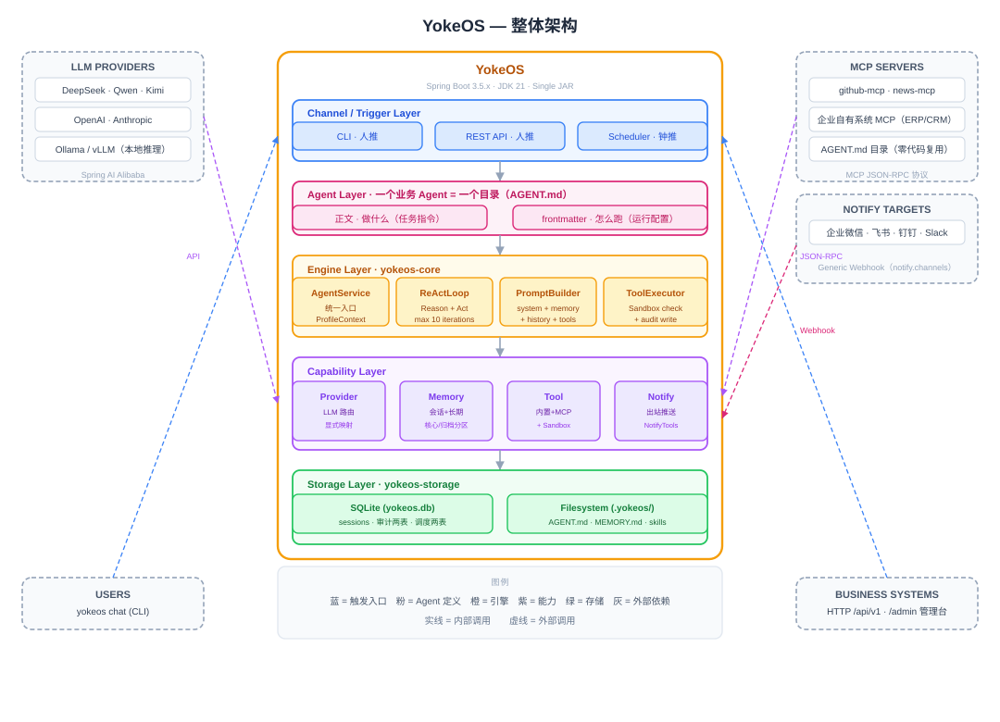

<p align="center">
  
</p>

<p align="center">
  <strong>One directory defines an agent. One foundation runs the fleet.</strong><br/>
  <em>The self-hosted, fully auditable Agent Harness OS for the enterprise.</em>
</p>

<p align="center">
  <a href="https://xianreallyhot-zzh.github.io/YokeOS/zh/"></a>
  <a href="https://www.java.com"></a>
  <a href="https://spring.io/projects/spring-boot"></a>
  <a href="https://www.apache.org/licenses/LICENSE-2.0"></a>
</p>

---

**YokeOS is a Java-native Agent foundation (Agent Harness OS) installed on the enterprise's own infrastructure.** One directory defines an Agent; one foundation runs a fleet of them — sharing a single set of channels, model routing, tool calling, memory, sandboxed execution, and scheduling. Data never leaves your infrastructure, and no cloud locks you in.

**So that banks, governments, telcos, energy companies, and hospitals — organizations where data cannot leave the premises, behavior must be auditable, and every new component must pass existing security review — can run every business Agent on infrastructure they fully control.** Like an operating system manages processes, YokeOS manages a fleet of Agents.

> **On the reference implementation**: YokeOS enters the agent-foundation category by building on a proven reference. Phase 1 replicates the runtime kernel of [oryx-labs/oryxos](https://github.com/oryx-labs/oryxos) section by section — same tech stack, same module boundaries, equivalent acceptance per unit. A later entrant of the same kind, the same stack, and the same anchors: we don't hide the starting point, and we don't re-claim design firsts the category has already proven. What's different lives on another axis — a fully spec-driven build with traceable specs and acceptance evidence for every unit.

- **Target shape**: drop one directory into the workspace and get a working business Agent — defined in `AGENT.md`, with tools, MCP connectors, skills, memory, notifications, and cron scheduling. Private deployment on your own K8s, VMs, or bare metal.
- **Where we are**: **Phase 1 is in progress** — the single-node runtime kernel is being delivered unit by unit against the reference's public build sequence. See the [roadmap](#roadmap) and the [docs](https://xianreallyhot-zzh.github.io/YokeOS/zh/).

## Why YokeOS

The demand side is no longer in question — every enterprise has work that should go to Agents. What blocks enterprises is not *building* an Agent but *running it under control*:

- Core data must stay in-house — putting business Agents on a SaaS or public-cloud control plane fails compliance.
- Execution is a black box — nobody signs off on a system that leaves no trace. **88.4%** of organizations experienced an AI-Agent-related security incident in the past 12 months (AvePoint, 750 IT leaders); **31%** admit they lack observability or auditability for Agent systems (Trend AI, 3,700 decision makers). The top self-reported blockers are integrating existing systems (46%), data access and quality (42%), and security and compliance (40%) — *"agent adoption is no longer limited by model capability"* (Anthropic, 2026 State of AI Agents Report).
- Over-privileged identities are the new attack surface — **90%** of deployed Agents carry excess permissions (CyberArk), and MIT NANDA finds **95%** of GenAI pilots produce no measurable P&L impact, with the gap in organizational integration, not model capability.

**None of these are solved by a stronger model. They are all foundation problems.** The deepest judgment behind YokeOS: *the bottleneck for reliable agents in production is not the model — it's the runtime environment.* YokeOS doesn't claim to have invented this judgment; it stands on it. What it builds is not yet another Agent, but the foundation that lets a fleet of Agents run reliably and be governed.

## Model → Harness → Foundation

| | Bare Model | Agent Harness | Agent Harness OS |
| --- | --- | --- | --- |
| Scope | A single LLM call | **One** reliable agent | A **fleet** of agents |
| Provides | Text generation | Loop, tools + execution, context, memory, sandbox, audit | Lifecycle, channels, routing, shared registries, scheduling, admin + API |
| Analogy | A CPU instruction | A process with its runtime | An OS running many processes |

The runtime and harness make one Agent run, and run correctly. The Agent Harness OS is what gets a fleet of Agents *managed* inside an enterprise. YokeOS is the third column — and it ships the second one for every Agent it runs.

## Features

- 🤖 **One directory = one Agent** — a directory containing `AGENT.md` defines an Agent. No code. Multiple Agents coexist on one instance.
- 📡 **Dynamic management** — CRUD over REST, one-sentence draft generation, drop a directory and it goes live. No restarts.
- 🛠️ **Skill templates** — `SKILL.md` packages reusable procedural knowledge that Agents reference by name; compatible with the agentskills.io open format. Community skills can be imported after enterprise review.
- ⏰ **Runs on a schedule** — per-Agent cron tasks plus notification channels, with every execution traced.
- ☕ **Java native** — Java 21 + Spring Boot, one executable JAR, reusing the enterprise's existing Java ops toolchain.
- 🔒 **Private and controlled** — runs on your own K8s, VMs, or bare metal. Data stays home. No cloud lock-in.
- 🛡️ **Security isolation** — file, command, and domain whitelists; least privilege; credentials via environment variables, never persisted; full-chain audit persisted from day one.
- 🧠 **Self-implemented ReAct** — the core reasoning loop is implemented in-house, not wrapped in an external Agent framework. Fully controllable.
- 🔌 **Open standards** — MCP for tools, A2A for collaboration, open formats for skills. Interoperate with the ecosystem, don't invent protocols.
- 🌐 **Stateless by design** — instances hold no state; state is externalized. The road to distributed is built in from the start.

## Architecture

<p align="center">
  
</p>

Four layers: **access** (CLI Channel, REST API, `AgentScheduler` — three trigger sources converging on one `AgentService`), **engine** (`ReActLoop`, `PromptBuilder`, `ToolExecutor`), **capabilities** (Provider, Memory, Tool), and **foundation** (workspace loading, session storage, SQLite, config and secrets).

## Six Core Capabilities

| Capability | Description |
| --- | --- |
| **LLM Routing** | A Provider abstraction unifies mainstream models (DeepSeek, Qwen, Kimi, GLM, Anthropic, OpenAI, and any OpenAI-compatible endpoint). Agents are provider-agnostic; explicit name → model mapping keeps multi-provider dispatch correct. Runtime switching with zero code change; local inference supported. |
| **ReAct Loop** | The Agent's reasoning engine, self-implemented — no external framework. The LLM decides whether and which tool to call; YokeOS executes and feeds the result back; the LLM decides the next step, until a final response or the iteration cap. Loop behavior fully controllable. |
| **Memory** | Two layers in Phase 1: session memory (persisted, restorable across restarts) and long-term memory (`MEMORY.md`, keyword recall, pluggable backends), auto-injected into every system prompt. Vector retrieval upgrade path reserved. |
| **Tool System** | Nine built-in tools (file, shell, HTTP, memory, notify). Every call passes path, command, and domain whitelist checks inside the sandbox boundary, fully traced. Three extension tiers by effort: zero-code (Agent directory + community MCP server) → light-code (custom MCP server) → heavy-code (native `@Tool` bean). |
| **Notify & Schedule** | Notify pushes results to configured channels (Webhook adapter in Phase 1 — enterprise IM bots connect via webhook). Cron schedules make each Agent run on its own — the third trigger source, sharing the same execution path as CLI and REST. |
| **Web Service** | All capabilities exposed over REST — any language integrates over HTTP. A Web admin console covers everyday management of Agents, providers, sandbox whitelists, and sessions. |

## Roadmap

The philosophy: **slow is fast — restrained and focused.** Make the single-node runtime kernel solid first, then grow distributed capabilities on top of it. Phase 1 deliberately pursues no product-level differentiation: deliver unit by unit against the proven reference, with equivalent acceptance, and let the engineering process itself be the deliverable.

**Phase 1 — Single-node runtime kernel** 🚧 *(in progress)*
A complete runtime kernel aligned with the reference: LLM routing, self-implemented ReAct, two-layer memory, tools + sandbox, notify + scheduling, REST API + web console. One directory = one Agent, dynamic management, multi-Agent coexistence, packaged distribution. Audit tables and whitelist sandbox in place from day one.

**Phase 2 — Capability completion & distributed foundation** *(planned)*
Knowledge base and semantic memory: document ingestion, chunking, vector retrieval. Stateless nodes, externalized state, multi-replica deployment for scale and availability. Platform baseline upgrade (Spring Boot 4 + Spring AI 2.0).

**Phase 3 — Cross-node Agent collaboration** *(vision)*
Agent communication substrate with A2A integration — discovery, delegation, and reliable async coordination across nodes.

*Horizontal capabilities, added across phases: multi-tenancy, SSO, staged approval (HITL), full audit and tool policies, observability, web management.*

## Module Structure

```text
yokeos/
├── yokeos-core          # YokeTool interface, Session, Profile, AgentLoader, ContextLoader,
│                        #   ReActLoop, PromptBuilder, ToolExecutor, AgentService, AgentScheduler
├── yokeos-provider      # ProviderService, Function Calling adapter, explicit provider → ChatModel map
├── yokeos-memory        # MemoryService facade, LongTermMemoryStore backends (md / sqlite / mem0),
│                        #   MemoryTools (save/recall)
├── yokeos-tool          # Built-in tools (file/shell/http/notify), MCP Client, ToolRegistry,
│                        #   Sandbox interface + WhitelistSandbox, NotifyChannelAdapter + WebhookNotifyAdapter
├── yokeos-channel-cli   # CLI Channel: yokeos chat implementation
├── yokeos-web           # REST API controllers, web admin console, GlobalExceptionHandler, OpenAPI
├── yokeos-storage       # SQLite, SessionRepository, ToolInvocationRepository, LlmCallRepository,
│                        #   JpaScheduledTaskStore
├── yokeos-cli           # Picocli entry, 12 subcommands, ConfigLoader
└── yokeos-boot          # Spring Boot main class, auto-configuration, dependency aggregation
```

Modules are decoupled through interfaces — cross-module contracts live in `yokeos-core` and are implemented downstream, with no circular dependencies. Adding a new Channel or Tool means adding a module; `yokeos-core` stays untouched.

## Quick Start

> **Phase 1 is in progress.** This is the target shape of a YokeOS session, distilled from the requirements — it goes live together with the packaged runtime at the end of the Phase 1 sequence. What ships today: the initiation document chain (`docs/`), which every unit of the kernel is being built against.

**Prerequisites**: Java 21, and an LLM API key (DeepSeek / Qwen / Kimi / Ollama / OpenAI-compatible).

```bash
# 1 · Initialize the workspace — creates .yokeos/ (idempotent, never overwrites)
yokeos init

# 2 · Create an Agent and edit its AGENT.md
yokeos profile create ops-agent

# 3 · Chat with it
yokeos chat --profile ops-agent

# Or expose it over HTTP
yokeos serve --port 8080        # REST API + web console
```

The initialized workspace:

```text
.yokeos/
├── agents/            # each subdirectory = one Agent (AGENT.md + optional resources)
├── skills/            # shared Skill library (one SKILL.md per subdirectory)
├── output/            # Agent artifacts
├── memory/
│   └── MEMORY.md      # long-term memory
├── sessions/          # session export (source of truth is SQLite)
├── logs/              # structured logs
├── AGENTS.md          # bootstrap: project-level agent behavior
├── SOUL.md            # bootstrap: agent persona
├── USER.md            # bootstrap: user preferences (read-only to agents)
├── mcp_servers.yaml   # MCP configuration
└── yokeos.db          # SQLite
```

### What "done" looks like: two daily demos

Phase 1's acceptance is two end-to-end demos that run **every day on their own**, together covering all six capabilities plus scheduling:

1. **Daily weather** — a bare `AGENT.md` Agent: at 8:00 the scheduler triggers it, it fetches the weather over `http_get` (domain-whitelisted, audited), drafts outfit advice, and pushes it to an enterprise IM bot via `notify`. No human involved.
2. **Daily tech digest** — an `AGENT.md` Agent that references a shared formatting Skill by name and pulls news through MCP. It remembers you care about AI and chips (via `save_memory` → `MEMORY.md`) and the digest reflects it. Zero Java code written by the business side.

The same Agent can always be triggered manually (`yokeos chat` or `POST /agents/{name}/invoke`) — human-pushed and clock-pushed calls share one execution path, one audit trail.

## Agent Definition

**One directory = one Agent.** `.yokeos/agents/<name>/AGENT.md` has two parts: the **frontmatter** is this Agent's profile (which provider/model, which tools, which channel, whether it runs on a schedule, where it pushes), and the **body** is the task instruction. `AgentLoader.deriveProfile()` derives the runtime `Profile` from the frontmatter.

```markdown
---
name: ops-agent
description: DevOps assistant
identity:
  agent_name: ops-agent
  prompt: You are a professional DevOps assistant...
provider:
  name: deepseek          # switch to qwen / kimi / ollama — zero code change
  model: deepseek-chat
  temperature: 0.7
  api_key: ${DEEPSEEK_API_KEY}   # from the environment, never in plaintext
tools:
  - read_file
  - shell
  - http_get
  - save_memory
  - recall_memory
  - notify
skills:
  - runbook-format        # by-name reference into .yokeos/skills/
mcp_servers:
  - github-mcp
notify:
  channels:
    - name: team-im
      type: webhook
      config: {}          # webhook URL etc.
schedules:
  - cron: "0 0 8 * * ?"   # the third trigger source: runs on its own
bootstrap:
  - AGENTS.md
  - SOUL.md
  - USER.md
settings:
  max_iterations: 10
  max_history_turns: 20
---

You are a professional DevOps assistant. When triggered, ... (task instructions)
```

Drop the directory into `.yokeos/agents/` and it goes live — no restart. Agents can also be created via REST (`POST /api/v1/agents`), drafted from one sentence (`POST /api/v1/agents/generate`, preview before commit), or managed in the web console.

## REST API

All endpoints live under `/api/v1`. Every response uses one envelope: `{ "code", "message", "data", "timestamp" }`. No auth in Phase 1 — internal network assumed.

| Group | Endpoint | Description |
| --- | --- | --- |
| Sessions | `POST /api/v1/sessions` | Create session |
| Sessions | `POST /api/v1/sessions/{id}/messages` | Send message (triggers the ReAct loop) |
| Sessions | `GET /api/v1/sessions/{id}` | Session history |
| Sessions | `DELETE /api/v1/sessions/{id}` | Archive session |
| Agents | `POST /api/v1/agents/generate` | One sentence → draft `AGENT.md` (preview only; not persisted, not registered) |
| Agents | `POST /api/v1/agents` | Create Agent (persist + register, no restart) |
| Agents | `GET /api/v1/agents` · `GET /api/v1/agents/{name}` | List / inspect Agents |
| Agents | `PUT /api/v1/agents/{name}` | Update Agent definition |
| Agents | `DELETE /api/v1/agents/{name}` | Delete Agent (archived, not hard-deleted) |
| Agents | `POST /api/v1/agents/{name}/invoke` | Stateless single-shot invocation |
| Workspace | `GET /api/v1/workspace/tree` | Workspace directory tree |
| Workspace | `GET /api/v1/workspace/file` | Read-only workspace file view |
| Info | `GET /api/v1/profiles` | List runtime profiles |
| Info | `GET /api/v1/memory` | Long-term memory |
| Info | `GET /api/v1/tools` | List available tools |
| System | `GET /api/v1/health` | Health check |
| System | `GET /api/v1/info` | Runtime info + provider status |

## CLI

Twelve commands in Phase 1:

```bash
yokeos init                          # initialize the .yokeos/ workspace
yokeos status                        # config and runtime status
yokeos chat [--profile <name>]       # interactive multi-turn chat
yokeos serve [--port 8080]           # REST API + web console
yokeos gateway                       # daemon mode, multiple channels

yokeos profile list | create <name> | show <name> | delete <name>

yokeos provider list                 # configured providers
yokeos tool list                     # registered tools
yokeos session list                  # session history
```

## Design Principles

- **Foundation before Agent** — the most important deliverable is not a powerful Agent, but the environment that lets any Agent run reliably.
- **Self-implement the core; reuse the plumbing** — the reasoning loop is hand-written; model protocol adaptation delegates to mature libraries.
- **Configuration is the Agent** — an Agent is defined by a directory (`AGENT.md` + optional resources), not by code.
- **Open standards** — MCP for tools, A2A for collaboration, open formats for skills.
- **Stateless instances, externalized state** — the prerequisite for going distributed without a rewrite.
- **Security is the foundation, not a patch** — controlled tool origins, least privilege, mandatory sandbox, credentials never persisted, full audit from day one.
- **Phased restraint** — build the minimal complete runtime kernel first; every architecture upgrade must be justified by real usage data.
- **Rebuild-first start** — replicate the runtime kernel unit by unit against a proven reference; Phase 1 differentiation lives in the process: traceable specs, acceptance evidence, and methodology, not in product features.
- **Anchor on needs, not on concepts** — anchor on the needs that don't change (private, controlled, auditable, Java-aligned), not on category words that may be diluted or renamed.

## Tech Stack

| Component | Choice |
| --- | --- |
| Language / Runtime | Java 21 (virtual threads) |
| Framework | Spring Boot 3.5.x |
| LLM Integration | Spring AI 1.1.8 + Spring AI Alibaba (protocol translation + `@Tool` schema only) |
| HTTP | Spring MVC + Java 21 virtual threads |
| CLI | Picocli 4.7.6 |
| Config parsing | SnakeYAML |
| Persistence | SQLite + Spring Data JPA |
| MCP | MCP Java SDK |
| Logging | Logback + SLF4J (structured JSON) |
| Admin console | Vue 3 + Vite (bundled at build time) |
| API docs | springdoc-openapi |
| Build | Maven multi-module, single fat JAR |

## License

[Apache License 2.0](LICENSE)
