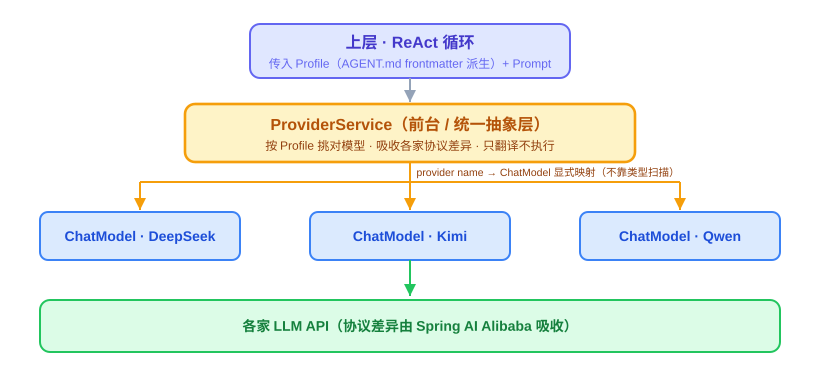
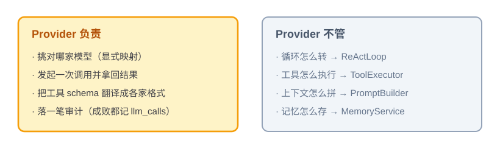
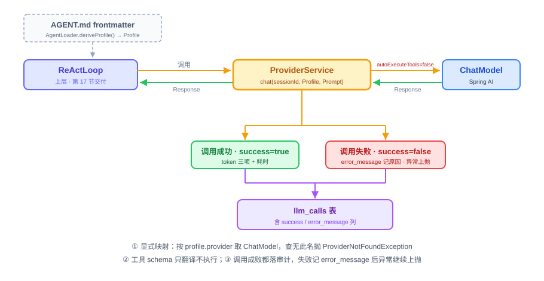

# 第 16 节：Provider——对接大模型的统一入口

> **双定位**：本文档是 YokeOS 节级开发文档——既是**教学文档**（给人看：原理解析、动手前想清楚、代码怎么写），也是 **Spec-Kit 的开发原料**（给 AI 执行）。流水线映射：一、二部分供 `/speckit-specify` 取材；三部分供 `/speckit-plan` 取材，末尾「本节交付物」是 `/speckit-tasks` 的比对锚点；四部分是验收 harness 规格（DoD 对号锚点）；五部分是人工验项。
>
> **语料出处**：[需] `docs/DemandAnalysis.md` · [技] `docs/TechnicalSolution.md` · [宪] CLAUDE.md 宪法 · [指] `docs/AiProgrammingGuide.md` · [参] 参照库课件第 16 节与钉版树测试文件。
>
> **拍板记录**（2026-09-10，用户批准）：① `llm_calls` 补 `success`/`error_message` 两列（技 §9.2 已同步修订）② 本节演示口径 = `yokeos init` 就绪 + `ProviderSmokeIT` 真调拿到回复，完整 CLI 对话归 18 节 ③ 全局 provider 清单键名 `yokeos.providers` ④ 先跑通哪家按 `mvn dependency:tree` 核实结果定 ⑤ `tool_invocations` 本节仅建表，写入归 17 节。

技术栈：JDK 21 + Spring Boot 3.5.16 + Spring AI 1.1.8 + Spring AI Alibaba。**API 代差警示**：参照课程期实为 Boot 3.3.5 / Spring AI 1.0.0-M6，本文代码是示意——`ChatModel` 调用与「关闭自动执行」的确切写法以本地依赖 1.1.8 为准逐个核实（H3：核实不到不写）。

---

## 一、Provider 是什么，干嘛用的

一句话：**Provider 是 Agent 和大模型之间的前台。**

上层要跟大模型说话，但它不想操心「这次到底是调 DeepSeek 还是 Kimi、每家的接口格式还不一样」。这些事全交给 Provider：上层把要说的话递进去，Provider 负责挑对模型、用对方听得懂的格式发出去、再把回话拿回来。

放到 Agent 的整体里看：Agent = LLM + Tools + Memory + Loop + Environment，其中 **LLM 是那个做决策的大脑**。Provider 就是把这个大脑接进系统的工程封装——ReAct 循环每转一圈，都要通过 Provider 调一次大模型。企业场景的三个现实约束也压在这一层上：多家模型并存（不同 Agent 用不同家）、模型要能随时换（不锁厂商）、每次调用要可审计（token 花了多少、失败为什么）。[需 §5.4]

具体怎么工作：上层传两样东西——一份 **Profile**（从 `AGENT.md` frontmatter 派生，写了这次用哪个 provider、哪个 model）、一段 **Prompt**（要发给模型的内容）。Provider 按 Profile 挑出对应的模型，调用，把结果原样返回。好处：以后想换模型，只改 frontmatter，ReAct 那边一行不动。



YokeOS 的立场是不重复造轮子：Spring AI Alibaba 已经做好了主流 LLM（DeepSeek、通义、文心、Kimi、智谱、混元、豆包、Anthropic、OpenAI 等）的 connector，YokeOS 在其上做一层薄包装 `ProviderService`，把它们包装成 Provider。多 Provider 并存通过显式映射区分，不靠类型扫描。[需 §5.4][技 §3]

这里还有一个容易搞混的点：**工具（Tool）这件事，Provider 只做翻译，不做执行。**

大模型能「调用工具」（业界叫 Function Calling），意思是：发请求时顺带告诉模型「你手上有哪些工具能用、每个工具要传什么参数」——这份说明叫 **schema**。模型看完可能回一句「我想调 `http_get`，参数是这些」。注意模型只是**说它想调**，并不会真去调。Provider 拿到这个请求后原样交回上层，真正去执行的是第 17 节的 `ToolExecutor`。为什么这么较真：Spring AI 自带一套自动执行机制，不关掉的话工具会被调两次、且执行绕过沙箱检查——这是宪法 2 点名的「最容易被写错的一条」。

---

## 二、动手前先想清楚几件事

写适配层，别急着敲代码。把下面几件事定下来，代码基本就顺着出来了。

**第一，把职责划窄。** Provider 要做的事很少：挑对模型、发起一次调用、把结果拿回来、落一笔审计。就这些。循环怎么转、工具怎么执行、上下文怎么拼，都不归它管。这个边界不划清楚，Provider 会越写越胖，最后和 ReActLoop 缠在一起分不开。



**第二，哪些不自己造。** 各家大模型的协议不一样，OpenAI、Anthropic、Gemini 的工具格式各写各的。这些转换 Spring AI Alibaba 已经做好，直接用。我们要写的只是薄薄一层 `ProviderService` 套在它上面。

**第三，四个坑——直接决定架构长什么样。**

*坑一：多个 provider 时，怎么区分谁是谁。* 同时配了 DeepSeek 和 Kimi，它们在 Spring 容器里都是 `ChatModel` 类型，光靠「把容器里所有 ChatModel 扫出来」根本分不清哪个是哪个（类型一样，Bean 名字也未必对得上）。所以从一开始就得自己维护一张表：**provider 的名字 → 对应的 ChatModel**，一一显式对应（宪法 3）。

*坑二：Spring AI 会「自作主张」帮你执行工具。* Spring AI 自带一套自动执行工具的机制——模型说想调 `http_get`，它会自己跑个小循环直接把工具执行了，再把结果喂回模型。听起来省事，但我们自己写了 `ReActLoop` 和 `ToolExecutor` 来管这件事。两套一起跑，工具会被调两次，而且执行绕过了沙箱检查。所以**必须把自动执行关掉**，只留协议转换和 schema 生成，执行权攥在自己手里（宪法 2）。

*坑三：教程里的 provider 名字只是示意。* 每家模型背后都是一个独立的 starter 依赖，它在不在你项目锁定的 Spring AI 1.1.8 BOM 里、版本号对不对，动手前先跑一遍 `mvn dependency:tree` 确认。想接哪家，先确认依赖能下载、能解析，再往下写——不照着教程的名字假设一定能用。

*坑四（YokeOS 特有）：API 代差。* 参照课程用 Boot 3.3.5 / Spring AI 1.0.0-M6，本仓钉 3.5.16 / 1.1.8。课件与参照代码里的 API 写法不能照抄，以本地依赖为准逐个核实——这正是 H3 门禁存在的理由。

---

## 三、代码怎么写

核心一个类 `ProviderService`，外加几个配角：派生 Profile 的 `AgentLoader`、翻译工具格式的适配器、写审计日志的 Auditor。对外只露一个方法：`chat(sessionId, Profile, Prompt)`。

对着「一次调用从头到尾怎么走」，先补前置，再分四步写。



**第零步（前置）：Profile 体系，这节一并交付。** Provider 是整个系统里第一个消费 Profile 的模块（要从里面读 provider 名、model、温度）。YokeOS 的 Profile 不来自独立的 profiles/ YAML 目录，而来自 `AGENT.md` 的 frontmatter——一个目录 = 一个 Agent（宪法 8，与参照实现形态不同但同构）：

- **`Profile`**：承载全部字段的记录类——`name`、`description`、`identity`（`agent_name`/`prompt`）、`provider`（name/model/temperature）、`tools`、`skills`、`mcp_servers`、`channels`、`notify.channels`、`schedules`、`bootstrap`、`settings`。后面每节用到哪个字段就取哪个，类本身这节就建全。[需 §5.2][技 §8.2]
- **`AgentLoader`**：启动时扫 `.yokeos/agents/` 各子目录，`deriveProfile` 把每个 `AGENT.md` 的 frontmatter 派生成 `Profile`。本节先校验「provider 名能在全局层找到」这一条，后面各节的字段各自补自己的校验规则；坏文件记错误日志、不阻断启动。[技 §8.2]
- **`ProfileRegistry`**：解析好的 Profile 放进内存索引（`Map<String, Profile>`）按 name 查找。29 节会给它补运行时 `register()` 方法，现在只有启动扫描这一条注册路径。[技 §8.2]

顺带交付 `yokeos init`（工作区初始化，TS §13 把它排在本节）：幂等创建 `.yokeos/` 六子目录 + 三个 Bootstrap 文件，已存在一律不覆盖。[需 §5.1]

**第一步：配置分两层，别搞混。**

```yaml
# application.yaml —— 全局层：声明这个实例上接了哪些 provider、凭证从哪个环境变量读
yokeos:
  providers:            # 键名 plan 阶段定稿（拍板③）
    - name: deepseek
      api-key: ${DEEPSEEK_API_KEY}
    - name: kimi
      api-key: ${KIMI_API_KEY}
```

```yaml
# .yokeos/agents/ops-agent/AGENT.md frontmatter 的 provider 段 —— Profile 层
provider:
  name: deepseek        # 必须能在全局层的 providers 列表里找到同名项
  model: deepseek-chat  # 用哪个模型，Profile 自己定
  temperature: 0.7
```

两层各管一段：全局层只管「连接」（provider 存不存在、key 有没有），Profile 层管「调用参数」（用哪个 model、什么温度）。Profile 引用的 `provider.name` 在全局层找不到同名项，必须直接报错，不能悄悄用错或留空跑过去。`${DEEPSEEK_API_KEY}` 表示运行时从环境变量取，代码和配置文件里都不会出现真实 key（宪法 7）。

**第二步：建映射表。** 启动时按 `application.yaml` 里 `yokeos.providers` 列表逐条创建对应的 `ChatModel`，把 name 和 `ChatModel` 存进一个 `Map<String, ChatModel>`。这是坑一的解法——**显式建表，不靠类型扫描**。用 `@Qualifier` 也行、自己手动 put 进 Map 也行，原则就一条：谁对谁必须写死、看得见。

**第三步：写 chat 方法。** 整个 Provider 的核心，骨架长这样（示意，写法按 1.1.8 核实）：

```java
public Response chat(String sessionId, Profile profile, Prompt prompt) {
    ChatModel model = providerMap.get(profile.getProvider());   // 按名字取模型
    if (model == null) {
        throw new ProviderNotFoundException(profile.getProvider());
    }
    var tools = adapter.toSpringAiTools(prompt.getAvailableTools());  // 只翻译，不执行
    long startedAt = System.currentTimeMillis();
    try {
        Response resp = model.call(request(prompt, tools, /* autoExecuteTools */ false));  // 关掉自动执行
        audit.record(sessionId, profile.getProvider(), profile.getModel(), resp.usage(),
                     true, null, System.currentTimeMillis() - startedAt);
        return resp;
    } catch (RuntimeException e) {
        audit.record(sessionId, profile.getProvider(), profile.getModel(), null,
                     false, e.getMessage(), System.currentTimeMillis() - startedAt);
        throw e;   // 调用失败也留痕，再把错误抛给上层处理
    }
}
```

一行行看它在干嘛：

- `chat(String sessionId, ...)`——多传一个 sessionId，是因为审计要落 `llm_calls`，那张表按 session 关联；签名不带这个参数，审计那一步就没法写。
- `providerMap.get(profile.getProvider())`——拿 Profile 里写的 provider 名去表里取模型，取不到直接抛异常，别让它悄悄用了个错的（坑一）。
- `adapter.toSpringAiTools(...)`——把这次能用的工具翻译成 Spring AI 的格式（只生成 schema，不执行）。
- `model.call(request(..., false))`——发起真正调用；最后那个 `false` 就是关掉自动执行（坑二、宪法 2 的代码落点）。
- `audit.record(..., true, null, ...)`——调用**成功**记一笔：provider、model、token、耗时，`success=true`。
- `catch (RuntimeException e) { audit.record(..., false, e.getMessage(), ...); throw e; }`——调用**失败**（超时、限流、模型报错）同样记一笔，`success=false`、原因进 `error_message`，再把异常继续往上抛。**这一步最容易漏**：只记成功不记失败，一次真实事故在系统里就完全没留下痕迹（技 §9.2 已为这两列补档，与 `tool_invocations` 对称）。
- 最后返回 `Response`。响应里可能带着模型「想调某个工具」的请求，但执行不在这儿——原样交回上层。

**第四步：工具适配和审计落库。** 适配器 `ToolSchemaAdapter` 负责把 `YokeTool` 的参数说明（`getInputSchema()`）转成 Spring AI 的工具描述——还是只翻译、不执行。审计走依赖倒置：`LlmCallAuditor` 接口放 `yokeos-provider`，`JpaLlmCallAuditor` 实现放 `yokeos-storage`（跨模块契约方向，技 §10）。`llm_calls` 的 JPA 实体、Repository 和建表脚本归这节交付；`tool_invocations` 在同一份 `schema.sql` 里一并建表，写入者是 17 节的 `ToolExecutor`（拍板⑤）。注意 SQLite 的 `ALTER TABLE` 很弱，建表用手工维护的脚本，别指望 `ddl-auto=update` 做迁移（宪法 7）。

**有几样先别做。** fallback（一家挂了换另一家）、hedge racing（同时发几家抢最快）、熔断，都放扩展阶段；现在故障就直接把错误抛给上层。成本看板也放后面，眼下只落 `llm_calls` 这张表，够审计用就够了。核心阶段的目标是「能稳定调通一次」，别一上来就求全。[需 §5.4]

**本节交付物**（Spec-Kit 拆解锚点）：

- 前置已备（工程地基 350c914 已交付，本节不重做）：Maven 九模块骨架、统一响应体与全局异常、结构化日志、门禁全链路（Spotless + P3C + Checkstyle + SpotBugs/FSB + PMD + OWASP）、CI、pre-commit
- 代码：`Profile`、`AgentLoader`、`ProfileRegistry` → yokeos-core；`ProviderService`（含 `chat(sessionId, Profile, Prompt)`）、`ToolSchemaAdapter`、`LlmCallAuditor` 接口、`ProviderNotFoundException`、`ProvidersProperties` → yokeos-provider；`LlmCall` 实体、`LlmCallRepository`、`JpaLlmCallAuditor`、`schema.sql`（`llm_calls` + `tool_invocations` 两表） → yokeos-storage；`yokeos init` → yokeos-cli
- 测试：`AgentLoaderTest`、`ProviderServiceTest`、`ToolSchemaAdapterTest`、`LlmCallRepositoryTest`、`ProviderSmokeIT`（见第四部分）
- 配置：`application.yaml` 全局 provider 清单（键名 `yokeos.providers`，plan 定稿）；`AGENT.md` frontmatter `provider` 段
- 表：`llm_calls`（含 `success`/`error_message`）；`tool_invocations`（本节建表）

---

## 四、验收 harness：把验收标准变成可执行的测试

SDD 给目标，**Harness 给边界**。这一节的 harness 就是一套测试——AI 写的实现对不对，不靠人盯着代码看，靠这套测试跑绿。测试清单在实现之前（或同时）定下来，`/speckit-implement` 产出的代码必须让它们全绿，这就是「验收」的工程化形态。

**先定分层：什么用单测，什么用集成冒烟。** 判断标准就一条——要不要碰真实网络：

- **单测（默认全跑）**：路由、校验、审计、翻译，全部把 `ChatModel` mock 掉，不花一分钱、不依赖网络，秒级跑完。这是 harness 的主体。
- **集成冒烟（打 `@Tag("integration")`，本地手动跑）**：真调一次模型，验证「key 对、依赖对、真的通」。CI 里默认跳过——不能让外部 API 的可用性变成自己流水线的可用性。[指 §5.1/§6.3]

**五个测试类，逐条对应验收标准：**

| 测试类 | 覆盖的验收点 |
|---|---|
| `AgentLoaderTest` | 合法 `AGENT.md` frontmatter 全字段派生；引用不存在的 provider 报错清晰；坏文件不阻断其余加载；`${ENV}` 占位从环境变量解析 |
| `ProviderServiceTest` | 双 provider 按名路由不串台；未知名抛 `ProviderNotFoundException`；成功/失败都落审计；自动执行关闭 |
| `ToolSchemaAdapterTest` | `YokeTool` 的 schema 翻译成 Spring AI 格式后字段一一对齐；只翻译、产物里不含任何执行逻辑 |
| `LlmCallRepositoryTest` | 手工建表脚本建出的 `llm_calls` 能存能读，`success`/`error_message` 两列真实存在 |
| `ProviderSmokeIT` | 读环境变量真 key、真调一次、断言非空响应且 `llm_calls` 多一条 `success=true` |

**最值钱的三个测试方法，写出来看。** 都在 `ProviderServiceTest` 里，mock 两个 `ChatModel` 就能测（示意；测试方法名用英文，语义对齐参照课件的中文测试名，`@DisplayName` 保留原文以便对号）：

```java
@Test
@DisplayName("按名路由_两个provider不串台")
void routeByName_twoProvidersNoCrosstalk() {
    var deepseek = mock(ChatModel.class);
    var kimi = mock(ChatModel.class);
    var service = new ProviderService(Map.of("deepseek", deepseek, "kimi", kimi), adapter, audit);

    service.chat("s-1", profileUsing("kimi"), prompt);

    verify(kimi, times(1)).call(any());       // 调的是 kimi
    verify(deepseek, never()).call(any());    // deepseek 一次都没被碰——「不串台」的直接证据
}

@Test
@DisplayName("调用失败_审计必须留下success为false的记录")
void callFailure_auditsSuccessFalseRecord() {
    when(chatModel.call(any())).thenThrow(new RuntimeException("connect timeout"));

    assertThrows(RuntimeException.class,
        () -> service.chat("s-1", profileUsing("deepseek"), prompt));   // 异常继续上抛

    verify(audit).record(eq("s-1"), eq("deepseek"), any(), isNull(),
        eq(false), contains("timeout"), anyLong());   // 但审计先落了：success=false + 原因
}

@Test
@DisplayName("带工具schema调用_请求里关闭了自动执行")
void callWithToolSchema_disablesAutoExecution() {
    service.chat("s-1", profileUsing("deepseek"), promptWithTools(httpGetTool));

    var captor = ArgumentCaptor.forClass(Request.class);
    verify(chatModel).call(captor.capture());
    assertFalse(captor.getValue().autoExecuteTools());   // 坑二的回归测试：一旦有人改回自动执行，这里立刻红
    assertNotNull(captor.getValue().tools());            // 翻译过的 schema 确实带上了
}
```

第一个测的是坑一（显式映射），第三个测的是坑二（关自动执行）——**每个「想清楚」阶段点过名的坑，都应该有一个对应的回归测试**，这样坑就被永久钉死，后来的人改不回去。第二个测的是最容易漏的失败审计路径：注意断言的不是「没抛异常」，而是「抛了异常**并且**审计先落了账」。

**`LlmCallRepositoryTest` 的一个讲究**：建表要走那份手工脚本（测试里执行 `schema.sql`），不要让 Hibernate 自动建——不然测试绿了、生产上跑真脚本时列名对不上，白测。

**集成冒烟 `ProviderSmokeIT`**：一个方法，读环境变量里的真 key、真调一次、断言拿到非空响应且 `llm_calls` 多了一条 `success=true`。跑法：

```bash
mvn test                                            # 日常：单测全绿才算实现完成
DEEPSEEK_API_KEY=xxx mvn test -Dgroups=integration   # 手动：冒烟验真连通
```

---

## 五、做完怎么验

harness 全绿之后，剩下这几条需要人工确认（自动化覆盖不到或不值得自动化的部分，进验收报告的「剩余人工项」）：

- [ ] 用到的 provider，对应的 Spring AI（Alibaba）starter 依赖已确认在 1.1.8 BOM 里能下载、能解析——不是照着教程的名字就假设一定能用（`mvn dependency:tree` 看一眼，坑三；先跑哪家按核实结果定，拍板④）
- [ ] 集成冒烟真跑过一次：配真 key，`ProviderSmokeIT` 通过，拿到过真实响应
- [ ] key 走环境变量：`grep -r "sk-"`（或你的 key 前缀）在代码和配置里搜不到明文
- [ ] `yokeos init` 幂等抽查：二次运行不覆盖既有文件
- [ ] 可演示成果核对（拍板②口径）：`yokeos init` 就绪 + 真 key 真调拿到 LLM 回复

其余验收点——双 provider 路由、错误名报错、成功/失败审计、自动执行关闭、只翻译不执行——已由第四部分的单测覆盖，`mvn test` 绿就等于打勾。

Provider 自己没有独立入口，它要和下一节的 ReAct 一起，才能撑起 Demo 一（每日天气）的对话版。所以这块跑通的标准很直接：能撑住 Demo 一里的那次大模型调用。
