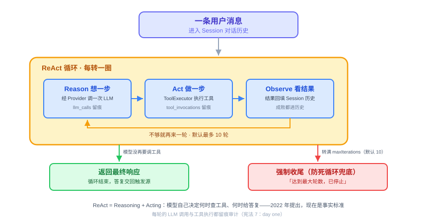
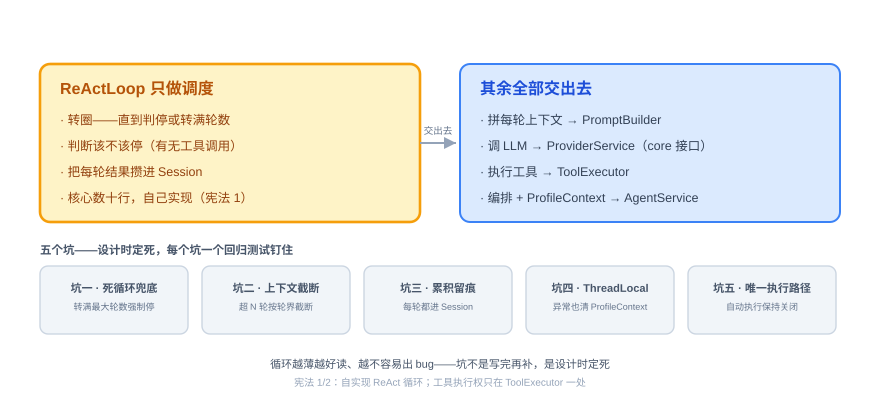
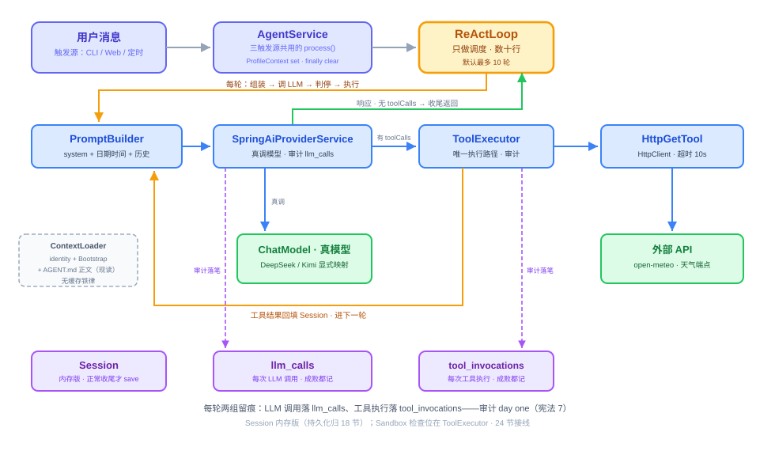

# 第 17 节：ReAct 循环——Agent 的大脑

> **双定位**：本文档是 YokeOS 节级开发文档——既是**教学文档**（给人看：原理解析、动手前想清楚、代码怎么写），也是 **Spec-Kit 的开发原料**（给 AI 执行）。流水线映射：一、二部分供 `/speckit-specify` 取材；三部分供 `/speckit-plan` 取材，末尾「本节交付物」是 `/speckit-tasks` 的比对锚点；四部分是验收 harness 规格（DoD 对号锚点）；五部分是人工验项。
>
> **语料出处**：[需] `docs/DemandAnalysis.md` §5.5/§8.2/§9/§11 · [技] `docs/TechnicalSolution.md` §4/§8.3/§9.2/§13 · [宪] CLAUDE.md 宪法 · [指] `docs/AiProgrammingGuide.md` · [参] 参照库课件第 17 节、钉版树第 17 节测试文件与 `specs/002-react-loop/contracts/react-loop.md`（契约先例）。
>
> **拍板记录**（2026-09-13，用户批准）：
> ① **契约上移（方案 A）**：core 新增 `com.yokeos.core.provider` 包——`ProviderService` 接口 + `ProviderRequest`/`ProviderResponse`/`ToolCallRequest` 值对象（不带 Usage——审计在实现内部闭环、`LlmCallAuditor` 收 Integer×3，参照带 Usage 是因其 auditor 接口收 Usage 对象）；第 16 节的 `ProviderService` 具体类**改名 `SpringAiProviderService`** 并实现该接口，签名换型 `Prompt`→`ProviderRequest`、`ChatResponse`→`ProviderResponse`（toolCalls 提取写法按 1.1.8 `javap` 核实，H3）；`ProviderServiceTest` 改名随动、断言语义逐条保留（路由不串台/点名报错/成败双路审计/自动执行关闭），16 节测试全绿是回归门禁；验证口径 `grep "com.yokeos.provider" yokeos-core/src/main` 零命中。动因：`ReActLoop` 落 core（模块表）而 provider→core 依赖已存在，core 再依赖 provider 即循环依赖——参照 specs/002 research D1 同款先例；本仓差异：16 节签名含 Spring AI 类型（参照从 16 节就用自家值对象），上移 = 搬家 + 换型纠偏，实现体不能「一行不动」。
> ② **YokeTool 扩展 execute**：第 16 节注释写「执行语义归第 20 节」，但技 §13 第 17 节行明确「一个内置 HTTP Tool」——文档链内部张力，本节给 `YokeTool` 加 `ToolResult execute(JsonNode input)`（注释同步修订为「白名单校验归 20/24 节」）。
> ③ **重试纳入本节**：技 §4.2 要求 ToolExecutor「失败时按可重试策略返回错误信息，默认指数退避最多重试三次」（对齐需 §8.2）；参照课件未教此点，超出参照的部分在验收报告记实施偏差。
> ④ **冒烟落 boot 模块**：`ReActSmokeIntegrationTest` 跨 core/provider/tool/storage 四模块，放 yokeos-boot（第 16 节冒烟在 provider 模块，因它只跨两模块）；真 key + 真 `http_get`（open-meteo 无 key 天气端点）。
> ⑤ **演示口径**：本节可演示成果 = 需 §11 第 17 节行「Agent 一次对话内完成多步任务：思考 → 调 Tool → 观察 → 续推」，由集成冒烟承载；完整 CLI 交互归 18 节。

技术栈：JDK 21 + Spring Boot 3.5.16 + Spring AI 1.1.8 + Spring AI Alibaba。**API 代差警示**：参照课程期实为 Boot 3.3.5 / Spring AI 1.0.0-M6，本文代码是示意——尤其「从 `ChatResponse` 里提取工具调用请求」的确切 API 以本地依赖 1.1.8 的 `javap` 核实为准（H3：核实不到不写）。

---

## 一、ReAct 是什么，干嘛用的

一句话：**ReAct 就是让大模型像人做事一样，在一个循环里反复「想一步、做一步、看结果」，直到把事办成。**

单独调一次大模型，就是个 chatbot——你问一句、它答一句，完事（第 16 节做到的就是这一步）。但很多事一句话答不了，比如「看看今天天气，帮我决定穿什么」：模型得先去查天气、拿到结果、再根据结果给建议。**ReAct 干的就是把「想—做—看」串成一个循环**：模型想下一步该干嘛（Reason）、调个工具去做（Act）、拿到结果看一眼（Observe），不够就再来一轮，够了就给最终答复。这个模式叫 ReAct（Reasoning + Acting），2022 年提出，现在是事实标准——Claude Code、Cursor、LangChain 跑的都是它。

一轮里的动作是固定的三步：



什么时候停？看模型这一轮的反应：**它没提出要调工具，就说明它觉得能给最终答复了**，循环返回结果；万一它一直要调工具停不下来，就靠「最大轮数」兜底，转够了强制收尾（默认 10 轮，AGENT.md 的 `settings.max_iterations` 可覆盖）。[需 §5.5][技 §4.3]

放回 Agent 整体：ReAct 是那个「大脑循环」，它自己不调模型、也不执行工具，而是指挥——想的时候通过上一节的 Provider 调一次大模型，做的时候把工具交给 `ToolExecutor`。每转一圈的 LLM 调用和工具调用都要留痕：`llm_calls` 第 16 节已经落了，`tool_invocations` 本节起写入（审计 day one，宪法 7）。

---

## 二、动手前先想清楚几件事

ReAct 有个反直觉的地方：它是 Agent 的灵魂，但主循环的代码其实很短，就几十行。难的不是「写个 for 循环」，而是循环里要照顾的那些边界。动手前把三件事定下来：职责怎么拆、契约放哪、有哪些坑。

**第一，把职责拆干净。** 循环本身只该做一件事——**调度**：转圈、判断该不该停、把每轮的结果攒起来。每轮要拼的 prompt 归 `PromptBuilder`，要调的模型归 `ProviderService`，要执行的工具归 `ToolExecutor`，进出的编排归 `AgentService`。循环里塞的东西越少，它越好读、越不容易出 bug。[技 §4.2]



**第二，为什么自己写，不用框架现成的循环。** Spring AI 这类框架都带现成的 Agent / 循环封装，拿来就能跑。但循环恰恰是 Agent 最需要自己掌控的地方——什么时候停、工具失败了怎么办、上下文太长了怎么截、哪几步想换个模型，这些都得能自己调。用框架的黑盒，这些就动不了。所以核心阶段我们自己写这几十行，把控制权攥在手里（宪法 1）。这也呼应第 16 节关掉自动执行的原因：**执行权只能有一条路**，就是本节的 `ToolExecutor`——两套执行路径并存，工具会被调两次、且绕过沙箱（宪法 2）。

**第三，契约放哪——本仓特有的结构决策。** `ReActLoop`/`PromptBuilder` 按模块表落 yokeos-core，但 core 禁引 Spring AI 类型，而第 16 节的 `ProviderService.chat` 签名进出都是 Spring AI 的 `Prompt`/`ChatResponse`。解法是**契约上移**：core 里立一套中性协议（`ProviderService` 接口 + `ProviderRequest`/`ProviderResponse`/`ToolCallRequest` 值对象，全是普通 Java 类型），yokeos-provider 里的实现体改名 `SpringAiProviderService` 实现它，Spring AI 类型不出 provider 模块。这不是发明——参照库 specs/002 契约 §6 就是这么拍的（D1「契约上移」，签名逐字保真、实现体零改动）。

**第四，五个坑——直接决定循环长什么样。**

*坑一：不设轮数上限，模型可能反复要调工具，陷进死循环下不来。* 解法是 `maxIterations` 兜底（默认 10，Profile 可覆盖），转够强制收尾并返回明确的收尾答复。[技 §4.3]

*坑二：不管上下文长度，转几轮 context 就撑爆了。* 每次调模型都把全部历史带上，越滚越大。解法是组装 prompt 时只留最近 `maxHistoryTurns` 轮（默认 20），**以轮为界截断**——一轮 = 一条用户消息及其后全部消息，不能从中间撕裂，否则工具结果和它的提问分家。[技 §4.3]

*坑三：每轮不把模型响应和工具结果累积回 Session，事后没法审计，下一轮也接不上前一轮。* Session 的对话历史要包含完整的 LLM 调用链和工具调用链，对外可查可审计（宪法 7）。[技 §4.3]

*坑四（最阴险）：ThreadLocal 泄漏。* `ProfileContext` 解决「工具执行时怎么知道当前是哪个 Agent」——`YokeTool.execute` 签名不带 Profile，改接口代价太大，让 `AgentService` 在入口 set、出口 clear，工具想用就取。虚拟线程下每个请求独占线程天然不串，但 clear 必须放 `finally`：循环中途抛异常也清，否则下一个复用线程的请求会拿到**别人的 Profile**。这类 bug 在单请求测试里永远不报错，只在并发复用时串号——必须在 harness 里显式钉死。[技 §4.2]

*坑五（第 16 节伏笔的兑现点）：两套执行路径。* Spring AI 的自动执行已在 16 节关闭（`internalToolExecutionEnabled(false)`）；本节 `ToolExecutor` 落地后，它成为工具执行的**唯一路径**——沙箱检查位、审计写入都挂在这条路上，别处不再开口子（宪法 2，24 节 Sandbox 在此接线）。

---

## 三、代码怎么写

六个角色：`ReActLoop` 管调度，`PromptBuilder` 管拼上下文，`ToolExecutor` 管执行工具，`AgentService` 管编排，`ContextLoader` 供 system prompt，`Session` 攒历史。调大模型走契约上移后的 `ProviderService` 接口。



**第零步（前置）：契约上移 + 工具接口补执行语义。** 两笔改造，先立契约再写循环：

- **core 新增 `com.yokeos.core.provider` 包**：`ProviderService` 接口——`ProviderResponse chat(String sessionId, Profile profile, ProviderRequest request)`；值对象 `ProviderRequest`（拼好的 prompt 文本 + `List<YokeTool> availableTools`）、`ProviderResponse`（`text` + `List<ToolCallRequest>`，`hasToolCalls()` 便捷判断）、`ToolCallRequest`（`name` + `argumentsJson`）。token 审计照旧在实现体内部做（16 节路径不动），`ProviderResponse` 不需要携带 usage。
- **yokeos-provider 改造**：16 节的 `ProviderService` 具体类改名 `SpringAiProviderService`，实现 core 接口——`ProviderRequest` 转内部 `Prompt`、复用既有显式映射与审计路径、`ChatResponse` 转回 `ProviderResponse`（工具调用请求的提取写法以 1.1.8 `javap` 核实为准，H3）。对外行为零变化，16 节全部测试随改名平移后必须保持绿。
- **`YokeTool` 补 `ToolResult execute(JsonNode input)`**：第 16 节只建了 schema 翻译所需的三方法，本节循环要真执行了；同包新增 `ToolResult`（`content`/`success`/`errorMessage`/`retryable` + `ok(content)`/`error(msg, retryable)` 工厂）。Jackson `JsonNode` 作参数形态（core 若无显式 jackson-databind 依赖则补，记实施偏差）。

**第一步：Session——循环的输入与累积容器（内存版）。** 一次对话的全部状态：`sessionId`、`profileName`、按序累积的 `List<Message>`。`Message` 是 `(role, content, toolName)` 三元记录（role 取 user/assistant/tool）。累积只走 append 三兄弟：`appendUser(String)`、`appendAssistant(ProviderResponse)`（text 为 null 按空串——既无文本也无工具请求的收尾边界）、`appendToolResult(toolName, ToolResult)`（成功存 content、失败存错误描述——**成败都进历史，模型下一轮能看到失败原因并自行决定下一步**）。顺序不变量：消息严格按发生序追加，事后可完整回放（坑三的落点）。`SessionManager` 前向最小——本节只有 `save(Session)` 一个方法，内存实现 `InMemorySessionManager` 按 sessionId 存Map 兜底装配；`session_id` 三元组拼接公式（channel+user+agent）、`getOrCreate`/持久化归 18 节（技 §13「Session 内存版」）。

**第二步：ContextLoader——system prompt 的供给者。** 每次组装 prompt 都重新读文件、**不做任何缓存**（用户改完立即生效）；两条错误纪律：Bootstrap 缺失 WARN 跳过不阻断、读文件 IO 失败显式抛错——静默跳过会造成「人格悄悄丢了」这种最难查的软故障。拼接顺序按技 §8.3 定死：

1. `identity.prompt`（frontmatter 人格提示词，需 §5.2）；
2. Bootstrap 文件（按 Profile `bootstrap` 列表，相对序固定 AGENTS.md → SOUL.md → USER.md，列表只能裁剪不能乱序；**每段前带角色 header** 如 `## 项目约定（AGENTS.md）`——无覆盖语义，冲突消解交给模型按 header 语义判断）；
3. 引用 Skill 正文——**29 节留位**，本节不实现；
4. `AGENT.md` 正文（去掉 frontmatter 后的任务指令，压轴）。

`AGENT.md` 归上下文这一层而不是 Tool 模块，因为它是 prompt 的输入、不是可执行的 Tool（宪法 8——参照课件把它从 Tool 模块挪回 ContextLoader 的坑，016 节已吸收）。

**第三步：PromptBuilder——每轮拼一次。** 按固定顺序拼成单段文本（技 §4.2）：

```text
[1] system prompt（ContextLoader 供给）+ 末尾一行当前日期时间
    ——模型自己不知道今天几号，定时场景里的「今天」全靠这一行
[2] 长期记忆位——22 节 MemoryService 就位前恒空跳过（构造器届时扩展）
[3] 对话历史（只留最近 maxHistoryTurns 轮，以轮为界不撕裂——坑二解法）
[4] 可用 Tool 列表——不进文本，经 ProviderRequest.availableTools 传递，
    只带 Profile.tools 点名的那些（schema 翻译挂载由 16 节 ToolSchemaAdapter 单点负责）
```

日期时间行要可测：`Clock` 注入（默认系统时钟，测试给固定时钟），不能在测试里赌真实时间。

**第四步：ReActLoop——主循环，全节的主角。** 输入 Session 和用户这句话，输出最终响应。骨架（示意，写法按核实）：

```java
public String run(Session session, String userMessage, Profile profile) {
    session.appendUser(userMessage);
    for (int i = 0; i < profile.settings().maxIterations(); i++) {   // 坑一：轮数兜底，默认 10
        ProviderRequest prompt = promptBuilder.build(session, profile);
        // sessionId 随调用传递：llm_calls 审计按 session 关联（16 节签名设计在此兑现）
        ProviderResponse resp = providerService.chat(session.sessionId(), profile, prompt);
        session.appendAssistant(resp);                        // 坑三：先累积再判停，每轮留痕
        if (!resp.hasToolCalls()) {
            return resp.text() == null ? "" : resp.text();    // 停止条件：没要工具即收尾
        }
        for (ToolCallRequest call : resp.toolCalls()) {
            // 执行权只在 ToolExecutor（宪法 1/2）；失败结果同样回填，模型下一轮自行决定
            ToolResult result = toolExecutor.execute(session.sessionId(), call);
            session.appendToolResult(call.name(), result);
        }
    }
    return "达到最大轮数，已停止";                              // 坑一的强制收尾答复（测试断言字面量）
}
```

一行行看：`for (i < maxIterations)` 是死循环兜底；`promptBuilder.build` 拼本轮上下文；`providerService.chat` 带 sessionId 调 LLM——16 节签名里的 sessionId 就是为这里的审计关联设计的；`session.appendAssistant(resp)` **先累积再判停**（坑三：转满轮数的那几轮也全留痕）；`!resp.hasToolCalls()` 即收尾；内层 for 逐个执行工具调用（一次响应多个工具调用按顺序执行，不并行——技 §4.3 第一阶段边界），结果回填进 Session 再进下一轮。

**第五步：ToolExecutor——工具执行的唯一路径。** 构造持 `Map<String, YokeTool>`（20 节 `ToolRegistry` 就位后只换 Map 的来源，本类不动）+ `ToolInvocationAuditor`。执行语义：

- **先解析后执行**：`argumentsJson` 解析成 `JsonNode` 再交给工具；不是合法 JSON 直接失败路径；
- **成败都落审计，先落审计再还结果**（宪法 7）：成功记 `success=true` + 结果；失败记 `success=false` + 原因——`tool_invocations` 表 16 节已建好，本节起写入；
- **异常不吞也不炸循环**：工具抛 `RuntimeException` 转成失败 `ToolResult`（errorMessage 带原因）交还循环——模型下一轮能看到失败原因并决定下一步，不上抛不中断；
- **可重试失败指数退避**（拍板③）：`ToolResult.retryable=true` 的失败按退避重试，默认最多 3 次尝试（需 §8.2）；退避间隔可注入（测试给零延迟，不赌真实时钟）。不可重试失败（未注册工具名、坏 JSON）一次即止；
- **沙箱检查位**：执行前过白名单校验的挂点，**24 节接线**，本节留注释位（宪法 6）。

审计契约走依赖倒置：`ToolInvocationAuditor` 接口放 `com.yokeos.core.audit`（与 16 节 `LlmCallAuditor` 同包对称），`JpaToolInvocationAuditor` + `ToolInvocation` 实体 + `ToolInvocationRepository` 放 yokeos-storage，列定义逐字来自技 §9.2（`session_id`/`tool_name`/`input_json`/`result_json`/`success`/`error_message`/`duration_ms`/`created_at`）。

**第六步：AgentService + ProfileContext——循环之上的薄编排层。** 三种触发源（CLI/Web/定时）最终都调同一个 `AgentService.process`：

```java
public String process(Session session, String userMessage) {
    Profile profile = profileRegistry.get(session.profileName())
        .orElseThrow(() -> new IllegalStateException("Session 引用的 Profile 不存在: " + session.profileName()));
    ProfileContext.set(profile);          // 坑四：工具执行时靠它知道「当前是哪个 Agent」
    try {
        String reply = reActLoop.run(session, userMessage, profile);
        sessionManager.save(session);     // 把累积完的历史持久化（仅正常路径）
        return reply;
    } finally {
        ProfileContext.clear();           // 用 remove() 而非 set(null)——P3C 同款要求，必达
    }
}
```

`ProfileContext` 是 ThreadLocal 封装（`set`/`current`/`clear`）。为什么需要它：`YokeTool.execute` 签名不带 Profile，但 19 节的 `notify` 要读当前 Profile 的通知渠道、20 节要按 Profile 过滤工具子集——改工具接口代价太大，入口 set、出口 clear，工具想用就取。

**第七步：一个内置 HTTP Tool。** 技 §13 把它排在本节——循环要有真东西可执行。`HttpGetTool` 落 yokeos-tool：入参 `{url}`，Java `HttpClient` 发 GET（连接/读取超时约 10 秒），返回响应正文文本（超长截断保护，约 8000 字符，防撑爆上下文）。本节**不做**域名白名单（Sandbox 归 24 节），schema 按 16 节 `ToolSchemaAdapter` 的消费格式写。20 节扩展为 `HttpTools` 全量（`http_get` + `http_post` + 白名单接线）。

**有几样先别做。** 工具并行调用、Agent 之间互相委托、流式输出、上下文压缩，本节都不做（技 §4.3）；Memory 注入归 22 节、Sandbox 归 24 节、`ToolRegistry`/MCP 归 20 节、Session 持久化与 `session_id` 公式归 18 节、Spring 装配归 18 节（`chat` 命令需要时），本节冒烟手工装配（16 节同款口径）。上下文先用「只留最近 N 轮」顶着，够用就行。

**本节交付物**（Spec-Kit 拆解锚点）：

- 代码：
  - yokeos-core：`com.yokeos.core.provider`（`ProviderService` 接口、`ProviderRequest`、`ProviderResponse`、`ToolCallRequest`）——契约上移；`com.yokeos.core.agent`（`ReActLoop`、`PromptBuilder`、`ToolExecutor`、`AgentService`、`ProfileContext`）；`com.yokeos.core.context`（`ContextLoader`）；`com.yokeos.core.session`（`Session`、`Message`、`SessionManager` 接口〔仅 save〕、`InMemorySessionManager`）；`com.yokeos.core.audit`（`ToolInvocationAuditor`）；`com.yokeos.core.tool`（`YokeTool` 扩 `execute`、`ToolResult`）
  - yokeos-provider：`ProviderService` 改名 `SpringAiProviderService` implements core 接口（含双向协议映射；16 节行为零变化）
  - yokeos-tool：`HttpGetTool`（内置 HTTP Tool 最小形态）
  - yokeos-storage：`ToolInvocation` 实体、`ToolInvocationRepository`、`JpaToolInvocationAuditor`
- 测试：`ReActLoopTest`、`PromptBuilderTest`、`ToolExecutorTest`、`AgentServiceTest`、`ContextLoaderTest`（core）；`ToolInvocationRepositoryTest`（storage）；`SpringAiProviderServiceTest`（provider，原 `ProviderServiceTest` 改名平移 + 补映射测试）；`ReActSmokeIntegrationTest`（boot，`@Tag("integration")`）——见第四部分
- 配置：无新配置键（`settings.max_iterations`/`max_history_turns` 本节开始消费，缺省 10/20；http_get 白名单阶段不引配置）
- 表：无新表（`tool_invocations` 16 节已建，本节起写入）

---

## 四、验收 harness：把验收标准变成可执行的测试

SDD 给目标，**Harness 给边界**。这一节的东西除集成冒烟外全部不碰网络——`ProviderService` 接口、工具、文件系统都能 mock 或用临时目录，单测秒级跑完。八个测试类对应交付物：

**先定分层：什么用单测，什么用集成冒烟。**

- **单测（默认全跑）**：循环调度、拼装顺序、截断、审计、上下文加载，全部 mock `ProviderService` 接口（契约上移的直接红利：mock 的是自己的接口，不是 Spring AI 类型）。harness 主体。
- **集成冒烟（`@Tag("integration")`，本地手动跑）**：真 key 真模型 + 真 `http_get` + 真 SQLite 审计，验证「思考 → 调 Tool → 观察 → 续推」整条链路。CI 默认跳过（16 节同款理由）。

**测试类与验收点对号表：**

| 测试类 | 覆盖的验收点 |
|---|---|
| `ReActLoopTest` | 无工具调用一轮收尾且零工具执行；有工具调用执行并回填进下一轮；一轮多个工具调用逐个顺序执行；每轮响应和工具结果都累积进 Session（**坑三回归**）；转满最大轮数强制停、恰好 N 轮一轮不多（**坑一回归**）；最大轮数按 Agent 配置生效（5 轮即停）；响应既无文本也无工具调用按空串收尾；工具执行失败结果回填循环继续不中断 |
| `PromptBuilderTest` | 拼接顺序正确（system + 日期时间行 → 历史；记忆位 22 节接入；工具走 availableTools）；历史超 N 轮被截断（**坑二回归**）；恰好 N 轮不截断；system prompt 末尾含当前日期时间（Clock 注入断言）；availableTools 只含 Profile 点名的工具；截断以轮为界不撕裂（工具结果跟住它的提问轮） |
| `ToolExecutorTest` | 成功写审计 `success=true`；失败也写 `success=false` 带原因、异常不吞；工具返回失败 ToolResult 同样落 `success=false` 审计；未注册工具名：失败结果 + 审计留痕（不抛异常）；入参不是合法 JSON：失败结果 + 审计留痕；可重试失败在退避内重试成功（**重试回归**）；重试耗尽落最终失败审计；不可重试失败一次即止（**重试回归**） |
| `AgentServiceTest` | 处理期间 `ProfileContext` 可取到当前 Profile；处理抛异常时 finally 也清掉（**坑四回归**）；正常结束后 Session 被保存且返回循环结果；异常路径不保存 Session；Profile 不存在时点名报错 |
| `ContextLoaderTest` | identity + Bootstrap（含角色 header、固定相对序）+ AGENT.md 正文按序拼接；改 AGENT.md 正文后下一次 load 立即读到新内容（**无缓存回归**）；改 Bootstrap 文件后下一次 load 立即读到新内容（**无缓存回归**）；Bootstrap 缺失 WARN 不静默不阻断 |
| `ToolInvocationRepositoryTest` | 手工建表脚本建出的 `tool_invocations` 能存能读（测试里执行 schema 脚本，不让 Hibernate 自动建表）；`success`/`error_message` 列真实存在；按 `session_id` 关联查询 |
| `SpringAiProviderServiceTest` | 16 节全部用例平移后保持绿（双 provider 路由、点名报错、成败双路审计、自动执行关闭）；补：`ChatResponse` → `ProviderResponse` 映射——toolCalls 提取不丢、text 判空、无工具时 `hasToolCalls()` 为 false |
| `ReActSmokeIntegrationTest` | 真 key 真模型真 `http_get`（open-meteo）：多步循环真实走通——非空答复 + `tool_invocations` 新增 `success=true` 行 + `llm_calls` 有对应调用记录；缺 key 时 `assumeTrue` 跳过 |

**两个最值钱的回归测试写出来看**（示意；测试方法名用英文，`@DisplayName` 保留中文语义）：

```java
@Test
@DisplayName("模型一直要调工具_转满最大轮数强制停")
void modelKeepsRequestingTools_forceStopAtMaxIterations() {
    when(providerService.chat(any(), any(), any()))
        .thenReturn(responseWithToolCall(httpGetCall));   // 每轮都要调工具，永不收敛

    String reply = loop.run(session, "查天气", profileWithMaxIterations(10));

    verify(providerService, times(10)).chat(any(), any(), any());  // 恰好 10 轮，一轮不多
    assertTrue(reply.contains("达到最大轮数"));                     // 强制收尾答复可辨认
}

@Test
@DisplayName("处理中抛异常_ProfileContext也必须被清掉")
void processThrowsException_profileContextMustBeCleared() {
    when(reActLoop.run(any(), any(), any())).thenThrow(new RuntimeException("boom"));

    assertThrows(RuntimeException.class, () -> agentService.process(session, "hi"));

    assertNull(ProfileContext.current());   // finally 没清，下一个复用此线程的请求会拿到别人的 Profile
}
```

第一个测的是坑一（死循环兜底）——断言的不是「没死循环」，而是「恰好 10 轮 + 收尾答复可辨认」。第二个测的是坑四（ThreadLocal 泄漏）——守的是最阴险的一类 bug：单请求测试永远不报错，只在并发复用时串号，所以必须在 harness 里显式钉死。

**`PromptBuilderTest` 的一个讲究**：日期时间行必须用注入的固定 `Clock` 断言，不在测试里赌真实时间——「system prompt 末尾含当前日期时间」的断言写成期望值计算，而不是事后解析。

**集成冒烟 `ReActSmokeIntegrationTest`**：手工装配全链路（16 节同款口径，Spring 装配归 18 节）——`AgentService` + `ReActLoop` + `PromptBuilder` + `ContextLoader` + `SpringAiProviderService`（真 DeepSeek key）+ `ToolExecutor` + 真 `HttpGetTool` + storage JPA 审计（构造形态照 `LlmCallRepositoryTest`）。提示词设计成强引导（「必须先调用 http_get 获取天气再回答」），断言三件事：答复非空、`tool_invocations` 多一条 `success=true`、`llm_calls` 有本次调用。跑法：

```bash
mvn test                                                        # 日常：单测全绿才算实现完成
DEEPSEEK_API_KEY=xxx mvn -pl yokeos-boot -am test -Dgroups=integration -DexcludedGroups=   # 手动：冒烟验真链路
```

---

## 五、做完怎么验

harness 全绿之后，剩下这几条需要人工确认（进验收报告的「剩余人工项」）：

- [ ] 集成冒烟真跑过一次：真 key + 真 `http_get`，看到 Agent 完整走完「思考 → 调 Tool → 观察 → 续推」——需 §11 第 17 节行的可演示成果（拍板⑤口径）
- [ ] code review 确认（测不出来的两条）：循环是自实现的，没用框架现成 Agent 封装（宪法 1）；Spring AI 自动执行仍处于关闭状态、`ToolExecutor` 是唯一执行路径（宪法 2）
- [ ] `grep -rE "CompletableFuture|reactor|WebFlux"` 九模块无新增——同步 + 虚拟线程纪律没被破坏（宪法 4）
- [ ] 16 节测试全部保持绿：契约上移与改名是「零行为变化」的搬移，任何 16 节用例变红都说明搬移夹带了私货

其余验收点——死循环兜底、累积、轮界截断、成败双路审计、重试、ProfileContext 清理、无缓存加载——已由第四部分单测覆盖，`mvn test` 绿就等于打勾。

ReAct 要和上一节的 Provider、本节的 `http_get` 合在一起，才撑得起 Demo 一（每日天气）的对话版。所以这块跑通的标准很直接：一次对话里，Agent 自己决定调 `http_get`、拿到数据、给出建议。完整 CLI 交互与 Session 持久化，归 18 节。
