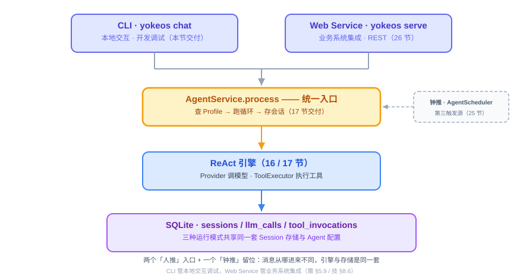
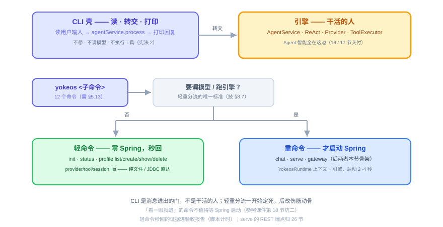
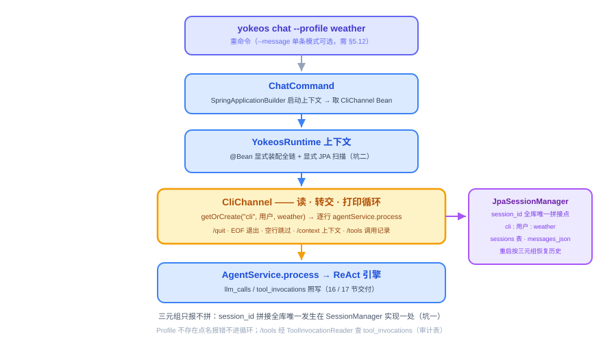

# 第 18 节：CLI——YokeOS 的命令行入口

> **双定位**：本文档是 YokeOS 节级开发文档——既是**教学文档**（给人看：原理解析、动手前想清楚、代码怎么写），也是 **Spec-Kit 的开发原料**（给 AI 执行）。流水线映射：一、二部分供 `/speckit-specify` 取材；三部分供 `/speckit-plan` 取材，末尾「本节交付物」是 `/speckit-tasks` 的比对锚点；四部分是验收 harness 规格（DoD 对号锚点）；五部分是人工验项。
>
> **语料出处**：[需] `docs/DemandAnalysis.md` §5.9/§5.11~§5.13/§11 · [技] `docs/TechnicalSolution.md` §8.4/§8.6~8.7/§9.2/§10/§13 · [宪] CLAUDE.md 宪法 · [指] `docs/AiProgrammingGuide.md` · [参] 参照库课件第 18 节、钉版树第 18 节测试文件与 `specs/003-cli-entry/` 全套（本节 worked example）。
>
> **拍板记录**（2026-09-15，用户批准「没问题，继续」——七项整体通过）：
> ① **范围口径 = CLI 整节**：12 个子命令本节全量交付（`init` 16 节已交付，本节只接入根命令；`serve`/`gateway` 为启动骨架，REST 端点归 26 节）。依据：specs/001 spec 明文「profile create/list/show/delete 归第 18 节」+ 参照第 18 节即 CLI 整节；技 §13 第 18 节行列的是能力主线（`CliChannel` + chat + 记录查看）非全清单。
> ② **sessions 表关联列名按技 §9.2 字面量 `agent_name`**（参照用 `profile_name`；core 领域字段仍是 `profileName`，实体映射处注明——照抄技术方案，不照抄参照）。
> ③ **session_id 格式 `channel:user:agent`**（如 `cli:wang:weather`）。课件与技术方案只定「联合生成」未定格式，取可读可测试的最简形态；格式本身不对外承诺，唯一承诺是「拼接只发生在 SessionManager 实现内部一处」（参照 clarify 同款口径）。
> ④ **交互面字面量**：`/quit`（参照既有）+ `/context`（查看当前会话上下文）+ `/tools`（查看本会话 Tool 调用记录）+ `chat --message <text>`（发单条消息后退出，需 §5.12 明文）。前三项里 `/context`、`/tools`、`--message` 为 YokeOS 特有（参照无此项，需 §5.9/§5.11/§5.12 取材）；`/tools` 的数据源新增 core 只读契约 `ToolInvocationReader`（+ `ToolInvocationRecord` 值对象，`com.yokeos.core.audit`，storage 实现——依赖倒置，26 节 Web 会话详情可复用）。
> ⑤ **profile delete = 归档式**：Agent 目录移入 `.yokeos/archive/`，不物理删（对齐技 §11.3 DELETE 端点「归档不物理删」语义；参照物理删 YAML 是其 profiles 文件形态使然）。30 节 `AgentLifecycleService` 就位后 CLI 改调同一方法。
> ⑥ **装配落位三则**：`YokeosRuntime`（重命令 Spring 装配面）落 yokeos-cli——boot 聚合依赖全部九模块，cli 反向依赖 boot 即循环依赖（参照 `OryxOsRuntime` 同款落位）；fat JAR mainClass 自 `YokeosBootApplication` 切换为 `com.yokeos.cli.YokeOsCli`（boot pom 注释预告的切换点；`YokeosBootApplication` 保留供 26 节 serve，其组件扫描吸收 YokeosRuntime 的显式装配与 JPA 注解）；运行配置唯一归 boot 的 `application.yaml`（追加 schema-002，参照 18 节「双 yaml 冲突」纠正先例，不在 cli 模块另放配置）。伴随：`YokeosBootApplicationLoadTest` 补哑 key 测试属性（全链 Bean 进上下文后，无 key 起不了上下文——前序测试触碰点，断言语义不变）。
> ⑦ **演示口径**：本节可演示成果 = 需 §11 第 18 节行「`yokeos chat` 多轮会话，可查上下文与 Tool 调用记录」——真 key 下 `yokeos chat` 完成两轮以上多轮对话、`/context` 与 `/tools` 可查、退出重进历史还在；fat JAR 或 `mvn exec` 均可承载。

技术栈：JDK 21 + Spring Boot 3.5.16 + Spring AI 1.1.8 + Spring AI Alibaba。本节不新增 Spring AI 写法面（Provider 与工具全量复用 16/17 节交付物，装配是 Spring Framework 层）；**代差警示换成依赖核实**：yokeos-cli 补直接依赖前先 `mvn dependency:resolve -am` 核实可用版本（H3）。

---

## 一、CLI 是什么，干嘛用的

一句话：**CLI 就是 YokeOS 的命令行入口——你在终端里敲命令，跟 Agent 对话、把服务跑起来、查配置和状态。**

YokeOS 打包出来是一个可执行 JAR，`YokeOsCli` 是整个程序的 `main` 入口，所有操作通过子命令完成，第一阶段 12 个（需 §5.13）：

- **跑 Agent**：`chat`（终端交互式对话）、`serve`（启动 Web Service）、`gateway`（守护进程，同时挂多个通道）。
- **看情况**：`status`、`profile list/create/show/delete`、`provider list`、`tool list`、`session list`。
- **起项目**：`init`（初始化工作区，16 节已交付）。

其中三个是**运行模式**，区别只在「消息从哪进来」：`chat` 走终端，`serve` 走 HTTP，`gateway` 同时挂多个通道。三种模式共享同一份 Agent 配置和同一套 Session 存储，底下的引擎是同一个（技 §8.6）。



放到整体架构里看：YokeOS 有两个「人推」入口——**CLI 管本地交互和调试，Web Service 管业务系统通过 REST API 集成**（25 节还会加上第三种触发源「钟推」）。所有入口的消息最后都汇进同一个 `AgentService.process`（17 节立的统一入口）。所以 CLI 在这一层的角色很清楚：**它是消息进出的门，不是干活的人。**

这一节还有个双重身份：CLI 是第一个真正「用起来」Session 的入口，所以**会话层一并交付**——17 节预告的 `session_id` 三元组拼接公式、`getOrCreate`、持久化（SQLite `sessions` 表）都在这节落地；Spring 装配（17 节冒烟是手工装配）也从这节起有正式形态。

## 二、动手前先想清楚几件事

CLI 看着杂（12 个命令），但每个命令要做的事都很浅。动手前把五件事定下来。

**第一，CLI 只做「入口」，不碰 Agent 逻辑。** 一个 `chat` 命令的活就三步：读用户输入 → 交给引擎处理 → 把结果打印出来。它自己不想、不调模型、不执行工具（宪法 2 的执行权只在 `ToolExecutor`）。想清楚这个边界，CLI 的代码就薄得下来。



**第二，命令分两类，为的是启动够快。** Spring Boot 在 JDK 21 下启动要 2~4 秒。对 `serve` 这种常驻服务无所谓，对 `yokeos profile list` 这种「看一眼就退」的命令，等 4 秒才出结果太难受。所以命令按「要不要调模型 / 跑引擎」分流（技 §8.7）：

- **轻命令**（`init`、`status`、`profile` 四件、`provider list`、`tool list`、`session list`）：直接文件 / JDBC 操作，**不启动 Spring 上下文**，秒回。
- **重命令**（`chat`、`serve`、`gateway`）：要跑引擎，**才启动 Spring 上下文**。

**第三，别自己解析命令行参数，用 Picocli。** 子命令、参数、帮助信息、报错提示，Picocli 都帮你做好了，一个命令一个 `@Command` 类。自己撸 `args[]` 解析既费劲又容易出 bug。

**第四，装配面放哪——本仓特有的结构决策。** 重命令要启动 Spring，装配类放哪个模块？答案是 yokeos-cli 自己：`yokeos-boot` 是依赖聚合模块（pom 依赖全部九模块，含 cli），cli 反向依赖 boot 就是循环依赖——所以参照把 `OryxOsRuntime` 放在 cli 模块，本仓同款落 `YokeosRuntime`。boot 的 `YokeosBootApplication` 保留给 26 节 serve：它组件扫描 `com.yokeos` 时会自然吸收 `YokeosRuntime` 的显式装配与 JPA 注解，两个入口不会两套配置。运行配置（datasource、schema 脚本、provider 清单）唯一归 boot 的 `application.yaml`——fat JAR 里 cli 的重命令启动时从 classpath 读到它；参照在 18 节踩过「cli 模块也放一份 yaml → fat JAR 双配置冲突」的坑，末期纠正为统一归 boot，我们直接吸收。

**第五，五个坑——每个都要有对应的回归测试。**

*坑一（最难查）：session_id 两处拼接。* 会话标识由三元组（channel + user + agent）联合生成。CLI、Web、定时所有入口都会用到它——两处各拼一遍、格式差一个分隔符，同一个人就会出现两条互不相认的历史，这类口径问题事后几乎查不出来。解法：**拼接只允许发生在 `SessionManager` 实现内部一处**，所有入口只提供三元组、不自己拼字符串（技 §9.2）。

*坑二（参照真实踩过）：`scanBasePackages` 不会带动 JPA 扫描。* `@SpringBootApplication(scanBasePackages = "...")` 只管普通 Bean 的组件扫描，**不会**让 `@EnableJpaRepositories`、`@EntityScan` 跟着扫到别的模块——这两个默认只按「主类自己所在的包」扫描，是两套独立逻辑。存储在独立模块（`com.yokeos.storage`），不显式声明，启动时就是 "Found 0 JPA repository interfaces"，审计和会话**静默写不进去**，等发现时已经丢了数据。解法：装配类显式 `@EnableJpaRepositories(basePackages = "com.yokeos.storage")` + `@EntityScan(basePackages = "com.yokeos.storage")`，并用装配完整性测试钉死（仓库 Bean 数 > 0）。

*坑三：EOF 与空行。* 管道结束 / Ctrl-D 会让 `readLine()` 返回 null——不处理就抛异常堆栈给用户看；空行转交引擎则是一次无意义的 LLM 调用。解法：EOF 等同 `/quit`、空行跳过；`/quit` 判断前先 trim。

*坑四：重启丢历史。* 「隔天再聊还记得」是会话存在的意义（需 §5.11）。对话历史整体 JSON 序列化存 `messages_json` 一列，回读必须用与 core `Message` 一致的类型反序列化——序列化格式与领域对象字段脱节，重启恢复就会丢消息或乱序。模拟重启（同一库文件、新建实例重查）进 harness。

*坑五（本仓特有）：`agent_name` 列与 `profileName` 字段的映射。* 技 §9.2 定的表列名是 `agent_name`，core 领域字段叫 `profileName`——实体映射写错列，历史照样存取「成功」，按 Agent 查会话时才发现查不回。harness 对列名显式断言。

## 三、代码怎么写

入口是 `YokeOsCli`（`main` 函数 + 根命令），底下挂 12 个 `@Command` 子命令类；重命令的 Spring 装配在 `YokeosRuntime`；交互循环在 `CliChannel`；会话持久化在 storage。对着「一次 `chat` 从敲命令到退出」走一遍。



**第零步（前置）：core 契约补全——17 节预告的改造点。**

- `SessionManager` 接口从「仅 save」补全为三方法：`Session getOrCreate(String channel, String userId, String profileName)`、`Optional<Session> get(String sessionId)`、`void save(Session session)`（原有）。`InMemorySessionManager` 随动实现（保留作测试与轻量场景兜底），17 节既有测试零改动保持绿。
- `Session` 加恢复构造器 `Session(String sessionId, String profileName, List<Message> restored)`——既有构造器与 append 三兄弟不动。
- `com.yokeos.core.audit` 新增只读契约：`ToolInvocationRecord`（`toolName`/`inputJson`/`success`/`errorMessage`/`durationMs`/`createdAt` 值对象）+ `ToolInvocationReader`（`List<ToolInvocationRecord> findBySession(String sessionId)`）——`/tools` 的数据源，与既有 `ToolInvocationAuditor` 同包对称（写口 17 节、读口本节），storage 实现。这不违反「查询接口放扩展阶段」（技 §9.2）——那条说的是对外 REST 审计端点与报表；CLI 交互查看是第一阶段需求（需 §5.9/§11 第 18 节行），走内部只读口。

**第一步：sessions 表 + JPA 会话层。**

- 建表脚本 `db/schema-002-sessions.sql`（yokeos-storage，手工维护，宪法 7）：`session_id` VARCHAR PRIMARY KEY、`agent_name`/`channel`/`user_id` NOT NULL、`messages_json` TEXT、`status` NOT NULL、`created_at`/`last_active_at`/`archived_at`，加 `idx_sessions_agent` 索引。boot 的 `application.yaml` `schema-locations` 追加此脚本（`CREATE TABLE IF NOT EXISTS` 幂等）。
- `Session` JPA 实体（`com.yokeos.storage.Session`，与 core 领域对象同名不同包——参照先例，`JpaSessionManager` 内全限定引用实体、import core 类型）+ `SessionRepository`（`JpaRepository<Session, String>`）。
- `JpaSessionManager` implements core 接口：私有 `sessionId(channel, userId, agentName)` = `channel + ":" + userId + ":" + agentName`——**全库唯一拼接点**（坑一）；`getOrCreate` 命中→Jackson 反序列化恢复领域 Session（含历史）、未命中→落一条 `status=active` 新记录；`save` 序列化整体覆盖 `messages_json` + 刷 `last_active_at`；`archived` 状态本节不产生（26 节 DELETE 端点接线，列先建好恒空）。`agent_name` 列 ↔ `profileName` 字段映射在实体注明（坑五）。

**第二步：CliChannel——chat 的交互壳。** 构造注入 `AgentService` + `SessionManager` + `ToolInvocationReader`；`run(profileName, userId)` 内部委托可注入 IO 的重载（`BufferedReader`/`PrintStream`，测试脚本化驱动）：

```java
public void run(String profileName, String userId) {
    Session session = sessionManager.getOrCreate("cli", userId, profileName);  // 三元组，不拼 id
    print("已连接 Agent [" + profileName + "]，/context 上下文 /tools 调用记录 /quit 退出");
    while (true) {
        print("> ");
        String line = readLine();
        if (line == null || "/quit".equals(line.trim())) { print("再见。"); return; }  // 坑三：EOF 等同退出
        if (line.isBlank()) { continue; }                                            // 坑三：空行跳过
        if ("/context".equals(line.trim())) { printContext(session); continue; }     // 查看上下文：最近消息逐条打印（单条截断保护）
        if ("/tools".equals(line.trim())) { printToolInvocations(session); continue; } // 查看调用记录：ToolInvocationReader 按 sessionId 查
        print(agentService.process(session, line));                                  // 交给引擎，等结果
    }
}
```

`channel` 字面量 `"cli"` 只作为三元组参数出现；`--message <text>` 模式：起同一上下文、`getOrCreate` 后 `process` 一条、打印、退出（不进循环——需 §5.12 单条消息口径，也给 Demo 脚本化留了口）。Profile 不存在时 `AgentService` 点名异常透出、不进循环。

**第三步：YokeosRuntime + ChatCommand——重命令装配。**

- `YokeosRuntime`（com.yokeos.cli）：`@SpringBootApplication(scanBasePackages = "com.yokeos")` + **`@EnableJpaRepositories` / `@EntityScan` 显式指 storage**（坑二）+ `@Bean` 显式装配全链——providerMap（宪法 3）→ 双 auditor → `SpringAiProviderService` → `ProfileRegistry`（AgentLoader 启动扫描）→ `ContextLoader` → `PromptBuilder` → `ToolExecutor`（持 17 节工具 Map，20 节换 ToolRegistry 来源）→ `ReActLoop` → `JpaSessionManager` → `AgentService` → `CliChannel`。配方就是 17 节冒烟的手工装配转录成 `@Bean`（16/17 节交付的类保持纯 POJO 零框架依赖，宪法 2——不引任何带 autoconfigure 的 starter）。
- `ChatCommand`（com.yokeos.cli.command）：`@Option --profile`（默认 `default`）、`@Option --message`；`SpringApplicationBuilder(YokeosRuntime.class).web(NONE).bannerMode(OFF).run()` 起上下文 → 取 `CliChannel` Bean → `run(profileName, System.getProperty("user.name"))`。「当前用户」取系统用户名（核心阶段无认证，参照 clarify 同款默认）。

**第四步：根命令 + 轻命令组 + serve/gateway 骨架。**

- `YokeOsCli` 根命令：注册 12 个子命令，`main` = `System.exit(new CommandLine(new YokeOsCli()).execute(args))`；boot pom 的 spring-boot-maven-plugin `mainClass` 切到它（拍板⑥——不切的话 CLI 参数进不了 fat JAR）。
- 轻命令（零 Spring，纯文件/JDBC）：`status` 查工作区/配置/库文件存在性；`profile list` 列 `.yokeos/agents/` 目录名、`show` 打印 `AGENT.md` 原文、`create <name>` 写最小 `AGENT.md` 模板（provider 缺省取全局层第一个，已存在报错不覆盖——init 同款幂等纪律）、`delete <name>` 归档式移入 `.yokeos/archive/`（拍板⑤）；`provider list` SnakeYAML 直读 application.yaml 的 `yokeos.providers` 列 name/base-url（不解析 key）；`tool list` 列当前真实就绪的内置工具（`http_get`）+ 注明 20 节 ToolRegistry 接线；`session list` 纯 JDBC 只读查 sessions 表（库文件不存在→「暂无会话」）。
- `serve`/`gateway` 启动骨架：`SpringApplication.run(YokeosRuntime.class)` 常驻 + 打印说明（serve：REST 端点 26 节接线；gateway：多通道挂载扩展阶段）；`--port` 透传 `server.port`。

**有几样先别做。** IM Channel（企业微信/飞书/钉钉/Slack）扩展阶段；REST 端点归 26 节（serve 本节只起上下文常驻）；定时触发归 25 节；ToolRegistry/MCP 归 20 节（tool list 本节不查注册表）；对话历史按条拆表不做（整体 JSON 一列）；认证、流式输出不做（需 §5.10 第一阶段边界）。

**本节交付物**（Spec-Kit 拆解锚点）：

- 代码：
  - yokeos-core：`SessionManager` 补全三方法、`Session` 恢复构造器、`InMemorySessionManager` 随动（17 节预告改造点）；`com.yokeos.core.audit` 加 `ToolInvocationReader` + `ToolInvocationRecord`
  - yokeos-storage：`Session` 实体、`SessionRepository`、`JpaSessionManager`、`JpaToolInvocationReader`、`db/schema-002-sessions.sql`
  - yokeos-channel-cli：`CliChannel`（/quit、/context、/tools、EOF/空行、IO 注入重载）
  - yokeos-cli：`YokeOsCli` 根命令、`YokeosRuntime` 装配面、`ChatCommand`、`ServeCommand`、`GatewayCommand`、`StatusCommand`、`ProfileCommand`（嵌套 list/create/show/delete）、`ProviderListCommand`、`ToolListCommand`、`SessionListCommand`（`InitCommand` 16 节已有，接入根命令）
  - yokeos-boot：`application.yaml` 追加 schema-002；pom `mainClass` 切 `com.yokeos.cli.YokeOsCli`
- 测试：`SessionManagerTest`、`SessionRepositoryTest`、`JpaToolInvocationReaderTest`（storage）；`CliChannelTest`（channel-cli）；`YokeOsCliTest`、`StatusCommandTest`、`ProfileCommandTest`、`ProviderListCommandTest`、`ToolListCommandTest`、`SessionListCommandTest`、`YokeosRuntimeAssemblyTest`（cli）——见第四部分
- 配置：无新配置键（`yokeos.providers` 等沿用）；boot `schema-locations` 追加
- 表：`sessions`（9 列 + idx_sessions_agent，schema-002）

## 四、验收 harness：把验收标准变成可执行的测试

SDD 给目标，**Harness 给边界**。本节除装配完整性测试（本地哑 key 起 Spring 上下文）外全部不碰网络——引擎 mock、库用 `@TempDir` SQLite 文件，秒级跑完。宪法 9：参照 CLI 入口零测试是已知工程瑕疵，本仓入口模块测试不例外（16 节 `InitCommandTest` 已开先例）。

**先定分层：什么用单测，什么留人工。**

- **单测（默认全跑）**：会话口径与持久化（storage）、交互壳脚本化驱动（channel-cli）、轻命令逐个（cli）、装配完整性（哑 key + 临时库，本地无网络——参照 `YokeosBootApplicationLoadTest` 同款定位，正常跑不算 integration）。
- **人工项（进程级/要真 key）**：真模型多轮对话、fat JAR 冒烟、轻命令秒回体感、启动日志目检。

**测试类与验收点对号表：**

| 测试类 | 覆盖的验收点 |
|---|---|
| `SessionManagerTest` | 同一三元组历次 `getOrCreate` 同一 Session（**坑一回归**）；任一元素不同即不同会话（全排列）；id 格式 `channel:user:agent`；未命中落 `status=active` 记录（`agent_name` 列断言，**坑五回归**）；恢复历史完整；`save` 刷 `last_active_at` |
| `SessionRepositoryTest` | 手工建表脚本建出的 `sessions` 能存能读（测试里执行 schema-002，不让 Hibernate 自动建）；user/assistant/tool 三类消息序列化回读完整、顺序不变；模拟重启（同库文件新建实例重查）历史还在（**坑四回归**）；零消息会话正常；列名逐一对齐技 §9.2 |
| `JpaToolInvocationReaderTest` | 实体行映射 `ToolInvocationRecord` 字段逐一对齐；按 sessionId 只查本会话；成败行都在 |
| `CliChannelTest` | 多行输入逐行转交引擎并打印回复；`/quit` 前后空白照常退出；EOF（null）等同退出不抛堆栈（**坑三回归**）；空行跳过不转交；`--message` 单条后即退；`/context` 输出含最近消息；`/tools` 输出含调用记录（mock Reader 返回 `success=true` 行）；Profile 不存在点名报错不进循环 |
| `YokeOsCliTest` | 12 个子命令全部注册；`--help` 正常；未知子命令 Picocli 报错退出码非 0（无堆栈） |
| `StatusCommandTest` / `ProfileCommandTest` / `ProviderListCommandTest` / `ToolListCommandTest` / `SessionListCommandTest` | 各自命令主路径：status 汇总工作区存在性；profile list/create/show/delete（create 幂等不覆盖、delete 归档到 `.yokeos/archive/` 不物理删）；provider list 列 name/base-url；tool list 含 `http_get` 与 20 节注明；session list 库不存在→「暂无会话」不抛异常 |
| `YokeosRuntimeAssemblyTest` | 哑 key + `@TempDir` SQLite 起 `YokeosRuntime` 上下文：JPA repository Bean 数 > 0（**坑二回归**：装配残缺立刻红）；`SessionManager`/双 auditor/`AgentService`/`CliChannel` Bean 就位；经真实 Bean 完成 `getOrCreate`→`save`→`getOrCreate` 往返 |

**两个最值钱的回归测试写出来看**（示意；测试方法名英文，`@DisplayName` 保留中文语义）：

```java
@Test
@DisplayName("同一三元组_历次getOrCreate都是同一个Session")
void sameTriple_everyGetOrCreateReturnsSameSession() {
    var first = sessionManager.getOrCreate("cli", "wang", "weather");
    var second = sessionManager.getOrCreate("cli", "wang", "weather");
    assertEquals(first.sessionId(), second.sessionId());     // 幂等：多轮对话靠它串起来

    var other = sessionManager.getOrCreate("web", "wang", "weather");
    assertNotEquals(first.sessionId(), other.sessionId());   // channel 不同就是不同会话
}

@Test
@DisplayName("重命令上下文_JPA仓库必须装配到位")
void runtimeContext_jpaRepositoriesMustBeWired() {
    try (var ctx = new SpringApplicationBuilder(YokeosRuntime.class)
            .properties(dummyKeyProps(), "spring.datasource.url=" + tempSqliteUrl())
            .run()) {
        var repositories = ctx.getBeansOfType(JpaRepository.class);
        assertFalse(repositories.isEmpty());   // 坑二：Found 0 = 审计会话静默写不进去，带病运行必须在此刻红
        assertTrue(ctx.getBean(SessionManager.class) instanceof JpaSessionManager);
    }
}
```

第一个测的是坑一（会话口径）——断言的不是「能创建会话」，而是「幂等 + 隔离」这条口径本身；配套还有全库 grep 证据：`":"` 拼接 session_id 全库唯一命中 `JpaSessionManager.sessionId()`（验收报告贴 grep 输出）。第二个测的是坑二（装配完整性）——参照把「Found N JPA repository interfaces」留人工目检，本仓升格为机器断言（宪法 9：瑕疵不继承）。

**`SessionRepositoryTest` 的一个讲究**：建表要走 schema-002 手工脚本（测试里执行），不让 Hibernate 自动建——16/17 节同款理由：测试绿、生产跑真脚本时列名对不上，白测。

**跑法**：

```bash
mvn test                                          # 日常：单测全绿才算实现完成
mvn -pl yokeos-cli -am test                       # 本节主战场
mvn -pl yokeos-boot -am package -DskipTests && java -jar yokeos-boot/target/*.jar --help   # fat JAR 冒烟（12 命令）
```

## 五、做完怎么验

harness 全绿之后，剩下这几条需要人工确认（进验收报告的「剩余人工项」）：

- [ ] 真模型多轮对话（拍板⑦口径）：`DEEPSEEK_API_KEY=xxx java -jar yokeos-boot/target/*.jar chat`——两轮以上问答、`/context` 能看到刚才的对话、`/tools` 能看到本会话的工具调用记录、`/quit` 正常退出
- [ ] 隔天口径：退出后重进 `chat`，上次聊过的还在（同三元组续会话）；`session list` 能看到这条会话——三种运行模式共享同一套 Session 存储的体感证据
- [ ] 轻命令秒回：终端实际敲 `yokeos profile list` / `provider list`，目测无 Spring 启动等待（脚本计时留证据）
- [ ] `chat` 启动日志 "Found N JPA repository interfaces" 的 N > 0（坑二的人工复核面）
- [ ] 12 个子命令 `--help` 全部正常、未知命令有清晰报错（Picocli 自带，抽查即可）
- [ ] `grep -r "sk-"` 代码与配置零命中——凭证卫生不受本节影响
- [ ] code review 确认：轻命令零 Spring import；`CliChannel` 无 Agent 智能（只有读—转交—打印）；`YokeosRuntime` 全 `@Bean` 显式装配、未引入带 autoconfigure 的 starter（宪法 2）

其余验收点——会话幂等与隔离、id 单点拼接、序列化回读、重启恢复、EOF/空行、装配完整性、命令注册与报错——已由第四部分单测覆盖，`mvn test` 绿就等于打勾。

到这一步，Provider、ReAct、会话持久化、CLI 入口串成了完整体验：你能在终端里真正跟自己搭的 Agent 说上话，它记得你们聊过什么——这就是 Demo 一（每日天气）的对话版。`serve` 的 REST 门面归 26 节，第三触发源「钟推」归 25 节。
