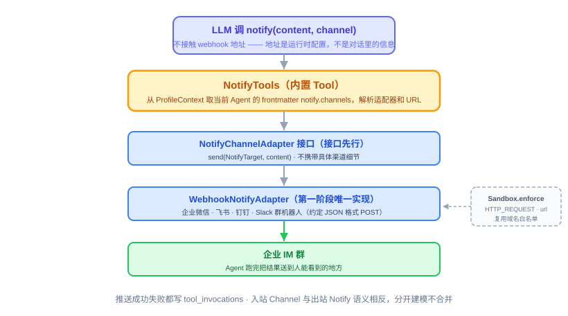

# 第 19 节：Notify——结果主动送出去的统一出口

> **双定位**：本文档是 YokeOS 节级开发文档——既是**教学文档**（给人看：原理解析、动手前想清楚、代码怎么写），也是 **Spec-Kit 的开发原料**（给 AI 执行）。流水线映射：一、二部分供 `/speckit-specify` 取材；三部分供 `/speckit-plan` 取材，末尾「本节交付物」是 `/speckit-tasks` 的比对锚点；四部分是验收 harness 规格（DoD 对号锚点）；五部分是人工验项。
>
> **语料出处**：[需] `docs/DemandAnalysis.md` §5.8/§11/§5.2 · [技] `docs/TechnicalSolution.md` §6.8/§8.2/§13 · [宪] CLAUDE.md 宪法 5/7 · [指] `docs/AiProgrammingGuide.md` §4~5 · [参] 参照库课件第 19 节、钉版树 `specs/004-notify-outbound/` 与 `oryxos-tool` notify 测试文件。
>
> **拍板记录**（2026-09-15，用户批准）：① `notify` 的 `channel` 参数按**渠道名（name）**匹配而非按 type——本仓 `Profile.NotifyChannelConfig` 是 `name`/`type`/`config` 三字段（16 节已定），同名 type 可配多条渠道（两个不同的群），按 name 匹配才无歧义；缺省或字面量 `default` 取第一个渠道；指定名匹配不到报错点名、不回退（参照按 type 匹配是因为它的渠道模型没有 name 字段，推理对本仓不成立）。② `AgentLoader` 对 `notify.channels` 的 `type` 从硬编码 `"webhook"` 改为**读取 frontmatter**：缺省视为 `webhook`；声明了第一阶段不支持的 type 记错误日志并剔除该渠道、不阻断启动（技 §8.2 总原则）。③ HTTP 客户端用 **JDK `HttpClient`** 而非参照的 Spring `RestClient`——与 17 节 `HttpGetTool` 同构、同步阻塞（宪法 4）、不新增 `spring-web` 依赖（软门禁⑥规避）。④ 演示口径 = `yokeos chat` 对话里说「把测试消息推一下」，Agent 调 `notify` 推到本地假 webhook（自动化）/ 真群机器人（人工冒烟），锚定需 §11 可演示成果。⑤ `NotifyTools` 构造注入 `Map<String, NotifyChannelAdapter>`（type → 实现）而非单个 adapter——与参照终态同构，20/24 节扩展不改构造器。

技术栈：JDK 21 + Spring Boot 3.5.16。本节不碰 Spring AI，无 API 代差问题；`RestClient`/`HttpClient` 等 JDK 与 Boot 组件写法照常以本地依赖核实为准（H3）。

---

## 一、Notify 是什么，干嘛用的

一句话：**入站有 Channel 负责「消息怎么进来」，Notify 补的是对称的另一半——「结果怎么主动送出去」。**

前 18 节的所有链路都是「人推」：CLI 里你问一句，Agent 答一句，同步返回——回复方式是原路带回，不需要额外的推送机制。但「每日天气」「每日科技日报」这类场景不一样：25 节的定时触发到点自动跑，**没有人在另一端等着看响应**，Agent 跑完一整套 ReAct 循环，结果只能烂在 Session 里没人看到。Agent 必须自己决定把结果送到哪、怎么送——送到人能看到的地方，就是企业 IM 群。[需 §5.8][技 §6.8]

**如果没有这个模块会怎样**：每个业务方定义 Agent 时都要在正文里手写「调 `http_post` 打这个 webhook URL」，或者自己找一个企业微信/飞书的 MCP server 配上——每个 Agent 各写一份，重复且不统一。`NotifyTools` 要把「往外推一条消息」这件最常见的事统一掉。这也是 Memory（21/22 节）、Sandbox（23/24 节）会反复用到的「接口先行」设计习惯的第一次亮相。



四个角色先认清：

- **`NotifyChannelAdapter`**（接口）：表达「把一条内容送到某个通知目标」这个意图，不出现「企业微信」「飞书」这类某一档实现特有的词。
- **`NotifyTarget`**（值对象）：`channelType` + 一份 `config`，具体是 webhook 地址还是别的，由实现类自己解释。
- **`WebhookNotifyAdapter`**（第一阶段唯一实现）：通用 HTTP webhook——企业微信、飞书、钉钉、Slack 的群机器人都提供 webhook 地址，一档覆盖大部分场景。
- **`NotifyTools`**（内置 Tool，`notify`）：LLM 在对话里调用的入口，从当前 Agent 的配置解析渠道、委托适配器发送。

## 二、动手前先想清楚几件事

**第一，先定接口，别先定实现。** 接口签名里不携带任何渠道特有概念——「换成企业微信官方 SDK 实现，`send(NotifyTarget, String)` 这个签名需要改吗？答案应该是不需要」（五部分接口中立性自查）。核心阶段只在接口后面挂一档实现，以后加新渠道只新增实现类，不改接口、不改调用方。这条与宪法 6「Sandbox 接口先行」是同一套设计习惯。

**第二，核心阶段只做通用 webhook，不逐家接专用 API。** 企业微信/飞书/钉钉的群机器人都收 webhook，不需要逐家接签名算法、AccessToken 刷新这些认证细节——那是扩展阶段按需新增专用 Adapter 的事（参照课件 6.4 路一：按 `channelType` 挂实现类，认证细节收在各自 Adapter 内部）。

**第三，安全校验留位 24 节。** `notify` 发出去的是一次 HTTP 请求，理应跟 `http_post` 一样过 `Sandbox.enforce(HTTP_REQUEST, url)` 域名白名单——不能因为它是「往外推」就绕过「往内请」的那道墙，两者共享同一份 `http.allowed_domains`。但 Sandbox 接口 23 节才评审、24 节才落地，本节按**检查位注释**接进去（`HttpGetTool` 17 节同款留位），24 节接线后补 InOrder 顺序回归。

**第四，推到哪是配置，不是对话内容。** webhook 地址是运行时配置，LLM 调用时大多数时候只传 `content` 就够——地址不进 system prompt、不进 tool schema、不进日志。这跟 Sandbox 域名白名单「配置在配置文件、不暴露在接口签名里」是同一个考虑：**webhook URL 本身就是凭证**（拿到 URL 谁都能往群里发消息），必须走 `${ENV_VAR}` 占位（宪法 7）。

**第五（本仓特有），渠道带 name 字段，`channel` 参数按 name 匹配。** 本仓 `Profile.NotifyChannelConfig` 是 `name`/`type`/`config` 三字段（16 节已定，技 §8.2）：同一个 Agent 完全可以配两个 webhook 渠道——`ops-group` 和 `dev-group`，都推群、群不同。按 type 匹配对这种配置无能为力（两条都是 `webhook`），按 name 匹配才无歧义（拍板①）。

**四个坑——直接决定代码长什么样：**

*坑一：静默失败。* 发送失败（对端 5xx、连接不上）或渠道压根没配置时装作成功——这是最危险的软故障：日报「发了」但群里没人收到，发现时已经断了一周。「发出去没送到」与「没发出去」对 Agent 是同一件事，必须把失败显式抛出或报错点名。[参 specs/004 US2]

*坑二：webhook URL 即凭证。* URL 里的 token 就是权限本身，泄漏等于任何人都能往群里发消息。URL 不明文写进 Profile、不进日志、不进 git——写 `url: ${FEISHU_WEBHOOK_URL}` 从环境变量解析；`grep` 凭证卫生是本节人工项。

*坑三：「都是 webhook」≠「同一个 JSON」。* 各家群机器人约定的 body 格式不一样：企业微信是 `{"msgtype":"text","text":{"content":...}}`，飞书是 `{"msg_type":"text","content":{"text":...}}`，钉钉同企微形态但要配安全设置，Slack 是 `{"text":...}`，Discord 才与核心阶段的 `{"content":...}` 天然兼容。第一阶段统一发 `{"content": ...}`——发到不认这个格式的渠道，消息进不了群但通常不报错（HTTP 200、内容丢弃），对接时要知道这个坑；payload 适配是扩展阶段专用 Adapter 的事，本节不做（见「先别做」）。[参课件 6.2]

*坑四：`ProfileContext` ThreadLocal 串号。* `notify` 是第一个经 `ProfileContext.current()` 读配置的 Tool（17 节留的位），测试里 `@BeforeEach` set、`@AfterEach` 必 clear——不清的话下一个复用线程的测试拿到别人的 Profile，单测永红不了、并发才炸（17 节同款纪律）。

## 三、代码怎么写

四样东西全落 `yokeos-tool`（宪法 5 三合一：Notify 归 Tool 模块，不拆），外加两处接线。对着「一次 notify 从对话到进群」走一遍：

**第零步（前置确认，不写码）：** `YokeTool`/`ToolResult`（17 节）、`ProfileContext`（17 节）、`Profile.NotifyChannelConfig`（16 节）都已就位——`NotifyTools` 直接 implements `YokeTool`，可被既有 `ToolExecutor` 执行与审计，不需要 20 节的注册机制。

**第一步：接口两件。**

```java
// com.yokeos.tool.notify.NotifyChannelAdapter —— 唯一方法，课件字面量签名
public interface NotifyChannelAdapter {
    void send(NotifyTarget target, String content);
}

// com.yokeos.tool.notify.NotifyTarget —— channelType + config，接口语汇零渠道特有词
public record NotifyTarget(String channelType, Map<String, String> config) {}
```

**第二步：`WebhookNotifyAdapter`（第一阶段唯一实现）。** JDK `HttpClient` 发一次 POST（拍板③，与 `HttpGetTool` 同构、同步阻塞）：`config.get("url")` 缺失抛 `IllegalArgumentException` 点名、不发请求；body 统一 `{"content": ...}`；**非 2xx 异常上抛不吞**（坑一：不注册任何吞错处理器，让 `RestClient` 式默认异常语义由 `HttpClient` 的状态码检查承担）。构造注入 `HttpClient` 便于测试定制超时。

**第三步：`NotifyTools`（内置 Tool）。** 核心方法 `execute(JsonNode input)`，一步步看：

1. `content` 缺失或空白 → `ToolResult.error("notify 缺少必填参数 content", false)`——确定性失败不重试；
2. `ProfileContext.current()` 取当前 Profile——null 则报错「当前无 Agent 上下文」；`notifyChannels` 为空则报错点名「Profile xxx 未配置 notify_channels，无处可推」，**adapter 零调用**（坑一：不能让 Agent 以为发出去了）；
3. 渠道解析 `resolveChannel(channels, channel)`：`channel` 缺省、空白或字面量 `default` → 第一个渠道；否则**按 name 匹配**（拍板①）；匹配不到 → 报错点名「不存在名为 xxx 的通知渠道（不回退默认，避免消息发错地方）」；
4. 按渠道条目的 `type` 从 `Map<String, NotifyChannelAdapter>` 取实现（拍板⑤；本 Map 只装 `webhook` 一档）——取不到报错点名「渠道类型 xxx 没有对应实现」；
5. **沙箱检查位**：注释钉死「24 节接 `Sandbox.enforce(new SandboxAction(HTTP_REQUEST, url))`，与 `http_post` 共享 `http.allowed_domains`；enforce 不过异常上抛走既有失败审计」——本节不写实现；
6. `adapter.send(target, content)` → `ToolResult.ok("已推送")`。发送异常（HTTP 层）**不 catch**，上抛给 `ToolExecutor` 走既有失败审计路径（`tool_invocations` 记 `success=false`）——审计零新增逻辑（宪法 7：Sandbox 拒绝与其他失败同一条路径）。

`getInputSchema()` 手写 JSON Schema：`content` 必填、`channel` 可选（描述里写明「缺省用第一个渠道」）。

**第四步：两处接线。**

- `AgentLoader`（yokeos-core）：`notify.channels` 的 `type` 从硬编码 `"webhook"` 改为读取 frontmatter——缺省 `"webhook"`；非支持值记错误日志并剔除该渠道、不阻断启动（拍板②，16 节「后面各节补自己的校验」在此兑现）。
- `YokeosRuntime`（yokeos-cli）：`tools()` Map 注册 `"notify"` → `new NotifyTools(Map.of("webhook", new WebhookNotifyAdapter(...)), )`——`yokeos chat` 对话里 Agent 就能调到。

**frontmatter 配置示例**（本仓三字段形态，技 §8.2）：

```yaml
notify:
  channels:
    - name: ops-group          # channel 参数按它匹配（拍板①）
      type: webhook            # 缺省可省；第一阶段唯一支持值
      config:
        url: ${TEAM_WEBHOOK_URL}   # 凭证走环境变量，不落明文（坑二）
```

**有几样先别做。** 企业微信/飞书/钉钉专用 Adapter（payload 适配、加签、AccessToken）、邮件/短信渠道、失败重试策略复杂化、富文本卡片消息——全部扩展阶段（需 §5.8「第一阶段不做」）。需要富文本的 业务方走 MCP 方式二自己接专用 server，两条路并存：`notify` 只是把「最常见的纯文本推送」统一掉，不是要吃掉 MCP 的场景。[技 §6.8]

**本节交付物**（Spec-Kit 拆解锚点）：

- 代码：`NotifyChannelAdapter`、`NotifyTarget`、`WebhookNotifyAdapter`、`NotifyTools` → yokeos-tool（notify 子包 + tool 包根）；`AgentLoader` type 读取与校验 → yokeos-core；`YokeosRuntime` 注册 `notify` → yokeos-cli
- 测试：`WebhookNotifyAdapterTest`、`NotifyToolsTest`（见第四部分）；`AgentLoaderTest` 补 notify 渠道用例（type 显式/缺省/不支持值剔除）
- 配置：`AGENT.md` frontmatter `notify.channels`（`name`/`type`/`config.url`）；无新全局配置键（域名白名单归 24 节）
- 表：无新表（`tool_invocations` 既有路径，零新增审计逻辑）

## 四、验收 harness：把验收标准变成可执行的测试

分层判断照旧——**要不要碰真实网络**：本地假 webhook（JDK `com.sun.net.httpserver.HttpServer`，port 0 自动分配）是单测层，秒级跑完；真群机器人是人工冒烟。

**两个测试类，逐条对应验收标准：**

| 测试类 | 覆盖的验收点 |
|---|---|
| `WebhookNotifyAdapterTest` | 发送后收到恰好一次 POST、body 含 `content`、Content-Type 为 JSON；URL 来自 `NotifyTarget.config` 非硬编码——两个不同 url 的 target 各发各的（换渠道零代码）；假 webhook 返回 5xx → 异常上抛不吞（坑一）；config 缺 `url` → `IllegalArgumentException` 点名、零请求 |
| `NotifyToolsTest` | `notify_channels` 未配置 → 失败点名、adapter 零调用（坑一）；`channel` 缺省/空白/`default` → 第一个渠道；显式传 name → 命中指定渠道（拍板①）；指定 name 不存在 → 失败点名零调用、不回退；`ProfileContext` 无值 → 失败点名；`content` 缺失 → 失败点名；成功路径 → `verify(adapter).send(目标匹配, 内容)` 且结果 `content="已推送"` |

**最值钱的两个测试，写出来看。**（示意；测试方法名英文，`@DisplayName` 保留语义）

```java
@Test
@DisplayName("notify_channels未配置_明确报错不静默失败")
void unconfiguredChannelsFailsExplicitly() {
    ProfileContext.set(profileWith(List.of()));      // 配了 Agent 但没配渠道

    ToolResult result = notifyTools.execute(input("content", "hello"));

    assertFalse(result.success(), "不是静默失败——Agent 不会以为发出去了");
    assertTrue(result.errorMessage().contains("notify_channels"), "报错点名未配置项");
    verify(adapter, never()).send(any(), anyString());   // 一次请求都没发
}

@Test
@DisplayName("webhook返回5xx_异常向上抛不静默吞掉")
void webhookReturns5xx_ExceptionPropagates() {
    fakeWebhook.respondWith(500);
    NotifyTarget target = webhookTarget(fakeWebhook.url());

    assertThrows(IOException.class, () -> adapter.send(target, "今天 28°C"));
    // 坑一的另一半：对端报错绝不装成功——"发出去没送到"与"没发出去"是同一件事
}
```

**分批说明（明文写进 tasks）**：① InOrder 白名单顺序回归（`enforce` 先于 `send`）**留 24 节**——Sandbox 接口未就位，本节 `NotifyToolsTest` 文件头注释注明待补；② `YokeosRuntime` 注册后的对话级联动（`yokeos chat` 里模型真调 `notify`）归 CLI 侧既有冒烟框架，本节不新开集成测试类。

**`NotifyToolsTest` 的一个讲究**：mock 的是 `NotifyChannelAdapter`，`@BeforeEach` 里 `ProfileContext.set(...)`、`@AfterEach` 里必 `ProfileContext.clear()`——坑四的纪律直接写在测试里，漏 clear 的话下一个用例的 Profile 就是脏的。

**`AgentLoaderTest` 补用例**：`type: webhook` 显式声明 → 派生成功；省略 `type` → 缺省 `webhook`；`type: email` → 该渠道剔除、错误日志可断言、Agent 其余字段照常加载（拍板②）。

**实现完成的定义是 `mvn clean verify` 九模块全绿**（18 节基线 125 测试 + 本节新增，前序零回归）。

## 五、做完怎么验

harness 全绿之后，人工确认这几条（进验收报告「剩余人工项」）：

- [ ] **真 webhook 真推一条**：配一个真实群机器人（飞书自定义机器人最简——签名校验可选），`yokeos chat` 里让 Agent 推一条，群里肉眼看到（假 webhook 测协议，真 webhook 验配置；注意坑三——发 `{"content":...}` 进企微/飞书群进不了正文，Discord/自建 ntfy 才天然兼容，人工项选对渠道）
- [ ] 凭证卫生：`grep -r "hook KEY 前缀\|access_token\|sk-"` 在代码与配置里搜不到明文 URL/token（坑二）
- [ ] 接口中立性自查（思维练习，测不出来）：换成企业微信官方 SDK 实现，`NotifyChannelAdapter.send(NotifyTarget, String)` 签名需要改吗？答案应该是不需要
- [ ] 接口语汇 grep：`grep -ri "wecom\|feishu\|dingtalk" yokeos-tool/src/main` 零命中——主代码无渠道特有词（测试与注释里的知识性盘点不算）
- [ ] 可演示成果核对（需 §11 口径）：`yokeos chat` 对话里说「把测试消息推一下」，Agent 调 `notify` 推到配置渠道，`tool_invocations` 查得到这次调用

其余验收点——POST 形态、URL 来自配置、5xx 上抛、未配置报错、渠道解析、默认渠道、ThreadLocal 纪律——已由第四部分单测覆盖，`mvn test` 绿即打勾。

Notify 补上的是「Agent 说完话还能主动送出去」这个出口。有了它，25 节的定时模块和 31 节的两个日跑 Demo 才有地方把结果真正交出去——不然到点跑完一整套 ReAct 循环，结果只能烂在 Session 里没人看到。
