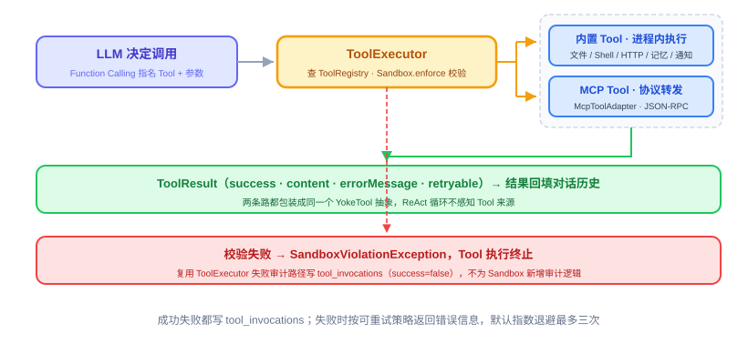

# 第 20 节：Tool 体系与 MCP——Agent 的手

> **双定位**：本文档是 YokeOS 节级开发文档——既是**教学文档**（给人看：原理解析、动手前想清楚、代码怎么写），也是 **Spec-Kit 的开发原料**（给 AI 执行）。流水线映射：一、二部分供 `/speckit-specify` 取材；三部分供 `/speckit-plan` 取材，末尾「本节交付物」是 `/speckit-tasks` 的比对锚点；四部分是验收 harness 规格（DoD 对号锚点）；五部分是人工验项。
>
> **语料出处**：[需] `docs/DemandAnalysis.md` §5.7/§11/§5.2 · [技] `docs/TechnicalSolution.md` §6.1~6.6/§8.2/§13 · [宪] CLAUDE.md 宪法 2/5/7 · [指] `docs/AiProgrammingGuide.md` §4~5 · [参] 参照库课件第 20 节、钉版树 `oryxos-tool` 主代码与 tool/mcp 测试文件。
>
> **拍板记录**（2026-09-17，用户批准：①~⑦ 整体通过，④ 经专项评估确认不做五件扩展工具——选 A，扩展阶段按信号补齐）：
> ① **Sandbox 不在本节立前向接口**：需 §11 第 20 节行「白名单校验生效」与技 §13 第 20 节行（交付物无 Sandbox）/技 §13 第 24 节行（`Sandbox` 接口 + `WhitelistSandbox` 归 24 节）存在张力。本节按技 §13 口径：六个工具各留**检查位注释**（17 节 `HttpGetTool`、19 节 `NotifyTools` 同款先例），白名单拦截用例与 InOrder 顺序回归归 24 节接线时补；「白名单校验生效」的完整兑现落 24 节，本节验收以「校验链路定稿」（检查位注释钉死 `enforce` 调用形态与共享配置）承接。备选 B（参照口径：本节立 Sandbox 接口五件 + 直通临时实现）不采，动因：技 §13 第 24 节行明确接口交付物在 24 节、19 节刚拍过同款留位先例、软门禁①不在本节交付清单外新增 public 概念。
> ② **内置工具走 `@Tool` 注解管道**（技 §6.5「方式三写法跟 YokeOS 内置 Tool 完全一样」/§6.6「扫描 `@Tool` 注解的方法」）：`FileTools`/`ShellTools`/`HttpTools` 为带 `@Tool` 注解方法的 Bean，经 `ToolRegistry.registerAnnotated` + `AnnotatedToolAdapter` 包装成 `YokeTool`；`NotifyTools`（19 节直接实现 `YokeTool`，构造注入适配器映射）保持**直接注册**——参照终态同构。17 节 `HttpGetTool`（手写单类）演进并入 `HttpTools` 后删除（17 节注释预告「20 节扩展为 HttpTools 全量」，当节明确列为改造点）。
> ③ **`shell` 入参 argv 数组直传**（技 §6.2「参数以 argv 直传（不经 Shell 解释拼接）」）：schema 为 `{"command": ["git", "status"]}` 数组形态，`ProcessBuilder(List<String>)` 直传、零 shell 解释——参照实现为 `bash -c` 字符串拼接（经 shell 解释），与本仓技术方案冲突，采信技术方案；24 节白名单对 `argv[0]` 精确比对也因此干净。超时默认 30 秒。
> ④ **参照第六部分的五个扩展工具（`edit_file`/`grep`/`glob`/`ask_user`/`web_search`）不进本节**：需 §5.7 与技 §6.2 的内置清单均为九个，五个是参照实现期对齐业界主流的超集交付，YokeOS 文档链不含——列「先别做」；将来要补属需求变更先行。
> ⑤ **新依赖两件**（软门禁⑥记理由）：`yokeos-tool` + `org.springframework.ai:spring-ai-model`（`@Tool`/`ToolCallback`/`ToolCallbacks`——宪法 2 允许的 schema 生成）+ `io.modelcontextprotocol.sdk:mcp`（MCP Java SDK，技术栈表既列）；版本经 spring-ai-bom 1.1.8 管理，写前 `mvn dependency:resolve` 核实实际解析版本，MCP SDK 写法以本地依赖 `javap` 核实为准（参照课件 `new McpSchema.Tool(name, desc, "{}")` 三参构造是旧版形态，代差警示）。
> ⑥ **Profile 点名校验兑现 17 节预告**（`PromptBuilder` 注释「注册校验归 20 节 ToolRegistry」）：`AgentLoader` 派生 Profile 时对 `tools` 点名做存在性校验，点名了但注册面没有的记 **WARN 不阻断**——把 19 节实证的「静默略过」（AGENT.md 漏写 `tools:` → 零工具可用）变成「有痕略过」，配置错误在启动日志里看得见。
> ⑦ **`tool list` 改查注册表但保持轻命令零 Spring**（18 节口径）：手动构造静态注册面（三组 `@Tool` Bean + `notify`，不连 MCP），MCP 动态工具注明不列（随重命令启动注册）；`.yokeos/mcp_servers.yaml` 模板进 `init`（幂等，CLAUDE.md 工作区结构既列此文件）。

技术栈：JDK 21 + Spring Boot 3.5.16 + Spring AI 1.1.8（本节只用 `@Tool` schema 生成与 `ToolCallbacks` 载体）+ MCP Java SDK（stdio transport、同步客户端——`McpSyncClient` 正合宪法 4）。**API 代差警示**：参照课程期 Spring AI 为 1.0.0-M6、MCP SDK 为 0.x，本文代码是示意——`McpSchema.Tool` 构造形态、`ToolCallbacks.from` 位置以本地 1.1.8 依赖 `javap` 核实为准（H3：核实不到不写）。

---

## 一、Tool 是什么，干嘛用的

一句话：**Tool 就是 Agent 的手——LLM 负责想，Tool 负责真的去读文件、跑命令、调接口。**

大模型本身只会生成文字：它读不了磁盘上的文件，也发不出一次数据库查询。17 节的 ReAct 循环里「Act」那一步，至今只有一只最小的手（`http_get`）加一个出口（`notify`）。本节把这只手**成建制补全**：读写文件、跑命令、发请求六个内置工具，再立一套让**外部能力**安全接进来的管道（ToolRegistry + MCP）。[LLM 决定「调哪个工具、传什么参数」（16 节 Function Calling），YokeOS 负责真正执行、把结果递回 LLM——一次调用全链路落 `tool_invocations`（宪法 7，17 节起已在写）。]



YokeOS 的 Tool 分两类：

- **内置 Tool**：九个分五组（需 §5.7）——`FileTools`（`read_file`/`write_file`/`list_dir`）、`ShellTools`（`shell`）、`HttpTools`（`http_get`/`http_post`）六件本节交付；`notify` 19 节已交付，本节入册注册；`save_memory`/`recall_memory` 归 22 节 Memory 模块（届时经同管道注册）。九件覆盖「读写文件、跑命令、调 API、记事、往外推通知」的最短链路。
- **扩展 Tool**：业务方接进来的能力，三档门槛从低到高（技 §6.3~6.5）——**方式一零代码**（AGENT.md 目录 + 复用社区 MCP server，主推）、**方式二轻代码**（自写 MCP server 配进 `mcp_servers.yaml`）、**方式三重代码**（`@Tool` Java Bean 进程内直调）。选择原则一句话：**能用一不用二，能用二不用三。**

本节的两个主角恰好是这套体系的两个「汇合点」：**ToolRegistry** 把三种来源的工具统一成 `YokeTool`（ReAct 循环由此对来源无感知）；**MCP Client** 把外部 MCP server 的工具经协议转换接进同一个注册表。方式一本节就能跑通一半——AGENT.md 的 `mcp_servers` 字段（16 节已建）配上本节的 MCP 管道，社区 server 的工具就到了模型手里；Skill 正文注入与目录语义的完整闭环归 29 节。

## 二、动手前先想清楚几件事

**第一，统一抽象 17 节已立，本节不新增抽象，只建汇总管道。** `YokeTool` 四方法（`getName`/`getDescription`/`getInputSchema`/`execute`）已在 core——不管工具从哪来（内置注解、MCP、直接实现），都包装成 `YokeTool` 进 `ToolRegistry`，`ToolExecutor` 与 `PromptBuilder` 只认 Map 里的 `YokeTool`，完全不感知它背后是什么。动手前先检查现有代码这条已过：`getInputSchema()` 17 节就在（16 节立的签名，schema 翻译 16 节就在消费）。

**第二，内置工具与方式三共用同一条注解管道——这是宪法 2 的边界题。** 内置工具的每个动作是 `@Tool` 注解方法，启动时 `ToolCallbacks.from(bean)` 生成 `ToolCallback`（schema 自动生成——**宪法 2 允许的两件事之一**），`AnnotatedToolAdapter` 把它包装成 `YokeTool`。要分清的是：`callback.call()` 在这条管道里是**进程内直调 Java 方法**（方式三的语义本体），执行的**发起方永远是 `ToolExecutor`**——不存在「框架自动执行」路径，也不碰 `chatClient.prompt().tools()`。这条最容易写错（陷阱表第一条），写错的症状是 tool 被调两次。

**第三，MCP 失联不拖垮启动——外部依赖的可用性不是自己的可用性。** MCP server 是外部进程：连不上、起不来、响应超时都正常。`McpClientService` 启动时逐个连接，任何一个失败只记 WARN 跳过它的工具，YokeOS 照常起、其他 server 的工具照常注册。反过来要求配置加载同样宽容：`mcp_servers.yaml` 缺失 = 零 server，启动照常。

**第四，安全校验留位 24 节（拍板①）。** 工具能读文件、跑命令、发请求，一旦被乱调就是事故——校验链路（`Sandbox.enforce` 白名单）在设计上属于执行第一步，但接口本体 23 节评审、24 节落地。本节六个工具每个方法**第一行**留检查位注释钉死调用形态（与 17 节 `HttpGetTool`、19 节 `NotifyTools` 同款），24 节接线后补拦截用例与 InOrder 顺序回归。

**第五（本仓特有），点名过滤已就位，本节把「静默」变「有痕」（拍板⑥）。** `PromptBuilder.availableTools` 从 17 节起就按 `Profile.tools` 点名过滤（点名不在候选集的静默略过）——19 节 E2E 实证过它最危险的形态：frontmatter 漏写 `tools:` 时模型零工具可用、只会口头答复。本节 `AgentLoader` 在派生 Profile 时记 WARN 把这类配置错误照亮：点名了但注册面没有的，启动日志看得见。

**六个坑——直接决定代码长什么样：**

*坑一：注解管道被误当自动执行。* `AnnotatedToolAdapter.execute` 里调 `callback.call(...)` 是直调不是框架执行；工具执行异常**不 catch**，上抛给 `ToolExecutor` 统一转 `ToolResult.error` 落审计——adapter 里若自己兜异常，`tool_invocations` 记到的就永远是成功。

*坑二：MCP server 失联拖垮启动。* `connectAll` 里连接/初始化/列工具任何一步抛 RuntimeException 都只 WARN 跳过该 server——一个外部进程的生死不能决定底座起不起得来。

*坑三：MCP SDK API 代差。* 参照课件的 `new McpSchema.Tool(name, desc, schema)` 三参构造是 0.x 旧形态，本地解析到的版本签名大概率不同——所有 `McpSchema.*` 写法落笔前 `javap` 核实，核实不到不写（H3）。

*坑四：shell 命令挂死拖死循环。* 命令不退出，同步执行的 ReAct 循环就永远等在那——超时兜底（默认 30 秒）到点 `destroyForcibly` 并报失败，失败信息带超时秒数。

*坑五：大输出撑爆上下文。* `read_file` 读到几 MB 文件直接全文回填，一轮就把上下文吃光——与 17 节 `http_get` 同款 8000 字符截断防护（参照 `read_file` 无截断，本仓补上，实施偏差记验收报告）。

*坑六：重名注册静默覆盖。* 两个来源撞名（业务方 MCP 工具叫 `read_file`）静默覆盖后，谁在响应模型的调用无从查起——重名注册直接 `IllegalStateException` 点名拒绝。

## 三、代码怎么写

Tool 相关全落 `yokeos-tool`（宪法 5 三合一：内置 Tool、MCP Client、ToolRegistry 一个模块，不拆），外加三处接线。对着「模型点名调一个工具到拿到结果」走一遍：

**第零步（前置确认，不写码）：** `YokeTool`/`ToolResult`（17 节）、`Profile.tools`/`Profile.mcpServers`（16 节建全）、`PromptBuilder` 点名过滤与 `ToolExecutor` Map 构造（17 节，本节只换 Map 来源、类不动）都已就位。

**第一步：`ToolRegistry`——所有来源的汇合点。** 六个成员：`register(YokeTool)`（直接实现与 MCP adapter 走这条）、`registerAnnotated(Object bean)`（`@Tool` 注解 Bean——`ToolCallbacks.from(bean)` 逐个包装注册）、`contains`/`get`/`all`、`asMap()`（喂 `ToolExecutor`/`PromptBuilder` 的既有 Map 形态）、`filterByNames(List<String>)`（按 Profile `tools` 过滤，结果**恰好等于**声明列表，未知名跳过）。重名注册 `IllegalStateException` 点名拒绝（坑六）。

**第二步：`AnnotatedToolAdapter`——注解管道的机制本体。** 把 `ToolCallback` 包装成 `YokeTool`：name/description/inputSchema 直接取自 callback 自带的 `ToolDefinition`（schema 是 Spring AI 自动生成的那份）；`execute` 调 `callback.call(input.toString())` 进程内直调，异常不 catch（坑一）。内置工具与业务方式三共用——业务方写一个 `@Tool` Bean 放进工程就是扩展，写法与内置完全一样（技 §6.5）。

**第三步：`FileTools`——三个 `@Tool` 方法。** `read_file`（读文本文件；超 8000 字符截断并注明，坑五）、`write_file`（覆盖写，父目录不存在则创建）、`list_dir`（列目录条目名，排序稳定）。每个方法**第一件事**是检查位注释：`// Sandbox 检查位：24 节接 sandbox.enforce(new SandboxAction(FILE_READ/FILE_WRITE, path))`——本节不写实现（拍板①）。文件不存在/不是普通文件报错点名路径（`IllegalArgumentException`），不吞。

**第四步：`ShellTools`——argv 直传 + 超时兜底。** 入参 `{"command": ["git", "status"]}` 数组（拍板③），`ProcessBuilder(List<String>)` 直传、零 shell 解释；超时默认 30 秒到点 `destroyForcibly`（坑四）；非零退出码报失败带 stderr；成功返回 stdout。检查位注释同款（`SHELL_COMMAND`，24 节对 `argv[0]` 白名单比对）。SpotBugs `COMMAND_INJECTION` 类告警按参照先例类级 `@SuppressFBWarnings` 抑制 + javadoc 记理由（命令执行是该工具的功能本体，治理在校验位）。

**第五步：`HttpTools`——`HttpGetTool` 演进为全量。** `http_get` 逻辑从 17 节 `HttpGetTool` 迁入（JDK `HttpClient` 同步阻塞、8000 字符截断、连接/读取超时 10 秒——全保留），新增 `http_post`（JSON body，`@ToolParam` 注明）。原 `HttpGetTool` 类删除（拍板②，17 节注释预告的改造点）；`YokeosRuntime`/测试引用同步换。检查位注释同款（`HTTP_REQUEST`）。

**第六步：MCP 子包四件（`com.yokeos.tool.mcp`）。**

```java
// McpServerConfig —— 一个外部 MCP server 的连接配置（mcp_servers.yaml 条目）
public record McpServerConfig(String name, String transport, String command, Map<String, String> env) {}

// McpConfigLoader —— 读 .yokeos/mcp_servers.yaml（顶层 servers: 列表）
//   文件缺失 = 零 server 照常启动；解析失败 WARN 按零 server；env 值 ${ENV} 占位，
//   缺失时保留原样并 WARN（16 节 ConfigLoader 同口径——但缺失 env 的 server 连接必失败，
//   由失联路径接住，不在加载层阻断）

// McpClientService —— 连接维护与工具注册
public void connectAll(ToolRegistry registry) {
    for (McpServerConfig config : configLoader.load()) {
        if (!"stdio".equals(config.transport())) { /* WARN 跳过：第一阶段只支持 stdio */ continue; }
        try {
            McpSyncClient client = clientFactory.apply(config);   // 构造可注入（测试替身）
            client.initialize();
            client.listTools().tools()
                .forEach(tool -> registry.register(new McpToolAdapter(client, tool)));
        } catch (RuntimeException e) {
            LOG.warn("MCP server {} 连接失败，跳过它的工具", config.name());   // 坑二：只 WARN，照常起
        }
    }
}

// McpToolAdapter —— 把一个 MCP 工具适配成 YokeTool
//   三要素直接映射 tools/list 返回；execute 经 callTool 原样转发参数，
//   TextContent 逐段拼接为内容；isError=true → ToolResult.error(..., true) 可重试（网络类失败值得再试）
```

**第七步：三处接线 + 一处校验。**

- `YokeosRuntime.tools()`（yokeos-cli）：唯一替换点——构造 `ToolRegistry`：`registerAnnotated` 三组内置 Bean + `register(new NotifyTools(...))`（19 节直接实现，不走注解管道）+ `mcpClientService.connectAll(registry)`，`registry.asMap()` 喂 `PromptBuilder`/`ToolExecutor`（两消费方构造签名不动，17 节预告兑现）。
- `ToolListCommand.listTools()`（yokeos-cli）：改查注册表——轻命令零 Spring（18 节坑二），手动构造静态注册面（三组 `@Tool` + `notify`），MCP 动态工具注明「随 chat/serve 启动注册，此处不列」（拍板⑦）。
- `InitCommand`（yokeos-cli）：工作区模板补 `mcp_servers.yaml`（注释模板 `servers: []`，幂等不覆盖）。
- `AgentLoader`（yokeos-core）：Profile 派生时对 `tools` 点名做存在性校验，未注册名记 WARN 不阻断（拍板⑥；校验面 = 静态注册名集合，由调用方传入，core 不依赖 tool 模块）。

**frontmatter 消费示例**（16 节已建字段，本节起生效）：

```yaml
tools:            # PromptBuilder 点名过滤（17 节就位）+ AgentLoader 存在性 WARN（本节）
  - read_file
  - write_file
  - http_get
mcp_servers:      # Profile 级声明（29 节目录语义完整消费；本节 MCP 工具为全局注册面）
  - github-mcp
```

**有几样先别做。** `edit_file`/`grep`/`glob`/`ask_user`/`web_search` 五个扩展工具（拍板④，参照超集交付，YokeOS 需求清单九个不含）；MCP 的 SSE/HTTP transport（第一阶段 stdio 唯一）；Tool Policy（Profile 级 allow/deny 规则）、工具并行调用、按需加载、YokeOS 自身作为 MCP server 对外暴露（技 §6.7 要点二、参照「先别做」——扩展阶段）；Sandbox 本体（24 节，拍板①）。

**本节交付物**（Spec-Kit 拆解锚点）：

- 代码：yokeos-tool：`ToolRegistry`、`AnnotatedToolAdapter`、`FileTools`、`ShellTools`、`HttpTools`（`HttpGetTool` 演进删除）、`mcp` 子包四件（`McpServerConfig`/`McpConfigLoader`/`McpClientService`/`McpToolAdapter`）；yokeos-cli：`YokeosRuntime` 装配替换、`ToolListCommand` 改查注册表、`InitCommand` 补 `mcp_servers.yaml` 模板；yokeos-core：`AgentLoader` 点名校验 WARN
- 测试：`YokeToolContractTest`、`ToolRegistryTest`、`FileToolsTest`、`ShellToolsTest`、`HttpToolsTest`、`McpClientServiceTest`（含 `McpConfigLoader` 用例）、`McpToolAdapterTest`（见第四部分）；yokeos-cli 侧 `ToolListCommand` 断言更新、`YokeosRuntimeAssemblyTest` 装配面断言更新
- 配置：`.yokeos/mcp_servers.yaml` 模板（init）；Profile frontmatter `tools`/`mcp_servers` 消费；无新全局配置键（三条白名单配置归 24 节）
- 表：无新表（`tool_invocations` 既有路径，零新增审计逻辑）
- 依赖（软门禁⑥记理由）：`yokeos-tool` + `spring-ai-model`（`@Tool` schema 生成，宪法 2）+ `io.modelcontextprotocol.sdk:mcp`（技术栈表既列）；版本 spring-ai-bom 管理

## 四、验收 harness：把验收标准变成可执行的测试

分层判断照旧——**要不要碰真实进程与网络**：单测层 mock `McpSyncClient`、假 HTTP server（JDK `com.sun.net.httpserver.HttpServer`，19 节先例）、`@TempDir` 真文件；真 MCP server（stdio 子进程）+ 真模型进集成冒烟 `@Tag("integration")`。

**七个测试类，逐条对应验收标准：**

| 测试类 | 覆盖的验收点 |
|---|---|
| `YokeToolContractTest` | **参数化遍历注册面每个工具**：name/description/inputSchema 非空非空白、schema 含参数定义（`properties`）——任何一个工具漏契约三件套立刻红；新工具自动纳入（`MethodSource` 取自注册面装配） |
| `ToolRegistryTest` | 三种来源（直接实现/`@Tool` 注解/MCP adapter）都以 `YokeTool` 身份注册；重名注册拒绝并点名（坑六）；`filterByNames` 子集**恰好等于**声明列表——多一个（没过滤干净）少一个（过滤过头）都是错 |
| `FileToolsTest` | 读/写/列正常能跑通（`@TempDir` 真文件）；写后可回读、父目录自动创建；读不存在文件报错点名路径；`read_file` 超长截断（坑五）；〔Sandbox 拦截用例留 24 节，文件头注释注明〕 |
| `ShellToolsTest` | 正常命令拿到 stdout；非零退出码失败带 stderr；挂死命令按超时终止（坑四）；〔白名单拦截留 24 节〕 |
| `HttpToolsTest` | GET/POST 经假 server 取回正文（POST 断言 body 与 Content-Type）；4xx/5xx 报失败；响应超长截断；〔域名拦截留 24 节〕 |
| `McpClientServiceTest` | **失联隔离（最值钱）**：一个 server 连接失败只 WARN、其余工具照常注册、启动不炸（坑二）；`listTools` 逐个包装注册；`McpConfigLoader`：command/env 占位解析、缺文件零 server、解析失败零 server；transport 非 stdio 跳过 |
| `McpToolAdapterTest` | 三要素直接映射 `tools/list` 返回；execute 参数**原样**转发（ArgumentCaptor 断言）；成功结果包装 `ToolResult.ok`；`isError=true` 包装为**可重试**失败 |

**最值钱的两个测试，写出来看。**（示意；测试方法名英文，`@DisplayName` 保留语义）

```java
@ParameterizedTest
@MethodSource("allRegisteredTools")   // 遍历注册面，新工具自动纳入契约检查
@DisplayName("每个工具的契约三件套都不能缺")
void everyRegisteredToolHasFullContract(YokeTool tool) {
    assertNotNull(tool.getName());
    assertNotNull(tool.getDescription());
    assertNotNull(tool.getInputSchema());   // 缺了它，Provider 翻译 Function Calling 时直接卡死
}

@Test
@DisplayName("某个MCP_server失联_不能拖垮启动和其他工具")
void oneMcpServerDownDoesNotBreakStartupOrOtherTools() {
    // loader 指向 good-server + bad-server 两条配置；factory 对 bad-server 抛连接失败
    assertDoesNotThrow(() -> mcpClientService.connectAll(registry));   // 外部依赖的可用性不是自己的可用性

    assertTrue(registry.contains("good_mcp_tool"));   // 好的 server 照常注册
    assertFalse(registry.contains("bad_mcp_tool"));
}
```

**分批说明（明文写进 tasks）**：① File/Shell/Http 三类各自的「白名单拦截」用例与 InOrder 顺序回归**留 24 节**——Sandbox 接口未就位（拍板①），三个测试类文件头注释注明待补；② `AnnotatedToolAdapter` 经 `ToolCallbacks.from` 的 schema 有效性由 `YokeToolContractTest` 的 `properties` 断言覆盖，不单开测试类；③ `AgentLoader` 点名 WARN（拍板⑥）在 `AgentLoaderTest` 补用例：点名未注册名 → 派生成功 + WARN 可断言（Logback ListAppender，19 节同款）。

**集成冒烟**（boot 模块，`@Tag("integration")`，ReActSmoke/NotifyE2E 框架同款）：真 stdio MCP server（`npx @modelcontextprotocol/server-everything` 或等价 echo server——无 key 依赖）+ 真模型对话点名调 MCP 工具，断言：MCP 工具进注册面、`tool_invocations` 记到该调用（`server_name=stdio` 语义不引入，审计仍是通用五元组）、答复引用工具产出。环境缺（npx 不可用/无 key）`assumeTrue` 跳过不失败。

**实现完成的定义是 `mvn clean verify` 九模块全绿**（19 节基线 + 本节新增，前序零回归）。

## 五、做完怎么验

harness 全绿之后，人工确认这几条（进验收报告「剩余人工项」）：

- [ ] **真 MCP server 真跑一次**：`.yokeos/mcp_servers.yaml` 配一个真实社区 server（`npx @modelcontextprotocol/server-everything` 最简，无需 key），`yokeos chat` 里让模型调用其工具完成任务——「接入外部 MCP server」这条可演示成果的最终口径（需 §11 第 20 节行）
- [ ] **方式三最小验证**：一个 `@Tool` 示例 Bean 进 `tool list` 可见（注册管道对业务开放的最小闭环）
- [ ] **`tool list` 全量核对**：六个内置 + notify 全部列出、无规划中的幽灵条目（18 节「唯一诚实口径」延续）
- [ ] **检查位抽查**：File/Shell/Http/Notify 四处检查位注释 grep 可见、形态一致（`Sandbox.enforce(new SandboxAction(<TYPE>, ...))`）——24 节接线前的过渡验项（拍板①）
- [ ] **点名 WARN 抽查**：AGENT.md 的 `tools:` 写一个未注册名，启动日志出现 WARN 点名
- [ ] 凭证卫生：`grep -r "sk-\|api_key:"` 在代码与配置零明文命中（MCP env 占位同口径）

其余验收点——契约三件套、三来源注册、重名拒绝、过滤恰好、文件/Shell/HTTP 正常路径、MCP 失联隔离、参数原样转发、可重试包装、超时兜底、截断防护——已由第四部分单测覆盖，`mvn test` 绿即打勾。「白名单校验生效」条按拍板①记「24 节兑现」，本节验收报告显式注明。

本节之后，Agent 的手配齐了：会调模型（16 节）、会想（17 节）、有出入口（18/19 节）、能干事（本节）。Demo 一（每日天气）的对话版从「真去查天气」到「查完还能推给你」整链可跑；22 节 Memory 的两个工具将经本节同一条管道入册——「加工具的成本恒定在写一个类」这个抽象红利，从本节起持续兑现。
