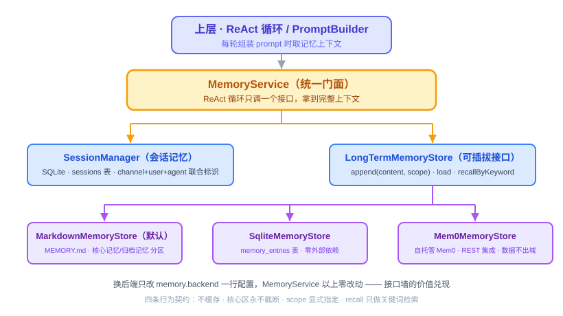
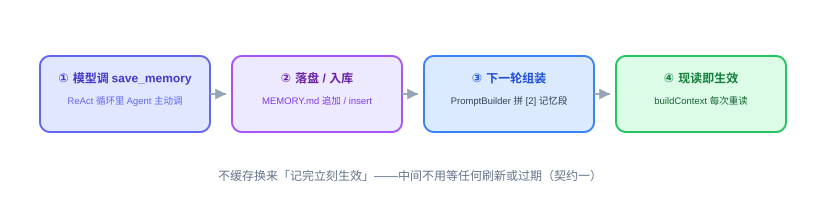

# 第 22 节：Memory 实现——让 Agent 记得住（代码课）

> **双定位**：本文档是 YokeOS 节级开发文档——既是**教学文档**（给人看：原理解析、动手前想清楚、代码怎么写），也是 **Spec-Kit 的开发原料**（给 AI 执行）。流水线映射：一、二部分供 `/speckit-specify` 取材；三部分供 `/speckit-plan` 取材，末尾「本节交付物」是 `/speckit-tasks` 的比对锚点；四部分是验收 harness 规格（DoD 对号锚点）；五部分是人工验项。
>
> **语料出处**：[需] `docs/DemandAnalysis.md` §5.6/§11/§13 · [技] `docs/TechnicalSolution.md` §5/§9.1~9.2/§4.2/§10/§13 · [宪] CLAUDE.md 宪法 4/5/7 · [指] `docs/AiProgrammingGuide.md` §4.1 · [评] `specs/006-memory-review/review.md`（D1~D11 定稿与 6.1 六段式预填——本节 specify 的直接素材） · [参] 参照库课件第 22 节与钉版树测试文件。
>
> **拍板记录**（2026-09-18，用户批准「没问题，继续」）：① 配置键带 `yokeos.` 前缀——`yokeos.memory.backend`（技 §5.1 的 `memory.backend` 为示意短写，本仓既有键 `yokeos.providers`/`yokeos.db.dir` 全带前缀，键名一致性优先）；② 归档阈值两键两单位——`yokeos.memory.archive-max-chars` 默认 4000（md 档字符，评审 O1）、`yokeos.memory.archive-max-rows` 默认 100（sqlite 档行数，参照钉版树口径）；③ Mem0 档配置 `yokeos.memory.mem0.base-url`/`api-key` 走 `${MEM0_BASE_URL}`/`${MEM0_API_KEY}` 占位、缺省空、仅切到 mem0 档时运行时报错（评审 O2）；④ 契约测试对三档统一跑（Mem0 档用进程内 `InMemoryMemoryStore` 替身、真实 REST 交互由 mock 单测验证、真实例人工可选——评审 O5 照 20 节 MCP 冷缓存先例）；⑤ 钉版树末态的 `readAll(agentName)` 与 per-agent 记忆作用域**不采纳**——那是参照第 30 节的演进（其接口注释自证），本仓技 §5 为全局 MEMORY.md、26 节端点为 `GET /api/v1/memory`，需要查询方法时 26 节再议；⑥ `InMemoryMemoryStore` 随参照落 main（契约测试替身 + 轻量基建，**不进** `memory.backend` 选项）。

技术栈：JDK 21 + Spring Boot 3.5.16 + Spring AI 1.1.8 + Spring AI Alibaba。**代差警示**：`@Tool` schema 生成复用 20 节已核实的写法（`MethodToolCallbackProvider` + `AnnotatedToolAdapter` 剥壳）；Mem0 无官方 Java SDK，走 Spring `RestClient` REST 集成，请求体字段以部署的 Mem0 版本为准（H3：动手前核实不到具体字段就先 mock 定契约）。SQLite 档复用 18 节既有 JPA 基建。

---

## 一、Memory 实现是什么，干嘛用的

一句话：**一个 `MemoryService` 统一门面，背后一个可插拔的长期记忆后端接口 `LongTermMemoryStore`，第一阶段一次交付三档实现——Markdown 文件（默认）、SQLite、Mem0——靠一行配置切换、上层一行不改；再加两个内置 Tool（`save_memory` / `recall_memory`）让 Agent 自己读写长期记忆。**

第 21 节评审把三句话定成了稿（specs/006 D1~D11），本节把它们变成真实存在的类：

- **接口墙焊死**（评审 D1）——`MemoryService` 对上层的方法签名现在定死，`PromptBuilder` / `MemoryTools` 只认它，不感知底下是文件、本地库还是外部服务。
- **墙之下可插拔**（评审 D4）——长期记忆抽成 `LongTermMemoryStore` 后端接口，三档实现对应三级演进：Markdown 是默认单机档，SQLite 是记忆量变大后的结构化升级档（仍零外部依赖），Mem0 是「真需要自动抽取/语义检索」的自托管外部集成档。**换档只改 `yokeos.memory.backend` 一行配置**，`PromptBuilder`、`MemoryTools`、`ReActLoop`、全部测试一个字不动——这句话本节当场兑现，兑现的证据就是那套对三档统一跑的契约测试。
- **写入靠 Agent 主动调 `save_memory`**（评审 D11 偏离依据①）——三档后端都遵守：不做自动抽取，写入时机和分区（scope）由 ReAct 循环里的模型显式决定。



放到既有体系里看：会话记忆（短期）= Session，18 节已随 CLI 落地（SQLite 真相源 + `max_history_turns` 截断），本节**不新增**任何会话存储概念（评审 D10）；长期记忆（长期）才是本节的新增物。`PromptBuilder` 里那个「[2] 长期记忆位：22 节 MemoryService 接入（构造器届时扩展），本节恒空跳过」的预留注释，本节接线。

Agent 从此凑齐三大能力：会想（ReAct，17 节）、会动手（Tool，20 节）、记得住（Memory，本节）。Demo 二「日报内容体现用户说过的偏好」这一环，靠的就是本节的 `save_memory` 写入、下次组装 Prompt 自动带上。

## 二、动手前先想清楚几件事

**第一，分两层：门面 + 后端接口，两道解耦。** `MemoryService` 是对上的门面：给 `PromptBuilder` 用的「要拼进 Prompt 的记忆内容」、给 `MemoryTools` 用的「记一条」「查一下」。`LongTermMemoryStore` 是对下的后端接口：三档实现各写各的。上层只认 `MemoryService`，`MemoryService` 只认 `LongTermMemoryStore`——换后端时上层零感知，门面只是换一个注入的实现。

接口的**物理落位**要先想清楚：`MemoryService` 与 `MemoryScope` 放 `yokeos-core`，`LongTermMemoryStore` 与全部实现放 `yokeos-memory`。理由是依赖方向：`PromptBuilder`（core）必须注入 `MemoryService`，而 `yokeos-memory → yokeos-core` 的依赖已经存在（用 `Session` 等契约），接口若留在 memory 模块，core 就要反向依赖 memory 成环——与 16 节 `ProviderService` 接口上移 core 是同一个先例、同一个理由（技 §10「跨模块契约放 core」）。模块依赖随之定形：`yokeos-memory → yokeos-core + yokeos-tool + yokeos-storage`（ToolRegistry 注册、MemoryEntryRepository 查库），单向无环。

**第二，三档后端的定位拎清，别糊在一起。**

| 后端 | 定位 | 什么时候用 | 依赖 |
|------|------|-----------|------|
| **Markdown** | 默认单机档：一个两分区 `MEMORY.md` | 记忆量不大、要人可读、git 可跟踪 | 无（文件系统） |
| **SQLite** | 结构化升级档：记忆按条入库 | 记忆量上千、要按 scope/时间结构化查询、多副本部署要共享 | 无外部依赖（复用既有 SQLite） |
| **Mem0** | 外部集成档：自托管 Mem0 记忆层 | 真需要自动抽取、冲突消解、语义检索 | 需部署自托管 Mem0 server（数据不出域） |

三档是递进关系：文件顶着 → 量大了上 SQLite 仍零依赖 → 真要智能记忆才集成 Mem0。默认 Markdown，`yokeos.memory.backend` 决定装配哪一个。

**第三，四条行为契约定死，三个实现都得守**（评审 D3，防的就是评审点名的坑）：

- **契约一：不缓存。** 每次重新读（读文件 / 查库 / 调 API），不做进程内缓存——Agent 调完 `save_memory`，下一轮组装 Prompt 立刻能看到。这条最容易被后来者手滑加个缓存「优化性能」，一旦加了「记完立刻生效」就没了。
- **契约二：核心区永不被截断。** 长期记忆分核心/归档两分区，核心区「始终在场、完整拼进每次上下文」，截断只作用在归档区——物理上让截断逻辑碰不到核心区那段（md 档只把归档段文本传给裁剪函数；sqlite 档 `LIMIT` 只加在归档查询上）。
- **契约三：写核心还是写归档，由 Agent 显式指定。** `save_memory` 带 `scope` 参数（`core` / `archival`，缺省 `archival`），系统不猜；非法值明确报错点名，不静默落错区。
- **契约四：`recall` 是关键词检索，别做复杂。** md 档行匹配（`String.contains`）、sqlite 档 `LIKE`、Mem0 档用它自带的 search——不上正则、不分词、更不上向量（评审 O4 的边界：不得升级成语义检索）。

这套契约的存在方式不是注释，是**测试**：一套契约测试对三档实现参数化统一跑，谁破谁红——「接口不变、实现随便换」由此有了自动化保障。



**第四，`buildContext` 的边界要分辨清楚（本节最容易写错的新坑）。** 技 §4.2 的 Prompt 四段里，[2] 写「Memory 注入（会话历史加长期记忆，由 MemoryService 提供）」、[3] 又写「对话历史（按 maxHistoryTurns 截断）」——两段表述有重叠。**实际分工**：`MemoryService.buildContext` 只出**长期记忆**（核心区全量 + 归档区截断后），会话历史仍由 `PromptBuilder` 既有 [3] 段（17 节交付的 `truncateByTurn`）独立负责——门面视角「两层都在 Prompt 里」，实现上各拼各的。若 `buildContext` 真把会话历史也拼上，`PromptBuilder` 再拼一次截断历史，**对话历史就被注入两遍**（坑七，见第四部分回归点）。

**第五，坑逐个点名（评审坑一~六逐条承接 + 本节新增坑七），每个坑一个回归测试：**

- **坑一：`MEMORY.md` 无限膨胀不截断。** 症状：注入超 context window。修复：归档区超阈值（默认 4000 字）保留最近内容，核心区永不截断。
- **坑二：长期记忆做缓存或预载。** 症状：`save_memory` 之后下一轮看不到新记忆。修复：每次组装 Prompt 现读（契约一；评审裁决一——以技 §5.3「每次现读」为准，需 §5.6「启动时注入」是粗粒度表述）。
- **坑三：把 `USER.md` 当 `MEMORY.md` 写。** 症状：Agent 改掉用户的初始设定。修复：`USER.md` 用户手写、YokeOS 只读（Bootstrap，`ContextLoader` 管）；成长记录只进 `MEMORY.md`（Memory 模块管）——Memory 写路径在物理上碰不到 `USER.md`。
- **坑四：scope 由系统猜。** 症状：该进核心区的进了归档区（被截掉）。修复：Agent 经 `scope` 显式指定，缺省 `archival`（契约三）。
- **坑五：检索或截断越界作用到核心区。** 症状：核心记忆被重复注入或被截断丢字。修复：截断与检索都只作用归档区（契约二/四）。
- **坑六：`memory_entries` 表演进走 `ddl-auto=update`。** 宪法 7 老坑的 Memory 变体。修复：手工建表脚本 `schema-003-memory.sql`，与 sessions/审计表同口径。
- **坑七（本节新增）：`buildContext` 与 `PromptBuilder` 各拼一次会话历史。** 见上「第四」——历史重复注入，token 翻倍、模型困惑。修复：`buildContext` 只出长期记忆，历史归 `PromptBuilder` 既有段。

**第六，钉版树末态与本节形态的分寸。** 参照钉版树里 `MemoryService` 有第四个方法 `readAll(agentName)`、记忆带 per-Agent 作用域——那是参照第 30 节的演进（接口注释自证「30 节接线」「记忆现在跟着 Agent 走」），不是第 22 节时点形态。本仓技 §5 是全局 `.yokeos/memory/MEMORY.md`（无 agent 维度），26 节的查询端点是 `GET /api/v1/memory`；本节**不引入** `readAll` 与 agentName 参数，26 节需要时由当节 spec 定形态。「结构照抄」抄的是第 22 节的结构，「不继承」的是后续节的回填。

## 三、代码怎么写

分八步：门面接口 → 后端接口 → 两个本地实现 → 建表与 sqlite 档 → Mem0 档 → 门面实现与装配 → MemoryTools → PromptBuilder 接线。

**第一步：`MemoryService` 门面 + `MemoryScope`（落 `yokeos-core`，依赖方向见二·第一）。**

```java
// com.yokeos.core.memory.MemoryService —— 上层（PromptBuilder / MemoryTools）只认这三个方法
public interface MemoryService {
    String buildContext(Session session);              // 拼进 Prompt 的长期记忆（核心全量 + 归档截断后）
                                                       // 只出长期记忆——会话历史归 PromptBuilder 既有段（坑七）
    void remember(String content, MemoryScope scope);  // save_memory 调这个
    List<String> recall(String keyword);               // recall_memory 调这个（只检索归档区）
}

public enum MemoryScope { CORE, ARCHIVAL }
```

**第二步：`LongTermMemoryStore` 后端接口 + `InMemoryMemoryStore` 测试基建（落 `yokeos-memory`）。** 后端接口三方法（评审 D2）：`append(content, scope)`（自动加日期 header）、`load`（核心区全量 + 归档区截断后）、`recallByKeyword`（只检索归档区）。`InMemoryMemoryStore` 是第四个实现但**不是第四档**：进程内 List 存储、满足四条契约，用途有二——契约测试里代替 Mem0 档验证「这一档守不守规矩」（真实 REST 交互由 mock 单测单独验证），以及门面/工具测试的轻量基建；不进 `memory.backend` 选项。

**第三步：`MarkdownMemoryStore`（默认档）。** 操作 `.yokeos/memory/MEMORY.md`，两分区 header（评审 D5 的字面量）：

```java
private static final String CORE_HEADER = "## 核心记忆";
private static final String ARCHIVE_HEADER = "## 归档记忆";
```

`append` 往目标分区追加一行 `- [yyyy-MM-dd] 内容`（写回文件，同样不缓存）；`load` 每次 `Files.readString` 现读（契约一），核心区段完整返回，归档区段超 `archive-max-chars`（默认 4000）从尾部保留最近内容——**裁剪函数只接收归档区文本**，物理上碰不到核心区（契约二）；`recallByKeyword` 只读归档区段做行匹配（契约四）。文件不存在时视作空记忆（首次运行），不报错。



**第四步：`memory_entries` 建表 + `SqliteMemoryStore`。** 建表脚本 `yokeos-storage/src/main/resources/db/schema-003-memory.sql`（列定义逐字来自技 §9.2，风格照 schema-002），boot 的 `sql.init.schema-locations` 追加一行：

```sql
CREATE TABLE IF NOT EXISTS memory_entries (
    id         INTEGER PRIMARY KEY AUTOINCREMENT,
    scope      VARCHAR(16) NOT NULL,   -- CORE / ARCHIVAL
    content    TEXT NOT NULL,
    created_at TIMESTAMP NOT NULL
);
CREATE INDEX IF NOT EXISTS idx_memory_scope ON memory_entries (scope);
```

`MemoryEntry` 实体 + `MemoryEntryRepository`（`findByScope`、`findRecentArchival(Pageable)`、`searchArchival`）落 `yokeos-storage`。`SqliteMemoryStore` 落 `yokeos-memory`，依赖方向 `memory → storage`（pom 已备）：`append` 直插（契约一天然满足）；`load` 核心区 `WHERE scope='CORE'` 全量、归档区 `LIMIT archive-max-rows`（默认 100）——**`LIMIT` 只加在归档查询上**，契约二靠 SQL 结构保证；`recallByKeyword` 翻译成 `LIKE '%关键词%'`（`%`/`_` 需转义，契约四）。同一套契约，落地方式完全不同：截断从「字符串掐头」变成 `LIMIT`、检索从 `contains` 变成 `LIKE`——这就是接口墙之下各写各的。

**第五步：`Mem0MemoryStore`（外部集成档）。** 无官方 Java SDK，走 Spring `RestClient`；`append/load/recall` 翻译成 Mem0 的 add/get/search REST 调用，`scope` 落进 metadata 供检索区分。地址与凭证走 `${MEM0_BASE_URL}`/`${MEM0_API_KEY}` 占位（宪法 7），缺省空值、不阻断启动——只有切到 mem0 档才在运行时校验并清晰报错（与 3.3 一句话生成「报错发生在调用时」同一思路）。这一档的本质是**协议转换**：提炼、冲突消解、语义检索都交给 Mem0 自己管（契约四在这一档被「升级」为语义检索——评审 D4 明示的允许项），代价是一个额外服务 + 数据流经它的管线，所以默认档不是它。

**第六步：`MemoryServiceImpl` 门面实现 + 装配。** 实现很薄：`buildContext` 委托 `LongTermMemoryStore.load()`（带分区 header 拼装，**不含会话历史**——坑七），`remember`/`recall` 直接转发。装配按 `yokeos.memory.backend` 三选一构造 `LongTermMemoryStore` 注入同一个 `MemoryServiceImpl`——换后端就是改这一行配置。装配类（`MemoryModule` 之类）落 `yokeos-memory`，boot 引依赖即可。

**第七步：`MemoryTools`，把长期记忆暴露给 Agent（三档共用，零改动）。** 两个 `@Tool` 方法，经 20 节 `ToolRegistry.registerAnnotated(bean)` 注册，与其他内置 Tool 一视同仁（评审 D7、裁决二——落位 `yokeos-memory`，注册进 `yokeos-tool` 的 Registry，依赖单向）：

```java
@Tool(name = "save_memory", description = "记住一件值得长期记住的事")
public String saveMemory(
        @ToolParam(description = "要记住的内容") String content,
        @ToolParam(description = "core 或 archival，不确定就填 archival") String scope) {
    // scope 空白 → ARCHIVAL（契约三缺省）；非法值返回明确提示，不静默落错区
    memoryService.remember(content, MemoryScope.valueOf(normalized));
    return "已记住";
}

@Tool(name = "recall_memory", description = "按关键词检索长期记忆")
public String recallMemory(@ToolParam(description = "检索关键词") String keyword) {
    List<String> hits = memoryService.recall(keyword);
    return hits.isEmpty() ? "没有找到相关记忆" : String.join("\n", hits);  // 未命中不抛异常
}
```

**第八步：`PromptBuilder` 接线（17 节预留位的兑现）。** 构造器扩展注入 `MemoryService`（16 节以来每个消费者注入门面的同一手法），组装时在 system prompt 段之后、对话历史段之前拼入 `memoryService.buildContext(session)`——每次组装现调，`load()` 现读（坑二的完整链路：Tool 写入 → store 落盘 → 下一次 `build` 现读可见）。既有单测同步更新构造器调用。

**有几样先别做。** 自动抽取（评审 D11 偏离依据①）、内置向量库（三档都不在进程内自建向量层，评审 D11 偏离依据②）、情景记忆、Memory Wiki、记忆压缩（超长简单截断就是第一阶段的压缩）——全部照技 §5.5 留扩展。`readAll`/per-Agent 作用域不引入（二·第六）。三档后端已经把「接口墙 + 可插拔」证明清楚，够了。

**本节交付物**（Spec-Kit 拆解锚点）：

- 代码：`MemoryService`、`MemoryScope` → yokeos-core（`core/memory` 包）；`LongTermMemoryStore`、`MarkdownMemoryStore`、`SqliteMemoryStore`、`Mem0MemoryStore`、`InMemoryMemoryStore`、`MemoryServiceImpl`、装配类（`MemoryModule`）、`MemoryTools` → yokeos-memory；`MemoryEntry`、`MemoryEntryRepository`、`schema-003-memory.sql` → yokeos-storage；`PromptBuilder` 构造器扩展注入 `MemoryService` → yokeos-core（本节唯一改造的前序公共类，17 节预留注释点名）；yokeos-memory pom 补 `yokeos-tool` 依赖（MemoryTools 注册用）
- 测试：`MemoryStoreContractTest`、`MarkdownMemoryStoreTest`、`Mem0MemoryStoreTest`、`MemoryServiceImplTest`、`MemoryToolsTest` → yokeos-memory；`MemoryEntryRepositoryTest` → yokeos-storage；`PromptBuilderTest` 更新（注入 mock 门面后的组装与坑七回归）（见第四部分）
- 配置：`yokeos.memory.backend`（markdown 缺省 | sqlite | mem0）、`yokeos.memory.archive-max-chars`（默认 4000）、`yokeos.memory.archive-max-rows`（默认 100）、`yokeos.memory.mem0.base-url`/`api-key`（`${MEM0_BASE_URL}`/`${MEM0_API_KEY}` 占位）；boot yaml `schema-locations` 追加 schema-003
- 表：`memory_entries`（`schema-003-memory.sql`，含 scope 索引）

## 四、验收 harness：把验收标准变成可执行的测试

Memory 全是文件、本地库和（mock 掉的）HTTP 操作，`@TempDir`、内存替身和 mock 就能测干净，harness 主体全单测。这节 harness 的设计核心是**契约测试对三档实现统一跑**——同一套断言，三个后端都得过，这才叫「接口不变、实现随便换」有了自动化保障。

**先定分层：什么用单测，什么留人工。**

- **单测（默认全跑）**：三档契约、各档特有行为、门面、工具、真库 LIMIT/LIKE（`MemoryEntryRepositoryTest` 挂真 SQLite 文件库，同 18 节口径）——不花一分钱、不依赖网络。
- **人工项**：真模型跨对话演示（第五部分）；Mem0 档真实例（可选，依赖自托管 server，测不了不阻塞）。

**七个测试类，逐条对应验收点：**

| 测试类 | 覆盖的验收点 |
|---|---|
| `MemoryStoreContractTest` | **参数化遍历三档**（markdown @TempDir / sqlite fakeRepo / mem0 用 `InMemoryMemoryStore` 替身），同一套断言全过：写后立读（契约一·坑二）、截断只裁归档核心区一字不动（契约二·坑一）、scope 路由到正确分区（契约三·坑四）、recall 只搜归档区（契约四·坑五）。任何一档破契约，对应参数立刻红且一眼看出是哪一档 |
| `MarkdownMemoryStoreTest` | Markdown 特有：两分区 header 解析、字符串截断边界（恰好在阈值上/下）、每条带日期 header、文件不存在视作空记忆 |
| `MemoryEntryRepositoryTest` | 真库（SQLite 文件）：手工建表脚本能建能读（坑六）、归档 `LIMIT` 取最近 N、`LIKE` 检索只命中归档区、`%`/`_` 转义 |
| `Mem0MemoryStoreTest` | mock RestClient：`append` 请求体带 scope metadata、`recall` 转发查询、非 2xx 翻译成明确异常——不碰真 server |
| `MemoryServiceImplTest` | `buildContext` 返回长期记忆且**不含会话消息**（坑七）、核心记忆完整在内、`remember`/`recall` 正确转发 |
| `MemoryToolsTest` | scope 缺省写归档（坑四）、显式 core 落核心区、非法 scope 明确提示不落错区、关键词未命中返回「没有找到相关记忆」不抛异常 |
| `PromptBuilderTest`（更新） | 注入门面后 [2] 位出现长期记忆、对话历史仍由 [3] 段承载且**不重复**（坑七）、门面每次组装都被调用（坑二链路收口） |

**最值钱的两个契约测试写出来看**（测试方法名英文 camelCase、中文语义进 `@DisplayName`——19 节 Checkstyle 实证；`@TestInstance(PER_CLASS)` 让 `@MethodSource` 工厂能非静态、访问实例 `@TempDir`）：

```java
@TestInstance(TestInstance.Lifecycle.PER_CLASS)
class MemoryStoreContractTest {

    @TempDir Path tempRoot;

    Stream<Arguments> allStores() {
        return Stream.of(
            Arguments.of("markdown", (Supplier<LongTermMemoryStore>) () -> new MarkdownMemoryStore(tempRoot, ...)),
            Arguments.of("sqlite", (Supplier<LongTermMemoryStore>) () -> new SqliteMemoryStore(fakeRepo())),
            Arguments.of("mem0(替身)", (Supplier<LongTermMemoryStore>) InMemoryMemoryStore::new));
    }

    @ParameterizedTest(name = "[{0}]")
    @MethodSource("allStores")
    @DisplayName("截断只裁归档区_核心记忆一字不能少")
    void truncationKeepsCoreIntact(String name, Supplier<LongTermMemoryStore> factory) {
        LongTermMemoryStore memory = factory.get();
        memory.append("用户叫小王，偏好用 Java", MemoryScope.CORE);
        for (int i = 0; i < 500; i++) {
            memory.append("归档流水 " + i, MemoryScope.ARCHIVAL);   // 灌到远超阈值
        }

        String loaded = memory.load();

        assertTrue(loaded.contains("用户叫小王，偏好用 Java"), name + ": 核心区完整——始终在场的底线");
        assertFalse(loaded.contains("归档流水 0"), name + ": 归档区最早的被裁掉");
        assertTrue(loaded.contains("归档流水 499"), name + ": 保留的是最近的");
    }

    @ParameterizedTest(name = "[{0}]")
    @MethodSource("allStores")
    @DisplayName("写入后立刻可读_不允许有缓存")
    void writeIsImmediatelyReadableNoCache(String name, Supplier<LongTermMemoryStore> factory) {
        LongTermMemoryStore memory = factory.get();
        memory.append("刚记的事", MemoryScope.ARCHIVAL);

        assertTrue(memory.load().contains("刚记的事"), name + ": 下一次 load 立即可见");
        assertFalse(memory.recallByKeyword("刚记的事").isEmpty(), name + ": 检索同样立即命中");
    }
}
```

第一个测的是坑一+坑五（截断越界），第二个测的是坑二（缓存）——将来任何一档的截断或缓存逻辑被「优化」坏了，对应那一行参数立刻红。sqlite 档在契约集里用背靠内存 List 的有状态 mock Repository（避免契约测试拉起 Spring 容器），真库的 `LIMIT`/`LIKE` 由 `MemoryEntryRepositoryTest` 单独锚（参照钉版树形态；其契约测试注释里提到的 `SqliteMemoryStoreTest` 实物并不存在，以实物为准——瑕疵不继承）。

**坑三的锚法说明**：`USER.md` 是 Bootstrap 文件、归 `ContextLoader`（8.3）管，Memory 模块物理上没有触碰它的代码路径——测试锚「`MarkdownMemoryStore` 写入后 `@TempDir` 里只有 MEMORY.md 变化、USER.md 不存在也不被创建」，配合 code review 确认无写 `USER.md` 的路径。

## 五、做完怎么验

harness 全绿之后，剩下这几条需要人工确认（进验收报告「剩余人工项」）：

- [ ] **真模型跨对话演示**（可演示成果口径，需 §11 第 22 节行「Agent 跨对话记住用户偏好并在后续对话用到」）：配真 key，`yokeos chat` 会话一告诉 Agent 一条偏好（观察模型主动调 `save_memory`、`tool_invocations` 留痕）；新开会话（或换 user）问相关问题，答复体现该偏好——长期记忆跨 Session 生效的体感证据
- [ ] **三档切换体感**：`yokeos.memory.backend` 分别设 `markdown` / `sqlite`，各跑一次上述对话——同一段交互同一个体感，只是底下换了后端（「墙」最直观的人工证据；mem0 档可选，依赖自托管实例）
- [ ] `USER.md` 全程只读确认：code review 无写 `USER.md` 的代码路径（坑三）
- [ ] key 走环境变量：`grep -r "sk-"` 在代码和配置里搜不到明文（Mem0 档同理，`${MEM0_API_KEY}` 占位）
- [ ] `mvn clean verify` 九模块全绿 + `memory_entries` 由 schema-003 真实建出（boot 启动或 repo 测试的库文件里 `sqlite3 .schema` 可见）

其余验收点——四条契约对三档统一、门面不含会话历史、Prompt 注入不重复、scope 路由、未命中不报错、真库 LIMIT/LIKE、手工建表——已由第四部分单测覆盖，`mvn test` 绿就等于打勾。

到这一步，Agent 会想、会动手、也记得住了——ReAct、Tool、Memory 三大能力凑齐。且记忆这一层从第一天起就是「接口不变、后端随便换」：默认 Markdown 零依赖跑起来，量大了换 SQLite 仍零外部依赖，真要智能记忆再接 Mem0，全程上层无感。第 23 节 Sandbox 评审之前，Demo 二（每日科技日报）的「日报体现用户偏好」一环已具备跑通条件。
