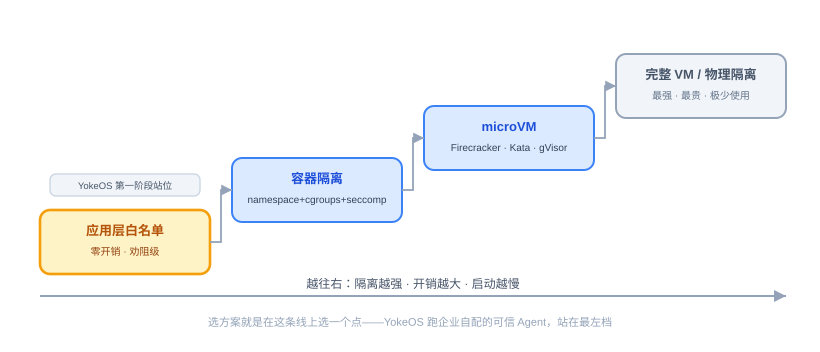
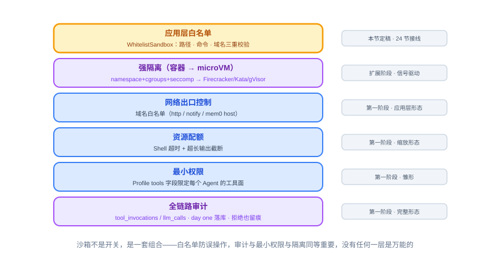
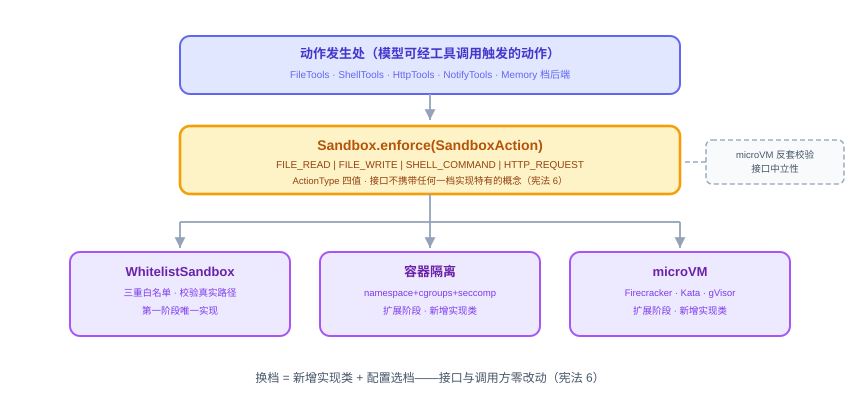
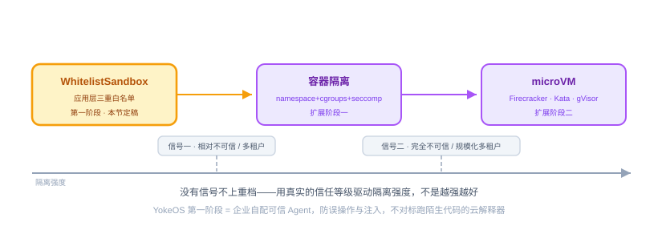

# 第 23 节：Sandbox 设计评审——让 Agent 干活不闯祸（评审课，不产码）

> **双定位**：本文档是 YokeOS 节级开发文档——既是**教学文档**（给人看：原理解析、业界方案、动手前想清楚），也是**评审产出的规格**（评审课形态：本节不开 spec，产出评审文档作为第 24 节 `/speckit-specify` 的素材——「评审产文档、文档产 spec」，不直接从评审结论跳到代码）。流水线映射：一、二部分供评审文档「业界方案对照」取材；三部分定义评审文档的结构与定稿口径，末尾「本节交付物」是 DoD 对号锚点；四部分是评审自查清单（替代代码课的验收 harness）；五部分是人工验项。
>
> **语料出处**：[需] `docs/DemandAnalysis.md` §5.7/§5.8/§6.3/§8.5/§11/§12/§13 · [技] `docs/TechnicalSolution.md` §6.7/§7.3/§13 · [宪] CLAUDE.md 宪法 5/6/7 · [指] `docs/AiProgrammingGuide.md` §4.2/§4.4 · [参] 参照库课件第 23 节（评审课原型，业界数据为其 2026 年口径）· [码] 前序节留位现状：`ToolExecutor`（17 节）、`NotifyTools`（19 节）、内置三 Tool（20 节）、Memory 档后端（22 节）。
>
> **拍板记录**（2026-09-20，用户批准「内容没问题」并要求补图，四张配图当日补齐）：① 教学文档定稿（评审课形态：五段式适配，四部分以自查清单替代测试 harness）；② 评审文档落 `specs/008-sandbox-review/`（specs 序号 008，评审课无 spec 三件套，同第 21 节先例）；③ 张力一裁决——enforce 单一落点在「动作发生处」，`ToolExecutor` 预留位仅作违规收口，24 节把该注释改为收口说明；④ 张力二裁决——需 §5.7「执行超时和资源占用限制」按技 §6.7 口径归属（超时=Shell 超时、资源=超长截断，完整资源配额随容器档进扩展阶段），需求文档不回改；⑤ 张力三裁决——22 节 Memory 档后端留位纳入 enforce 覆盖面（「模型可经工具调用触发的动作发生处」原则），配套白名单配置自洽硬前提；⑥ 业界数据口径 = 参照课件 2026 年口径，不另行联网核实（21 节同款）。

课型声明：**评审课，拒绝产码**。Provider、ReAct、CLI、Notify、Tool、Memory 都已落地——Agent 能被喂话、会想、会动手、会往外推消息、也记得住事了。但「会动手」还欠一道闸：模型决定的每一次读写文件、跑命令、发请求，今天只有审计在留痕（宪法 7 day one 已落地），没有校验在拦截——17/19/20/22 节在执行链上预埋的八处「Sandbox 检查位」还只是注释，真正的闸门是下一节的事。本节做一次技术评审：把 Sandbox 是什么、业界怎么做讲清楚，对照 YokeOS 技术方案 §6.7 的既有设计逐条过，产出评审文档（业界对照 + 设计定稿），作为第 24 节 Sandbox 实现的 specify 素材。Sandbox 的每一行代码都归第 24 节。

---

## 一、Sandbox 是什么，业界怎么做

### 1. 为什么 Agent 突然需要 Sandbox

**Agent 会自己决定干什么，这件事本身就是风险源。**

传统软件里代码是你审过的，不太需要沙箱；Agent 场景变了两件事，让隔离从可选变成刚需。第一，**Agent 执行的不是你写的代码和命令**——ReAct 循环里模型在运行时生成命令、发起读写、调工具操作真实系统，这些动作可能被 prompt injection 骗着执行危险操作（读密钥、外传数据），也可能就是模型犯傻生成了破坏性命令。第二，**多 Agent 共处一个底座**——YokeOS 正是如此，一个 Agent 的误动作不能波及别的 Agent 与宿主系统。没有隔离，你不敢让 Agent 执行任何有副作用的操作，它就只能是个聊天玩具——所以沙箱是 Agent 上生产的前提，不是锦上添花（[需 §12] 已把「Tool 执行安全风险」列为已识别风险：应用层白名单不是完整 Sandbox，可能影响 YokeOS 进程）。

### 2. 沙箱在隔离什么：四个维度

**无论用什么方案，隔离的本质都是这四类东西，看懂它们就看懂了所有方案在做什么。**

- **文件系统**：不能乱读乱写宿主文件，尤其密钥、配置、其他 Agent 的数据；
- **网络**：不能随便对外连接——防数据外泄，也防 Agent 被当跳板攻击别处；
- **进程和系统调用**：不能执行危险系统操作、不能提权、不能影响宿主；
- **资源**：不能吃光 CPU/内存/磁盘把宿主拖垮——防资源炸弹。

### 3. 核心规律：隔离强度和开销是跷跷板

**隔离越强、开销越大、启动越慢；隔离越轻、越快越省但越不安全——所有方案都在这条线上选点。** 还有一条规律：**隔离边界越往底层走越安全**——应用层校验最弱，进程/OS 级（容器）居中，内核级（microVM）更强，物理隔离最强。所以选沙箱方案的本质是回答一个问题：**你要跑的东西有多不可信，你愿意为隔离付多大代价。**

### 4. 四档方案：从白名单到物理隔离

**第一档，应用层白名单校验。** 不做系统隔离，在动作执行前用代码拦一道：路径在不在允许范围、命令在不在白名单、域名允不允许访问。优点是零额外基础设施、零性能开销、单二进制可做；致命弱点是**它只是劝阻，不是关押**——你拦的是想到要拦的东西，命令拼接、软链接、编码绕过、没列进清单的危险命令都能破防。它防模型犯傻，防不住蓄意攻击；作为唯一防线上生产不够，作为纵深防御第一层有价值。

**第二档，容器隔离。** Linux namespace 做视图隔离（文件/网络/进程各看各的），cgroups 限资源，seccomp 限系统调用。隔离维度全、生态成熟，是当前跑不可信代码的 Agent 系统的主力方案。弱点是**容器共享宿主内核**——这是安全天花板，内核漏洞逃逸即破防；启动也比进程慢。

**第三档，microVM。** 给每个沙箱配自己的轻量级内核：AWS **Firecracker**（启动百毫秒级、内存开销极小）、**Kata Containers**（用起来像容器、底层是轻量 VM）、Google **gVisor**（用户态内核，介于容器与 VM 之间）。它不是把传统 VM 变小，而是重造一个极简 VMM、砍掉 Agent 场景用不到的设备模拟——同时拿到 VM 的强隔离和接近容器的轻量。跑完全不可信代码、多租户、要规模化，这是当前的黄金标准。

**第四档，完整虚拟机与物理隔离。** 隔离最强但最重最贵，只在极高合规要求下使用，大多数 Agent 系统不会走到这里。

### 5. 业界的整体思路：分层纵深防御

**成熟系统往往不是只选一档，而是多层叠加。** 应用层先拦明显的，容器或 microVM 做强隔离兜底，网络出口控制防数据外泄，资源配额防炸弹，审计记录 Agent 到底干了什么——没有任何一层是万能的，安全靠层层设防。这个观念意味着**沙箱不是一个开关，而是一套组合**：即使上了 microVM，出口控制、资源配额、审计这些配套一样不能少。

### 6. 三类真实系统怎么选：跑谁的代码决定选型

**关键不是哪档最强，而是「代码可信度」决定档位——三类系统对号入座，选型逻辑立刻清楚。**

**第一类，本地编码 Agent——以 Claude Code 为代表。** 跑在用户自己可信的机器上，威胁模型是「模型误操作 + 提示注入」，不是「跑蓄意恶意的陌生代码」。选型是**一档权限门 + 二档 OS 轻隔离叠加，不上 microVM**：主防线是权限门（危险操作 `allow`/`ask`/`deny`），再叠可选 OS 级沙箱（macOS Seatbelt、Linux bubblewrap + seccomp），文件写入限工作目录、网络走域名白名单、子进程继承限制；Anthropic 还把这套抽成了开源 `sandbox-runtime`。**这对 YokeOS 参照意义最直接**：私有部署、跑企业自配的可信 Agent、重点防误伤与注入——威胁模型与 Claude Code 同类，它没直奔 microVM，恰恰印证 YokeOS「第一档白名单起步」是对路的。

**第二类，可插拔多后端 Agent——Hermes Agent（NousResearch）。** 把隔离档做成可插拔 terminal backend 共六种（`local`/`Docker`/`SSH`/`Singularity`/`Modal`/`Daytona`），换隔离强度就是换一个后端——与 YokeOS 的「Sandbox 接口 + 可换实现」是同一套接口墙思路。它安全文档里有句话点破本节题眼：**「对抗恶意 LLM 的唯一安全边界是操作系统」**——进程内的任何校验都只是「作用在一段被攻击者影响过的字符串上的启发式」。它还区分了两种隔离姿态：terminal-backend isolation 只把 shell/文件工具关进沙箱，**管不住 Agent 自己进程里的东西**（代码执行、MCP 子进程、插件加载都在进程内）；要真正兜住得 whole-process wrapping，把整个进程树塞进沙箱（Docker，或 NVIDIA **OpenShell**——按会话隔离、声明式策略覆盖文件系统/L7 出口/系统调用，凭证外部注入）。**这是给 YokeOS 的现成提醒**：`Sandbox.enforce` 拦的是工具执行路径，MCP 子进程是同等的暴露面——「只隔离了 shell」不等于「隔离了 Agent」。

**第三类，云端代码解释器与 Agent 云沙箱——跑的是陌生人的代码。** OpenAI Code Interpreter 用 gVisor；E2B 用 Firecracker microVM；Daytona 用 gVisor（冷启约 90ms）；Modal 甚至沙箱里跑 GPU。共同点：完全不可信代码、多租户、规模化，直奔黄金标准。**这反衬出 YokeOS 不必上 microVM**——跑的是企业自己配置的可信 Agent，威胁模型根本不同。选型由威胁模型决定，不是越强越好。

一句话收束：**Claude Code（可信机器，防误伤）→ Hermes（可切换，本地到云沙箱）→ 云解释器（不可信代码，直奔 microVM）**，YokeOS 站在最左边那档附近。

### 7. 学界与安全社区的共识：白名单为什么挡不住蓄意攻击

- **混淆代理问题（confused deputy）**：Agent 握着高权限（读写/联网/调工具），却被低权限输入（提示注入）诱骗滥用权限。白名单防不住它——校验的是「请求长什么样」，不是「请求为什么发起」；工具调用本身完全合法，坏在动机。
- **AgentDojo**（苏黎世联邦理工 spylab，NeurIPS 基准）：把「注入能否劫持 Agent 越权调工具」变成可打分指标，验证各种防御到底有没有用。
- **能力安全模型（capability-based security）**：学界主张按最小权限直接授予「能力令牌」，白名单本质是 capability 的粗糙近似。

落到 YokeOS，结论很诚实：**第一档白名单不是安全边界，它防的是误操作、限的是可用面。** 真正的对抗性安全靠 OS 级隔离（扩展阶段）、**审计**（已 day one 落库，宪法 7）、**最小权限**（Profile `tools` 字段限定每个 Agent 的工具面）三者合力——单靠任何一层都不够，这就是纵深防御用在 YokeOS 上的样子。

---

## 二、动手前先想清楚几件事（评审要点）

评审不是复述技术方案，是拿业界方案当镜子照它。以下几件事在评审文档里必须有明确结论，前五件是设计立场，坑与张力随后——**每个坑在第 24 节都要有一个对应的回归测试**（评审课点名，24 节 harness 承接）。

**第一，设计原则三句话：方向想清楚，接口设计对，实现只做第一档。** 分界线是接口这道墙——墙之上（`Sandbox.enforce` 契约）现在定稿，墙之下（白名单校验）只做当下需要的，不现在就写容器/microVM 代码。方向免费、接口最重要、实现要克制——与 Memory（21 节）同一套设计母题。

**第二，接口中立性怎么验：语义定稿 + microVM 反套。** YokeOS 的接口（宪法 6 与 [技 §6.7] 已钉字面量）：`Sandbox.enforce(SandboxAction action)`，`SandboxAction = { type: ActionType, target: String }`，`ActionType` 取四值 `FILE_READ | FILE_WRITE | SHELL_COMMAND | HTTP_REQUEST`。两条纪律：①**方法名与参数不得出现某一档实现特有的词**——不能叫 `checkFilePath`/`checkCommand`（白名单档特有），不能有容器镜像/VM 配置参数；校验办法是拿最重的 microVM 实现反向套签名，套得进去才算中立——`enforce` 读作「确保该动作只在受控环境发生」，白名单档的实现是「校验放行或拒绝」，未来容器档的实现可以是「把动作路由进隔离环境执行」，**签名不变、语义重心由实现定义**。②**FILE_READ 与 FILE_WRITE 分离**是接口层预留的权限维度（未来可按读/写分权限），第一阶段 `WhitelistSandbox` 两 case 同路由 `checkFilePath`（同一份路径白名单）——接口先分、实现先合，这是「方向想清楚、实现只做当下」的又一处落地。

**第三，威胁模型定位：YokeOS 跑的是企业自配的可信 Agent。** 这决定了：对标 Claude Code（防误操作 + 防注入），不对标云解释器（跑陌生代码直奔 microVM）；第一档白名单是**想清楚了威胁模型的选择，不是能力不足**。配套的诚实标注（[技 §6.7 要点一]、[需 §12]）：第一阶段是劝阻级防线，不建议跑完全不可信的代码、不建议对外做多租户；完整隔离（容器/microVM、Docker/K8s pod、WASM 高性能选项）按 [需 §6.3] 列扩展阶段。

**第四，enforce 落点与覆盖面：挂在「模型可经工具调用触发的动作发生处」。** 前序节已预埋八个检查位，评审逐位对号（这是本节评审独有的第四读——代码留位对表）：

| 接线位 | 动作 | 留位出处 |
|---|---|---|
| `FileTools` readFile / writeFile / listDir | FILE_READ ×2 / FILE_WRITE | 20 节（[技 §6.7] 点名） |
| `ShellTools` execute | SHELL_COMMAND（argv[0]） | 20 节（[技 §6.7] 点名） |
| `HttpTools` get / post | HTTP_REQUEST | 20 节（[技 §6.7] 点名） |
| `NotifyTools` notify | HTTP_REQUEST，共享 `http.allowed_domains` | 19 节（[需 §5.8] 明文「推送动作过 Sandbox 域名白名单」） |
| `MarkdownMemoryStore` append | FILE_WRITE（memory 文件） | 22 节留位（[技 §6.7] 未点名→张力三） |
| `Mem0MemoryStore` append | HTTP_REQUEST（mem0 host） | 22 节留位（同上） |
| `SqliteMemoryStore` append | 无动作（进程内写库不涉外） | 22 节已定口径 |
| `ToolExecutor` attemptOnce | **违规收口位，不是 enforce 调用点**（张力一） | 17 节留位 |

覆盖面原则一句话：**Sandbox 校验的是 Tool 执行路径上的动作，不是底座自身的基础设施调用**——ProviderService 调 LLM、审计落库、会话持久化都不在管辖；判据是「该动作是否由模型经工具调用可触发」。**MCP 转发调用第一阶段不过 enforce**：`SandboxAction` 四值无法分类 MCP server 的任意语义，治理靠信任边界（配一个 MCP server = 信任其作者，与解释器同款逻辑 [技 §6.7 要点三]）+ 审计 day one——这正是参照课件 Hermes 解剖点破的暴露面，评审诚实记录为第一阶段边界，扩展阶段的容器化 MCP 子进程 / whole-process wrapping 才兜得住。

**第五，三条校验规则，每条对应一类绕过。** ①`checkFilePath`：路径标准化后比对白名单，**校验真实路径**——目标已存在时 `toRealPath` 后必须仍位于白名单根内（挡符号链接与 `../` 穿越），新建路径回溯最近存在的父目录取真实路径校验（挡「先建目录再穿越」）；不做纯字符串 `normalize + startsWith`（[指 §4.4] 跑偏表明令禁止）。②`checkShellCommand`：argv[0] 与可执行文件白名单**精确比对**（相等，非前缀非包含——前缀匹配会把 `lsblk` 之类的变体误放行）；argv 直传本身就杜绝了 shell 语法拼接。③`checkHttpUrl`：先从 URL 解析出 host，再与域名白名单**通配符匹配**（`*.example.com` 覆盖子域、裸域名精确匹配）——绝不拿整串 URL 或 host 做子串包含。任意校验失败抛 `SandboxViolationException`，**复用 `ToolExecutor` 既有失败路径**落 `tool_invocations`（`success=false` + `error_message`），不为 Sandbox 单增审计逻辑（宪法 7）。

**第六，六个坑——评审点名、24 节钉测试。**

- **坑一：路径校验只做字符串前缀比对。** 症状：符号链接、`../` 拼接、相对路径 cwd 漂移绕过白名单。修复：真实路径校验（已存在目标 `toRealPath` 后仍在根内；新建目标回溯最近存在父目录）。→ 24 节回归点：symlink 出根拒绝、`../` 穿越拒绝、白名单内新建文件放行。
- **坑二：enforce 落点错位或重复。** 症状：`ToolExecutor` 与工具内双接线导致同一动作校验两次、审计两条；或对无法分类的 MCP 调用强套四值报错。修复：单一落点 = 动作发生处；`ToolExecutor` 只收口（异常→不可重试失败→审计一条）。→ 24 节回归点：拒绝恰落一条 `tool_invocations`，且拒绝不重试。
- **坑三：命令白名单做成前缀/子串匹配。** 症状：白名单 `ls` 放行 `lsblk` 等变体。修复：argv[0] 精确比对。→ 24 节回归点：在单命令放行、不在单的变体拒绝。
- **坑四：域名校验不解析 host 或不守边界。** 症状：`example.com` 白名单被 `example.com.evil.com` 或 URL 参数里夹带域名串绕过。修复：解析 host 后通配符匹配。→ 24 节回归点：伪造后缀拒绝、子域命中通配、query 夹带不误放行。
- **坑五：拒绝只打日志不落审计、或吞异常继续执行。** 症状：违规动作照样发生且无痕可查。修复：`SandboxViolationException` 上抛终止动作，走既有失败审计（宪法 7「Sandbox 拒绝也走此表」）。→ 24 节回归点：拒绝后 IO 根本不发生（文件未建、请求未发）+ 审计一条。
- **坑六：白名单与底座自身路径/集成域名打架。** 症状：默认白名单漏 `.yokeos/` 工作区 → `save_memory`、产出物写入被自家沙箱拦截；切 mem0 档而域名白名单漏 mem0 host → 记忆后端自断。修复：**白名单配置自洽**硬前提——默认路径白名单含 `.yokeos/` 工作区，所选集成档的域名配套在单。→ 24 节回归点：默认配置下 `save_memory` 正常放行。

**第七，三处文档链张力，评审必须留裁决记录。**（裁决方向已进头部拍板记录，评审文档留痕展开）

- **张力一（技 §6.7 ↔ 17 节 `ToolExecutor` 留位字面）**：[技 §6.7] 明文「`FileTools`、`ShellTools`、`HttpTools` 在各自 `execute` 方法开头调用 `sandbox.enforce`」，而 `ToolExecutor` 里的留位注释写着「24 节**在此接线**」——若照字面在执行器再调一次 enforce，与 per-tool 落点重复且无法分类 MCP。**裁决：动作发生处单一落点；`ToolExecutor` 的位 = 违规收口**（`SandboxViolationException` 经既有 `RuntimeException` 转换为不可重试失败结果 + 审计），24 节把该注释改写为收口说明。
- **张力二（需 §5.7 ↔ 技 §6.7）**：需求文档把「执行超时和资源占用限制」列在 Sandbox 小节下，技术方案的三条校验方法没有超时/资源维度。**裁决：按技归属**——超时由 `ShellTools` 进程超时承载（20 节已落地）、资源占用由超长输出截断承载（read_file/http 截断），完整资源配额（CPU/内存）随容器档进扩展阶段；`ActionType` 第一阶段不设 TIMEOUT/RESOURCE 值。需求文档不回改，裁决留痕评审文档。
- **张力三（技 §6.7 点名清单 ↔ 22 节 Memory 档后端留位）**：[技 §6.7] 只点名三组工具接线，而 22 节已在 `MarkdownMemoryStore`（FILE_WRITE）与 `Mem0MemoryStore`（HTTP_REQUEST）留位、`SqliteMemoryStore` 明文无动作；[技 §5] 对 Memory 写路径过不过 Sandbox 无背书。**裁决：留位纳入覆盖面**，定稿为第四条的普遍原则（模型可经工具调用触发的动作发生处都过 enforce；底座基础设施不管辖），配套坑六的配置自洽硬前提。模块依赖无障碍：22 节为 `ToolRegistry.registerAnnotated` 已引入 `yokeos-memory → yokeos-tool`。

---

## 三、评审怎么做：评审文档的结构与口径

本节的产出是一份评审文档（业界对照 + 本项目设计定稿），落在 `specs/008-sandbox-review/`。评审方法 = **三读对照法 + 留位对表**：逐条读技 §6.7 → 每个设计点对照业界方案问一句「业界怎么做、我们为什么这样/不这样」→ 对照前序节八个检查位逐位对号 → 落「定稿」或提「张力」。发现文档链内部冲突时**修文档优先**（软门禁③），评审文档记录裁决。

评审文档六段结构：

1. **评审范围与方法**——输入（[需 §5.7/§5.8/§6.3/§8.5]、[技 §6.7/§7.3]、参照课件业界材料、前序节留位现状）、方法（三读对照法 + 留位对表）、结论形态（定稿清单 + 差异记录 + 张力裁决 + 24 节素材要点）。
2. **业界方案对照**——两张表：概念对照（四隔离维度、四档方案、纵深防御、三类系统、confused deputy/AgentDojo/capability ↔ YokeOS 对应物与站位）与档位对照（白名单/容器/microVM/物理 ↔ YokeOS 阶段、升级信号、第一阶段站位）。每个对照点带出处。
3. **YokeOS 设计定稿**——评审冻结清单，逐条引 [技 §6.7] 条款：`Sandbox` 接口签名（`enforce(SandboxAction)` + 四值 ActionType，FILE 读写分离的接口语义、microVM 反套口径）；`WhitelistSandbox` 唯一实现与三条校验方法规则细化；配置键全键映射（`yokeos.sandbox.file.allowed-paths` / `yokeos.sandbox.shell.allowed-commands` / `yokeos.sandbox.http.allowed-domains`，[技 §6.7] 短名的全键展开；具体默认值清单留 24 节 plan 定）；`SandboxViolationException` 走既有审计路径；接线位八处清单（二·第四的表照搬）；覆盖面原则与 MCP 诚实边界；升级路线表与两个升级信号；[技 §6.7] 要点一~四重申（劝阻级标注 / Tool Policy 扩展阶段、Profile `tools` 是雏形 / 解释器信任边界 / 白名单配置文件形态、管理端点按 §7.3 列扩展）。
4. **与参照实现的差异记录**——①接口形态：`enforce` 守门语义 + 部署级白名单（构造注入），不设参照课件的 per-call 策略对象与隔离等级参数——宪法 6 已钉字面量，换档靠换实现类不靠接口传参；②MCP 覆盖面：参照提醒（whole-process wrapping）采纳为诚实标注，第一阶段 MCP 不过 enforce、信任边界 + 审计兜底；③白名单管理端点：参照窗口内交付，YokeOS 按 [技 §7.3] 显式偏差列扩展阶段（配置文件形态），评审重申不悄悄加进第一阶段。
5. **张力与遗留裁决**——收录二·第七的张力一/二/三；开放事项（不阻塞 24 节开工，plan 阶段定稿）：默认白名单具体条目、域名通配符语义细节、命令白名单条目形态（裸名 vs 绝对路径）。
6. **结论：第 24 节 specify 素材要点**——六段式骨架的预填要点（背景价值、用户场景、FR 候选、明确不做、验收标准、依赖假设），外加「坑 → 回归测试点」清单（坑一~坑六逐条），让 24 节 specify 起手就有料。

**本节交付物**（Spec-Kit 拆解锚点）：

- 评审文档：`specs/008-sandbox-review/review.md`（上述六段结构）
- 验收报告：`specs/008-sandbox-review/acceptance-report.md`
- 明确不交付：**无代码、无测试、无配置、无表**——全部归第 24 节；本节无 spec 三件套（指南 §4.2：评审节有验收报告，无 spec 三件套）
- 前序依赖（本节引用、不改动）：[技 §6.7] 全文、[需 §5.7/§5.8]、宪法 5/6/7、前序节八个检查位留位（本节只对号，接线归 24 节）

---

## 四、验收方式：评审自查清单（评审课无测试 harness）

代码课的验收是测试跑绿；评审课的验收是**自查清单逐条答得上来 + 评审文档逐项存在**。自查清单（验收对号锚点，参照课件评审五问的本项目扩充版）：

| # | 自查问题 | 对应锚点 |
|---|---|---|
| 1 | 能否一句话讲清「隔离强度与开销的跷跷板」与「隔离边界越往底层越安全」？ | 评审文档概念对照表 |
| 2 | 四个隔离维度（文件/网络/进程与系统调用/资源）能否脱口而出？ | 概念对照表 |
| 3 | 接口签名能否默写（`enforce` + `SandboxAction` + 四值 ActionType）？拿 microVM 反套干净吗？为什么 FILE 读写分开、`WhitelistSandbox` 却同路由？ | 定稿第 1 条 |
| 4 | enforce 落点在哪？八个接线位能数出来吗？`ToolExecutor` 那个位是干什么的、为什么不是第二个 enforce？为什么拒绝不可重试？ | 定稿接线位表 + 张力一 |
| 5 | MCP 调用第一阶段为什么不过 enforce？靠什么兜底？参照课件哪个解剖点破的这个暴露面？ | 定稿覆盖面原则 + 差异记录② |
| 6 | 三条校验规则各自防的是哪类绕过（穿越与符号链接 / 命令名变体 / 域名边界）？ | 定稿第 2 条 + 坑清单 |
| 7 | 两个升级信号（白名单→容器、容器→microVM）能否不看文档复述？只能说「业界都上了」就是没想清楚。 | 定稿升级路线表 |
| 8 | 「劝阻不是关押」的诚实边界在哪？三类系统（Claude Code/Hermes/云解释器）各站哪档，YokeOS 对标谁、为什么不是能力不足？ | 差异记录 + 定稿要点一 |
| 9 | 纵深防御的配套（强隔离/网络出口控制/资源配额/审计/最小权限）在 YokeOS 第一阶段各自的对应物是什么？哪些是完整形态、哪些是缩放形态？ | 概念对照表 + 张力二 |
| 10 | 解释器信任边界：装一个带脚本的 Agent 等于什么？argv 直传挡住了什么、挡不住什么？ | 定稿要点三 |
| 11 | 三处张力（enforce 落点 / 超时资源归属 / Memory 档覆盖面）的裁决各是什么？ | 张力裁决节 |
| 12 | 坑一~坑六各自对应的 24 节回归测试点列出来了吗？ | 结论第 6 段 |

---

## 五、做完怎么验

harness 不存在于本节，剩余人工项：

- [ ] 评审文档 `specs/008-sandbox-review/review.md` 按六段结构齐全，每个定稿条目带 [技 §6.7] 条款出处
- [ ] 自查清单 12 条逐条过（第四部分），答不上来的回炉
- [ ] 三处张力裁决已留痕；评审中新发现的张力已按软门禁③停下问过用户
- [ ] 可演示成果核对（[需 §11] 第 23 节行口径）：**评审记录：白名单沙箱设计定稿（不产码）**——评审文档即评审记录
- [ ] 验收报告落 `specs/008-sandbox-review/acceptance-report.md`
- [ ] 仓库无任何 Sandbox 实现代码新增（`yokeos-tool` 无 `Sandbox.java`/`WhitelistSandbox.java`，前序八处留位注释原样未动）——「不产码」的反向核对

评审过关的标志不是文档写完了，而是：第 24 节拿着这份评审文档起手 specify 时，不需要再回头问「为什么这样设计、校验规则到底怎么算」——所有该拍板的都在评审里拍完了。
