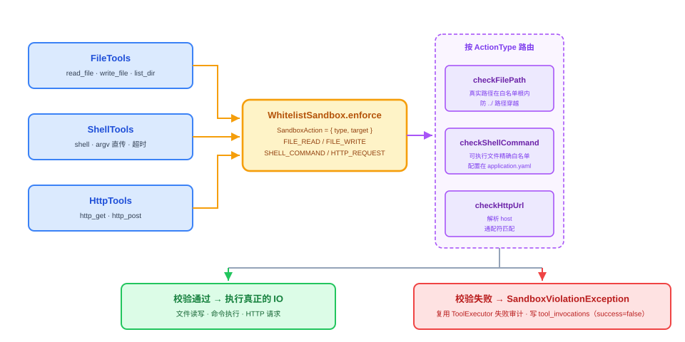

# 第 24 节：Sandbox 实现——让 Agent 干活不闯祸（代码课）

> **双定位**：本文档是 YokeOS 节级开发文档——既是**教学文档**（给人看：原理解析、动手前想清楚、代码怎么写），也是 **Spec-Kit 的开发原料**（给 AI 执行）。流水线映射：一、二部分供 `/speckit-specify` 取材；三部分供 `/speckit-plan` 取材，末尾「本节交付物」是 `/speckit-tasks` 的比对锚点；四部分是验收 harness 规格（DoD 对号锚点）；五部分是人工验项。
>
> **语料出处**：[需] `docs/DemandAnalysis.md` §5.7/§5.8/§6.3/§8.5/§11/§12 · [技] `docs/TechnicalSolution.md` §6.7/§7.3/§10/§13 · [宪] CLAUDE.md 宪法 5/6/7 · [指] `docs/AiProgrammingGuide.md` §4.1/§4.4 · [评] `specs/008-sandbox-review/review.md`（D1~D12 定稿、张力裁决 5.1~5.3、开放事项 O1~O5、§6.3 坑↔测试表——本节 specify/plan 的直接素材，六段式预填已在其 §6.1） · [参] 参照课件第 24 节 + 钉版树 `WhitelistSandboxTest`（其终态另含 `SandboxWhitelist`/`WhitelistSandboxMutationTest`/管理端点等后节演进物，按评审差异二/三取舍） · [码] 前序八处检查位现状（19/20/22 节留位注释）与 `ToolExecutor` 收口路径（17 节）。
>
> **拍板记录**（2026-09-20，用户批准「没问题，继续」）：① 配置载体 `SandboxProperties` 走 22 节 `MemoryProperties` 同款 classpath yaml 原文读取（SnakeYAML）+ 构造注入，不采纳参照的三个 `@ConfigurationProperties` record + `@Component` 扫描装配——本仓工具全是 `YokeosRuntime` 手工装配，显式构造与宪法 3 同精神；② 参照 `PermissiveSandbox`（WhitelistSandbox 就位前放行一切的临时装配）不引入——本仓八处检查位至今纯注释、无裸奔期，测试放行场景用白名单含目标的真 `WhitelistSandbox` 或 mock；③ `checkFilePath` 真实路径校验（`toRealPath` + 新建回溯父目录）为评审 D4 定稿落地，严于参照钉版树终态的 `normalize+startsWith` 字符串比对（其挡不住 symlink 出根）——记为与参照的显式差异（瑕疵不继承，[需 §5.7/§8.5]「校验真实路径」背书）；④ O1~O5 五项开放事项按评审 §5.4 归属留本节 plan 定稿，本文档只锁两条硬约束——默认路径白名单含 `.yokeos/` 工作区（D9）、空白名单 = deny-all 而非「不校验」；⑤ 配图复用 `docs-sandbox-flow.svg` 与 `class-023-1/3`，本节不新画（023 四张已覆盖概念层，本节是兑现课；定稿后若需专属配图按 019~022 先例另行补齐）。
>
> 技术栈：JDK 21 + Spring Boot 3.5.16 + Spring AI 1.1.8 + Spring AI Alibaba。**本节零新增第三方依赖**——纯 JDK NIO（`Path`/`toRealPath`）+ `URI` 解析 + 既有 SnakeYAML，无 Spring AI API 接触面（无代差坑）；主要门禁交互两处：异常/日志消息的 CRLF 门禁（编译期常量前缀 + 动态值进异常构造器，19/20 节同款）与测试命名（camelCase + `@DisplayName`，19 节实证）。

---

## 一、Sandbox 实现是什么，干嘛用的

一句话：**一个 `Sandbox` 接口 + 第一阶段唯一实现 `WhitelistSandbox`（路径/命令/域名三重白名单、真实路径校验），接进前序节预埋的八处检查位，拒绝走既有审计路径留痕——把 23 节评审冻结的 D1~D12 定稿，变成真实存在的墙。**

20 节起 Agent 会读写文件、跑命令、发请求了，但执行链上只有审计在留痕、没有校验在拦截——模型犯傻或被提示注入时，YokeOS 进程权限就是它的权限（[需 §12] 已识别「Tool 执行安全风险」）。审计是**事后可查**（宪法 7 day one 已落地），Sandbox 是**事前拦截**（本节），两者合成 Tool 执行的完整安全闭环。这是多 Agent 共处一个底座的前提，也是 31 节两个日跑 Demo 敢真跑的前提。

23 节评审已把设计全部定死（specs/008）：接口签名与中立性（D1/D2）、FILE 读写分离接口先分实现先合（D3）、三条校验规则（D4）、配置键全键（D5）、违规走既有审计（D6）、八处接线位（D7）、覆盖面原则与 MCP 诚实边界（D8）、配置自洽硬前提（D9）、信号驱动升级路线（D10）、诚实标注三条（D11）、第一阶段不做清单（D12）——**本节没有新设计要做，只有定稿要兑现**。兑现本身就是对评审的检验：接入中若发现哪里接不进去，要么实现错了、要么评审漏了，两者都值得记下来。



放到演进坐标里：这是隔离档位阶梯的最左档（应用层白名单，劝阻级——防模型犯傻、限可用面，防不住蓄意绕过），将来按信号升容器、升 microVM，接口一行不变（D10）。


## 二、动手前先想清楚几件事

**第一，接口墙先定死，四个类型一步到位。** `Sandbox`（唯一方法 `enforce(SandboxAction)`）、`SandboxAction`（record：`type` + `target`）、`ActionType`（四值枚举）、`SandboxViolationException`（`RuntimeException` 子类）。签名里不出现「白名单」「容器镜像」「VM 配置」任何一档实现特有的词（D1）；`FILE_READ` 与 `FILE_WRITE` 在接口层分离（未来按读/写分权限），第一阶段 `WhitelistSandbox` 把两 case 同路由 `checkFilePath`——**接口先分、实现先合**（D3）。


**第二，三条校验规则，每条对应一类绕过手法（D4）。**

- **`checkFilePath`：校验真实路径，不做纯字符串比对。** 目标已存在时 `toRealPath()`（解开全部符号链接）之后必须仍位于白名单根内——挡 symlink 出根与 `../` 穿越；目标不存在（新建文件/目录）时回溯最近存在的父目录取真实路径再校验——挡「借道白名单根下不存在的深层路径穿越」。**本仓这条严于参照**：参照钉版树终态仍是 `normalize().toAbsolutePath() + startsWith` 字符串比对，symlink 出根它挡不住——评审 D4 据[需 §5.7/§8.5]「校验真实路径」定稿，参照停在字符串比对属「瑕疵不继承」（拍板③）。
- **`checkShellCommand`：argv[0] 与白名单精确比对**（相等，非前缀非包含——前缀会把 `lsblk` 误放行）。本仓 20 节 shell 工具是 **argv 列表直传**（杜绝 shell 语法拼接），enforce 的 target 就是 argv[0] 本身，不需要参照「取命令首 token」的 split 逻辑——那是其字符串命令形态的包袱（结构同、入参形态异）。
- **`checkHttpUrl`：先解析 host，再与域名白名单通配符匹配。** `*.example.com` 只命中真子域（`api.example.com`、`a.b.example.com`），匹配必须带**点号边界**——`evil-example.com` 不得命中（`endsWith("example.com")` 的经典漏洞）；通配符不覆盖裸域，裸域 `example.com` 需单独的精确条目。绝不拿整串 URL 或 host 做子串包含——URL query 里夹带白名单域名字串不得误放行。畸形/解析失败的 URL 一律按拒绝处理（转 `SandboxViolationException`，不让 `IllegalArgumentException` 从 enforce 漏出去）；大小写与端口口径属 O2，plan 定。

三个 `check*` 方法一律 `private`——外部只看得到 `enforce(SandboxAction)` 一个入口。若三个方法 public 挂上接口，接口就被这一档实现带偏了。

**第三，enforce 落点 = 动作发生处，八处接线位逐位对号（D7，张力一裁决）。** 落点判据是 D8 覆盖面原则：**模型可经工具调用触发的动作发生处都过 enforce；底座自身基础设施不管辖**——`ProviderService` 调 LLM、审计落库、会话持久化都不在列，所以 `api.deepseek.com` **不需要**进域名白名单：

| 接线位 | 动作 | 留位出处 |
|---|---|---|
| `FileTools` readFile / writeFile / listDir | FILE_READ ×2 / FILE_WRITE | 20 节 |
| `ShellTools` execute | SHELL_COMMAND（argv[0]） | 20 节 |
| `HttpTools` get / post | HTTP_REQUEST ×2 | 20 节 |
| `NotifyTools` notify | HTTP_REQUEST（target = 从 frontmatter 解析出的 webhook URL，共享 `http.allowed-domains`） | 19 节（[需 §5.8] 明文） |
| `MarkdownMemoryStore` append | FILE_WRITE（MEMORY.md） | 22 节（张力三裁决纳入） |
| `Mem0MemoryStore` append | HTTP_REQUEST（mem0 host） | 22 节（同上） |
| `SqliteMemoryStore` append | 无动作（进程内写库不涉外） | 22 节已定口径 |
| `ToolExecutor` attemptOnce | **违规收口位，不是 enforce 调用点** | 17 节留位（本节只改注释） |

**MCP 转发调用第一阶段不过 enforce**（四值 ActionType 无法分类 MCP server 语义）——治理靠信任边界（配一个 MCP server = 信任其作者，与解释器同款逻辑）+ 审计 day one 兜底，这是诚实标注的暴露面（D8，扩展阶段容器化才兜得住）。

**第四，拒绝的后续路径一段都不用新写（D6）。** `SandboxViolationException` 是普通 `RuntimeException`，从工具 `execute` 里抛出来，被 `ToolExecutor.attemptOnce` 既有 catch 接住 → `ToolResult.error(…, retryable=false)` → 落 `tool_invocations`（`success=false` + `error_message`）→ 结果回填对话历史，模型下一轮可见。**拒绝不可重试**（重试被拒动作毫无意义）。这条收口链 17 节已天然落地，本节对 `ToolExecutor` 的全部动作 = 把 `ToolExecutor.java:78` 那行「24 节在此接线」留位注释改写为收口说明（张力一裁决的动作项；改注释不是改接口，不触软门禁②）。

**第五，配置自洽是硬前提，不是可选项（D9，坑六）。** 默认路径白名单必须含 `.yokeos/` 工作区（`memory/`、`output/` 在内），否则 `save_memory` 与产出物写入被自家沙箱拦截；切 mem0 档则域名白名单须含其 host。**空白名单 = deny-all（什么都不允许），不是「不校验」**——这条语义写进配置注释并钉回归测试。具体默认条目是 O1（plan 定稿），但有一条实现期就要想明白的难点：**工作区路径随 cwd 动态变化，静态 yaml 默认值写不了绝对路径**——默认条目要么以相对形态（`.yokeos`）表达、构造时按 cwd 解析，要么键缺省时代码缺省 = 当前工作区根（本节新增坑七，见下）。

**第六，坑逐个点名（评审坑一~六逐条承接 + 本节新增坑七），每个坑一个回归测试：**

- **坑一：路径校验只做字符串前缀比对。** 症状：符号链接、`../` 拼接、cwd 漂移绕过白名单。修复：真实路径校验（已存在目标 `toRealPath` 后仍在根内；新建回溯最近存在父目录）。→ 回归：symlink 出根拒绝、`../` 穿越拒绝、白名单内新建文件放行。
- **坑二：enforce 落点错位或重复。** 症状：同一动作校验两次、审计两条；MCP 被强套四值报错。修复：单一落点 = 动作发生处；`ToolExecutor` 只收口（异常 → 不可重试失败 → 审计一条）。→ 回归：拒绝恰落一条 `tool_invocations`、拒绝不重试。
- **坑三：命令白名单做成前缀/子串匹配。** 症状：白名单 `ls` 放行 `lsblk` 变体。修复：argv[0] 精确比对。→ 回归：在单命令放行、变体拒绝。
- **坑四：域名校验不解析 host、不守边界。** 症状：`example.com.evil.com` 或 URL 夹带域名串绕过。修复：host 解析 + 通配符点号边界。→ 回归：伪造后缀拒绝、子域命中通配、query 夹带不误放行。
- **坑五：拒绝只打日志不落审计、或吞异常继续。** 症状：违规动作照样发生且无痕。修复：异常上抛终止 + 既有失败审计。→ 回归：拒绝后 IO 根本不发生（文件未建、请求未发）+ 审计一条。
- **坑六：白名单与底座自身打架。** 症状：默认白名单漏 `.yokeos/`，`save_memory`、产出物写入被自家拦截；mem0 档域名漏 host 自断。修复：配置自洽硬前提（D9）。→ 回归：默认配置下 `save_memory` 正常放行。
- **坑七（本节新增）：默认白名单写死绝对路径。** 症状：在 `/tmp/demo` 下 init 的工作区，换个目录启动 YokeOS，默认白名单还指着老绝对路径，新工作区读写全被拦死。修复：默认条目相对形态按 cwd 解析，或键缺省时代码缺省 = 当前工作区根（O1 plan 定稿具体形态）。→ 回归：缺省配置下，当前工作区内 `save_memory` 与产出物写入放行。

**第七，与参照的分寸。** 参照钉版树里 Sandbox 相关另有三样后节演进物，本节一样不碰：`PermissiveSandbox`（其 24 节前的临时放行装配——拍板②不引入）、`SandboxWhitelist` + `WhitelistSandboxMutationTest`（白名单运行时增删）、`SandboxWhitelistController`（管理端点）——后两样是评审差异三明文列扩展阶段的不采纳项（[技 §7.3] 显式偏差，管理端点不悄悄补进第一阶段）。

## 三、代码怎么写

分五步：接口与值对象 → 配置载体与唯一实现 → 八处接线 → 收口注释改写 → 中立性自查。全部新增物落 `yokeos-tool` 的 `com.yokeos.tool.sandbox` 包（宪法 5 三合一模块；19 节 `notify` 包、20 节 `builtin`/`mcp` 包同款组织方式）。

**第一步：接口与值对象——这是墙，先定死（D1 字面量）。**

```java
// com.yokeos.tool.sandbox.Sandbox —— 宪法 6：接口不携带任何实现特有概念
public interface Sandbox {
  void enforce(SandboxAction action);
}

// com.yokeos.tool.sandbox.SandboxAction —— target 是纯字符串，是路径/命令/URL 由 type 决定
public record SandboxAction(ActionType type, String target) {}

// com.yokeos.tool.sandbox.ActionType —— 四值：文件读/写分离便于未来按读/写分权限（D3）
public enum ActionType { FILE_READ, FILE_WRITE, SHELL_COMMAND, HTTP_REQUEST }

// com.yokeos.tool.sandbox.SandboxViolationException —— 普通 RuntimeException，复用既有失败审计路径（D6）
public class SandboxViolationException extends RuntimeException { /* 构造器透传 message */ }
```

**第二步：`SandboxProperties` 配置载体 + `WhitelistSandbox` 唯一实现。** 配置载体照 22 节 `MemoryProperties` 先例：classpath yaml 原文读取（SnakeYAML）+ `load` 静态工厂 + 构造注入（拍板①），三块配置一组带走——`yokeos.sandbox.file.allowed-paths`（路径根清单，相对条目按 cwd 解析——坑七）、`yokeos.sandbox.shell.allowed-commands`（可执行文件名清单）、`yokeos.sandbox.http.allowed-domains`（域名模式清单）。

`WhitelistSandbox` 构造时三份清单各归各位（路径根 `toAbsolutePath().normalize()`；命令 `Set.copyOf`；域名模式原样保留），`enforce` 按 `ActionType` 路由三个 private 校验方法：

```java
@Override
public void enforce(SandboxAction action) {
  switch (action.type()) {
    case FILE_READ, FILE_WRITE -> checkFilePath(action.target());  // D3：接口先分、实现先合
    case SHELL_COMMAND -> checkShellCommand(action.target());
    case HTTP_REQUEST -> checkHttpUrl(action.target());
  }
}
```

`checkFilePath` 算法骨架（真实路径，D4）：目标存在 → `toRealPath()` 后必须落在某个白名单根内；目标不存在 → 回溯最近存在的父目录取真实路径、未存在的尾段原样接回再比对。异常消息守 CRLF 门禁：**编译期常量前缀 + 动态值经异常构造器**（如 `new SandboxViolationException("路径不在白名单内: " + rawPath)`——19/20 节同款；消息最终进 `tool_invocations.error_message` 对模型可见，粒度口径属 O5，plan 定）。

**第三步：八处接线——构造注入 + execute 首行 enforce。** 七个类的改法同一个模式（D7 表逐位对号，以 `FileTools` 为例）：

```java
private final Sandbox sandbox;

public FileTools(Sandbox sandbox) { this.sandbox = sandbox; }  // 无参构造消失——装配点显式传

// readFile 首行（writeFile/listDir 同款，ActionType 各按其位）：
sandbox.enforce(new SandboxAction(ActionType.FILE_READ, path));  // 检查位注释兑现：先 enforce 后 IO
// ……原有 IO 一行不动
```

装配点在 `YokeosRuntime`（yokeos-cli）：`tools()` Bean 里四个工具的构造与 `memoryService()` Bean 里 `MarkdownMemoryStore`/`Mem0MemoryStore` 的构造，统一加传一个 `WhitelistSandbox` 实例（`SandboxProperties.load` 构造，两 Bean 共用）——构造注入、无容器扫描（宪法 3 同精神，评审 O4 的落地形态）。构造器签名变化波及的既有调用点（yokeos-tool 工具测试类、yokeos-memory 档测试类、boot 集成测试装配段）同步更新——测试里传「白名单含 `@TempDir`/工作区」的真 `WhitelistSandbox`，不放行一切的假货。

**第四步：`ToolExecutor` 注释改写。** `ToolExecutor.java:78` 的「Sandbox 白名单校验位：24 节在此接线」改写为收口说明（`SandboxViolationException` 等工具异常在此转不可重试失败 + 审计留痕；enforce 落点在各工具动作发生处——D6/D7）。代码逻辑零变化。

**第五步：接口中立性自查。** microVM 反套思维练习：`Sandbox.enforce(SandboxAction)` 换成 `KataMicroVmSandbox` 实现，签名要加方法吗？调用方要改吗？不需要才算墙立住了（D2）。结论记进验收报告。

**有几样先别做（D12 全表）。** 容器/microVM/WASM 隔离（升级信号见 D10）；Tool Policy allow/deny（Profile `tools` 字段是雏形）；白名单管理端点（差异三，[技 §7.3]）；`ActionType` 不设 TIMEOUT/RESOURCE 值（超时 = Shell 进程超时、资源 = 超长输出截断，均由工具层承载——张力二裁决）；MCP 调用 enforce（信任边界 + 审计兜底）；`SecurityManager`（JDK 21 已不可用，宪法 6）；交互式权限门（钟推无人值守，没有人在旁边按 allow）。

**本节交付物**（Spec-Kit 拆解锚点）：

- 代码：`Sandbox`、`SandboxAction`、`ActionType`、`SandboxViolationException`、`WhitelistSandbox`、`SandboxProperties` → yokeos-tool（`tool/sandbox` 包，全新增）；`FileTools`（enforce×3 + 构造注入）、`ShellTools`、`HttpTools`（enforce×2）、`NotifyTools`（enforce×1，target = webhook URL）→ yokeos-tool（改造）；`MarkdownMemoryStore`（FILE_WRITE）、`Mem0MemoryStore`（HTTP_REQUEST）→ yokeos-memory（构造注入 + enforce）；`ToolExecutor` 留位注释改写为收口说明 → yokeos-core（本节唯一触碰，逻辑零变化）；`YokeosRuntime` 装配（`WhitelistSandbox` 构造并注入 `tools()`/`memoryService()` 两 Bean）→ yokeos-cli
- 测试：`WhitelistSandboxTest` → yokeos-tool（新建）；`FileToolsTest`/`ShellToolsTest`/`HttpToolsTest`/`NotifyToolsTest` → yokeos-tool（构造器更新 + 拦截回归）；`MarkdownMemoryStoreTest`/`Mem0MemoryStoreTest` → yokeos-memory（同上）；`ToolExecutorTest` → yokeos-core（收口回归：异常 → 不可重试 + 审计恰一条）；boot 五个集成测试装配段更新（`ToolMcpSmoke`/`ReActSmoke`/`MemoryEndToEnd`/`ToolSystemEndToEnd`/`NotifyEndToEnd`，其余构造调用点以 grep 为准一并更新）（见第四部分）
- 配置：`yokeos.sandbox.file.allowed-paths` / `shell.allowed-commands` / `http.allowed-domains` 三键进 application.yaml（默认值 O1 plan 定稿 + 「空白名单 = deny-all」语义注释）
- 表：无新表——拒绝复用 `tool_invocations` 既有失败路径（D6「不为 Sandbox 单增审计逻辑」）

## 四、验收 harness：把验收标准变成可执行的测试

安全模块 harness 的特殊性：**测的重点不是「放行对不对」，是「绕得过绕不过」**——三类校验各「允许 + 拒绝」成对，再加绕过场景（参照课件同款口径，其 `WhitelistSandboxTest` 的 `@Nested` 组织直接可鉴）。全部单测可离线跑（`@TempDir` + mock，不花钱不碰网）；真链路验证进 boot 集成冒烟与人工项。

**先定分层：什么用单测，什么留集成/人工。**

- **单测（默认全跑）**：三条校验规则与全部绕过场景、八个接线位的「拒绝时 IO 零发生」、收口语义（不可重试 + 一条审计）、deny-all、配置自洽。
- **集成冒烟（`@Tag("integration")`，真 key 时跑）**：真链路一次越权动作端到端。
- **人工项**：[需 §11] 第 24 节行的可演示成果（第五部分）。

**测试类与覆盖的验收点：**

| 测试类 | 覆盖的验收点 |
|---|---|
| `WhitelistSandboxTest`（新建，yokeos-tool） | 三类 `@Nested` 成对断言 + 绕过：路径（白名单内放行 / 外拒绝 / `../` 穿越拒绝 / **symlink 出根拒绝**（坑一·真实路径）/ 白名单内新建文件回溯放行）；命令（argv 精确条目放行 / 外拒绝 / **`ls` 在单但 `lsblk` 变体拒绝**（坑三））；域名（通配真子域命中 / **形似 `evil-example.com` 拒绝**（坑四·点号边界）/ 通配不覆盖裸域 / 精确条目命中裸域 / query 夹带域名串不误放行 / 畸形 URL 拒绝）；**空白名单 deny-all**（三类全空一律拒绝——坑六反向）。只经 `enforce` 公共入口断言（三个 `check*` private 不直测——接口中立性） |
| `FileToolsTest` / `ShellToolsTest` / `HttpToolsTest` / `NotifyToolsTest`（更新，yokeos-tool） | 构造器更新 + 拦截回归：mock 全拒 `Sandbox` → 各工具方法抛 `SandboxViolationException` 且 **IO 零发生**（文件未建 `assertFalse(Files.exists(...))`、进程未跑 `verify(..., never())`、HTTP 未发）（坑五）；白名单含目标的真 `WhitelistSandbox` 下原有行为不受影响（既有用例改构造后全绿） |
| `MarkdownMemoryStoreTest` / `Mem0MemoryStoreTest`（更新，yokeos-memory） | 拒绝时 append 抛异常、MEMORY.md 未动 / REST 未发（坑五·Memory 档位）；白名单含 `.yokeos/` 时 `save_memory` 写入路径放行（坑六） |
| `ToolExecutorTest`（更新，yokeos-core） | 收口回归：工具抛 `RuntimeException` → 结果不可重试（`retryable=false`，坑二·不重试）+ 审计恰一条（坑二·一条审计）。用抛异常的假工具即可，**不依赖 Sandbox 类型**（core 不依赖 tool——收口只认 RuntimeException） |
| boot 集成冒烟（更新，yokeos-boot） | 装配段传测试白名单 `WhitelistSandbox`；真链路一次越权动作 → `tool_invocations` 落 `success=false` + `error_message` 可读（D6 端到端） |

**两个最值钱的绕过用例写出来看**（测试方法名 camelCase、中文语义进 `@DisplayName`——19 节实证）：

```java
@Test
@DisplayName("符号链接出白名单根_真实路径校验拒绝")
void symlinkEscapingRootIsRejected(@TempDir Path allowed, @TempDir Path outside) throws IOException {
  Path secret = Files.createFile(outside.resolve("secret.txt"));     // 白名单外
  Files.createSymbolicLink(allowed.resolve("innocent.txt"), secret); // 白名单内的链接指向外面

  WhitelistSandbox sb = sandbox(List.of(allowed.toString()), List.of(), List.of());

  assertThrows(SandboxViolationException.class,
      () -> sb.enforce(new SandboxAction(ActionType.FILE_READ, allowed.resolve("innocent.txt").toString())));
  // normalize+startsWith 的字符串比对放行这个链接——toRealPath 才拦得住（严于参照的实证）
}

@Test
@DisplayName("形似域名不得命中通配符_点号边界")
void lookalikeDomainDoesNotMatchWildcard() {
  WhitelistSandbox sb = sandbox(List.of(), List.of(), List.of("*.example.com"));

  assertDoesNotThrow(() -> sb.enforce(new SandboxAction(ActionType.HTTP_REQUEST, "https://api.example.com/v1")));
  assertThrows(SandboxViolationException.class,  // "evil-example.com".endsWith("example.com") 为真——必须带点号边界
      () -> sb.enforce(new SandboxAction(ActionType.HTTP_REQUEST, "http://evil-example.com/x")));
  assertThrows(SandboxViolationException.class,  // 通配符不覆盖裸域（要裸域另加精确条目）
      () -> sb.enforce(new SandboxAction(ActionType.HTTP_REQUEST, "http://example.com/x")));
}
```

**「IO 零发生」的断言口径**（坑五，安全测试的底线）：只断言抛了异常不够，得证明危险动作真的没跑——文件用 `assertFalse(Files.exists(...))`、HTTP/进程用 mock 底层执行器后 `verify(client, never())`（22 节 Mockito `RETURNS_SELF` 先例可鉴）。拒绝不可重试的断言挂在 `ToolExecutor` 既有重试语义测试旁（不可重试失败一次即止）。

## 五、做完怎么验

harness 全绿之后，剩下这几条需要人工确认（进验收报告「剩余人工项」）：

- [ ] **真链路拦截演示**（可演示成果口径，[需 §11] 第 24 节行「越权路径/命令/域名被拦截，拦截动作留痕可查」）：配真 key 跑 `yokeos chat`，诱导 Agent 各试一次白名单外路径读取、白名单外命令、白名单外域名请求——观察三次拒绝、`tool_invocations` 各落一条 `success=false`、`error_message` 人能读懂、文件/进程/请求根本没发生
- [ ] **默认配置自身体感**（坑六/坑七端到端）：默认白名单下既有 E2E 不被自家沙箱拦截——`save_memory` 正常、产出物写入 `output/` 正常、`yokeos init` 后换目录再跑不拦死
- [ ] **接口中立性自查**：microVM 反套结论记进验收报告（二·第一条 / 三·第五步）
- [ ] `mvn clean verify` 九模块全绿（含七个被改造类的既有测试改构造器后全绿）
- [ ] 装配卫生 grep：`WhitelistSandbox` 无 `@Component`、无类型扫描注册（宪法 3 同精神）；`yokeos-core` 未新增对 `yokeos-tool` 的依赖（收口不依赖 Sandbox 类型）

其余验收点——三条校验规则与全部绕过场景、八处接线、拒绝不可重试、deny-all、配置自洽——已由第四部分单测覆盖，`mvn test` 绿就等于打勾。

到这一步，Tool 执行链有了完整的安全闭环：动作发生处先拦（Sandbox）、执行全程留痕（审计两表）、事后可查可审。25 节定时任务上线后是钟推无人值守场景，这道闸从「值得有」变成「必须有」——没有人盯着的时候，劝阻级防线加审计留痕就是全部在场证据。
