# 第 25 节：定时任务——让 Agent 到点自己干活（代码课）

> **双定位**：本文档是 YokeOS 节级开发文档——既是**教学文档**（给人看：原理解析、动手前想清楚、代码怎么写），也是 **Spec-Kit 的开发原料**（给 AI 执行）。流水线映射：一、二部分供 `/speckit-specify` 取材；三部分供 `/speckit-plan` 取材，末尾「本节交付物」是 `/speckit-tasks` 的比对锚点；四部分是验收 harness 规格（DoD 对号锚点）；五部分是人工验项。
>
> **语料出处**：[需] `docs/DemandAnalysis.md` §5.8（定时任务·第三触发源）/§11（第 25 节行「Agent 按 cron 到点自跑，执行历史可查」） · [技] `docs/TechnicalSolution.md` §8.5（本节主章）/§8.6（serve/gateway 常驻）/§9.2（`scheduled_tasks`/`task_executions` 两表字段）/§13（第 25 节交付物行）/§13.2（调度管理端点显式偏差） · [宪] CLAUDE.md 宪法 4（ThreadPoolTaskScheduler 唯一异步例外）/宪法 7（手工建表脚本） · [指] `docs/AiProgrammingGuide.md` §4.1/§4.4 · [参] 参照课件第 25 节 + 钉版树 `AgentScheduler`/`ScheduledTaskStore`/`JpaScheduledTaskStore` 及其测试（其 `SchedulerFlowIT`/`ScheduledTaskE2ETest` 依赖管理端点 POST run，按 ADR 0008 偏差改造）+ 参照 `specs/008-scheduled-tasks/spec.md`（FR-001~007 与 Edge Cases 取材） · [码] `YokeosRuntime` 现状（`ProfileRegistry`/`AgentService`/`SessionManager` Bean 已在，16~18 节）、`ServeCommand`/`GatewayCommand` 骨架留位注释、`Profile.ScheduleConfig`（16 节定稿三字段）。
>
> **拍板记录**（2026-09-21，用户批准「同意，继续」）：① **task_id 派生生成**：`task_id = {profileName}#{声明序号，从 1 起}`（同 profile 内按声明顺序编号，跨 profile 天然不冲突）。裁决依据（参照库研究结论）：技 §9.2 原文「schedule 的 id（frontmatter `schedules` 里声明）」与本仓 16 节定稿 `Profile.ScheduleConfig(cron, zone, message)` 三字段、CLAUDE.md 数据模型段口径冲突（软门禁③）；参照显式 id 的完整收益在其 28 节管理端点 REST 路径——本仓该端点显式列扩展阶段（ADR 0008），25/29/30 节窗口内派生 id 功能等价（注销按旧 Profile 派生 id 全量清、不依赖新旧对齐；仅「删条目/调顺序后旧 run_count 不延续」一差异，新定义新状态语义可辩护）；参照 id 无必填校验（缺 id 静默跳过）与无唯一性校验（同 id 表行/句柄互相覆盖）两处瑕疵随派生整个消掉；扩展阶段上调度管理端点时加**可选** id 字段缺省回退派生，平滑演进。技 §9.2 该行括号说明已同步修订（修文档优先，第 16 节 llm_calls 补列先例）——不动 Profile 已定稿契约（软门禁④）。② 配图：本节不新画，复用 `docs/images/docs-scheduler.svg`（三触发源汇入 `AgentService`，技 §8.5 同款）；参照课件 class-25-2（职责边界）/class-25-3（执行流程）两张的语义已在文中文字承载，若定稿后需要专属配图按 019~022 补图先例另行补齐（024 拍板⑤同款）。
>
> 技术栈：JDK 21 + Spring Boot 3.5.16 + Spring AI 1.1.8 + Spring AI Alibaba。**本节零新增第三方依赖**——`ThreadPoolTaskScheduler`/`CronTrigger`/`SimpleTriggerContext` 均为 spring-context 既有传递件（18 节起就在 classpath 上），无 Spring AI API 接触面（无代差坑）；主要门禁交互与 24 节同款（异常/日志消息 CRLF 门禁走编译期常量 + 动态值进异常堆栈、测试命名 camelCase + `@DisplayName` 中文）。

---

## 一、定时任务是什么，干嘛用的

一句话：**一个 `AgentScheduler`——启动时扫所有 Profile 的 `schedules` 声明逐条注册进 Spring `TaskScheduler`，到点拼一条消息交给 `AgentService.process`（跟 CLI/Web 人推完全一样的入口），外加两张 SQLite 表（`scheduled_tasks`/`task_executions`）把「到点有没有跑、跑了什么、结果如何」落库可查。**

Provider（16）、ReAct（17）、CLI（18）、Notify（19）、Tool（20）、Memory（22）、Sandbox（24）都齐了——Agent 能被喂话、会想、会动手、会往外推、记得住事、干活有边界。还剩最后一个缺口：**每次都得有人喂话**。每日天气、每日科技日报（31 节两个验收 Demo）没人会天天手动去问——Agent 得自己知道「到点了，该干活了」。

**定时任务不是一种新能力，是第三种触发源。** CLI 是人推、Web 是人推（换了个入口）、定时任务是**钟推**——到点了系统自己拼一条消息，喂给跟人推完全一样的处理入口。`ReActLoop` 怎么想、Tool 怎么过 Sandbox、Provider 怎么调模型，一个字都不用改（[需 §5.8]「定时触发与 CLI、REST API 复用同一条执行链路——同一个 Agent 不管从哪个入口触发，行为一致、审计同构」）。



**本节一次性交付参照两节的内容**（技 §13 第 25 节行拍板）：参照把调度层放 25 节、状态落库放 28 节；本仓 `scheduled_tasks`/`task_executions` 建表、`ScheduledTaskStore` 契约与 JPA 实现全在 25 节交付——「执行历史可查」是[需 §11] 当节可演示成果的一半，不推迟。

## 二、动手前先想清楚几件事

**第一，把职责划窄，别让它膨胀成小型工作流引擎。** 这个模块只干一件事——**到点了，拼一条消息，交给 `AgentService`**。消息里具体说什么话，是 AGENT.md frontmatter 的事；消息交上去之后怎么处理，是 ReActLoop 的事。这两件都不归定时任务模块管。

**第二，别自己写调度器。** Spring 自带 `TaskScheduler`，支持标准 cron 表达式、支持动态注册任务。跟 Provider 那节「协议转换不自己造」同一个原则：能用现成的就不重复造轮子，要写的只是薄薄一层，把「frontmatter 里配的定时规则」接到 Spring 的调度能力上。注意宪法 4 全程同步禁异步，**唯一例外就是本节的 `ThreadPoolTaskScheduler` 调度线程池**（宪法原文点名）——触发线程之外的执行链路（`AgentService.process` 往下）仍是纯同步阻塞，跑在调度线程上。

**第三，状态持久化：契约在 core、实现在 storage（依赖倒置）。** 光「到点自动跑」还不够——「到点没跑、跑了什么、结果如何」要有据可查（[需 §5.8]）。为此把任务状态和执行历史落 SQLite，重启不丢：

- **两张表**（技 §9.2，手工建表脚本 `schema-004-scheduler.sql`，宪法 7）：`scheduled_tasks` 存登记信息与运行状态，`task_executions` 存每次执行历史（成功失败都记）。**定义源仍是 frontmatter 的 `schedules`**——这两张表只存「状态 + 历史」，重启时从文件重新协调，不作为定义源。
- **`ScheduledTaskStore` 接口六方法**（技 §8.5 字面）：`reconcile`（幂等登记/更新：已存在则更新定义字段、**保留 enabled 与 run_count**——重启不丢运行状态；不存在则插入默认启用）/`recordExecution`（写一条历史并更新任务状态）/`isEnabled`（**未登记的按启用处理，fail-open**）/`setEnabled`/`list`/`executions`（按开始时间倒序、limit 条）。接口放 `yokeos-core`，`AgentScheduler` 依赖它；JPA 实现 `JpaScheduledTaskStore` 放 `yokeos-storage`。`setEnabled`/`list`/`executions` 第一阶段无调用方（管理端点不做，见第五），但契约一次立全——依赖倒置 + 接口先行是本仓定式（Sandbox 6 节同款）。
- **文件里已删掉的任务**：表内留档不删（`task_executions` 按 task_id 关联，删任务会孤儿化历史），孤儿行无害——重启后按文件协调时不会注册它。

**第四，task_id 用派生生成（拍板①）。** frontmatter 三字段 `(cron, zone, message)` 已 16 节定稿、CLAUDE.md 数据模型同口径；id 的全部用途是锁维度 + 表主键 + 注销句柄 key，`{profileName}#{声明序号}` 派生即可全局唯一。第一阶段定义变更 = 重启进程，派生 id 在进程生命周期内稳定；跨重启按文件重新协调本就重新登记；29/30 节注销按旧 Profile 派生 id 全量清，不依赖新旧 id 对齐（参照研究结论，拍板①）。

**第五，几个坑，提前想到（每坑一个回归测试，见第四部分对号表）。**

- **坑一：配置从哪来。** cron 表达式、时区、到点要说什么话，必须能在 AGENT.md frontmatter 里声明，不能写死在 Java 代码——`@Scheduled` 注解的 cron 是编译期常量，改一次触发时间就得重新编译，不符合「配置即 Agent」。解法：`TaskScheduler.schedule(runnable, trigger)` 动态注册。
- **坑二：重叠执行。** 一次 ReAct 循环跑得比调度间隔长（每分钟触发但上一次没跑完），不能并发跑两份、也不排队堆积——按任务 id 一把进程内 `ReentrantLock` + `tryLock()`，拿不到直接跳过本次。核心阶段单实例，**这不是分布式锁**，多实例协调扩展阶段做（[需 §5.8] 第一阶段不做）。
- **坑三：失败隔离 + 留痕 + 不留死锁。** 一次任务跑挂了只记日志不外抛，不能带崩调度器、不能影响其它任务与下次触发；失败的这次调用照样走 `AgentService.process` 内部完整的 `llm_calls`/`tool_invocations` 审计（与人推的失败无区别，不为钟推单开审计逻辑）；无论成败锁必须在 `finally` 释放；执行结果（成功失败都）`recordExecution` 落库，**落库本身失败也只记日志不外抛**（执行已经发生，不能因记失败账把调度线程搞挂）。
- **坑四：时区。** cron 默认按服务器系统时区跑，容易跟「用户以为的早上 9 点」对不上。`CronTrigger` 构造时显式带 `ZoneId`（frontmatter `zone` 缺省/空白才回退系统时区），不由服务器时区替用户做主。
- **坑五：会话身份。** 钟推也要落 Session：channel 与 user 固定为 `scheduler`，`session_id` 沿用既有三元组公式（18 节 `SessionIds` 单点拼接，H4④）——同一个 Agent 历次定时触发复用同一个 Session，对话历史自然累积、靠 `max_history_turns` 截断兜底，不为钟推新设任何概念。`AgentScheduler` 不碰 session_id 生成。
- **坑六：单条规则非法拖垮整体。** 某条 cron/时区解析失败，MUST NOT 让整个注册过程崩溃拖垮其它合法规则——单条 catch 记日志跳过（FR-007）。同理 `nextExecution` 算下次触发时刻失败返回 null，不影响本次执行。
- **坑七（本仓实证预判）：调度线程非 daemon 阻止进程退出。** `ThreadPoolTaskScheduler` 默认非 daemon 线程——`yokeos chat` 跑完该退出时 JVM 会被调度线程挂住。解法：`setDaemon(true)`（参照钉版树同款）。副作用要知道：chat 会话期间到点的任务也会真触发一次（与参照行为一致；chat 本就是同一台运行时的调试入口）。定时任务**随 serve/gateway 常驻**（技 §8.6）——两命令骨架注释 18 节已留位「归 25 节」，本节兑现。
- **坑八（测试基建）：Mockito boolean 默认 false。** `taskStore.isEnabled(...)` 不显式 stub 时返回 false，`runOnce` 全部因「停用」被跳过——测试白绿。解法：setUp 里 `when(taskStore.isEnabled(any())).thenReturn(true)` 钉死默认启用。
- **坑九（测试基建）：`CronTrigger.equals` 只比 cron 不比时区。** 断言「时区生效」不能靠 equals——用固定 `SimpleTriggerContext` 比对 `nextExecution` 时刻：与「同 cron + 配置时区」参照一致、与别的时区不一致，证明时区没被服务器默认顶掉。
- **坑十（本仓特有）：派生 task_id 的唯一性依赖声明顺序。** `{profileName}#{序号}` 在同 profile 内按声明序唯一、跨 profile 有前缀隔离；回归测试锚「同 profile 两条规则 id 不同」「跨 profile 同序号 id 不同」两断言。改 schedules 内容/顺序后 id 语义变化属预期（定义变更 = 重新协调，表内旧 id 留档无害，见第三）。
- **坑十一：reconcile 把运行状态冲掉。** 重启时重新登记若当成「删了重建」，enabled 停用状态与 run_count 累计全部归零——「重启不丢」落空。解法：reconcile 幂等 upsert，已存在行只更新定义字段（cron/zone/message/next_run_at），**不动 enabled 与 run_count**。

**第六，与参照的分寸（显式差异，ADR 0008 背书）。** 参照钉版树的 `ScheduleApiController`（GET/PUT `/api/v1/schedules`、POST `/{id}/run`）与依赖它的 `SchedulerFlowIT`/`ScheduledTaskE2ETest`（经 REST 驱动执行）本节**不引入**——调度管理端点显式列扩展规划位（技 §7.3/§13.2，不悄悄补进第一阶段）。替代：`AgentScheduler.runNow(taskId)` 保留为**类级公开方法**（按 id 遍历注册表找到任务手动跑一次、无视启用状态），不挂 REST——用途是验收 harness 确定性驱动（免等真 cron 到点）+ 31 节「人推补跑」+ 30 节端点预留位（[需 §11] 验收硬条件「都是钟推、支持人推补跑」的补跑入口）。E2E 测试直接 `@Autowired AgentScheduler` 调它，不走 HTTP。

**第七，先别做（边界，[需 §5.8] + 技 §8.5 第一阶段边界逐项照搬）。** 分布式调度（选主/分布式锁/租约——「这个任务归哪个实例执行」扩展阶段跟状态外置一起解决）；失败自动重试、失败 N 次告警（核心阶段做到「失败不崩、留痕可查」即够）；调度管理 REST 端点与管理台页面（ADR 0008 扩展规划位——第一阶段「可查」由两张表落库 + `GET /api/v1/sessions/{id}`（26 节）+ 审计表承接）；cron 表达式高级语法扩展（Quartz 级）——Spring 标准 cron 够用。

## 三、代码怎么写

分四步：core 契约与调度器 → storage 落库 → cli 装配 → 骨架注释兑现。**模块落位**（技 §10）：`AgentScheduler`/`ScheduledTaskStore`/`ScheduledTaskView`/`TaskExecutionView` 落 `yokeos-core` 的 `com.yokeos.core.agent` 包（`AgentService` 同包）；`ScheduledTask`/`TaskExecution` 实体、两 Repository、`JpaScheduledTaskStore`、`schema-004-scheduler.sql` 落 `yokeos-storage`（22 节 `MemoryEntry` 同款组织）；三个 Bean 落 `yokeos-cli` `YokeosRuntime`（16 节起显式装配定式）。core 类保持纯 POJO 零框架注解（`AgentService`/`ReActLoop` 同构）——装配与启动注册由 `YokeosRuntime` 显式做。

一次触发从头到尾是这样走的（`runOnce` → `execute` 两层拆开，为可测——cron 触发本身是 Spring 的事，测试直接调方法验全部行为逻辑）：

```text
CronTrigger 到点（ThreadPoolTaskScheduler 线程，daemon）
  → runOnce(profile, sc)
      isEnabled(taskId)?  否 → 跳过、不记执行（停用语义）
      是 → execute(profile, sc)
          lockFor(taskId).tryLock() 拿不到 → 跳过本次（坑二）
          拿到 → sessionManager.getOrCreate("scheduler", "scheduler", profile.name())（坑五，三元组拼接在 SessionIds 单点）
          → agentService.process(session, sc.message())（人推同款入口；审计在 process 内部，坑三前半）
          → finally: lock.unlock()（坑三中段）
                  taskStore.recordExecution(taskId, sessionId, startedAt, success,
                                            error, durationMs, nextExecution(sc))（坑三后半；自身失败只记日志）
```

**第一步：core——接口与值对象先立（契约先行）。**

```java
// com.yokeos.core.agent.ScheduledTaskStore —— 技 §8.5 六方法字面；依赖倒置：接口在 core，JPA 实现在 storage
public interface ScheduledTaskStore {
  void reconcile(String taskId, String profileName, String cron, String zone,
                 String message, Instant nextRunAt);          // 幂等登记/更新，保留 enabled 与 run_count
  void recordExecution(String taskId, String sessionId, Instant startedAt, boolean success,
                       String errorMessage, long durationMs, Instant nextRunAt);
  boolean isEnabled(String taskId);                            // 未登记按启用处理（fail-open）
  void setEnabled(String taskId, boolean enabled);
  List<ScheduledTaskView> list();
  List<TaskExecutionView> executions(String taskId, int limit); // 按开始时间倒序
}
```

`ScheduledTaskView`/`TaskExecutionView` 是纯数据 record（字段 = 技 §9.2 两表列的只读投影），供 30 节管理端点与排障复用。

**第二步：core——`AgentScheduler` 骨架（四坑解法的落点）。**

```java
// 纯 POJO，YokeosRuntime 显式装配 @Bean(initMethod = "registerAll")
public class AgentScheduler {
  private final TaskScheduler taskScheduler;        // ThreadPoolTaskScheduler（宪法 4 唯一异步例外）
  private final ProfileRegistry profileRegistry;
  private final AgentService agentService;
  private final SessionManager sessionManager;
  private final ScheduledTaskStore taskStore;
  private final ConcurrentMap<String, Lock> taskLocks = new ConcurrentHashMap<>();      // 坑二
  private final Map<String, ScheduledFuture<?>> scheduledTasks = new ConcurrentHashMap<>(); // 句柄留位（29/30 节注销用）

  public void registerAll() { /* 扫 profileRegistry.all() 逐 profile 调 registerProfile */ }

  public void registerProfile(Profile profile) {
    // 逐条 sc：new CronTrigger(sc.cron(), resolveZone(sc.zone()))（坑四）
    //   → taskScheduler.schedule(() -> runOnce(profile, sc), trigger)，句柄入 scheduledTasks
    //   → taskStore.reconcile(taskIdOf(profile, sc), …, nextExecution(sc))（登记）
    //   单条 RuntimeException catch 记日志跳过（坑六）
  }

  public void runOnce(Profile profile, ScheduleConfig sc) { /* isEnabled 否→跳过；是→execute */ }

  public void runNow(String taskId) { /* 按 id 遍历注册表找到 (profile, sc) 手动 execute；找不到抛 IllegalArgumentException */ }

  public void execute(Profile profile, ScheduleConfig sc) { /* 拿锁→Session→process→finally 放锁+recordExecution（上文流程图） */ }

  public Lock lockFor(String taskId) { /* taskLocks.computeIfAbsent；public 为可测（harness 占锁模拟"上一次还在跑"） */ }

  private static String taskIdOf(Profile p, ScheduleConfig sc) { /* "{name}#{声明序号}"（拍板①定稿）；序号取 sc 在 p.schedules() 中的位置 */ }

  private Instant nextExecution(ScheduleConfig sc) { /* CronTrigger.nextExecution(new SimpleTriggerContext())；非法返回 null */ }

  private ZoneId resolveZone(String zone) { /* 空/blank 回退系统时区，否则 ZoneId.of(zone) */ }
}
```

日志纪律（CRLF 门禁）：「定时任务 {} 已注册」这类**编译期常量消息 + 动态值走参数化/异常堆栈**——id/cron/zone 来自运营方手写的 AGENT.md（非请求输入），但本仓门禁只认 API 形态，一律 19/20 节同款形态书写。

**第三步：storage——两实体、两仓库、一实现、一脚本。**

- `ScheduledTask` 实体：`@Table(name = "scheduled_tasks")`，列 = 技 §9.2 表逐列（`task_id` 主键 String、`profile_name`、`cron`、`zone`、`message`、`enabled`、`next_run_at`、`last_run_at`、`last_status`、`run_count`、`updated_at`）。
- `TaskExecution` 实体：`@Table(name = "task_executions")`，`id` 自增主键、`task_id`、`session_id`、`started_at`、`success`、`error_message`、`duration_ms`。
- `JpaScheduledTaskStore`：`reconcile` 按 id 查找——无则新建（`enabled=true`、`run_count=0`）保存，有则只更新定义字段与 `next_run_at`/`updated_at`（坑十一）；`recordExecution` 先 insert 一条 `task_executions`，再按 id 更新任务行的 `last_run_at`/`last_status`（`"success"`/`"failed"` 字面）/`run_count+1`/`next_run_at`；`isEnabled` 查无此行返回 true（fail-open）；`executions` 按 `started_at` 倒序取 limit 条。
- `schema-004-scheduler.sql`：`CREATE TABLE IF NOT EXISTS` 两张表 + 索引（`task_executions(task_id)` 查询路径），列定义逐字来自技 §9.2，头部注释三行（22 节 schema-003 同款：出处 + 宪法 7 + 语义说明）。
- 测试侧建表走 `ScriptUtils.executeSqlScript(connection, new ClassPathResource("/db/schema-004-scheduler.sql"))`（22 节同款）。

**第四步：cli——三个 Bean 进 `YokeosRuntime`，两处骨架注释兑现。**

```java
@Bean
ThreadPoolTaskScheduler taskScheduler() {
  ThreadPoolTaskScheduler scheduler = new ThreadPoolTaskScheduler();
  scheduler.setPoolSize(2);
  scheduler.setThreadNamePrefix("yokeos-sched-");
  scheduler.setDaemon(true);      // 坑七：chat 等一次性命令跑完 JVM 可退
  scheduler.initialize();
  return scheduler;
}

@Bean
ScheduledTaskStore scheduledTaskStore(ScheduledTaskRepository tasks, TaskExecutionRepository executions) {
  return new JpaScheduledTaskStore(tasks, executions);
}

@Bean(initMethod = "registerAll")   // 启动即扫描全部 Profile.schedules 逐条注册（依赖注入完成后执行，ProfileRegistry 已填充）
AgentScheduler agentScheduler(ThreadPoolTaskScheduler taskScheduler, ProfileRegistry profileRegistry,
                              AgentService agentService, SessionManager sessionManager,
                              ScheduledTaskStore scheduledTaskStore) { … }
```

`ServeCommand`/`GatewayCommand` 的留位注释（「定时任务随 serve/gateway 常驻调度归 25 节」）改写为已兑现说明；serve 启动文案同步提及调度已常驻。**不新增任何配置键**——cron/zone/message 全部来自 AGENT.md frontmatter（16 节 `AgentLoader.schedules()` 已解析建全，本节只消费，`Profile` 与 `AgentLoader` 零改动——拍板①采纳派生的话）。

**本节交付物**（Spec-Kit 拆解锚点）：

- **代码（yokeos-core，`com.yokeos.core.agent`）**：`AgentScheduler`（`registerAll`/`registerProfile`/`runOnce`/`runNow`/`execute`/`lockFor` + 按任务 id 的 `ReentrantLock` 表 + 句柄表 + `taskIdOf` 派生）、`ScheduledTaskStore` 接口（六方法）、`ScheduledTaskView`、`TaskExecutionView`
- **代码（yokeos-storage）**：`ScheduledTask`、`TaskExecution`（JPA 实体）、`ScheduledTaskRepository`、`TaskExecutionRepository`、`JpaScheduledTaskStore`、`db/schema-004-scheduler.sql`
- **代码（yokeos-cli）**：`YokeosRuntime` 加三 Bean（`ThreadPoolTaskScheduler` daemon / `ScheduledTaskStore` / `AgentScheduler` initMethod=registerAll）；`ServeCommand`/`GatewayCommand` 骨架注释兑现
- **测试**：`AgentSchedulerTest`（core）、`JpaScheduledTaskStoreTest`（storage）、`SchedulerEndToEndIntegrationTest`（boot，`@Tag("integration")`）——见第四部分
- **表**：`scheduled_tasks`、`task_executions`（schema-004 手工脚本，宪法 7）
- **约定**：会话身份固定 `("scheduler", "scheduler", profileName)`；失败只记日志不崩调度器；`isEnabled` fail-open；task_id 派生 `{profileName}#{序号}`（拍板①定稿）

## 四、验收 harness：把验收标准变成可执行的测试

测试诀窍是**别真等时间**：`runOnce`/`execute` 拆成独立公开方法直接调，就能测全部行为逻辑；cron 触发本身是 Spring 的事，只验「注册参数传对了」。真等一次 cron 属人工项（第五部分）。三个测试类，坑↔测试对号如下：

| 测试点 | 守住的坑 |
|---|---|
| 注册时 `CronTrigger` 带上配置的 cron **和时区**（ArgumentCaptor 抓注册参数；时区用固定 `SimpleTriggerContext` 下 `nextExecution` 时刻证明，坑九技巧） | 坑一、坑四 |
| 锁被占时本次触发直接跳过、不排队（`lockFor(taskId).lock()` 模拟上一次还在跑 → `verify(process, never())`） | 坑二 |
| `execute` 内部抛异常：不外抛、**锁在 finally 里被释放**（「二进宫」断言：紧接着再触发一次 `verify(process, times(2))`，光断不抛不够）、`recordExecution` 记了 `success=false` | 坑三 |
| 会话三元组固定 `("scheduler", "scheduler", profileName)`，两次触发拿到同一 `session_id` | 坑五 |
| 派生 task_id：同 profile 两条规则 id 不同、跨 profile 同序号 id 不同 | 坑十 |
| 单条 cron/时区非法：该条跳过（无 schedule 调用、无 reconcile 调用）、其它条照常注册 | 坑六 |
| `isEnabled=false`：跳过且**不记执行**（`recordExecution` 不被调） | 停用语义 |
| setUp 钉 `when(taskStore.isEnabled(any())).thenReturn(true)` | 坑八（基建） |
| reconcile 已存在行：enabled 与 run_count 不被冲掉 | 坑十一 |
| `recordExecution` 后：历史表多一行、任务行 last_status/run_count/next_run_at 更新 | 留痕 |
| `isEnabled` 未登记返回 true（fail-open）；`setEnabled` 切换生效；`executions` 倒序 + limit | 契约语义 |
| schema-004 两表 DDL 存在且幂等（`CREATE TABLE IF NOT EXISTS`，16 节 `StorageAuditDdlTest` 同款断言形态） | 宪法 7 |

**测试类清单与分层**：

1. **`AgentSchedulerTest`**（yokeos-core 单测）：五个协作者全 mock（`TaskScheduler`/`ProfileRegistry`/`AgentService`/`SessionManager`/`ScheduledTaskStore`），覆盖上表 core 侧全部行。`ScheduledFuture<?>` 通配符用 `doReturn` 避免 `thenReturn` 类型捕获问题（参照钉版树同款）。
2. **`JpaScheduledTaskStoreTest`**（yokeos-storage）：真 SQLite（22 节 `MemoryEntryRepositoryTest` 同款：临时库 + `ScriptUtils` 跑 schema-004 + `SQLiteConfig.setBusyTimeout`，18 节坑），覆盖上表 storage 侧行 + DDL 守点。
3. **`SchedulerEndToEndIntegrationTest`**（yokeos-boot，`@Tag("integration")`，真 DeepSeek，24 节 `SandboxEndToEndIntegrationTest` 同款形态——`assumeTrue` 缺 key 跳过不失败）：`@TempDir` 工作区 seed 一个带 `schedules` 的 AGENT.md（cron 设每年 1 月 1 日，测试窗口内绝不自然触发，执行只由 `runNow` 显式驱动、断言确定——参照 E2E 同款确定性手法）→ 起真 `YokeosRuntime` 上下文 → 断言：①启动即登记（`scheduled_tasks` 有行、enabled、run_count=0）；②`agentScheduler.runNow(taskId)` 后 `task_executions` 一条 success、`run_count=1`、`last_status="success"`；③钟推 Session 落库且 `session_id` 为三元组拼接；④`llm_calls` 有该 session 的调用记录（审计同构，与人推无区别）。

**实现完成的定义是 `mvn clean verify` 九模块全绿**；集成冒烟显式触发 `mvn -pl yokeos-boot -am test -Dgroups=integration -DexcludedGroups=`（覆盖 pom 默认排除）。测试方法名英文 camelCase（避连续大写缩写），教学语义进 `@DisplayName`（19 节实证）。

## 五、做完怎么验

harness 全绿后，剩下的人工确认（当场跑完，理想为零）：

- **真实到点触发一次**：`schedules` 设「每分钟」，`yokeos serve` 常驻，到点观察 Agent 自动发起对话、`llm_calls`/`tool_invocations` 有账、`scheduled_tasks.run_count` 累加（cron 触发链路本身只能真等一次——参照课件同款口径）。
- **改 cron 免编译**：改 AGENT.md 的 cron 表达式重启 serve，按新时间跑（配置驱动的体感验证）。
- **chat 跑完能退出**：`yokeos chat` 正常对话后 `/exit`，进程干净退出（坑七 daemon 的体感验证）。
- **凭证卫生**：`grep -r 'sk-' --include='*.yaml' .yokeos/` 无明文（宪法级例行项）。
- **端到端预演**：完整走一遍「到点自动触发 → ReAct 循环 → 留审计 + 执行历史」，为 31 节两个定时 Demo 把地基踩实。

**可演示成果口径**（[需 §11] 第 25 节行）：**Agent 按 cron 到点自跑，执行历史可查**——演示动作 = 带 schedules 的 Agent + `yokeos serve` 常驻 + 到点自动执行 + `task_executions`/`scheduled_tasks` 两表查得见记录。

重叠跳过、失败隔离、锁释放、时区、会话身份、reconcile 幂等——已由 harness 覆盖，`mvn test` 绿即打勾。

定时任务是「能自己按点干活」的地基，周报、日报、告警巡检都靠它才成立。它跟 CLI、Web Service 是平级的三种触发源，都汇入同一个 `AgentService`——核心引擎稳，加一个新入口不用动它一行代码。
