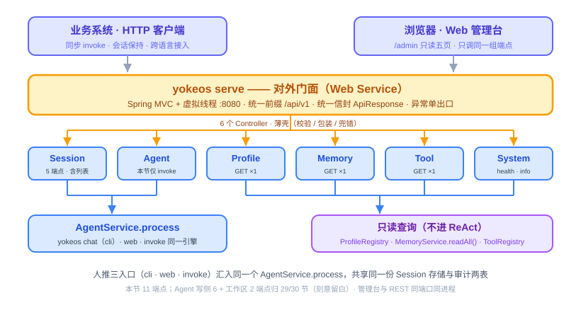
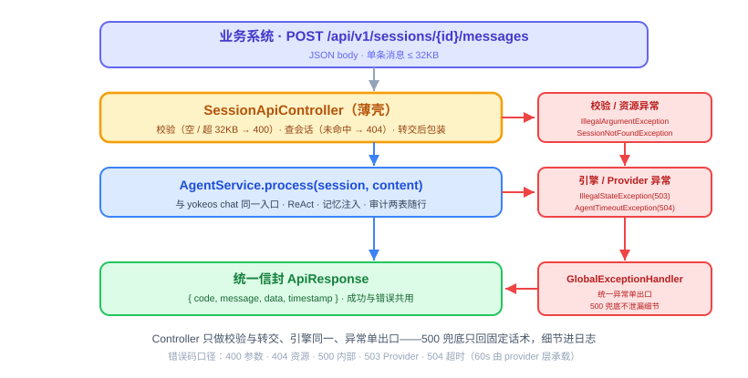
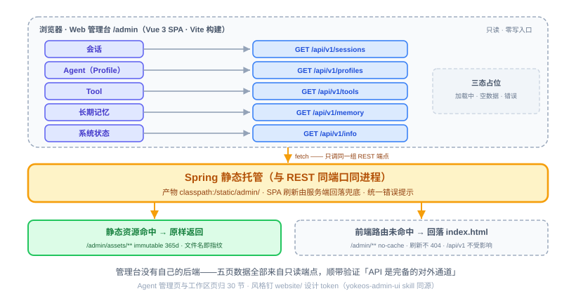

# 第 26 节：Web Service 与管理台第一版——对外门面

> **双定位**：本文档是 YokeOS 节级开发文档——既是**教学文档**（给人看：原理解析、动手前想清楚、代码怎么写），也是 **Spec-Kit 的开发原料**（给 AI 执行）。流水线映射：一、二部分供 `/speckit-specify` 取材；三部分供 `/speckit-plan` 取材，末尾「本节交付物」是 `/speckit-tasks` 的比对锚点；四部分是验收 harness 规格（DoD 对号锚点）；五部分是人工验项。
>
> **语料出处**：[需] `docs/DemandAnalysis.md` · [技] `docs/TechnicalSolution.md` · [宪] CLAUDE.md 宪法 · [指] `docs/AiProgrammingGuide.md` · [参] 参照库课件第 26 节与钉版树测试文件（commit f40a467）。
>
> **拍板记录**（2026-09-21，用户批准）：① **端点范围按参照切法**——本节交付 11 个端点（会话 5 含列表、invoke 1、信息查询 3、系统状态 2），Agent 写侧 6 端点（generate/CRUD）与工作区 2 端点及对应管理页归 29/30 节正题；技 §13 行 26「18 个端点」随本节修订为分节口径（文档链内部冲突，修文档优先，16 节 llm_calls 补列同款先例）。② **`GET /api/v1/sessions` 补为第 19 个端点**（上游赢：参照钉版树有同款「最近 ≤100 条 + `?status=` 过滤」，管理台会话观察页必需）——需求 §5.10、技 §7.2、CLAUDE.md 同步把第一阶段端点数 18→19。③ **管理台风格钉本仓 `website/` 主题 token**（`custom.css` 现成 `--yoke-*` 变量），固化项目内 skill `.claude/skills/yokeos-admin-ui/`，30 节加页复用同源。④ **`/info` 的 Provider 状态取「已配置」口径**——列已加载 Profile 引用到的 provider 名单，不做 live 探活（真调 API 花钱、把外部可用性变成自家状态页的可用性），探活留扩展阶段。⑤ **前序接口三个小扩是本节声明的改造点**：`SessionManager.listRecent/archive` + `SessionSummary` 值对象、`MemoryService.readAll()`（参照 26 节同款先例；`sessions` 表 18 节已埋好 `status`/`archived_at` 列，无表结构变更）。⑥ **管理台部署形态维持「同进程托管」**（2026-09-21 复审确认）：开发态已按契约分离（独立 Vue 工程、只依赖 `/api/v1`，无服务端模板耦合），独立部署只是换托管位置；同包发布保证前后端版本永远配套、单 fat JAR 部署单元是 31 节部署 Demo 的根，分离部署（nginx/CDN）列扩展阶段选项。

技术栈：JDK 21 + Spring Boot 3.5.16 + Spring MVC + virtual thread + springdoc-openapi 2.8.13 + Vue 3 + Vite（经 frontend-maven-plugin 1.15.1 + Node v20.18.0 构建，CLAUDE.md 技术栈表钉版；springdoc 原钉 2.6.0，实施实证与 Boot 3.5 二进制不兼容升 2.8.13，见 CLAUDE.md 陷阱表）。**与参照课件的一处关键差异**：参照第 26 节最大的启动坑是 Spring AI eager 自动装配（`serve` 起不来），本仓第 16 节已用「裸 `spring-ai-openai` 依赖 + 手工构造 ChatModel」化解（宪法 2），**本节无需任何 `autoconfigure.exclude`**——坑预埋期已拆，不重复排雷。

---

## 一、Web Service 是什么，干嘛用的

一句话：**Web Service 是 YokeOS 的对外门面——没有它，YokeOS 只是一个 CLI 工具；有了它，任何能发 HTTP 请求的业务系统都能把 Agent 接进自己的流程。**

到上一节为止，六个核心能力全部就位：会调模型、会思考、有 CLI 入口、能推送、能干活、记得住、有安全边界、还能到点自动跑。但它们只有 CLI 一个对外出口，业务系统没法用。这节把内部能力包装成 REST API，顺带做出第一版管理台。

`yokeos serve` 18 节就已交付（25 节起定时调度随行常驻），它的 javadoc 一直预告「REST 端点第 26 节接线」——就是现在。`serve` 起来后 Spring MVC 监听 8080（虚拟线程 boot 已开），对外暴露本节的 **11 个端点**，统一前缀 `/api/v1`，按资源分 **6 个 Controller**：

| 分组 | 端点 | 归属 |
|------|------|------|
| 会话管理 | `POST /api/v1/sessions`（创建）、`POST /{id}/messages`（发消息，触发 ReAct）、`GET /api/v1/sessions`（**列表，拍板②补位**）、`GET /{id}`（查历史）、`DELETE /{id}`（归档） | **本节** |
| Agent 调用 | `POST /api/v1/agents/{name}/invoke`（无状态调用） | **本节** |
| 信息查询 | `GET /api/v1/profiles`、`GET /api/v1/memory`、`GET /api/v1/tools` | **本节** |
| 系统状态 | `GET /api/v1/health`、`GET /api/v1/info` | **本节** |
| Agent 动态管理 | `generate` / `POST` / `GET` 列表 / `GET` 单个 / `PUT` / `DELETE` | 29/30 节正题，本节刻意留白 |
| 工作区 | `GET /api/v1/workspace/tree`、`GET /api/v1/workspace/file` | 30 节正题，本节刻意留白 |

加上 29/30 的 8 个，第一阶段端点总数 19（拍板②修订后口径）。业务系统最常用的两条路：要连续对话就先创建 Session 再多次发消息；要一次性调用就直接 `invoke`。



**管理台**是这节的第二个交付物：一个跑在 `/admin` 的 Vue 3 单页应用，跟 REST 同端口同进程托管，**没有自己的后端**——只读观察五页（会话、Agent（Profile）、Tool、长期记忆、系统状态）的数据全部来自上面的只读端点。这也顺带验证了「API 是完备的对外通道」这件事本身。

还有一条贯穿的架构线：**人推的三个入口（CLI、Web 会话、invoke）走同一个引擎**。`POST /sessions/{id}/messages` 进来后调的还是 `AgentService.process(session, content)`——跟 `yokeos chat` 完全同一个方法；Web 会话的 channel 固定 `"web"`、invoke 固定 `"invoke"`，三元组拼接仍单点在 `SessionIds`（H4④），两个新入口只提供三元组、不自己拼字符串。

---

## 二、动手前先想清楚几件事

**第一，Controller 必须薄，跟 CLI 是同一个引擎。** Controller 只做三件事：参数校验、响应包装、错误处理。`AgentService.process` 内部已经管了循环、审计、记忆注入——Controller 里再「顺手加点逻辑」就是破坏这条线。这条是可以测的：正常发消息的用例断言 `process` **恰好被调一次**，夹带私货立刻现形。

**第二，异常出口只有一个。** 6 个 Controller 都不自己拼错误响应，所有异常统一交给 `GlobalExceptionHandler`（地基已建，本节扩展）转成 `ApiResponse` 信封。错误码口径一开始定死：400 参数错误、404 资源不存在、500 内部错误、503 Provider 故障、504 Agent 调用超时。**500 兜底绝不把内部异常细节吐给外部**——地基的 `sanitize` 纪律保留，连接串、堆栈这类内幕只进服务端日志。

**第三，核心阶段明确不做的，列出来别手痒。** 认证（假设内网）、SSE 流式响应、WebSocket、RBAC、限流——全部不做（技 §7.5）。定时任务管理与白名单管理端点是 ADR 0008 显式扩展位，不悄悄补。请求大小限制倒是要有：单条消息最大 32KB、Session 历史返回最多最近 100 条、会话列表最多最近 100 条——这三条是防呆不是治理。

**第四，invoke 的「无状态」要落真。** 参照实现用固定三元组 `getOrCreate("invoke", "default", name)`——同一 Agent 的多次 invoke 会**共享历史**，与其自家「无状态调用」的文档口径相悖（钉版树代码实证）。宪法 9「瑕疵不继承」：本仓 invoke 每次调用生成一次性会话（channel=`"invoke"`、user 每次唯一），跑完保留落库（审计可查）但下次不复用——「无状态」= 不携带历史，可测：连续两次 invoke，第二次的对话历史不含第一次的消息。

**第五，管理台的边界：这一版只读。** 能看会话、看 Profile、看 Tool、看记忆、看状态，但不能创建或修改任何东西——Agent 管理页与工作区页是 30 节的正题，**界面上不该出现假按钮**。前端本身跟 `website/` 同栈（Vue 3 + Vite），风格钉死到官网设计 token（拍板③），生成与复用走项目内 skill。

**六个坑——每个坑对应一个回归测试：**

*坑一：SPA 刷新 404。* 管理台是单页应用，`/admin/sessions` 这类前端路由刷新时服务端没有对应静态文件，直接 404。解法：`/admin/**` 未命中真实文件的路径一律回落 `index.html`，且 **`/api/v1/**` 绝不能被回落劫持**（否则打错路径的 API 请求收到 HTML，业务系统解析直接炸）。

*坑二：缓存两档，搞混了表现为「只有某个页签能用」。* 带内容 hash 的 `assets/index-<hash>.js` 可以 immutable 长缓存 365 天（内容变文件名就变）；但 `index.html` 必须 `no-cache`——否则前端重建后浏览器还用旧壳，旧壳指向已删除的旧 bundle，页面时好时坏极难排查。

*坑三：invoke 的 404/503 语义。* Agent 不存在时，若直接丢给 `AgentService.process`，内部会以 `IllegalStateException` 报出→503「服务不可用」——语义错了：资源不存在是 404。解法：invoke 先查 `ProfileRegistry.get(name)`，未命中抛 `ResourceNotFoundException`→404。

*坑四：`@WebMvcTest` 切片 ≠ 真上下文。* 切片只起 MVC 层，服务 Bean 必须 `@MockBean` 提供、Controller 要显式声明——不然要么起不来要么测了个寂寞。真装配验证（JPA 扫描、静态资源、SPA 回落）归 `@Tag("integration")` 冒烟，模式照 boot 集成测试 `@Primary` 覆盖同款先例（24 节坑）。

*坑五：60 秒超时的诚实落法。* 同步模型 + 虚拟线程（宪法 4）下不造硬中断——不引入异步包装去掐 60 秒。落法：`AgentTimeoutException` + 504 映射就位，**真实超时由 provider 层承载**（17 节已收紧 retry/超时，失败传导为 503/500）。参照同款（其 `AgentTimeoutException` 亦无生产抛出点，纯口径占位）。

*坑六：前端构建进 Maven 链的副作用。* frontend-maven-plugin 首次构建要下载 Node v20.18.0（CI/新机首跑慢）；`node_modules` 与构建产物必须进 `.gitignore`；纯 Java 快速构建走 `-Dfrontend.skip=true` 逃生门——但**本节验收必须至少一次不带 skip 的全量构建**，否则管理台产物是空的。

---

## 三、代码怎么写

核心是 6 个 Controller + 1 个异常扩展 + 1 个静态托管配置 + 1 个前端工程 + 1 个风格 skill。先补前置，再分步写。

**第零步（前置）：core 三个小扩（本节声明的改造点，拍板⑤）。** Web 端点要的数据，前序接口差三个小口子：

- **`SessionManager.listRecent(int limit)`**：返回 `List<SessionSummary>`。`SessionSummary` 是 core 新值对象（`sessionId`/`agentName`/`channel`/`userId`/`status`/`lastActiveAt`）——列表是元数据视图，不搬全部消息，所以不塞进 `Session` 领域类。`sessions` 表 18 节就建好了 `status`/`archived_at`/`last_active_at` 列，JPA 实体已有对应字段，这一步只是把它们读出来；`InMemorySessionManager` 同步补齐（测试用）。
- **`SessionManager.archive(String sessionId)`**：归档——status 置 archived、写 `archived_at`，返回 boolean（未命中 false）。`Session` 领域类不动：归档是存储层元数据操作，不进对话状态。
- **`MemoryService.readAll()`**：读长期记忆全文。markdown 档返回 `MEMORY.md` 原文；sqlite 档按 PromptBuilder 注入同口径拼装（核心区全量 + 归档区最近 N）；mem0 档与 `buildContext` 同源。`GET /api/v1/memory` 的数据源。

**第一步：DTO 一组。** `controller/dto/` 下按参照形态放 record，只投影可展示字段：`CreateSessionRequest`（profile + 可选 userId）、`MessageRequest`/`MessageResponse`、`SessionView`（sessionId + profileName + 截断后消息）、`SessionSummaryView`、`ProfileView`（name/description/provider 名/model/tools）、`ToolView`（name/description）、`InfoView`（product/version/providers）。

**第二步：六个 Controller。** 最典型的两个：

```java
@RestController
@RequestMapping("/api/v1/sessions")
public class SessionApiController {
    // POST /sessions：校验 profile 非空（缺→400），channel 固定 "web"，userId 缺省 "default"，
    //   sessionManager.getOrCreate("web", userId, profile) 幂等建会话，返回 {sessionId}
    // POST /{id}/messages：内容空/超 32KB→400；session 不存在→SessionNotFoundException(404)；
    //   agentService.process(session, content) —— 与 yokeos chat 同一入口；返回 {reply}
    // GET /sessions：listRecent(100)，可选 ?status=active 过滤
    // GET /{id}：查历史，最多返回最近 100 条
    // DELETE /{id}：archive 未命中→404
}

@RestController
@RequestMapping("/api/v1/agents")
public class AgentApiController {
    // 本节只挂 POST /{name}/invoke：先查 ProfileRegistry（未命中→ResourceNotFoundException 404，坑三）；
    //   channel "invoke" + 每次唯一 user 生成一次性会话（「无状态」落真）；
    //   process 跑完返回 {reply}。
    // 29/30 节在本 Controller 上加 Agent 定义/管理 CRUD——本节刻意只此一个端点。
}
```

其余四个都直：`ProfileApiController` 列 `ProfileRegistry.all()` 投影；`MemoryApiController` 返回 `memoryService.readAll()` 全文；`ToolApiController` 列 `ToolRegistry.all()` 投影（yokeos-web 因此增补对 yokeos-tool 的依赖——`ToolRegistry` 是含 MCP 动态注册的运行时真相源，参照用 `@Qualifier Map` 快照绕开依赖的做法不采：快照会偏离真相源）；`SystemApiController` 的 `/health` 回 ok、`/info` 回运行信息 + providers 名单（已配置口径，拍板④：取已加载 Profile 引用到的 provider 名去重排序）。



**第三步：扩展 `GlobalExceptionHandler`。** 既有四映射（`IllegalArgumentException`→400、`NoResourceFoundException`→404、`IllegalStateException`→503、兜底 500 不泄漏）保留不动，新增三类：

```java
@ExceptionHandler({SessionNotFoundException.class, ResourceNotFoundException.class})
// → 404：领域资源不存在（会话 / Agent）

@ExceptionHandler(ProviderUnavailableException.class)
// → 503：Provider 故障（与既有 IllegalStateException→503 并列，语义更显式）

@ExceptionHandler(AgentTimeoutException.class)
// → 504：Agent 调用超时（口径占位，真实超时由 provider 层承载，坑五）
```

异常类放 `web/error/` 下，四个都是小类。

**第四步：`WebConfig` 静态托管三件套。** 管理台产物打进 jar 的 `classpath:/static/admin/`，由 Spring 托在 `/admin`：

- `/admin`（无尾斜杠）redirect 到 `/admin/`——让 `index.html` 的 base `/admin/` 资源路径正确解析；
- `/admin/`（入口）forward 到 `index.html`——资源处理器对空路径不走 resolver，必须显式转发；
- `/admin/assets/**` immutable 缓存 365 天（文件名即指纹），`/admin/**` no-cache + 自定义 `PathResourceResolver`：命中真实文件返它，否则回落 `index.html`（坑一：SPA 路由兜底；API 路径不在 `/admin/**` 下，天然不受影响）。

顺带一条 CORS 全开映射（技 §7.4：第一阶段开放所有源方便调试，扩展阶段收敛白名单）。

**第五步：前端工程与构建串联。** 源码 `yokeos-web/src/main/frontend/`（Vue 3 + Vite，`App.vue` 单文件承载五页：左侧导航五项 + 右侧内容区，空数据/加载中/错误三态占位）。`vite.config.js` 两行关键配置：`base: '/admin/'`、`build.outDir` 指向 `../resources/static/admin`。构建串联用 frontend-maven-plugin 1.15.1（Node v20.18.0）绑 `generate-resources` 阶段：`install-node-and-npm` → `npm install` → `npm run build`，一条 `mvn package` 出全量 fat JAR；`-Dfrontend.skip=true` 是逃生门（坑六）。`.gitignore` 补 `node_modules/` 与构建产物。



**第六步：风格 skill `.claude/skills/yokeos-admin-ui/`。** 管理台的视觉与工程规范不散写在提示词里，固化成项目内 skill（拍板③）：token 直取 `website/.vitepress/theme/custom.css` 的 `--yoke-*` 变量——深蓝底 `#0b1220`/`#111b31`/`#16223d`、边框 `#1e2c4a`、文字三档 `#e6eaf2`/`#97a3bc`/`#5c6a85`、品牌蓝 `#4f7cff`（hover `#6b90ff`）仅作强调、琥珀 `#f5a623` 高亮、Inter 正文 + JetBrains Mono 代码/ID/JSON；工程约定（`base:'/admin/'`、产物落 `static/admin`、SPA 回落、只调 `/api/v1`、无认证假设）；组件规范（深色表格、状态小圆点、三态、响应式窄屏收导航）。本节生成管理台、30 节加 Agent 管理页与工作区页，都调这个 skill，产出天然同源。

**有几样先别做。** Agent 写侧 6 端点与 Agent 管理页、工作区 2 端点与工作区页——29/30 节正题，这节刻意留白；认证、SSE、WebSocket、RBAC、限流、live 探活、调度/白名单管理端点（ADR 0008 扩展位）；Profile 的增删改、Memory 写入端点全在扩展清单；管理台独立部署（nginx/CDN 托管前端）——开发态已按契约分离，需要时构建产物直接换托管位置、后端零改动，但同包发布的版本配套与单 fat JAR 部署单元现阶段不动（拍板⑥）。

**本节交付物**（Spec-Kit 拆解锚点）：

- 前置已备（不重做）：`serve` 命令 + boot 虚拟线程 + 8080（18/25 节）、`ApiResponse`/`GlobalExceptionHandler` 地基、springdoc 2.6.0 依赖（工程地基 350c914）
- 代码：`SessionManager.listRecent/archive` + `SessionSummary` → yokeos-core（`InMemorySessionManager` 同步）；`MemoryService.readAll()` → yokeos-core 接口 + yokeos-memory 各档实现；6 个 Controller（Session 5 端点 / Agent 仅 invoke / Profile / Memory / Tool / System）+ DTO 一组 + `web/error/` 四异常类 → yokeos-web；`GlobalExceptionHandler` 扩展；`WebConfig`（/admin 三件套 + 两档缓存 + CORS 全开）；前端工程 `yokeos-web/src/main/frontend/`（Vue 3 + Vite 只读五页）
- 测试：见第四部分（切片单测 + integration 冒烟 + 存储层扩展单测）
- 配置：`yokeos-web/pom.xml` 增补 yokeos-tool 依赖 + frontend-maven-plugin（Node v20.18.0）；`.gitignore` 补前端条目
- 表：**无新表、无表结构变更**（`sessions` 既有 `status`/`archived_at` 列启用读/写）
- 文档同步（拍板①②）：技 §13 行 26 修订为分节口径；需求 §5.10 + 技 §7.2 + CLAUDE.md 端点数 18→19（补 `GET /api/v1/sessions` 行）
- skill：`.claude/skills/yokeos-admin-ui/SKILL.md`

---

## 四、验收 harness：把验收标准变成可执行的测试

**先定分层。** 判断标准——要不要起真上下文：

- **切片单测（`@WebMvcTest`，默认全跑）**：只起 MVC 层，`AgentService`/`SessionManager`/`ProfileRegistry`/`ToolRegistry`/`MemoryService` 全部 mock（坑四：显式声明要测的 Controller）。不花一分钱、秒级。这是主体。
- **存储层单测**：`listRecent`/`archive`/`readAll` 的真实现测试（临时 SQLite / 临时目录，形态照 18 节 `SessionManagerTest`、22 节 memory 测试同款）。
- **integration 冒烟（`@Tag("integration")`，显式触发）**：`@SpringBootTest` 起真上下文——真装配 + 静态资源 + SPA 回落一次验完；不依赖模型（不真调 LLM）。

**测试类清单：**

| 测试类 | 覆盖的验收点 |
|---|---|
| `SessionApiControllerTest`（切片） | 创建缺 profile→400；消息空/超 32KB→400；session 不存在→404；正常发消息 `process` **恰调一次**（Controller 无私货）；历史截断 ≤100；列表 `?status=` 过滤；归档未命中→404 |
| `AgentApiControllerTest`（切片） | Agent 不存在→404（坑三）；消息空→400；正常 invoke `process` 恰一次；两次 invoke 会话不同（无状态落真）；invoke 会话 channel=`"invoke"` |
| `ProfileApiControllerTest`（切片） | `all()` 投影字段对齐；provider 段缺失时 view 里为 null 不炸 |
| `MemoryApiControllerTest`（切片） | 返回 `readAll()` 全文原样 |
| `ToolApiControllerTest`（切片） | 注册表全量列出，name/description 对齐 |
| `SystemApiControllerTest`（切片） | `/health` ok；`/info` providers 去重排序（已配置口径回归，拍板④）；引用 provider 的 Profile 不存在时名单为空不炸 |
| `GlobalExceptionHandlerTest`（扩既有） | 三类新映射到 404/503/504；响应体统一信封；**500 时 body 不含内部异常细节**（不泄漏） |
| `JpaSessionManagerTest`（扩）+ `InMemorySessionManagerTest`（扩） | `listRecent` 上限与排序；`archive` 置 status/archived_at、未命中 false |
| `MemoryServiceImplTest`（扩） | `readAll` markdown 档回 MEMORY.md 原文（含两分区标题） |
| `WebSmokeIntegrationTest`（integration） | 真上下文起得来（JPA/Bean 装配）；`/health` `/info` `/profiles` `/tools` `/sessions` 真实可达；`/admin/` 200 且是 HTML；`/admin/不存在的路由` 回落 index.html（坑一）；`/api/v1/不存在` 返回 404 JSON **不是** HTML（回落不劫持 API，坑一另一半） |

**最值钱的三个测试方法，写出来看**（示意；测试方法名用英文，`@DisplayName` 保留中文语义）：

```java
@Test
@DisplayName("内部异常细节_绝不能出现在500响应里")
void internalErrorDetails_neverLeakIntoResponse() throws Exception {
    when(agentService.process(any(), any()))
        .thenThrow(new IllegalStateException("jdbc:sqlite:.yokeos/yokeos.db connect failed"));

    mockMvc.perform(post("/api/v1/sessions/s-1/messages")
            .contentType(MediaType.APPLICATION_JSON).content("{\"content\":\"hi\"}"))
        .andExpect(status().isServiceUnavailable())          // IllegalStateException→既有 503 映射
        .andExpect(content().string(not(containsString("jdbc:sqlite"))));  // 内幕一个字不漏
}

@Test
@DisplayName("正常发消息_process恰好被调一次")
void sendMessage_delegatesToProcessExactlyOnce() throws Exception {
    when(sessionManager.get("s-1")).thenReturn(Optional.of(session));
    when(agentService.process(any(), eq("今天北京天气怎么样"))).thenReturn("晴");

    mockMvc.perform(post("/api/v1/sessions/s-1/messages")
            .contentType(MediaType.APPLICATION_JSON).content("{\"content\":\"今天北京天气怎么样\"}"))
        .andExpect(status().isOk())
        .andExpect(jsonPath("$.data.reply").value("晴"));

    verify(agentService, times(1)).process(any(), any());    // Controller 没夹带私货的直接证据
}

@Test
@DisplayName("SPA回落只管admin_绝不劫持api路径")
void spaFallback_servesAdminButNeverHijacksApi() throws Exception {
    mockMvc.perform(get("/admin/sessions"))                  // 前端路由
        .andExpect(status().isOk())
        .andExpect(content().contentTypeCompatibleWith(MediaType.TEXT_HTML));  // 回落 index.html
    mockMvc.perform(get("/api/v1/no-such-endpoint"))
        .andExpect(status().isNotFound())
        .andExpect(content().contentTypeCompatibleWith(MediaType.APPLICATION_JSON));  // 404 JSON，不是 HTML
}
```

第一个是「门面的分寸」回归（注意走的是既有 `IllegalStateException`→503 映射——它比兜底 500 更先命中，断言跟着口径走）；第二个钉死「Controller 薄」；第三个把坑一的两个半边都钉死。**每个「想清楚」阶段点过名的坑，都有对应回归测试**：坑一→SPA 回落测试、坑二→冒烟里 `/admin/` 响应头 `Cache-Control: no-cache`（assets 断 immutable 可加）、坑三→invoke 404 用例、坑四→切片/冒烟分层本身、坑五→504 映射用例、坑六→不带 skip 的全量 `mvn verify`（DoD 第 1 项天然覆盖）。

---

## 五、做完怎么验

harness 全绿之后，剩下这几条需要人工确认：

- [ ] 不带 `-Dfrontend.skip=true` 的全量构建至少跑过一次——管理台产物真实进包（坑六）
- [ ] `serve` 起来 curl 全链路走通：建会话 → 发消息（真 key 真模型，审计两表有账）→ 查历史 → 归档；invoke 一次；五个 GET 端点各 curl 一遍
- [ ] CLI 聊过的 Session 从 `GET /api/v1/sessions/{id}` 能查到——两个人推入口共享同一份存储（channel 分别为 `cli`/`web`）
- [ ] 断掉 Provider（改错 key 重启）发消息拿 503——真实故障注入，切片测不了完整链路
- [ ] 管理台五页渲染真实数据、无任何写入口；窄屏抽查响应式；`/swagger-ui.html` 文档齐全、19 端点口径（含归属 29/30 的缺口不出现）
- [ ] `grep -r "sk-"` 凭证卫生：代码与配置无明文 key
- [ ] 并发压一把（如 200 并发 invoke），虚拟线程扛得住、无 `SQLITE_BUSY`（18 节 busy_timeout 在位）

其余验收点——校验/404/信封/不泄漏/恰一次/无状态/SPA 回落——已由第四部分覆盖，`mvn test` 绿即打勾。

可演示成果口径（需求 §11 行 26）：**REST 端点完整可用，管理台只读观察五页上线**。到这一步，六个核心能力全部有了对外出口；接下来的串联课（27/28）把整条链路从头到尾拉通并固化。
