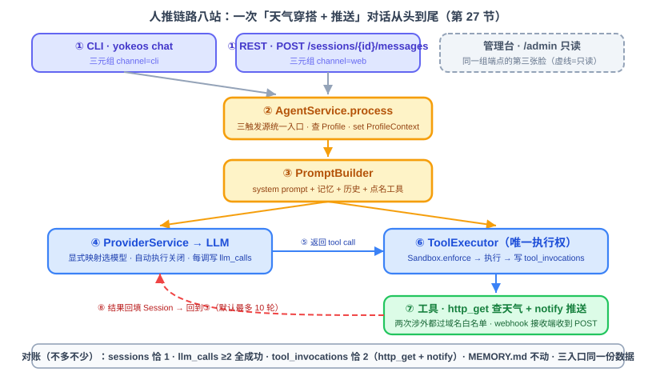

# 第 27 节：全流程串联（一）——打通人推主流程

> **双定位**：本文档是 YokeOS 节级开发文档——既是**教学文档**（给人看：原理解析、动手前想清楚、代码怎么写），也是 **实施的开发原料**（给 AI 执行）。串联课**不开新 spec**：一、二部分是本节「对账」的执行依据；三部分末尾「本节交付物」是实施比对锚点；四部分是验收 harness 规格（DoD 对号锚点）；五部分是人工验项。
>
> **语料出处**：[需] `docs/DemandAnalysis.md` §11 行 27、§9 流程三/四、§13 功能验收 · [技] `docs/TechnicalSolution.md` §12、§9.2 · [宪] CLAUDE.md 宪法 · [指] `docs/AiProgrammingGuide.md` §4~5 · [参] 参照库课件第 27 节与钉版树 commit `00fc9d7`。
>
> **拍板记录**（2026-09-21，用户批准）：① **对账场景纳入 Notify**——按需求 §11 行 27 字面「CLI → ReAct → Tool → Notify」，对账场景 = 天气穿搭 + 推送，`tool_invocations` 恰 2 条（`http_get` + `notify`，本地 HttpServer 扮接收端，19 节 E2E 同款替身）；与参照 27 节只到 `http_get` 的差异显式记录（参照 Notify 归 28 节钟推），顺带成为 31 节 Demo 一「手动补跑」形态预演。② **mock 不进生产默认清单**——生产 `application.yaml` 零改动，挂 mock 走测试属性注入 / 运行时附加配置；`mock` 为 provider 保留名（宪法 3 显式映射新键）。③ **`LiveApiIT` 引入**——黑盒打已运行实例、IT 结尾不进 gate、探活 `assumeTrue` 跳过；31 节日跑 Demo 上线后直接复用为线上黑盒探针。④ **specs 落位**——串联课不开 spec-kit 流程，验收报告落 `specs/012-integration-1/acceptance-report.md`（仅报告，无 spec/plan/tasks），分支 `specs/012-integration-1`。

技术栈：零新增。本节不开新模块、不引入新概念——全部交付物落在既有九模块内（`yokeos-provider` 一个新类 + `yokeos-cli` 工厂接线两行 + `yokeos-boot` 四个测试类）。唯一的新「产品级字面量」是 provider 保留名 `mock`（拍板项②）。

---

## 一、串联课是什么：把零件装成机器

Provider、ReAct、CLI、Notify、Tool、Memory、Sandbox、定时、Web Service——九类零件全部就位，每个模块的测试也都绿了。但「每个模块单测全绿」和「整台机器能转起来」是两码事：**坑几乎从不在模块内部，全在两个模块的接缝处**。这一节和下一节不再开发新功能，只做一件事：把零件装成机器，让它真正跑起来。

本节打通**人推链路**——有人发消息进来的一次完整对话，走 `yokeos chat` 或 REST。定时链路（钟推）、重启恢复、多 Agent 并存归第 28 节。

「真能用」不是凭感觉，给它三个可验证的标准（参照课件同款，口径按需求 §11 行 27 修订为含 Notify）：

1. **答得出来**：一句「今天北京天气怎么样，穿什么合适，给出穿搭建议并推送到群里」穿过八个环节，触发**两次 LLM 调用 + 两次工具调用**（`http_get` 查天气、`notify` 推送），最后回一段像样的穿搭建议；
2. **账记得对**：`sessions` / `llm_calls` / `tool_invocations` 三张表里留下**不多不少、刚好正确**的记录，`MEMORY.md` 一字不动（这次对话不涉记忆）；
3. **三面同源**：同一次对话，从 CLI、REST、管理台网页三个面看，都是同一条会话。

三件同时成立，主流程才算打通。**与参照课件的一处关键差异**：参照第 27 节对账场景只到 `http_get` 查天气（tool_invocations 恰 1 条），Notify 归第 28 节钟推链路；本仓需求 §11 行 27 的可演示成果字面是「CLI → ReAct → Tool → **Notify** 端到端打通」——本节把 notify 纳入人推对账（tool_invocations 恰 2 条），这正好是技 §12.1 Demo 一「手动补跑」形态的预演，31 节两个日跑 Demo 直接受益。

## 二、动手前先想清楚几件事

### 2.1 先对表：九类零件都在位

动手之前核对：前面每节答应对外提供的能力，现在还在不在。这张表是 16~26 节验收清单的浓缩，哪一行打不了勾，先回那一节修好再来——**带着一个坏零件装机器，最后查出来的全是假故障**：

| 模块（节） | 就位标准 | 本仓现状 |
|---|---|---|
| Provider（16） | 显式映射路由正确；自动 tool 执行已关；`llm_calls` 成功失败都写 | ✓ 宪法 2/3，16 节实证 |
| ReAct（17） | 最大轮数兜底；每轮累积回 Session | ✓ |
| CLI（18） | 轻重命令分流；`chat` 能进能出；`SessionIds` 单点拼 id | ✓ |
| Notify（19) | `notify` 能推 webhook；渠道未配置明确报错 | ✓ 19 节 E2E（本地 HttpServer 扮接收端） |
| Tool（20） | 九个内置 Tool 可调；三种来源统一成 `YokeTool` | ✓ |
| Memory（21、22） | 核心记忆始终在场；写入即读到（无缓存） | ✓ |
| Sandbox（23、24） | 三类白名单拦得住；违规写 `tool_invocations`（`success=false`） | ✓ |
| 定时（25） | cron 到点触发；本地锁防重叠 | ✓（本节不动，28 节串联） |
| Web Service（26） | 11 端点全通；异常统一 JSON；管理台 `/admin` 五页 | ✓ |

参照课件第 27 节预埋的五个接缝坑，本仓**四个已在前序节拆雷**（宪法 9「结构照抄，瑕疵不继承」的收益在串联课兑现）：① JPA 扫描 `Found 0`——18 节 `YokeosRuntime` 显式 `@EnableJpaRepositories` + `@EntityScan`，装配完整性测试钉死仓库 Bean 数 > 0；② 工具双调——宪法 2 + `ToolExecutor` 唯一执行路径；③ 会话 id 两入口对不上——`SessionIds` 单点（18 节），26 节 H4 自查 grep 无第二拼接点；④ Bootstrap 缺失静默——`ContextLoader` 缺文件 WARN、读失败抛错；⑤ 审计漏失败那一半——24 节定稿 Sandbox 拒绝走 `success=false` 落账、26 节实证 Provider 故障族 `success=0` 落账。**本节的坑不在参照五坑里，在串联课自己的新形态里**（见 2.5）。

### 2.2 对账：拿一次真实对话，逐表核对「不多不少」

方法朴素但有效：拿一次真实对话从进到出走一遍，每经过一站，核对它有没有在该留痕迹的地方留下**正确的**痕迹。挑「天气穿衣 + 推送」这一句，跑完后逐表核对：

- **`sessions`**：1 条，对话历史完整（用户问的、模型带 tool call 的回复、天气结果、推送结果、最终答复）；
- **`llm_calls`**：2 条（第一轮决定查天气、第二轮组织答复并推送——或第三轮收尾，**按实际轮数记**），session_id 一致、都成功、token 数不为零；
- **`tool_invocations`**：2 条——`http_get`（查天气，成功）+ `notify`（推送，成功），都过 Sandbox；
- **`MEMORY.md`**：没动。变了就是有地方在乱写。

**「该留的留下了」和「不该留的没多出来」一样重要**——工具被调两次、`llm_calls` 冒出三条，与缺记录同罪。对完账换入口重跑：CLI（`yokeos chat --message`）与 REST（`POST /sessions` + 发消息）各一遍，对账结果**完全一样**；再开管理台会话页看到同一条——「两个入口共用同一个引擎」不是口号，是能对出来的账（26 节人工项已实证三 channel 并存，本节把它固化为断言）。

### 2.3 查询接口零缺口：26 节已「上游赢」

参照第 27 节要补 `GET /api/v1/sessions` 列表端点（26 节只做了按 id 查）。本仓 26 节拍板②已把列表补位（第 19 个端点，管理台会话页已接真实数据）——**本节零接口缺口、零前端改动**，教学文档显式记录，不重复交付。

### 2.4 mock provider：让「全链路能不能跑通」进 gate

真 key 对账花钱、要网络、CI 跑不了。为了让这件事**在 gate 里自动判**，加一个独立的 **mock provider**——挂在显式映射表的 `mock` 名下（宪法 3），不连任何模型、不需要 key。它按脚本驱动一次确定性的 ReAct：第一轮请求一次 `save_memory` 工具调用（**真写 `MEMORY.md`**，给全链路一个可观测的文件写入行为），第二轮直接返回终答。**只有「模型」是假的**——ReActLoop / ToolExecutor / Memory / Session / 审计全部走真实路径。

于是 harness 分两层无 key 自测（都进 gate，随 `mvn verify` 自动跑）+ 一层真 key 集成 + 一层黑盒：

- **`MockProviderFlowTest`（手工装配，快）**：直接拼 ReActLoop + mock provider + 真实工具/记忆/会话，一条「记住…」消息 → 断言 ReAct 恰两轮、`save_memory` 恰调一次、`MEMORY.md` 记下事实、会话历史四条（user / assistant / tool / assistant）、审计 `llm_calls`×2 / `tool_invocations`×1；
- **`MockAgentE2ETest`（真启动整台服务）**：`@SpringBootTest` 真起 HTTP 端口 + SQLite，从测试里 `POST /sessions` 建会话、发对话，再把会话 / 记忆 / 工具 / 审计全查回来——跟人手动点一遍完全一样；
- **`HumanTriggerFlowIT`（`@Tag("integration")`，真 key）**：三支柱 + 失败路径 + 三面同源（见第四部分）；
- **`LiveApiIT`（黑盒，不进 gate）**：打一个**已经在跑**的实例，不起服务、探活跳过——31 节 Demo 上线后直接复用为线上黑盒探针（拍板项③）。

### 2.5 本节自己的坑——每个坑对应一个回归测试

**坑一：mock 判轮依赖消息形态。** `MockChatModel` 要区分「第一轮（该发 tool call）」和「第二轮（该收尾）」。参照实现解析 `Prompt.getContents()` 渲染字符串里的 `user:` / `tool:` 行——且必须比**最后一条**是谁（复用会话的历史里早有旧工具结果，只判「有没有 tool 行」会把每条新消息误判成第二轮、永不再调工具）。本仓更稳的判法：`prompt.getInstructions()` 拿 `List<Message>`，直接看**最后一条消息的 MessageType**（USER→第一轮、TOOL→第二轮）——不依赖拼接格式。写前核实本仓 ReActLoop 工具结果回填成什么 Message 类型（H3 读码），两案择稳者。

**坑二：mock 条目过不了启动校验。** 本仓 `ProvidersProperties.validate` 要求 api-key 必须占位形态且环境变量必须存在——`mock` 不需要 key，漏特判则挂 mock 即启动失败。参照同款修法：validate 遇 `"mock"` 名 continue，工厂遇 `"mock"` 名直接 `new MockChatModel()` 不走 OpenAi 构造。

**坑三：真 key 对账零工具可用。** 19 节坑的复现位：对账用的 demo Agent 若 `AGENT.md` 漏写 `tools:` 清单（`http_get`、`notify`），模型零工具只会口头答复「我查不了天气」——单测 mock 链路发现不了。对账 Agent 的 frontmatter 必须点名两工具 + 域名白名单含天气 API 域名（选无 key 免费的 open-meteo）+ `notify.channels` 配本地接收端。

**坑四：对账计数被前序数据污染。** 断言「`llm_calls` 恰 2 条」若查全表，静态库/前序用例的记录会串场（25 节静态库坑同族）。对账断言一律**按 session_id 过滤计数**；新测试库/属性全部 `properties=` 自钉（`yokeos.db.dir`、`yokeos.root`），不留系统属性尾巴（25/26 节坑先例）。

**坑五：mock 测试注入的哑 key 顶掉真 key。** 19 节坑：surefire `environmentVariables` 对全模块生效。mock 测试的 providers 清单若含 deepseek 条目，其 `${DEEPSEEK_API_KEY}` 占位校验需要 env 存在——用 `${env.X}` 透传形态（19 节先例），或者测试清单**只挂 mock 一个 provider**（更干净，推荐）。

**坑六：失败路径的三种造法各不同。** Provider 挂（错 key → 503 + `llm_calls` 落 `success=false`，26 节已实证）、Sandbox 拦（域名不在白名单 → `tool_invocations` 落 `success=false`，24 节已实证）、工具自身异常（notify 渠道未配置/URL 不通 → `success=false`）——三种失败造一次、逐条对账，系统不崩。

## 三、代码怎么写

### 3.1 `MockChatModel`（yokeos-provider 新类）

实现 `ChatModel` 接口，无状态、确定性。判轮看「最近一条消息」（坑一两案）；第一轮从用户消息里取事实构造 `save_memory` 的 `ToolCall`（JSON 转义自己写，不引依赖），第二轮返回固定终答。javadoc 记三件事：宪法 3 挂显式映射、只有模型是假的、判轮为什么看最后一条。

### 3.2 挂载接线（yokeos-cli 两处小改）

- `YokeosRuntime.providerMap()`：构造完清单后 `putIfAbsent("mock", new MockChatModel())` **内置常挂**——mock 不进生产清单、无条件在显式映射表（无 key 全链路自测随时可用；`/info` 列「Profile 引用到的 provider」，无 Agent 用它就不出现）。**实施修正**：本仓 providers 清单是 classpath yaml 原文手工读取（16 节占位策略），不走 Spring 配置绑定——测试属性注入清单条目行不通，故从参照的「清单条目驱动」改为「内置常挂」（`ProviderMapMockWiringTest` 钉死）；
- `ProvidersProperties.validate`：遇 `"mock"` 名 continue（坑二）——显式配置 mock 条目时也免凭证校验，两条路都通。

**生产 `application.yaml` 零改动**（拍板②兑现）：挂 mock 不需要任何配置，用一个 `provider: mock` 的 Agent 即可。

### 3.3 四层 harness（yokeos-boot 测试）

- `MockChatModelTest`（provider 模块单测）：判轮两分支、tool call 参数形态、特殊字符转义；
- `MockProviderFlowTest`：手工装配全链路（17 节 mock 链路单测的升级——那次只断言循环行为，这次断言**逐表对账**，审计走真库按 sessionId 过滤）；
- `MockAgentEndToEndTest`：`@SpringBootTest(RANDOM_PORT)` + `@DynamicPropertySource` 钉 `yokeos.root`/`yokeos.db.dir` 临时目录，`TestRestTemplate` 真发 HTTP 全链（26 节 `WebSmokeIntegrationTest` 同款自钉属性形态；类名 E2E 连续大写被 Checkstyle 拦，参照名 `MockAgentE2ETest` 属「瑕疵不继承」）；
- `HumanTriggerFlowIntegrationTest`：真 key（`@EnabledIfEnvironmentVariable` 缺 key 类级跳过），场景 = 坑三的 demo Agent + 本地 HttpServer 接收 webhook（19 节 `NotifyEndToEndIntegrationTest` 同款替身）；类名 IT 后缀同样被 Checkstyle 拦，tag 排除机制下 `…IntegrationTest` 语义不变；
- `LiveApiProbe`：黑盒打 `http://localhost:8080`（`-Dyokeos.base-url` 可换），`@BeforeEach` 探活 `assumeTrue` 跳过，类名**不带 Test 后缀**——surefire 默认 include 不匹配、不进常规 gate，显式 `-Dtest=LiveApiProbe` 才跑（拍板③；参照 `LiveApiIT` 同语义）。

### 本节交付物（实施比对锚点）

- **代码**：`MockChatModel`（yokeos-provider）；`ProvidersProperties.validate` mock 特判；`YokeosRuntime.providerMap()` 内置常挂 mock；对账 Agent 目录（测试工作区形态，frontmatter 点名 `http_get` + `notify`）。
- **测试**：`MockChatModelTest`（provider 单测）；`ProviderMapMockWiringTest`（cli 单测）；`MockProviderFlowTest`、`MockAgentEndToEndTest`（gate 内无 key）；`HumanTriggerFlowIntegrationTest`（integration 真 key）；`LiveApiProbe`（黑盒不进 gate，拍板③）。
- **配置**：生产 yaml 零改动（mock 常挂不进清单）；测试自钉属性形态落 `@DynamicPropertySource`；教学文档「手动怎么测」记无 key mock 走一遍的命令。
- **表**：无新表、无表结构变更。
- **文档**：README 端点表零变化；本教学文档 + 配图（`class-027-1.svg` 人推八站图）。

## 四、验收 harness

| 测试类 | 层 | 关键回归点 |
|---|---|---|
| `MockChatModelTest` | 单测（gate） | 坑一：判轮两分支；tool call JSON 形态与转义 |
| `ProviderMapMockWiringTest`（cli） | 单测（gate） | 拍板②守点：mock 常挂显式映射表、生产清单零改动 |
| `MockProviderFlowTest` | 装配（gate） | 对账四断言：ReAct 恰两轮、`save_memory` 恰一次、`MEMORY.md` 真写、审计 ×2/×1 不多不少（坑四按 sessionId 过滤真库） |
| `MockAgentEndToEndTest` | E2E（gate） | HTTP 全链：建会话→发消息→查会话/记忆/工具/列表/审计闭环 |
| `HumanTriggerFlowIntegrationTest` | integration（真 key） | 三支柱：①对话答得出（`http_get` ≥1 全成功 + `notify` 恰 1、接收端真收到 POST）②记忆查得到（真模型 `save_memory`）③工具查得到（`GET /tools` 含对账三件）；兜底：失败路径落账（坑六：错 key → `llm_calls` `success=false`）+ 三面同源（cli/web 两入口同引擎同库、列表两态并见） |
| `LiveApiProbe` | 黑盒（不进 gate） | 探活跳过；mock agent 无 key 复跑（随机 userId 每次新会话）；31 节线上探针 |

分层规则：单测 mock 主体；`MockProviderFlowTest`/`MockAgentE2ETest` 无 key 全真链（进 gate）；`HumanTriggerFlowIT` 真 key 显式触发；`LiveApiIT` 只打已运行实例。**实现完成的定义是 `mvn clean verify` 九模块全绿**（含两个新 gate 内测试）。

## 五、做完怎么验（人工项）

- [ ] 真 key 对账：serve 起真服务（25 节坑③ classpath 形态），REST 与 CLI 各发一句「天气穿衣 + 推送」，逐表 sqlite3 对账（`llm_calls`×N、`tool_invocations`×2、`sessions`×1、MEMORY.md 不动）——不多不少；
- [ ] 管理台三面同源：会话页看到这次对话，与 CLI/REST 同一条；
- [ ] 失败三路：错 key / 域名不在白名单 / notify 渠道坏 URL，各造一次，审计表 `success=false` 各落一条，系统不崩；
- [ ] 无 key mock 手动走一遍：测试配置挂 mock + `yokeos chat` 或 curl 发「记住…」，查回会话/记忆/工具/审计（教学文档记命令块）;
- [ ] `grep sk-` 凭证卫生；`mvn clean verify` 全量绿 + `mvn -pl yokeos-boot -am test -Dgroups=integration -DexcludedGroups=` 集成绿。

**可演示成果口径**（需求 §11 行 27）：CLI → ReAct → Tool → Notify 端到端打通——一句「天气穿搭」进、两次 LLM + 两次工具（查天气、推送）出、三张表账目不多不少、三个入口同一份数据。
