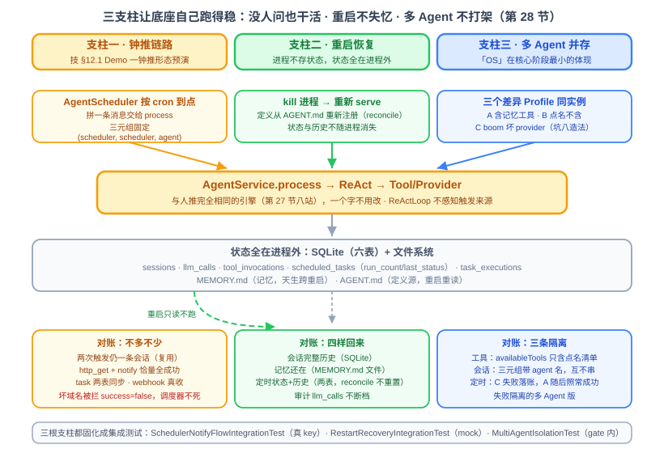

# 第 28 节：全流程串联（二）——让底座自己跑得稳

> **双定位**：本文档是 YokeOS 节级开发文档——既是**教学文档**（给人看：原理解析、动手前想清楚、代码怎么写），也是 **实施的开发原料**（给 AI 执行）。串联课**不开新 spec**：一、二部分是本节「对账」的执行依据；三部分末尾「本节交付物」是实施比对锚点；四部分是验收 harness 规格（DoD 对号锚点）；五部分是人工验项。
>
> **语料出处**：[需] `docs/DemandAnalysis.md` §11 行 28、§5.8、§9 流程三、§13 场景验收 · [技] `docs/TechnicalSolution.md` §12、§8.5、§9.2 · [宪] CLAUDE.md 宪法 · [指] `docs/AiProgrammingGuide.md` §4~5 · [参] 参照库课件第 28 节与钉版树 commit `8f12f11^`（`RestartRecoveryIT` / `SchedulerFlowIT` / `ScheduledTaskE2ETest`）。
>
> **拍板记录**（2026-09-22，用户批准）：① **本节纯「验」不「建」**——参照第 28 节的主体是「把定时从内存版升级成完整子系统（两表 + runNow + 四端点 + 管理台页）+ 验」，本仓第 25 节已提前交付子系统全部建设件（`scheduled_tasks`/`task_executions` 两表、`ScheduledTaskStore` 契约 + JPA 实现、`runNow` 人推补跑、`setEnabled` 启停、并发锁），管理四端点与管理台页被 ADR 0008 显式列扩展规划位——本节**零生产代码改动（预期）**，只补三个形态的验证固化；与参照的这处形态差即「结构照抄、瑕疵不继承」的兑现（参照把建和验挤一节，本仓把建提前拆干净）。② **参照 REST 驱动改直调 `runNow`**——参照 `SchedulerFlowIT`/`ScheduledTaskE2ETest` 用 `POST /api/v1/schedules/{id}/run` 端点驱动，本仓无此端点（ADR 0008），测试直调 `AgentScheduler.runNow(taskId)`（25 节 `SchedulerEndToEndIntegrationTest` 先例），cron 一律远期（每年 1 月 1 日）保证窗口内零自然触发。③ **多 Agent 并存升格为自动化**——参照课件把它列为人工核对项，本仓做成 gate 内 mock 测试（宪法 9「参照已知工程瑕疵补上」：人工项会烂掉，测试不会；需求 §13 功能验收「多 Agent 并存」字面承接）。④ **重启恢复用两代上下文形态**——参照 `RestartRecoveryIT` 同款：`SpringApplicationBuilder` 两代上下文指同一 root/db，mock 驱动无 key；跑两次整机上下文较重，打 `@Tag("integration")` 不进 gate。⑤ **specs 落位**——串联课不开 spec-kit 流程，验收报告落 `specs/013-integration-2/acceptance-report.md`（仅报告，无 spec/plan/tasks），分支 `specs/013-integration-2`。

技术栈：零新增。本节不开新模块、不引入新概念、不改任何生产代码（预期）——全部交付物是三个测试类（`yokeos-boot`）+ 教学配图。若实施中发现必须动生产代码才能成测，走软门禁停下报告。

---

## 一、串联课（二）是什么：没人看着的时候也持续正确

第 27 节把人推主干拉通了：一句话进来，八站走完，账全对得上，三面同源。这一节补另外半边——**没人看着的时候也持续正确**。一句话说清两节的分工：

> **27 节验证的是「有人问、答得对」；28 节要的是「没人问、也照样干活；重启了、也不失忆；多个 Agent、互不打架」——并且这三件事都能一条命令重演。**

这三件事正是 Agent 底座和「一个 Agent Demo」的分水岭：Demo 只要在演示那几分钟里活着就行，底座却要在没人值守时持续正确。而且需求 §11 行 28 给本节的字面成果就是「**端到端链路固化为集成测试，稳定复跑**」——不光要跑得稳，还要把「稳」变成可重复执行的证据。拆成三根能验证的支柱：

- **钟推链路**：cron 声明的任务到点**自己**跑完「查天气 → notify 推送」——这是技 §12.1 Demo 一（每日天气）的钟推形态预演，31 节日跑 Demo 直接受益。可验证终态：钟推 Session 被复用（两次触发仍一条）、`llm_calls`/`tool_invocations` 账目不多不少、webhook 那头真收到、`scheduled_tasks`/`task_executions` 两表同步更新；
- **重启恢复**：`kill` 掉进程再起来，会话、记忆、定时任务（状态 + 历史）、审计记录**全部原样回来**——「进程不存状态，状态全在进程外（SQLite + 文件）」这句架构承诺的实证；
- **多 Agent 并存**：多个差异明显的 Profile 跑在同一实例上，**工具、会话、定时**三条隔离边界都守得住——「OS」在核心阶段最小的体现。

三根支柱同时立住，底座才算「跑得稳」；三根支柱都固化成测试，才叫「稳定复跑」。

**与参照课件的关键形态差（拍板①）**：参照第 28 节是「建成定时任务子系统（建 + 验）」——它的 25 节只做了内存版 cron，两表、`runNow`、四端点、管理台页全在第 28 节补建。本仓第 25 节一步到位交付了全部建设件（含 task_id 修正案），管理面被 ADR 0008 显式推迟到扩展阶段。所以本仓第 28 节没有「建」的负担，纯粹是「验」：把 25 节的建设件与 27 节的人推结论，放到**钟推、重启、多 Agent** 三个更接近真实运行的形态下逐表对账，固化为一键复跑的集成测试。参照的四端点与管理台页不在本节范围——ADR 0008 是刻意保留的形态差，不是遗漏。

## 二、动手前先想清楚几件事

### 2.1 先对表：本节要用的零件都在位

上一节对过九类零件，本节只对三张新表——哪行打不了勾，先回那一节修好再来：

| 依赖（节） | 就位标准 | 本仓现状 |
|---|---|---|
| 定时子系统（25） | 两表落库、`runNow` 补跑、启停、并发锁、失败隔离 | ✓ 25 节实证（含 task_id 修正案） |
| mock provider（27） | `mock` 内置常挂显式映射表，无 key 驱动确定性 ReAct | ✓ 27 节四层 harness 基建 |
| 人推对账（27） | 天气穿搭推送逐表对账、三面同源、失败路径 | ✓ 27 节 IT 5/5 |
| serve 形态（25/26） | classpath 形态手跑真服务、8 并发 invoke | ✓（本节人工项复用） |

### 2.2 钟推对账：人推换了个触发头，账目口径不变

方法还是对账法。钟推链路无非是人推链路换了个「触发头」（`AgentScheduler` 按 cron 到点拼消息，代替人发消息）——中间引擎（`AgentService.process` → ReAct → Tool）一个字不用改，`ReActLoop` 不感知触发来源（技 §8.5）。拿一次真实钟推从进到出走一遍，逐表核对：

- **`sessions`**：channel/user 固定 `scheduler` 的那条会话**被复用**——连续触发两次后仍是一条、历史追加变长，而不是冒出两条（25 节规则：三元组 `(scheduler, scheduler, profileName)` 历次触发天然同 id）；
- **`llm_calls` / `tool_invocations`**：按 sessionId 过滤恰量计数——`http_get`（查天气）+ `notify`（推送）各一条、全成功，LLM 调用按实际轮数记；
- **`scheduled_tasks` / `task_executions`**：`run_count` 随触发自增、`last_status` 同步、执行历史一次一行；
- **webhook 那头**：真收到 POST（本地 HttpServer 扮接收端，19/27 节同款替身）。

**会话复用是本节最值得盯的接缝**——27 节人推每会话一次对话，「复用」无从体现；钟推两次触发才把它推上台面。**失败路径也是钟推课特有**：故意把 webhook 域名配到白名单外，确认 Sandbox 拦下、`tool_invocations` 留一条 `success=false`、而且**调度器本身没被拖死**（好任务的下一个触发照常执行）。

### 2.3 重启恢复：四样回来，一样都不能少

底座的状态全部放在进程外面（SQLite + 文件系统），进程自己不存状态——这句架构承诺，重启一次就能验证。哪一样没回来，就说明有状态偷偷留在了进程内存里（走向分布式前必须掐灭的隐患，「无状态实例」是技术方案定的前提）：

1. **会话回来了**：重启前的完整对话历史一条不少（本就在 SQLite）；
2. **记忆回来了**：新对话里 Agent 还记得核心记忆（`MEMORY.md` 是文件，天生跨重启）；
3. **定时任务回来了**：定义从 AGENT.md 重新注册（reconcile 保留 `enabled` 与 `run_count`，不重置不丢）；状态与历史（`run_count`、上次结果、执行记录）仍在两表；
4. **审计不断档**：重启前后的 `llm_calls` 连续，没丢一段。

### 2.4 多 Agent 并存：三条隔离边界

配多个差异明显的 Profile 跑在同一实例上（一个含记忆工具、一个刻意不含、一个用坏 provider 名），核对三条边界：

- **工具隔离**：Profile B 的对话里，模型拿不到 A 独有的工具——`PromptBuilder` 只带 `Profile.tools` 点名的工具（19 节坑的反向利用：点名不在候选集的工具静默略过）；
- **会话隔离**：各 Agent 的会话互不串——session_id 三元组带 profile 名天然分开；要提防哪处代码用了「默认 Profile」把两边搅一起；
- **定时隔离**：A 的定时任务执行失败（Provider 层炸），B 的下一个触发点照常执行（25 节失败隔离的多 Agent 版）。

### 2.5 稳定性四小项：前序节已拆雷，本节查漏不重做

参照课件 2.4 的打磨清单，本仓逐项核对**全部已有承接**，不重复交付：超时兜底（17 节收紧 retry/超时，挂 19 分钟的坑已拆）、错误信息人话（24 节 Sandbox 拒绝消息、25 节 `error_message` 形态）、日志一条主线（结构化 JSON + sessionId 贯穿）、外部 MCP 挂了不拖垮启动（20 节 connectAll WARN 跳过实证）。本节唯一补的稳定性断言是「**失败不拖垮调度器**」——并入钟推失败路径（2.2）。

### 2.6 为 Demo 备好环境（31 节前置条件清单）

31 节两个日跑 Demo 要用的环境，本节人工项一次配齐、逐项打勾（详见第五部分）：白名单三域名（天气源 `api.open-meteo.com`、通知 webhook 域名、新闻源域名）、通知渠道、记忆偏好预置、定时配置、跨重启确认。**最容易自己绊倒自己的一条：白名单会拦下你自己的 Demo**——24 节 Sandbox 缺省 deny-all，域名不进白名单，31 节 Demo 全是 `tool_invocations` 里的 `success=false`。

### 2.7 本节自己的坑——每个坑对应一个回归测试

**坑一：会话复用断言按全表计数被污染。** 断言「两次触发后 sessions 恰一条」若查全表，静态库/前序用例的会话串场（25/27 节坑同族）。对账断言一律按 sessionId（`scheduler:scheduler:{agent}`）过滤；新测试库/属性全部自钉，不留系统属性尾巴。

**坑二：钟推「失败」的语义分层，两层别搞混。** 工具层失败（Sandbox 拦截、未注册工具、工具自身异常）被 `ToolExecutor` 转**失败结果不上抛**——ReAct 继续、process 正常完成、任务的 `last_status` 仍是 `success`，失败证据在 `tool_invocations` 的 `success=false`；Provider 层失败（如 `ProviderNotFoundException`）才穿透 process、被 `execute` 兜底 catch、`task_executions` 记 `success=false`。断言必须按层对号：钟推失败路径（2.2）断言前者，定时隔离（2.4）断言后者——写反了就是假绿。

**坑三：重启测试的属性注入只对 Spring 占位有效。** `yokeos.root`/`yokeos.db.dir` 是 application.yaml 的 `${...}` 占位，`SpringApplicationBuilder.properties(...)` 注入有效；但 providers 清单是 classpath yaml 原文直读（16 节占位策略，27 节偏差 1 实证属性注入无效）——重启测试**只能靠 mock 内置常挂**起无 key 上下文，不能走参照的 `oryxos.providers[0].name=mock` 属性形态。两代上下文还要压 `web-application-type=none`（serve 形态才起 web，测试只要引擎不要端口）。

**坑四：两代上下文测试绝不 `System.setProperty`。** TestContext 缓存 + `@TempDir` 清理时机（25/26 节坑族：系统属性污染让同 JVM 后跑的上下文拿到悬空路径 `SQLITE_CANTOPEN`）。两代上下文的 root/db 全走 builder properties 自带，测试内不碰系统属性。

**坑五：多 Agent 工具隔离的断言面在 PromptBuilder，不在账目。** 「B 的 frontmatter 没写 save_memory」是配置断言不是行为断言；且账目面也断不出来——本仓 `ToolExecutor` 注入的是**全量注册表**、不按 Profile 过滤（第一阶段语义：隔离边界 = LLM 可见的点名清单，`PromptBuilder.availableTools` 只带 `Profile.tools` 点名的工具），模型若硬调未点名工具，执行面照样找得到。正确断言：`promptBuilder.build(session, profile).availableTools()` 只含 Profile 点名的工具——LLM 可见面即隔离边界。

**坑六：cron 自然触发的非确定性。** 全部用远期 cron（每年 1 月 1 日，25 节 research D6 先例）+ `runNow` 显式驱动，测试窗口内零自然触发、断言确定。真等 cron 到点属人工项（第五部分）。

**坑七：重叠锁不复测。** 「上一次还在跑则跳过」25 节已用跨线程双闩钉死（同线程 tryLock 必成功的坑也拆过）——本节不重复造轮，重叠语义不在本节对账范围。

**坑八：坏 provider 名启动期就被拦（已核实），定时隔离换「校验过、调用必炸」造法。** `AgentLoader.deriveProfile` 启动即校验 provider 名在显式映射表（校验面 = `providerMap.keySet()`，不在表即抛 `IllegalArgumentException`、`deriveQuietly` 整目录跳过）——`provider: ghost` 的 Agent 根本进不了注册表，走不通。替代造法：测试本地 `FailingChatModel`（`implements ChatModel`、`call` 必抛）挂 `@Primary` 覆盖 providerMap，映射名如 `boom`——名字过启动校验、调用期必炸，正好复现「map 里有、调用必炸」的 Provider 层故障形态（ Provider 层失败穿透 process、被 execute 兜底记 `task_executions success=false`）。

**坑九：会话复用下历史累积影响模型行为——连续触发可能不重推。** 钟推复用同一会话意味着第 N 次触发的 prompt 里带着第 N-1 次的完整往来（直到 `max_history_turns` 截断）。测试里连续三次触发间隔仅数秒，真模型看到「几秒前刚查过天气、刚推送过」会判定无需重复动作——任务执行成功、账面齐全，但物理推送停在两次。这不是调度器故障，是复用会话的真实行为。断言口径因此分层：**「调度器不死」锚账面（run_count 自增、执行历史 success、新 llm_calls 落账），物理推送锚前两次**。31 节日跑 Demo 间隔一天、历史被截断稀释，此象弱化——但设计日跑报文时值得知道（报文里写明「无论历史如何，本次都要重新查询并推送」可进一步压此象）。

## 三、代码怎么写

本节全部交付物是 `yokeos-boot` 三个测试类（生产代码零改动，拍板①）。三层各自成篇，互相不依赖执行顺序。

### 3.1 `SchedulerNotifyFlowIntegrationTest`（钟推全链 · 真 key · integration）

27 节 `HumanTriggerFlowIntegrationTest` 的钟推版：demo Agent = 27 节天气穿搭推送 Agent **加 `schedules` 段**（远期 cron + 报文「查北京天气，把穿搭建议推送出去」+ `notify.channels` 指本地 HttpServer），`@Primary` 覆盖 tools Bean 自备白名单（含 open-meteo、127.0.0.1，**不含** evil 域名——失败路径用，24/27 节同款）。`@EnabledIfEnvironmentVariable(DEEPSEEK_API_KEY)` 缺 key 类级跳过。

- **主链**：`runNow(taskId)` 两次 → 断言 sessions 按 id 过滤恰一条且历史随二次触发变长（坑一）、`task_executions` 恰两行成功、`scheduled_tasks` `run_count=2`、`tool_invocations` 两次触发各 `http_get`+`notify` 全成功、**接收端两次都真收到 POST**；
- **失败路径 + 调度器不死**：再配一个坏渠道 Agent（notify 渠道 URL 指 `evil.example.com`）→ `runNow` → 断言其 session 的 `notify` 一条 `success=false`（Sandbox 拦、错误消息含域名）、任务本身 `last_status` 仍 `success`（坑二工具层）——紧接着好任务第三次 `runNow` 照常执行成功（坑九口径：锚账面 run_count/执行历史/新 llm_calls，不锚第三次物理推送）。

### 3.2 `RestartRecoveryIntegrationTest`（重启恢复 · mock 无 key · integration）

参照 `RestartRecoveryIT` 形态迁移（拍板④）：**两代独立上下文指同一 root/db**，`SpringApplicationBuilder(YokeosRuntime.class).properties("yokeos.root=…", "yokeos.db.dir=…", "spring.main.web-application-type=none")`——全部 builder properties，测试内零 `System.setProperty`（坑四）；工作区含一个 `provider: mock` + 远期 schedule 的 Agent（mock 常挂，无需任何 provider 配置——坑三）。

- **第一代**：上下文起来即 `registerAll` 登记；`runNow` 一次（mock 驱动 `save_memory` 真写 `MEMORY.md`）；再经 `AgentService.process` 直发一条人推消息（三入口同引擎的反向利用，同时制造「钟推 + 人推」两种会话）；记下 `llm_calls` 条数——然后 `close()` 模拟停机；
- **第二代**：重开同 root/db 的上下文，**只查不跑**——断言四样（2.3）：`scheduled_tasks` `run_count=1` 且 `last_status=success`（reconcile 不重置）、`task_executions` 历史仍在、两条会话完整历史、`MEMORY.md` 核心记忆区有第一代写入的事实、`llm_calls` 总数与停机前一致（不断档）。

### 3.3 `MultiAgentIsolationTest`（多 Agent 三隔离 · mock · gate 内）

`@SpringBootTest(RANDOM_PORT)` + `@DynamicPropertySource` 自钉 root/db（27 节 `MockAgentEndToEndTest` 同款形态，进 gate 随 verify 自动跑）。工作区三个 Agent + 一个 `@Primary` providerMap 覆盖（mock + boom）：

- **A**（mock + `tools: [save_memory, recall_memory]` + 远期 schedule）：REST invoke「记住…」→ 断言其 session 的 `save_memory` 成功记账；`runNow(A 任务)` → `task_executions` 成功 + 钟推会话有成功的 `save_memory`；
- **B**（mock + `tools: [read_file]`，**不含** save_memory）：**工具隔离断言走 PromptBuilder 面**（坑五）——`build(sessionB, profileB).availableTools()` 不含 save_memory、含自己点名的 read_file；同样消息 invoke 后 B 会话历史只含 B 的消息（与 A 互不串）；
- **C**（`provider: boom` + 远期 schedule，boom = 测试本地 `FailingChatModel`，坑八造法）：`runNow(C 任务)` → `task_executions` 一行 `success=false`（Provider 层，坑二）、`llm_calls` 落该钟推会话的 `success=false`；**紧接着 `runNow(A 任务)` 照常成功**——C 的失败没影响 A（定时隔离）；
- **会话隔离**：A/B 各自 REST 会话 id 不同（`web:default:multi-a` vs `web:default:multi-b`）、按 id 过滤互不串；`GET /sessions` 列表两态并见。

### 3.4 Demo 前置环境清单（文档化，31 节直接用）

落第五部分人工项 + 31 节引用——本节不建环境只列清单打勾。

### 本节交付物（实施比对锚点）

- **代码**：**无**——零生产类、零生产改动（拍板①；若实施中被迫动生产代码，走软门禁停下报告，记验收报告「实施偏差」）。
- **测试**：`SchedulerNotifyFlowIntegrationTest`（真 key，integration）；`RestartRecoveryIntegrationTest`（mock，integration）；`MultiAgentIsolationTest`（mock，gate 内）。
- **配置**：生产 `application.yaml` 零改动；测试自钉属性形态（builder properties / `@DynamicPropertySource`）。
- **表**：无新表、无表结构变更（宪法 7 ✓）。
- **文档**：README 端点表零变化；本教学文档 + 配图（`class-028-1.svg` 三支柱图）。

## 四、验收 harness

| 测试类 | 层 | 关键回归点 |
|---|---|---|
| `SchedulerNotifyFlowIntegrationTest` | integration（真 key） | 钟推全链：两次触发 sessions 恰一条历史追加（坑一）、`task_executions`×2 / `run_count=2`、`http_get`+`notify` 每次全成功、接收端两收；失败路径：坏域名渠道 `notify` `success=false` 且任务仍 `success`（坑二工具层）、好任务随后照常执行（调度器不死，坑九口径：锚账面与新 llm_calls） |
| `RestartRecoveryIntegrationTest` | integration（mock 无 key） | 四样回来（2.3）：两表状态+历史、两条会话、`MEMORY.md`、`llm_calls` 不断档；两代上下文 builder properties 零系统属性（坑三/坑四） |
| `MultiAgentIsolationTest` | E2E（gate，mock） | 工具隔离：`availableTools` 只含 Profile 点名工具（坑五：断言面在 PromptBuilder）；会话隔离：两 id 互不串、列表两态并见；定时隔离：C 坏 provider（boom fixture，坑八）`task_executions` `success=false`（坑二 Provider 层）+ A 照常成功 |

分层规则：`MultiAgentIsolationTest` mock 全真链进 gate；重启/钟推两件 integration 显式触发（后者真 key 缺 key 跳过）。**实现完成的定义是 `mvn clean verify` 九模块全绿**（含 gate 内新增一个）；integration 两件 `mvn -pl yokeos-boot -am test -Dgroups=integration -DexcludedGroups=` 手动跑绿。

## 五、做完怎么验（人工项）

- [ ] 真 cron 自然触发：serve 起真服务（25 节坑③ classpath 形态），demo Agent 的 cron 临时改近点（如 `*/2 * * * *`），等到点**自然**触发一次，逐表 sqlite3 对账（与 `runNow` 等价性的实证）——验完改回远期；
- [ ] 真进程级重启：跑几轮对话 + 攒记忆 + 触发定时一次，`kill` 进程再 `serve`，四样核对（比两代上下文更真的一层）；
- [ ] 多 Agent 目检：`GET /profiles` 多 Agent 并见，管理台 Agent 页同源；
- [ ] Demo 前置环境清单逐项打勾（31 节直接用）：① 天气源 `api.open-meteo.com` 进 http 白名单；② 通知 webhook 域名进白名单 + 渠道配好；③ 新闻源域名进白名单（Demo 二 `http_get` 路线）；④ 记忆偏好预置（「更关注 AI 和芯片」写进 `MEMORY.md`）；⑤ 两个 Demo 的 `schedules` 定好；⑥ 跨重启确认一遍；
- [ ] `grep sk-` 凭证卫生；`mvn clean verify` 全量绿 + 全仓 integration 绿（真 key 在场）。

**可演示成果口径**（需求 §11 行 28）：端到端链路固化为集成测试，稳定复跑——钟推全链（含 notify 与失败隔离）一条命令重演、重启不失忆一条命令重演、多 Agent 三隔离在 gate 内自动判；31 节两个日跑 Demo 的前置环境清单就绪。
