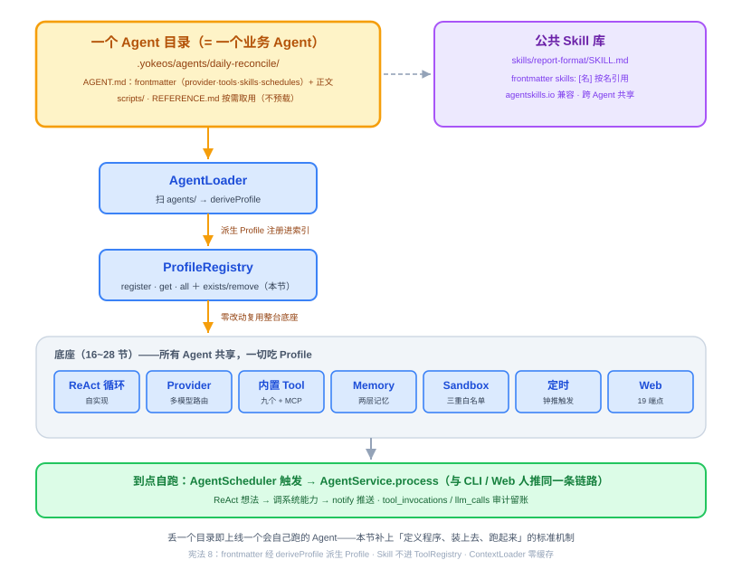
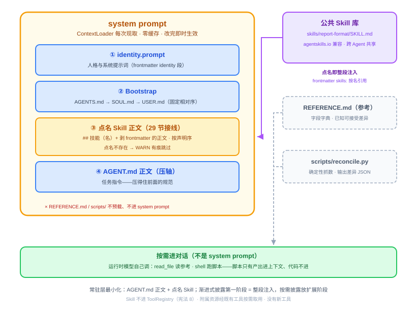
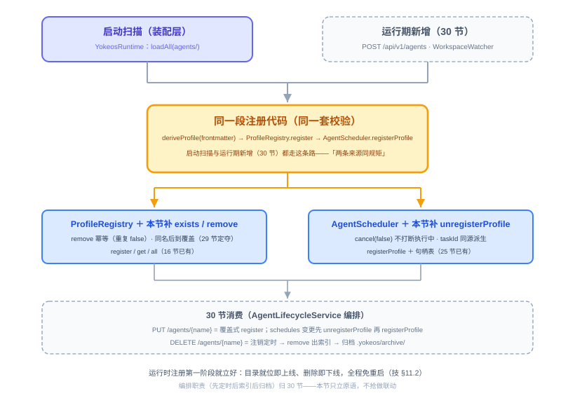

# 第 29 节：插件化 Agent——一个目录定义一个会自己跑的 Agent（代码课）

> **双定位**：本文档是 YokeOS 节级开发文档——既是**教学文档**（给人看：原理解析、动手前想清楚、代码怎么写），也是 **Spec-Kit 的开发原料**（给 AI 执行）。流水线映射：一、二部分供 `/speckit-specify` 取材；三部分供 `/speckit-plan` 取材，末尾「本节交付物」是 `/speckit-tasks` 的比对锚点；四部分是验收 harness 规格（DoD 对号锚点）；五部分是人工验项。
>
> **语料出处**：[需] `docs/DemandAnalysis.md` §5.2、§11 行 29、§13 · [技] `docs/TechnicalSolution.md` §11.1~11.2、§13 行 29 · [宪] 宪法 6/8 · [指] `docs/AiProgrammingGuide.md` §3.3 · [参] 参照库课件第 29 节与钉版树测试文件（`a99f299` / `8f12f11^`）。
>
> **拍板记录**（待用户审阅拍板，2026-09-22 起草）：① Skill 点名不存在 → WARN 有痕跳过不阻断（20 节 tools 点名 WARN 同款先例）② `ProfileRegistry` 同名冲突语义定夺 = 维持「后到覆盖」（16 节 javadoc 留给本节的决议：覆盖是 30 节 PUT 更新的基础，完整策略放扩展阶段）③ `AgentScheduler` 本节只补 `unregisterProfile`，不加 `hasScheduledTask` 公共探针（测试经 mock `ScheduledFuture` verify，参照偏差记实施偏差）④ 参照 `DeriveProfileTest` 不单列——16 节 `AgentLoaderTest` 已覆盖全字段派生与 schedules 携带，harness 映射表对号即可 ⑤ 示例 Agent 目录 `daily-reconcile`（含公共库 Skill 样例）落测试资源 + 人工演示素材，不进生产工作区模板 ⑥ `cancel(false)` 不中断执行中任务（注销语义 = 不再排期，正在跑的跑完落账）。

技术栈：JDK 21 + Spring Boot 3.5.16 + Spring AI 1.1.8 + SQLite。本节**不碰** Spring AI API、不新增第三方依赖、不建新表、不加新端点、不加新配置键——是纯「收口节」：把 16/17/20/25 节已铺好的零件接成「丢一个目录 = 上线一个 Agent」的完整机制。

---

## 一、插件化 Agent 是什么，干嘛用的

一句话：**凭什么叫 OS 的那一节。**

操作系统怎么成立的：一个能跑单个程序的东西不叫 OS，它只是那个程序。OS 的定义是「一套内核之上，能装、能跑任意多个程序，彼此隔离、不改内核、免重编译」——让它成为 OS 的，从来不是内核有多强，而是那套「**定义一个程序、把它装上去、让它跑起来**」的标准机制（可执行文件格式 + 加载器 + 调度）。

到 28 节为止，YokeOS 把**底座**（内核）造齐了、也跑稳了——Provider、ReAct、内置 Tool、Memory、Sandbox、定时、Web。但内核不等于 OS：此刻「跑一个业务 Agent」虽然已经能跑（16 节起就是 AGENT.md 目录形态），却还缺两块拼图——**公共 Skill 库的按名引用注入**（17 节 ContextLoader 留位至今）与**运行时注册**（16 节 ProfileRegistry 只有启动扫描一条路）。补上它们，「定义一个 Agent」才真正退化成**往 `.yokeos/agents/` 丢一个目录**：任意多个、互不干扰、不动底座、到点自己跑。[参 29 开篇]

### 1.1 两层：底座（系统基础能力）+ Agent（一个自足的目录）

| 层 | OS 类比 | YokeOS | 是什么 |
|---|---|---|---|
| **底座** | 内核 + 系统调用 | Provider、ReAct、内置 Tool（`read_file`/`shell`/`http_get`/`notify`/`save_memory`…）、Memory、Sandbox、定时、Web（16~28 节） | **系统基础能力**，所有 Agent 共享 |
| **Agent** | 一个可执行程序（一个目录/包） | 一个 **`.yokeos/agents/<name>/` 目录** | 一个自足的业务 Agent：自带身份/配置、指令、脚本、参考 |

**可验证的终态**：往 `.yokeos/agents/` 丢一个 Agent 目录 → 它出现在 Agent 列表里 → 到它自己声明的时间点，自动跑完「想 → 调系统能力 → 答 → 推送」、审计留账 → 改一下它目录里的指令，下一轮触发即时生效 → 全程不写一行 Java、不动一行底座。



### 1.2 借 Anthropic Agent Skills 的「形态」，但 YokeOS 有一个已定案的差异

这套模型的形态借鉴 Anthropic Agent Skills（目录 + 渐进式披露的开放形态）。参照实现把 skill 收在 **Agent 目录内部**（`agents/<name>/skills/*.md`，正文指引 `read_file` 按需读）。**YokeOS 不走这条**——技术方案 §11.1 拍板：

> **公共 Skill 库**：可复用的能力实体存 `.yokeos/skills/<name>/`（每个子目录一个 SKILL.md，兼容 agentskills.io 开放标准）。Agent 在 `AGENT.md` frontmatter 用 `skills: [名]` **按名引用**，`ContextLoader` 组装 system prompt 时把引用到的 Skill 正文**注入**来强约束产出。

区别用一张表钉死：

| | 参照实现（OryxOS） | YokeOS（技 §11.1 拍板） |
|---|---|---|
| Skill 存放 | Agent 目录内 `skills/*.md` | 公共库 `.yokeos/skills/<名>/SKILL.md` |
| 引用方式 | 正文指引相对路径 | frontmatter `skills: [名]` 按名引用 |
| 进上下文 | 模型 `read_file` 按需读 | **点名即整段注入 system prompt**（第一阶段形态） |
| 复用面 | 每个 Agent 自带、不共享 | **跨 Agent 共享**同一份规范 |

为什么这样拍：企业场景里「组稿规范」「报告格式」这类强约束是**治理资产**，多个 Agent 引用同一份、改一处全体生效——放在每个 Agent 目录里会散落失控。渐进式披露（元数据先注入、正文按需取）放扩展阶段，第一阶段整段注入。宪法 8 原文：「正文与所引用 Skill 的正文 MUST 注入 system prompt。Skill MUST NOT 进 `ToolRegistry`、正文 MUST NOT 预载」——「不预载」指不缓存不预挂载，每次组装 system prompt 时**现取**（技 §11.2 第 3 条：`ContextLoader` 每次现取、不缓存）。

### 1.3 一个 Agent 目录长什么样

全节用一个真实例子贯穿——**每日订单对账 Agent**：每天早上核对交易库与清算库昨天订单的条数和金额是否一致，有差异就按规范生成分级报告推到运维群。它一个目录加一条公共 Skill，把「正文常驻 / Skill 按名注入 / 脚本确定性 / 参考兜底」四样都用上：

```
.yokeos/
├── agents/daily-reconcile/        # 一个目录 = 一个 Agent
│   ├── AGENT.md                   # 主文件：frontmatter（Profile）+ 正文（任务指令）
│   ├── REFERENCE.md               # 可选：参考资料（字段字典/已知可接受差异），拿不准才 read_file
│   └── scripts/                   # 可选：脚本，用到才跑（shell），产出进上下文、代码不进
│       └── reconcile.py           #   连两库导出、逐单比对、输出差异 JSON
└── skills/report-format/          # 公共 Skill 库（技 §11.1 差异点：不在 Agent 目录内）
    └── SKILL.md                   #   对账差异报告规范 + P0/P1/P2 分级
```

`AGENT.md`（frontmatter 各字段 16 节 `AgentLoader` 已全量派生，此处只看本节相关的两处——`skills:` 按名引用、`schedules:` 定时来自 Agent 自己）：

```markdown
---
name: daily-reconcile              # 唯一标识 = 目录名
description: 每天核对交易库与清算库昨日订单的条数与金额；有差异按规范生成分级报告并推送
identity:
  agent_name: 对账小欧
  prompt: 你是一个严谨的对账助手，只根据脚本给出的确定性数据下结论，绝不臆测数字。
provider:
  name: deepseek
  model: deepseek-chat
  temperature: 0.2
tools: [shell, read_file, notify, save_memory]   # 最小权限（20 节）
skills: [report-format]            # ← 本节接线：按名引用公共 Skill 库，正文注入 system prompt
notify:
  channels:
    - name: ops-im
      type: webhook
      config:
        url: ${OPS_WEBHOOK_URL}
schedules:                         # ← 25 节已通：定时来自 Agent 自己（id 必填 + profile 内唯一）
  - id: reconcile-morning
    cron: "0 0 9 * * *"
    zone: Asia/Shanghai
    message: 到点了，核对昨天的订单对账。
---

你是每日订单对账助手。被触发时，严格按顺序做，不要跳步：
1. **拿数据（交给脚本）**：运行 `python3 .yokeos/agents/daily-reconcile/scripts/reconcile.py`
   （工作区根相对路径——shell 的工作目录是工作区根，不是本 Agent 目录），它返回一段 JSON（date、
   orders_count、settle_count、orders_amount、settle_amount、diffs）。只依据它下结论。
2. **判断**：diffs 为空且条数、金额都相等 → 调 notify 发「✅ 对账通过」并结束；否则进第 3 步。
3. **写报告**：系统提示词里已注入 report-format 技能的组稿规范，严格按它的结构和
   P0/P1/P2 分级组织报告；某条差异的字段含义或是否属于已知可接受差异拿不准，
   读 REFERENCE.md 对照后再定级。
4. **推送 + 留痕**：调 notify 推送报告；调 save_memory 记一笔「{date} 差异 {N} 笔，最高 {P?}，已通知」。
```

`skills/report-format/SKILL.md`（agentskills.io 兼容：frontmatter `name`/`description` + 正文规范；正文整段注入）：

```markdown
---
name: report-format
description: 对账差异报告的组稿规范——分级规则与报告结构，约束对账类 Agent 的产出形态
---
# 对账差异报告规范
## 分级规则（取命中的最严重一条作为整份报告级别；定级前先剔除 REFERENCE.md 里的已知可接受差异/测试单号）
- P0（立即处理）：amount_mismatch 金额差合计 > 10000 元，或任一单笔差 > 5000 元——可能资损，立即升级。
- P1（当天处理）：出现 missing_in_settle（交易库有、清算库无）≥ 1 笔——订单没进清算，当天排查。
- P2（观察）：仅 missing_in_orders，或仅单笔 0.01 元尾差——多为跨天入账/尾差，观察即可。
## 报告结构
标题 `【对账 {级别}】{date} 差异 {N} 笔`；总览一行（条数/金额两库对照）；按 kind 分组各列前 10 条
`- {order_id} · {detail}`，超 10 条注明省略；结尾一行处置建议（P0 联系清算值班 / P1 当天排查 / P2 明日复核）。
报告只放结论，不粘脚本代码或原始 JSON。
```

`scripts/reconcile.py` 与 `REFERENCE.md` 全文见参照课件第 29 节 §1.4（纯标准库 CSV 比对、无 key；字段字典 + 已知可接受差异 + 升级联系人），语义照抄——确定性抓数归脚本、判断归模型，二者不混。

### 1.4 一个 Agent 的资源何时进上下文——两档披露

| 资源 | 角色 | 何时进上下文 | 靠哪个底座能力 |
|---|---|---|---|
| `AGENT.md` 正文 | 任务编排 | 触发即**常驻** system prompt | `ContextLoader` 注入（17 节已有） |
| 点名的公共 Skill 正文 | 强约束规范（组稿/格式） | **点名即注入** system prompt（第一阶段整段） | `ContextLoader` 注入（**本节接线**） |
| `REFERENCE.md` | 字典/兜底参考 | 某条差异**定级拿不准**才读 | `read_file`（20 节已有） |
| `scripts/*.py` | 确定性抓数/比对 | 跑它时**只有输出进**、代码不进 | `shell`（20 节已有） |

注意这个表和参照的关键分野：参照的 skill 是「按需 read_file」；YokeOS 的 Skill 是「点名即注入」，**按需层只剩附属资源**（`REFERENCE.md`、`scripts/`）。「渐进式披露」在 YokeOS 第一阶段的准确表述是：**常驻层最小化**（正文 + 点名 Skill），**其余一切按需经既有工具取用，没有新工具、没有能力库、没有全局索引**。



---

## 二、动手前先想清楚几件事

### 2.1 不重写底座，只做「收口」

贯穿始终一条原则：**不重写底座，给已铺好的零件接上最后几根线。** 底座（16~28 节）的一切——`AgentService`、`ReActLoop`、`PromptBuilder`、`AgentScheduler`——都吃 `Profile` 这个值对象，而 `Profile` 从第一天（16 节）就派生自 `AGENT.md` frontmatter。所以本节没有迁移、没有改造面，只有三处收口：

| 零件 | 现状（哪节铺的） | 本节做什么 |
|---|---|---|
| `AgentLoader.loadAll/deriveProfile` | 16 节全量派生；20 节 tools 点名 WARN；25 节 schedules id 校验 | **不动** |
| `ContextLoader` | 17 节：identity → Bootstrap →〔Skill 留位〕→ AGENT.md 正文 | **接线**：留位处注入点名 Skill 正文 |
| `ProfileRegistry` | 16 节：`register`（覆盖）/`get`/`all`，javadoc 明写「运行时 remove 归 29 节」「冲突语义 29 节定夺」 | **补**：`exists`/`remove` + 冲突语义落档 |
| `AgentScheduler` | 25 节：`registerProfile` + 句柄表（javadoc 明写「为 29/30 节注销/更新铺路」） | **补**：`unregisterProfile` |
| 启动扫描装配 | `YokeosRuntime.profileRegistry()`：`loadAll → register` 循环 | **不动** |

### 2.2 派生 Profile = 零改动复用整台底座

为什么走「派生 Profile」而不是另起一套：底座 16~28 节的一切都吃 `Profile`。目录派生成 Profile，就等于让 Agent 目录零改动复用整台底座——运行时它触发一次，跟 CLI / Web 人推走的是同一个 `AgentService.process`，ReAct/Tool/Provider 一个字不用改。**「两条来源同规矩」在 YokeOS 是结构性成立的**：启动扫描（`loadAll`）和未来的运行时新增（30 节 API）都走同一个 `deriveProfile` 同一段校验——16 节起就是一条代码路径，本节 harness 把这个事实钉死成断言。

### 2.3 定时来自 Agent 自己——一行不用改

定时写在 `AGENT.md` frontmatter、派生进 `Profile.schedules`（id 必填 + profile 内唯一，25 节修正案），`AgentScheduler.registerProfile` 照旧逐条 `CronTrigger(cron, zone)` 注册并留句柄。效果：**一个 Agent 目录声明了 `schedules`，系统扫到就到点自动跑**，不用另配任何东西。25 节已交付，本节只补它的反操作。

### 2.4 运行时注册：本节立好，30 节消费

技 §11.2：「运行时注册在第一阶段就立好」——`register`/`remove`/`exists` 与 `registerProfile`/`unregisterProfile` 是**运行时方法而非仅启动期方法**，启动扫描和运行期新增走同一段注册代码。本节把缺的两个方法补齐：

- **`ProfileRegistry.exists(name)` / `remove(name)`**：remove 语义按参照——存在则移除返回 `true`，重复 remove 返回 `false`。
- **同名冲突语义定夺**（16 节 javadoc 遗留决议）：维持「后到覆盖」。理由：30 节 `PUT /agents/{name}` 更新走的就是同一段 `register`，「覆盖」即「更新」的机制基础；完整冲突策略（拒绝/版本化）放扩展阶段，与参照「同名冲突策略先别做」一致。
- **`AgentScheduler.unregisterProfile(profile)`**：按 25 节同款 taskId 派生（`{profileName}:{id}`）找句柄，`cancel(false)` + 移除。`cancel(false)` 不打断正在执行的任务——注销语义 = 不再排期，正在跑的那次让它跑完落账（审计完整性优先）。
- **编排边界要说清**：registry 和 scheduler 是两个独立原语，本节**不做**「remove Agent 时自动注销定时」的联动——那是 30 节 `AgentLifecycleService` 的编排职责（先注销定时、再移出索引、再归档目录）。本节若抢做联动，30 节的编排反而无处落笔。



### 2.5 信任边界：装一个带脚本的 Agent = 信任它的作者

脚本是任意代码，`python3 scripts/foo.py` 一旦放行，它能读写文件、能自己发网络请求——绕过 `http_get` 那道域名白名单（白名单只管内置 `http_get`，管不到子进程的网络）。这条边界 24 节已用三重白名单承载到它能到的极限：解释器进命令白名单（= 授予代码执行权）、`scripts/` 进路径白名单（真实路径校验）；把第三方 Agent 关进受限容器/网络隔离是扩展阶段的事。做 Agent OS 要对这条诚实，本节只在教学上点明，不加新机制（宪法 6：Sandbox 接口先行，第一阶段只到 `WhitelistSandbox`）。

### 2.6 本节自己的坑——每个坑对应一个回归测试

| 坑 | 症状 | 回归测试 |
|---|---|---|
| ① Skill 点名不存在被**静默**略过 | 模型看不到组稿规范、产出跑偏，单测 mock 链路发现不了——19 节「漏写 tools 清单」坑的同家族 | `SkillInjectionTest`：点名不存在 → WARN 有痕跳过、不阻断 Agent 加载 |
| ② SKILL.md 的 frontmatter 没剥 | YAML 头（`name: report-format` 字样）混进 system prompt 污染指令 | `SkillInjectionTest`：断言注入段不含 frontmatter 内容 |
| ③ 未点名的 Skill 被整库注入 | 库里有啥注啥——context 爆炸 + 越权注入（A Agent 拿到 B 的规范） | `SkillInjectionTest`：库里有两条、点名一条，另一条不出现 |
| ④ Skill 注入段序错乱（跑到 AGENT.md 正文之后） | 任务指令压不住技能规范，模型行为漂移 | `SkillInjectionTest`：断言 Bootstrap → Skill → AGENT.md 正文的固定序 |
| ⑤ `unregisterProfile` 的 taskId 派生与注册侧不一致 | 注销找不到句柄、定时变僵尸（Agent 没了任务还在跑） | `AgentSchedulerUnregisterTest`：注册后注销，句柄移除且 `cancel` 被调 |
| ⑥ 注销只移句柄不 cancel | Map 里删了、调度线程还活着 | `AgentSchedulerUnregisterTest`：verify `future.cancel(false)` |

（还有一个结构性守点不单测：**Skill 不进 `ToolRegistry`**——宪法 8。「没有某个东西」无法用单测证明，由 H4 不变量 grep 守：`yokeos-tool` 模块不出现 Skill 概念。）

**有几样先别做**（边界，照技 §11.1/§5.3 + 参照 29 对齐）：Skill 按需加载的渐进式披露（元数据先注入）——扩展阶段；Agent 版本管理、Agent 市场/共享、完整同名冲突策略——扩展阶段；L3 脚本的容器/网络隔离——扩展阶段；文件监听热加载（`WorkspaceWatcher`）——**30 节**；Skill 库 CRUD 端点——不在第一阶段 19 端点清单内，库的填充靠手工放目录；「remove Agent 自动注销定时」的联动——30 节编排。本节做到「一个目录派生成一个会自己跑的 Agent + 运行时注册原语补齐」就够。

---

## 三、代码怎么写

三处小改 + 一份示例资产，全部落在既有类上，没有新模块、没有新配置：

### 3.1 `ContextLoader` 接线：点名 Skill 正文注入（本节核心增量）

17 节留的位（javadoc 原文：「〔引用 Skill 正文：29 节留位〕→ AGENT.md 正文压轴」）在此兑现：

```java
/** 组装 system prompt：identity → Bootstrap → 引用 Skill 正文（本节接线）→ AGENT.md 正文。 */
public String loadSystemPrompt(Profile profile) {
    StringBuilder sb = new StringBuilder();
    sb.append(profile.identity().prompt()).append('\n');
    appendBootstrap(sb, bootstrapSelection(profile));
    appendSkills(sb, profile.skills());          // ← 29 节接线
    sb.append(stripFrontmatter(readAgentMarkdown(profile)));
    return sb.toString();
}

/** 点名的公共 Skill 正文按声明序注入，每段带角色 header；点名不存在 WARN 有痕跳过（拍板①）。 */
private void appendSkills(StringBuilder sb, List<String> referenced) {
    for (String name : referenced) {
        Path skill = workspace.resolve("skills").resolve(name).resolve("SKILL.md");
        if (!Files.isRegularFile(skill)) {
            // 消息编译期常量，Skill 名进异常消息（CRLF 门禁——与 tools 点名 WARN 同款形态）
            LOG.warn("Agent 点名的 Skill 在公共库不存在（跳过注入，名字见异常消息）",
                new IllegalArgumentException("skill=" + name));
            continue;
        }
        try {
            sb.append("## 技能（").append(name).append("）\n")
              .append(stripFrontmatter(Files.readString(skill))).append('\n');
        } catch (IOException e) {
            throw new UncheckedIOException("读 SKILL.md 失败: " + skill, e);
        }
    }
}
```

六个设计点，每个都有出处：

- **按声明序**：frontmatter `skills: [a, b]` 的顺序就是注入顺序（与 Bootstrap 固定相对序同哲学——顺序也是规范的一部分）。
- **每段带角色 header**（`## 技能（report-format）`）：Bootstrap 三件同款形态——模型能分清「这是注入的规范」不是 Agent 自己写的话。
- **`stripFrontmatter` 复用 17 节既有方法**：SKILL.md 的 agentskills.io frontmatter（`name`/`description`）剥掉只注正文（坑②）。
- **点名不存在 WARN 跳过**（拍板①）：Skill 是增强不是必需，坏点名不拖垮 Agent 加载；但必须有痕——19 节「静默略过」坑的正解就是「静默变有痕」，20 节 tools 点名 WARN 同款。
- **零缓存、每次现取**：与 AGENT.md 正文同款——改 SKILL.md 下一次触发即生效，公共库改一处全体引用 Agent 生效（这是把 Skill 放公共库的治理价值兑现）。
- **`Profile.skills()` 16 节就派生好了**（`strList(fm.get("skills"))`），本节只是第一个消费者。

### 3.2 `ProfileRegistry` 补运行时方法

```java
/** 是否已注册。 */
public boolean exists(String name) {
    return profiles.containsKey(name);
}

/** 移除（存在返回 true，重复 remove 返回 false）——30 节 DELETE 消费。 */
public boolean remove(String name) {
    return profiles.remove(name) != null;
}
```

javadoc 同步落两笔：① 16 节遗留的「冲突处置语义 29 节定夺」定夺为**维持后到覆盖**（30 节 PUT 更新的机制基础，完整策略扩展阶段——拍板②）；② `register`/`remove`/`exists` 是运行时方法，与启动扫描同一段代码同一套校验（技 §11.2）。`ConcurrentHashMap` 16 节就位，并发语义天然。

### 3.3 `AgentScheduler.unregisterProfile`（25 节句柄表的消费面）

```java
/** 注销该 Agent 的全部定时：cancel(false) 不打断执行中任务 + 移除句柄（拍板⑥）。编排（先定时后索引）归 30 节。 */
public void unregisterProfile(Profile profile) {
    for (Profile.ScheduleConfig sc : profile.schedules()) {
        String taskId = taskId(profile.name(), sc.id());   // 必须与注册侧同一个派生函数（坑⑤）
        ScheduledFuture<?> future = scheduledTasks.remove(taskId);
        if (future != null) {
            future.cancel(false);
        }
    }
}
```

taskId 派生**必须**复用 25 节注册侧的同一个私有方法（`{profileName}:{id}`）——抽出来共用，严禁抄一份（坑⑤：两处派生不一致，注销找不到句柄、定时变僵尸）。store 侧（`scheduled_tasks` 表行状态）本节不动：定义源是 frontmatter，表只存状态，30 节 DELETE 编排时统一处理。

### 3.4 示例 Agent 目录 `daily-reconcile`（贯穿示例落地）

§1.3 的四文件 + 公共库一条 SKILL.md，作为：a) 测试 fixture（`AgentScanRegisterTest`/`SkillInjectionTest`/`ProgressiveDisclosureTest` 复用真目录形态，与 `@TempDir` 内联写盘互补）；b) 人工演示素材（放进真实工作区即演示「丢目录 = 上线」）。落测试资源（拍板⑤），不进生产模板——`yokeos init` 的目录清单（18 节已含 `skills/`）不变。文件全文以参照课件第 29 节 §1.3~1.4 为语义源：`reconcile.py`（纯标准库 CSV 比对、环境变量指向两库导出、输出差异 JSON）、`REFERENCE.md`（字段对照 + 已知可接受差异 + 升级联系人）、`SKILL.md`（§1.3 已给全文）。

**本节交付物**（Spec-Kit 拆解锚点）：

- **代码**（改 3 个既有类，无新类、无新模块）：`ContextLoader.appendSkills`（点名 Skill 正文注入）→ yokeos-core；`ProfileRegistry.exists/remove` + 冲突语义 javadoc → yokeos-core；`AgentScheduler.unregisterProfile`（taskId 派生抽共用）→ yokeos-core
- **测试**（5 个新类，见第四部分）：`SkillInjectionTest`、`ProgressiveDisclosureTest` → core/context；`AgentScanRegisterTest`、`ProfileRegistryRuntimeTest` → core/profile；`AgentSchedulerUnregisterTest` → core/agent
- **文件**（工作区示例资产）：`daily-reconcile/`（AGENT.md + REFERENCE.md + scripts/reconcile.py）+ `report-format/SKILL.md` → 测试资源，兼人工演示素材
- **配置/表**：**无**新配置键、**无**新表、**无**新端点（29 节是收口节——`skills:` frontmatter 字段与 `.yokeos/skills/` 目录 16/18 节已就位）

---

## 四、验收 harness：把验收标准变成可执行的测试

本节机制是「扫描 → 派生 Profile → 注册 → 注入 → 到点自己跑 + 运行时原语」，harness 把每环钉死，尤其钉死**「目录派生的 Agent 与启动扫描走同一套代码」**和**「Skill 只经 ContextLoader 进上下文」**两条结构事实。

**分层规则**：全部单测——`TaskScheduler`/`ScheduledFuture` mock、目录用 `@TempDir` 现造，秒级跑完，不花一分钱。本节**不新增** `@Tag("integration")` 冒烟：真模型链路的钟推验证由 28 节存量 `SchedulerNotifyFlowIntegrationTest` 承载，真目录演示归第五部分人工项。实现完成的定义是 `mvn clean verify` 九模块全绿。

**测试类清单**（参照六类 → 本仓五新类一存量，类名经 P3C 校正、语义按本项目公共库形态重写）：

| 测试类（本仓） | 覆盖的验收点 | 参照映射 |
|---|---|---|
| `SkillInjectionTest`（core/context，新） | 点名 Skill 正文注入带 header；**未点名不注入**（坑③）；点名不存在 WARN 有痕跳过（坑①）；frontmatter 剥离（坑②）；段序 Bootstrap → Skill → AGENT.md 正文（坑④）；改 SKILL.md 即时生效 | `ProgressiveDisclosureTest` 的 Skill 侧（语义重写：公共库按名注入，非目录内 read_file） |
| `ProgressiveDisclosureTest`（core/context，新） | AGENT.md 正文进 system prompt；`scripts/`、`REFERENCE.md` 内容**不预载**（断言密文不出现）；改正文即时生效 | 参照同名（附属资源部分同语义） |
| `AgentScanRegisterTest`（core/profile，新） | 扫 N 个目录得 N 个 Agent、不多不少；带 `schedules` 的 Profile 携带定时并交 `AgentScheduler.registerProfile`（verify）；坏目录有声跳过不阻断 | 参照同名 |
| `ProfileRegistryRuntimeTest`（core/profile，新） | register 后 get/exists 立即可见；remove 后不可见、**重复 remove 返回 false**；同名 register 覆盖（29 节定夺）；运行时与启动同一段校验（同一异常类型 + 同一消息——都走 `deriveProfile`） | 参照同名 |
| `AgentSchedulerUnregisterTest`（core/agent，新） | unregisterProfile 后句柄移除且 `future.cancel(false)` 被调（坑⑤⑥）；无 schedules 空跑不报错 | 参照 `AgentSchedulerRegisterTest` 注销用例（注册侧 25 节 `AgentSchedulerTest` 已钉 11 用例，不重做） |
| `AgentLoaderTest`（16 节存量） | frontmatter 全字段派生、schedules 原样携带（id 校验 25 节）——本节无改动，回归即对号 | 参照 `DeriveProfileTest` + `AgentLoaderTest`（拍板④：不重复建类） |

**最值钱的三个测试方法，写出来看**（示意；方法名英文 camelCase、无连续大写，`@DisplayName` 保留中文语义）：

```java
@Test
@DisplayName("点名skill注入_未点名不注入_不存在的有痕跳过")
void referencedSkillInjectedOthersSkipped() throws IOException {
    writeSkill("report-format", "REPORT_FORMAT_BODY");     // 公共库两条
    writeSkill("digest-format", "DIGEST_FORMAT_BODY");
    writeAgent("reconcile", "skills: [report-format]", "正文指令");   // 只点名一条

    String prompt = loader.loadSystemPrompt(profileOf("reconcile"));

    assertTrue(prompt.contains("## 技能（report-format）"), "点名段带 header 注入");
    assertTrue(prompt.contains("REPORT_FORMAT_BODY"), "点名正文注入");
    assertFalse(prompt.contains("DIGEST_FORMAT_BODY"), "未点名不注入（坑③：越权+爆炸）");
    assertFalse(prompt.contains("name: report-format"), "frontmatter 剥离（坑②）");
    assertTrue(prompt.indexOf("REPORT_FORMAT_BODY") < prompt.indexOf("正文指令"), "Skill 在正文之前（坑④）");
}

@Test
@DisplayName("注销定时_句柄移除且cancel被调_不中断执行中")
void unregisterCancelsHandleWithoutInterrupt() {
    ScheduledFuture<?> future = mock(ScheduledFuture.class);
    doReturn(future).when(taskScheduler).schedule(any(Runnable.class), any(Trigger.class));
    Profile p = profileWithSchedule("ops", new ScheduleConfig("morning", CRON, ZONE, "到点"));
    scheduler.registerProfile(p);

    scheduler.unregisterProfile(p);

    verify(future).cancel(false);   // 坑⑥：只移句柄不 cancel = 僵尸定时；false = 不打断执行中（拍板⑥）
}

@Test
@DisplayName("registry运行时_remove后不可见_重复remove返回false_同名覆盖")
void removeIsIdempotentFalseAndRegisterOverwrites() {
    assertFalse(registry.exists("ops"));
    registry.register(profile("ops"));
    assertTrue(registry.remove("ops"));
    assertFalse(registry.exists("ops"), "注销后不可见");
    assertFalse(registry.remove("ops"), "重复 remove 返回 false");
    registry.register(profile("ops-v1"));
    registry.register(profile("ops-v2"));
    assertEquals("ops-v2", reg.get("ops").orElseThrow().description(), "同名后到覆盖（29 节定夺）");
}
```

第一个是本节核心守点——三个坑（②③④）一条用例钉死；第二个钉注销语义；第三个钉运行时原语的幂等与覆盖定夺。坑①（WARN 有痕）断言形态与 20 节 tools WARN 同款：日志断言或行为断言（跳过 + 其余注入照常），按 20 节 `unknownToolNameWarnsWithoutBlocking` 先例。

---

## 五、做完怎么验

harness 全绿之后，人工项当场跑完（可演示成果口径 = 需求 §11 行 29：**「放一个 Agent 目录即得到一个可用的业务 Agent」**）：

- [ ] **丢目录即上线**：把示例 `daily-reconcile/` 与 `report-format/` 分别放进真实工作区 `.yokeos/agents/`、`.yokeos/skills/` → `yokeos profile list` 出现该 Agent，全程没写一行 Java
- [ ] **Skill 注入真模型证据**：`yokeos chat --profile daily-reconcile` 手动触发（给 `RECON_ORDERS_CSV`/`RECON_SETTLE_CSV` 指向两份小 CSV），回复**按 report-format 的分级与结构组织**——证明注入的规范真被模型吃进去了（19 节教训：锚「模型真用了」而非只锚答复）
- [ ] **脚本产出进、代码不进**：上一步对话里模型引用 `reconcile.py` 的 JSON 数字下结论；`tool_invocations` 有 shell 调用记录
- [ ] **正文即时生效**：改 `AGENT.md` 正文一句话，不重启再触发，行为随新正文
- [ ] **定时来自 Agent**（可选强证据）：给示例 Agent 临时配一条每分钟 cron，真跑一次钟推（webhook 收到 + `task_executions` 有账）；或直接复跑 28 节 `SchedulerNotifyFlowIntegrationTest` 说明定时链路未回退
- [ ] `grep -r "sk-"` 凭证卫生抽查（示例含 `${OPS_WEBHOOK_URL}` 占位，不得出现明文）
- [ ] `mvn clean verify` 九模块全绿（不回退）

其余验收点——Skill 注入五守点、渐进式披露、扫描注册、运行时原语、注销语义——已由第四部分单测覆盖，`mvn test` 绿就等于打勾。

到这里，「在底座上定义一个会自己跑的 Agent」机制完全成立——只是入口还停在「登录服务器往目录里放文件」。下一节（30）把最后一块拼上：`POST /api/v1/agents` 七端点 + 一句话生成 + `WorkspaceWatcher` 实时监听，让业务系统/运营在页面上说一句话就造出一个会自己跑的 Agent——本节补齐的 `remove`/`unregisterProfile` 正是那里 DELETE/PUT 的地基。
