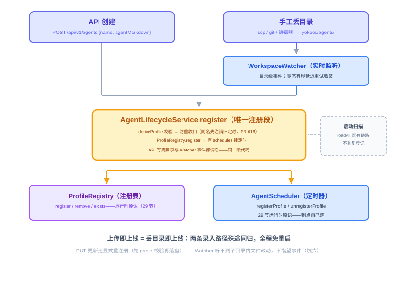
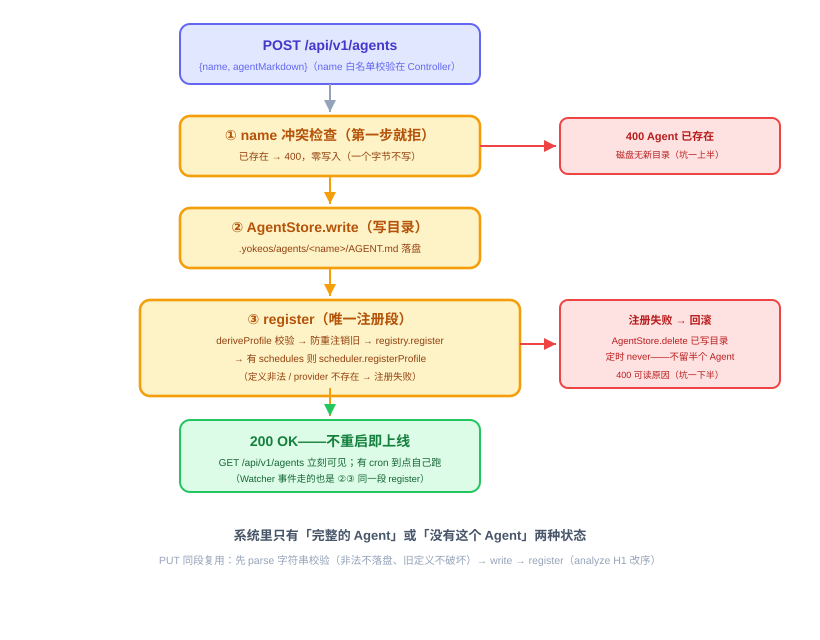

# 第 30 节：动态管理——一句话生成、上传即上线

> **双定位**：本文档是 YokeOS 节级开发文档——既是**教学文档**（给人看：原理解析、动手前想清楚、代码怎么写），也是 **Spec-Kit 的开发原料**（给 AI 执行）。流水线映射：一、二部分供 `/speckit-specify` 取材；三部分供 `/speckit-plan` 取材，末尾「本节交付物」是 `/speckit-tasks` 的比对锚点；四部分是验收 harness 规格（DoD 对号锚点）；五部分是人工验项。
>
> **语料出处**：[需] `docs/DemandAnalysis.md` §5.3 / §5.10 / §11 行 30 · [技] `docs/TechnicalSolution.md` §3.3 / §7.2 / §7.4 / §11.3~11.4 / §13 行 30 · [宪] CLAUDE.md 宪法 4/7/8 · [指] `docs/AiProgrammingGuide.md` · [参] 参照库课件第 30 节（`第30节：动态管理 Agent 一句话生成、上传即上线.md`）与钉版树第 30 节交付（commit 963d4f1：`AgentLifecycleService`/`WorkspaceWatcher`/`AgentStore`/`WorkspaceApiController` + 三测试类）。
>
> **拍板记录**（2026-09-22 起草，**待用户批准**）：
> ① **口径取参照课件原始设计**（课件一~四部分）：`generate` 一句话产草稿**预览不落盘**、`create` 写 Agent 目录、workspace**只读**。课件第五部分「实现回写」的四块演化增补——脚手架式 create（name+description 模板）、per-agent 专属记忆、管理台固定会话、文件可编辑（`POST /workspace/file`）、`generate-files`/`saveFiles`——**不采**：YokeOS 技术方案 §7.2 十九端点表与 §11.3 均按原始设计拍板，上述能力不在第一阶段需求清单（文档链内部张力，修文档优先——本例是「参照演化不追」：参照是其窗口内的自由迭代，本仓以自有技术方案为锚）。参照演化的价值在本节教学文档记为对照素材，不落码。
> ② **create 与 PUT 都收 `AGENT.md` 全文**（请求体 `{name, agentMarkdown}` / `{agentMarkdown}`）：generate 出草稿 → 人改 → 提交全文落盘，三步闭环里 create 收全文最顺；结构化字段表单形态不做（与 generate 能力重复）；**带附属资源（scripts/ 等）的复杂 Agent 走手工丢目录路径**（参照课件原始设计同款边界：JSON create 只写 `AGENT.md`）。
> ③ **WorkspaceWatcher 落 `yokeos-core` 的 agent 包**（参照同位），Bean 装配在 `YokeosRuntime`（yokeos-cli）；**启动全量扫描仍走 `AgentLoader.loadAll` 既有链路**，Watcher 只管启动之后的实时变更（参照同款——避免与启动扫描重复登记，尤其重复排定时）；监听线程用 Spring 管理的单线程执行器——基础设施守护线程，与 25 节调度池同类，不把异步引进请求链路（宪法 4 例外口径由 25 节确立）。
> ④ **generate 走既有 `ProviderService.chat`**（只协议转换，宪法 2），sessionId 固定前缀 `agent-generation`（仅审计关联用，不进 Session、不经三元组拼接，与 H4② 不冲突）；落 `llm_calls` 审计。配置键技 §3.3 已钉死：`yokeos.agent-generation.provider`（指向已注册 provider name）+ 可选 `yokeos.agent-generation.model`（缺省用该 provider 默认模型）。走 Spring Environment 绑定（非密钥、不含 `${ENV}` 占位，不踩 22/27 节 SnakeYAML 直读坑）；**缺失不阻断启动、调用时明确报错**（`IllegalStateException`→503，消息含配置方法提示），不静默回退任何 provider。
> ⑤ **校验异常复用 `IllegalArgumentException`**（29 节 `AgentLoader.deriveProfile` 既有形态）→ 既有 400 映射，不新造异常类型；LLM 产出非法定义 → generate 内剥 Markdown 代码围栏后用既有解析校验，非法抛 400 可读原因。
> ⑥ **归档目录 `.yokeos/archive/` 归档动作按需创建**（`mkdirs`）；`yokeos init` 模板不加此目录（幂等不覆盖原则不动，CLAUDE.md 工作区结构表维持现状）。
> ⑦ **管理台两页复用项目内 skill `.claude/skills/yokeos-admin-ui/`**（26 节拍板③兑现）：Agent 管理页（一句话新建 → 预览可改 → 创建 → 列表/查看/编辑/删除）+ 工作区页（只读文件浏览器）。
> ⑧ **GET `/api/v1/agents/{name}` 的视图含 `agentMarkdown` 全文**——管理台编辑页的回填数据源（拍板②闭环所需）。

技术栈：JDK 21 + Spring Boot 3.5.16 + Spring MVC + virtual thread + springdoc-openapi 2.8.13 + JDK `java.nio.file.WatchService` + Vue 3 + Vite（frontend-maven-plugin，26 节钉版）。**与参照的两处关键差异**：① 参照第 30 节最终形态走了「脚手架 + generate-files」演化路线，本仓按拍板①取原始设计；② 参照 `agentStore.writeAll` 支持多文件落盘（服务于其文件编辑演化），本仓 `AgentStore.write` 只写单份 `AGENT.md`（拍板②边界）。

---

## 一、动态管理是什么，干嘛用的

一句话：**动态管理把「定义一个 Agent」的最后一段路铺平——说一句话、调一次 API、或直接丢一个目录，Agent 就上线，全程免重启。**

到 29 节为止，「一个目录 = 一个 Agent」的机制已经立住：`AgentLoader.deriveProfile` 派生、`ProfileRegistry.register/remove` 运行时注册、`AgentScheduler.registerProfile/unregisterProfile` 定时挂载——运行时原语全在，29 节验收报告原话「30 节（动态管理七端点 + 一句话生成 + WorkspaceWatcher）的地基齐备」。但入口还停在两处残缺：业务系统够不着（只有 CLI 与 26 节的只读端点），管理台只能看不能管（26 节刻意留白，Agent 管理页与工作区页归本节）。本节补上最后一块：**改目录即改运行时**。

需求 §5.3 给了三条等价入口，本节全部落地：

1. **REST API**：`POST /api/v1/agents/generate` 一句话生成定义草稿（**原样返回预览、不落盘、不注册**），人过一眼、可改（尤其定时时刻、工具权限这类敏感项），确认后走 `POST /api/v1/agents` 落盘注册；列表、查看、更新、删除同组端点；
2. **直接丢目录**：scp / git / 编辑器直接往 `.yokeos/agents/` 写一个 Agent 目录，`WorkspaceWatcher` 实时监测到后校验加载，即插即用；
3. **Web 管理台**：Agent 管理页走同一组 API 覆盖「一句话新建 → 预览可改 → 创建 → 编辑 → 删除」闭环；工作区页只读浏览目录树与文件。

三个可验证的终态（本节的完成画像）：

1. **建 / 传 Agent 即上线**：`POST /api/v1/agents` 返回 200 后**不重启**，Agent 立刻出现在 `GET /api/v1/agents` 列表里、有 cron 就到点自己跑；
2. **丢目录也即上线**：serve 运行中往 `.yokeos/agents/` 拷一个目录（不走 API），几秒内列表里出现——两条录入路径殊途同归；
3. **一句话生成**：说一句「每天早上九点查北京天气，把穿搭建议发到团队群」，拿回一份可解析的 `AGENT.md` 草稿预览，改完一键创建。

本节 8 个新端点 + 26 节已有的 invoke，第一阶段 19 端点全部收口（技 §7.2）：

| 分组 | 端点 | 归属 |
|------|------|------|
| Agent 动态管理 | `POST /api/v1/agents/generate`（一句话草稿，不落盘不注册）、`POST /api/v1/agents`（创建）、`GET /api/v1/agents`（列表）、`GET /{name}`（单个）、`PUT /{name}`（更新）、`DELETE /{name}`（删除） | **本节** |
| Agent 调用 | `POST /api/v1/agents/{name}/invoke` | 26 节已有，不动 |
| 工作区 | `GET /api/v1/workspace/tree`（目录树）、`GET /api/v1/workspace/file?path=`（只读读文件） | **本节** |



贯穿的架构线只有一条：**`.yokeos/agents/` 是唯一真相源**。API 创建的本质是「校验 + 把 `AGENT.md` 写进目录 + 注册」，手工丢目录的本质是「目录已在 + 监听拾取 + 注册」——两条路最后调的是**同一个** `AgentLifecycleService.register(agentDir)`。这就是 29 节「API 建的和文件建的行为一模一样」的兑现，也是「上传即上线 = 丢目录即上线」的技术保证。

---

## 二、动手前先想清楚几件事

**第一，一个目录、两条录入路径、一段注册代码。** 运行期新增 Agent 的入口有两个（API create、Watcher 事件），但注册代码只有一段：`AgentLifecycleService.register(agentDir)` 内部三步——`agentLoader.deriveProfile(agentDir)`（解析 + 校验，与启动扫描同一套）→ `profileRegistry.register(profile)` → 有 `schedules` 则 `agentScheduler.registerProfile(profile)`。启动全量扫描仍走 `AgentLoader.loadAll` 既有链路（29 节 `AgentScanRegisterTest` 已固化「扫描注册与既有链路同源」）——它消费的是同一组 29 节运行时原语，语义同源、入口不重复，Watcher 不做启动扫描的第二个副本（避免重复登记，尤其重复排定时）。

**第二，Watcher 是「改目录即改运行时」的执行者，但它有平台语义限制，别许诺它做不到的事。** JDK `WatchService` 监听的是**注册目录的直接子项**（`.yokeos/agents/` 的一级子目录名）。由此推论三件事：① 新丢一个目录（scp/git clone/编辑器创建）触发 `ENTRY_CREATE`——拾取注册，没问题；② 删一个目录触发 `ENTRY_DELETE`——注销，没问题；③ **改子目录内部的 `AGENT.md` 文件，不保证触发事件**（子目录内文件变更在部分平台只体现为子目录 mtime 变化，事件时序不可靠）——所以「更新」不走 Watcher：PUT 端点显式调 `AgentLifecycleService.update` 覆写 + 重注册，Watcher 只兜「目录级新增/删除」。这是参照实现回写阶段用真金白银换来的结论（其原话「macOS WatchService 不监听子目录内文件的改动，必须显式重注册」），本节一开始就把边界划对。另有一个竞态要认清：`cp -r` 拷目录时 `ENTRY_CREATE` 先到、`AGENT.md` 可能还没落盘——首次 register 失败记 WARN 跳过，后续文件写完会让子目录 mtime 变化再触发一次事件、二次注册收敛。**单测直调 `handleChange` 不依赖真实事件时序**（参照同款），收敛路径归集成测试按轮询断言。

**第三，删除与更新的时序，提前定死。** 删 Agent 的顺序是「**注销定时 → 移出索引 → 归档目录**」，一步不能反：先移索引后停定时，中间窗口 cron 一触发就对着已注销的 Profile 空转——这种时序 bug 人工验收几乎撞不上，只有 `InOrder` 断言能稳定钉住（参照钉版树标注的「最值钱测试」）。归档不物理删：`整个 Agent 目录` 移入 `.yokeos/archive/`——它干过的事都在审计表里，定义也应可追溯（宪法 7 审计精神的延伸）。更新则先注销旧定时句柄再注册新的，不然旧 cron 跟新 cron 一起跑。

**第四，create 失败要回滚，不留半个 Agent。** create 的步骤是「name 冲突检查（第一步就拒，一个字节都不写）→ 写目录 → 注册」——注册失败（定义非法、provider 不存在等）时把已写的目录删回去再抛错。系统里永远只有「完整的 Agent」或「没有这个 Agent」两种状态。

**第五，一句话生成必须人在环里，配置缺失必须诚实报错。** generate 是一次普通 LLM 调用：把用户那句话 + AGENT.md 格式约束交给模型，产出草稿**原样返回**——不落盘、不注册、不解析成 Profile。必须留预览这一步的理由：LLM 生成的 cron 可能把时间理解错、`tools` 可能给多了权限，得人过一眼。三个配套口径（技 §3.3 钉死）：① 生成用的 Provider/Model 走独立配置键 `yokeos.agent-generation.provider` + `.model`，与具体 Agent 的 Provider 配置是两回事；② 未配置时**不静默回退**到任何 provider，调用时抛 `IllegalStateException`→503、消息含配置方法；③ 该键缺失不阻断进程启动（生成是运行时功能不是启动依赖）。生成动作本身照落 `llm_calls` 审计（sessionId 前缀 `agent-generation`，宪法 7）。

**第六，工作区浏览只读，防目录穿越是唯一安全要点。** `GET /api/v1/workspace/file?path=` 把任意路径交给服务端读，**必须**做边界校验：resolve 后 `normalize()`，再断言 `startsWith(workspaceRoot)`，越界 400——`../../etc/passwd`、绝对路径、符号链接变形全被这一道拦住。tree 与 file 都限定在 `.yokeos/` 内（agents/ 与 archive/ 两支）。本节不做在线编辑（写操作走 Agent 管理页的 create/PUT 表单，语义更清楚）。

**第七，Watcher 守护线程与宪法 4 的关系说清楚。** WatchService 的 `take()` 是阻塞循环，必须住在自己的线程里。这是**基础设施守护线程**——与 25 节 `ThreadPoolTaskScheduler` 调度线程同类（宪法 4 的既有例外口径），不是把异步编程模型引进请求链路：请求线程（虚拟线程）全程同步，Watcher 线程只消费文件系统事件。线程由 Spring 管理的执行器提供，不手工 `new Thread`。

**第八，核心阶段明确不做的，列出来别手痒。** 认证鉴权（谁能建 Agent / 读文件——内网假设，扩展阶段随 API Key + RBAC 补）；文件浏览器在线编辑（本版只读）；带脚本的复杂 Agent 走 multipart/zip 上传（本版 JSON create 只写 `AGENT.md`，带附属资源的走手工丢目录）；Agent 启用/停用状态位；创建时 dry-run 试跑；Agent 版本历史；一句话生成的多轮追问细化；草稿审批流、跨实例同步（需求 §5.3「第一阶段不做」）。参照课件第五部分的四块演化（拍板①）同样不做。

**九个坑——每个坑对应一个回归测试：**

*坑一：create 中途失败留半个 Agent。* 写目录成功、注册失败（如 provider 不存在），目录留在 `.yokeos/agents/` 里但注册表没有——下次 Watcher 事件或重启扫描还会撞上它。解法：注册失败回滚已写目录。回归：异常注入 + `verify(agentStore).delete(any())` + `verify(agentScheduler, never()).registerProfile(any())`。

*坑二：删除时序颠倒。* 先移索引后停定时，窗口期 cron 触发对着已删 Profile 空转。回归：`InOrder` 三连断言（注销定时 → 移索引 → 归档），顺序错直接红。

*坑三：update 改了 schedules 但旧定时句柄没注销。* 旧 cron 跟新 cron 一起跑，同一 Agent 一天推两次。回归：旧 Profile 有 schedules、新也有（不同 cron），断言 `unregisterProfile(old)` 先于 `registerProfile(updated)`。

*坑四：目录穿越。* `file?path=../../etc/passwd` 直穿文件系统。回归：normalize + startsWith 校验，越界路径断言 400（`../` 变形、绝对路径两形态都测）。

*坑五：generate 的三种失败形态错误码混用。* ① 参数问题（句子为空）→400；② 生成配置缺失 →503（消息含配置方法，不静默回退）；③ LLM 产出非合法 AGENT.md →400 可读原因。三者语义不同，混用会把「配错了」报成「参数错」。另：模型偶尔用 ``` 围栏包住输出，不剥就 parse 失败、误报「非法」——剥围栏后再校验。回归：三形态各一用例 + 围栏剥离用例 + **不落盘不注册断言**（generate 后 registry 空、目录无新文件）。

*坑六：WatchService 的子目录语义与拷贝竞态。* 改子目录内文件不保证触发事件（更新走 PUT 显式重注册，不指望 Watcher）；`cp -r` 竞态首注册失败 WARN 跳过、后续事件收敛。回归：`handleChange` 直调三用例（CREATE→register、DELETE→注销、坏目录不拖垮监听不抛），不走真实事件时序。

*坑七：切片测试形态（26 节坑四同款回归）。** `@WebMvcTest` 无主类库模块起不来，测试包放裸 `@SpringBootConfiguration + @EnableAutoConfiguration` 引导类 + `@Import` 显式登记（26 节 `WebSliceTestBoot` 形态）；新 Controller 的依赖（`AgentLifecycleService`）全部 `@MockBean`。另：Mockito 对 primitive 参数一律 `anyBoolean()/anyLong()`（25 节坑——`any()` 返 null 拆箱 NPE 且污染后续用例）。

*坑八：前端构建进包（26 节坑六同款回归）。* 管理台两页新增后，验收必须至少一次**不带 `-Dfrontend.skip=true`** 的全量构建；`node_modules` 与构建产物不进 git。

*坑九：Watcher 的 InterruptedException 与退出语义。* 关闭时 `take()` 抛 `InterruptedException`——必须恢复中断位（`Thread.currentThread().interrupt()`）并退出循环；监听目录不可用（`key.reset()` false）安静退出。回归：坏目录只 WARN 不抛（监听器活着）已由坑六覆盖，中断语义走代码 review 项 + 集成测试进程正常退出。

---

## 三、代码怎么写

核心是一个编排者 + 一个监听器 + 一个目录管家 + 两个 Controller + 两页前端。前序依赖已核齐（29 节交付物全部在位）：`AgentLoader.deriveProfile(agentDir)`（校验失败抛 `IllegalArgumentException`，拍板⑤）、`ProfileRegistry.register/remove/exists`、`AgentScheduler.registerProfile/unregisterProfile`。

**第零步（前置确认，零改动）：** `GlobalExceptionHandler` 既有映射已覆盖本节全部错误码需求（`IllegalArgumentException`→400、`ResourceNotFoundException`→404、`IllegalStateException`→503、Provider 族→503）——本节**零扩展**。`AgentApiController` 26 节已建（含 invoke），本节在其上加 5 个方法。

**第一步：`AgentStore`（core/agent，目录管家）。** 三个文件操作，全部限定在 `.yokeos/` 内：

```java
// write：把 AGENT.md 写进 .yokeos/agents/<name>/AGENT.md（目录不存在则建，已存在则覆写），返回 agentDir
//   —— create 与 update 共用（update 覆写同一份文件）
// delete(agentDir)：物理删除目录——只给 create 回滚用（刚写的目录删回去）
// archive(name)：.yokeos/agents/<name>/ 整目录移入 .yokeos/archive/<name>/
//   （archive/ 按需 mkdirs，拍板⑥；归档位已有同名目录则加时间戳后缀，不覆盖历史归档）
```

**第二步：`AgentLifecycleService`（core/agent，编排者）。** 本节唯一的新逻辑中枢，方法六个：

```java
// register(Path agentDir)：唯一注册段——deriveProfile（解析+校验，与启动同一套）
//   → profileRegistry.register → 有 schedules 则 agentScheduler.registerProfile。
//   API create 写完目录后调它、WorkspaceWatcher 收到 CREATE/MODIFY 事件也调它（坑六边界内）。
// create(name, agentMarkdown)：
//   profileRegistry.exists(name) → 抛 IllegalArgumentException（"Agent 已存在"，第一步就拒，一个字节不写）
//   → agentStore.write(name, agentMarkdown)
//   → try { register(agentDir) } catch (RuntimeException e) { agentStore.delete(agentDir); throw e; }  // 坑一回滚
// update(name, agentMarkdown)：
//   registry.get(name) 未命中 → ResourceNotFoundException（web 层 404）
//   → agentStore.write 覆写 → deriveProfile 校验（非法 400，坏定义不落盘）
//   → agentScheduler.unregisterProfile(old)（无条件先注销，坑三）
//   → profileRegistry.register(updated) → 有 schedules 则 registerProfile(updated)
// delete(name)：
//   未命中 → 404；agentScheduler.unregisterProfile → profileRegistry.remove → agentStore.archive(name)  // 坑二时序
// unregisterByDir(agentDir)：Watcher 收到 ENTRY_DELETE 用——目录已没了，只注销 + 移索引、不归档
// generate(sentence)：
//   句子空白 → IllegalArgumentException（400）
//   → agentGenerationProvider 配置为空 → IllegalStateException（503，消息含 "yokeos.agent-generation.provider" 配置方法）
//   → 构造一次性内部 Profile（provider=agent-generation.provider、model=agent-generation.model）
//   → providerService.chat("agent-generation-" + 时间戳/序号, profile, ProviderRequest.of(AUTHOR_PROMPT + sentence))
//   → 剥 ``` 围栏（stripCodeFences，坑五）→ agentLoader 既有解析校验（非法 → IllegalArgumentException 400 可读原因）
//   → 返回草稿 String——不落盘、不注册（get/list 直通 registry，不赘）
```

`AUTHOR_PROMPT`（生成用系统提示词）要点：约束模型只输出一份完整 AGENT.md（frontmatter 必含 name/description/identity/provider/tools/settings，有定时需求加 schedules，`provider.name` 用指定 provider 名），不加解释、不加代码围栏。生成侧不做 name 预填（草稿里的 name 由人在预览时改定，create 请求体的 name 才是权威）。



**第三步：`WorkspaceWatcher`（core/agent，监听器）。** 参照钉版树同款骨架：

```java
// start()：装配层 @Bean(initMethod="start") 调用——agents/ 不存在则建目录，
//   newWatchService + register(ENTRY_CREATE, ENTRY_MODIFY, ENTRY_DELETE)，
//   把监听循环交给 Spring 管理的单线程执行器（基础设施守护线程，宪法 4 例外口径，拍板③）
// loop()：while(true) { key = watchService.take();   // 阻塞等事件
//   for (event : key.pollEvents()) 若 context 是 Path → handleChange(agentsDir.resolve(child), event.kind());
//   if (!key.reset()) return; }                      // 监听目录不可用，安静退出（坑九）
//   InterruptedException → 恢复中断位并 return
// handleChange(agentDir, kind)：包级可见供单测直调（不走真实时序，坑六）
//   ENTRY_DELETE → lifecycle.unregisterByDir(agentDir)
//   否则且 Files.isDirectory(agentDir) → lifecycle.register(agentDir)   // CREATE/MODIFY
//   RuntimeException → LOG.warn(常量消息, new IllegalArgumentException(目录名进异常)) 跳过——单个坏目录不拖垮监听（CRLF 门禁形态：常量 + 动态值进异常堆栈）
```

**第四步：装配与配置。** `YokeosRuntime`（yokeos-cli）加三个 Bean：`AgentStore`、`AgentLifecycleService`（注入既有 `AgentLoader`/`ProfileRegistry`/`AgentScheduler`/`ProviderService` + 生成配置两键）、`WorkspaceWatcher`（`initMethod="start"`，`destroyMethod` 关停执行器）。执行器形态：单线程 executor，Bean 生命周期随上下文关停。配置进 `application.yaml`：

```yaml
yokeos:
  agent-generation:
    provider: deepseek     # 已注册 provider name（技 §3.3；缺失不阻断启动、调用时 503）
    model: deepseek-chat   # 可选；缺省用该 provider 默认模型
```

**第五步：`AgentApiController` 扩 5 端点 + DTO。** Controller 仍薄（26 节纪律：参数校验、响应包装、错误处理三件事，编排全在 lifecycle）：

```java
@PostMapping("/generate")   // {sentence} → 200 {data: {agentMarkdown}}；400 空句/非法产出；503 配置缺失/Provider 故障
@PostMapping               // {name, agentMarkdown} → lifecycle.create → 200 AgentView；400 已存在/非法
@GetMapping                // lifecycle.list → 200 [AgentView]
@GetMapping("/{name}")     // lifecycle.get 未命中 404 → 200 AgentView（含 agentMarkdown 全文，拍板⑧）
@PutMapping("/{name}")     // {agentMarkdown} → lifecycle.update → 200 AgentView；404 不存在；400 非法
@DeleteMapping("/{name}")  // lifecycle.delete → 200；404 不存在
```

`AgentView`（record）：`name`/`description`/`provider`/`model`/`tools`/`hasSchedules` + `agentMarkdown` 全文。请求体 DTO：`GenerateRequest(sentence)`、`CreateAgentRequest(name, agentMarkdown)`、`UpdateAgentRequest(agentMarkdown)`。

**第六步：`WorkspaceApiController`（第 7 个 Controller，只读）。**

```java
@GetMapping("/tree")        // .yokeos/agents/ 与 .yokeos/archive/ 两支目录树 → [FileNode]
//   FileNode(name, path, type: dir|file, children)——agents/ 每个 Agent 目录可展开列其内文件
@GetMapping("/file")        // ?path=agents/<name>/AGENT.md → 文本内容；
//   解析为 workspaceRoot.resolve(path).normalize()，不 startsWith(workspaceRoot) → 400（坑四）
//   文件不存在 → 404；读失败（二进制等）→ 400 可读原因
```

两 Controller 都加 `@SuppressFBWarnings` 类级注解（29 节连锁口径：持有 `ProfileRegistry` 等共享单例的 `EI_EXPOSE_REP2` 豁免 + justification）。

**第七步：管理台两页（前端，`yokeos-admin-ui` skill 生成）。** 复用 26 节工程（`yokeos-web/src/main/frontend`，App.vue pages 数组追加两项）：

```text
新增「Agent 管理」页：
- 表格列 GET /api/v1/agents（name/description/provider/model/hasSchedules），每行 查看 / 编辑 / 删除（删前二次确认）；
- 「一句话新建」：输入框 → POST /agents/generate 拿草稿 → textarea 可编辑预览（重点提示改 cron / tools
  敏感项）+ name 输入框 → 确认后 POST /agents {name, agentMarkdown} 创建；
- 编辑页：GET /{name} 回填 agentMarkdown 全文 → 改 → PUT /{name}；
- 错误显示 ApiResponse.message（含 503 配置缺失的配置方法提示）。
新增「工作区」页（只读文件浏览器）：
- 左侧目录树 GET /workspace/tree（agents/ 可展开、archive/）；
- 点文件 → GET /workspace/file 右侧只读展示；
- 本节不做在线编辑（拍板①）。
```

**本节交付物**（Spec-Kit 拆解锚点）：

- **代码**：`AgentLifecycleService`（register/create/update/delete/unregisterByDir/generate）、`WorkspaceWatcher`、`AgentStore`（core/agent 三新类）；`AgentApiController` 扩 5 端点 + `AgentView` 与三个请求 DTO；`WorkspaceApiController` + `FileNode`；`YokeosRuntime` 装配三 Bean + 单线程执行器；前端 Agent 管理页 + 工作区页。
- **测试（harness）**：`AgentStoreTest`、`AgentLifecycleServiceTest`、`WorkspaceWatcherTest`（core/agent 三新）、`WorkspaceApiControllerTest`（web 新）、`AgentApiControllerTest` 扩展（web 存量）、`AgentLifecycleIntegrationTest`（boot，`@Tag("integration")`）。
- **配置**：`yokeos.agent-generation.provider` / `yokeos.agent-generation.model`（application.yaml，缺失不阻断启动）。
- **端点/目录**：8 新端点（19 端点收口）；`.yokeos/archive/`（归档按需建，init 不动）。零新表（generate 落既有 `llm_calls`）。

---

## 四、怎么验收：把编排、时序与失败路径固化成 harness

复杂度全在**编排顺序**和**失败回滚**，恰好是单测主场——`agentStore`/`profileRegistry`/`agentScheduler`/`agentLoader`/`providerService` 全 mock，`InOrder` 钉顺序、异常注入钉回滚。分层照 26 节：

- **core 单测**（默认全跑）：`AgentStore` 用 `@TempDir` 真文件操作；`AgentLifecycleService` 全 mock 协作者；`WorkspaceWatcher` 直调 `handleChange` 不起真监听（坑六）。
- **web 切片单测**（`@WebMvcTest`，默认全跑）：`WebSliceTestBoot` 引导类 + `@Import` + `@MockBean AgentLifecycleService`（坑七）。
- **integration 冒烟**（`@Tag("integration")`，显式触发）：真上下文免重启闭环 + 真丢目录拾取 + generate 真模型（assumeTrue 真 key，缺 key 跳过不失败）。

| 测试类 | 覆盖的验收点 |
|---|---|
| `AgentLifecycleServiceTest`（core，新） | create 按序（写→派生→注册→有 schedules 注册定时）；**name 冲突第一步拒、零写入**（坑一上半）；**注册失败回滚已写目录、定时 never**（坑一下半）；**create 与 watcher 走同一段 register**；delete 按「注销定时→移索引→归档」InOrder（坑二）；update schedules 变更先 unregister 后 register（坑三）；generate 正常链（chat 被调、草稿返回）；**generate 不落盘不注册**（坑五）；**围栏剥离**（带 ``` 输出剥后可解析）；**LLM 产出非法 → 400 可读原因**（坑五）；**生成配置缺失 → IllegalStateException**（坑五）；update 不存在 → 404 异常形态；unregisterByDir 不归档 |
| `WorkspaceWatcherTest`（core，新） | handleChange CREATE 目录 → register 被调（免重启语义）；DELETE → unregisterByDir；**坏目录抛异常不外溢、监听不倒**（坑六/坑九） |
| `AgentStoreTest`（core，新） | write 建/覆写目录与 AGENT.md；archive 移动 + 按需建 archive/ + 重名不覆盖（时间戳后缀）；delete 物理删 |
| `AgentApiControllerTest`（web，存量扩展） | 既有 invoke 用例零回退；5 新端点薄转发（lifecycle 恰调一次）；400（已存在/非法/空句）、404（get/put/delete 不存在）、503（配置缺失透传）错误码对号；AgentView 字段投影 |
| `WorkspaceApiControllerTest`（web，新） | tree 返回 agents/archive 结构、Agent 目录可展开；**`file?path=../../etc/passwd` 与绝对路径形态 → 400**（坑四）；正常文件返回内容；不存在 → 404 |
| `AgentLifecycleIntegrationTest`（boot，integration） | 真上下文：POST create → **不重启** GET 列表可见 → PUT 改 → invoke 可调 → DELETE → `.yokeos/archive/` 目录实证；**serve 运行中直接 cp 目录进 `.yokeos/agents/` → 轮询等待 GET 列表出现**（Watcher 真拾取，容忍竞态收敛）；generate 真模型（assumeTrue `DEEPSEEK_API_KEY`，产出的草稿可被解析） |

两个最值钱的（示意；方法名英文，`@DisplayName` 中文）：

```java
@Test
@DisplayName("注册失败_必须回滚已写的Agent目录_不留半个Agent")
void create_registerFails_rollsBackWrittenDir() {
    doThrow(new IllegalArgumentException("provider 不存在: ghost"))
        .when(agentLoader).deriveProfile(any(), any());
    assertThrows(IllegalArgumentException.class,
        () -> lifecycle.create("half", validMarkdown("half")));
    verify(agentStore).delete(any());                        // 已写的目录删回去
    verify(agentScheduler, never()).registerProfile(any());  // 定时根本没走到
}

@Test
@DisplayName("删除必须先停定时_再动索引和目录")
void delete_unregistersTimerBeforeTouchingRegistryAndDir() {
    when(profileRegistry.get("weather-daily")).thenReturn(Optional.of(profile));
    lifecycle.delete("weather-daily");
    InOrder o = inOrder(agentScheduler, profileRegistry, agentStore);
    o.verify(agentScheduler).unregisterProfile(profile);     // 顺序反了：定时还在跑、Profile 已没
    o.verify(profileRegistry).remove("weather-daily");       // ——触发即空转
    o.verify(agentStore).archive("weather-daily");
}
```

---

## 五、做完怎么验

harness 全绿之后，剩下这几条人工确认：

- [ ] **不带 `-Dfrontend.skip=true` 的全量构建至少一次**（坑八）——管理台两页产物真实进包；
- [ ] `serve` 起来 curl 走完整闭环：**一句话生成（真 DeepSeek key）→ 预览改 → create → 不重启 GET 列表即见 → PUT 改正文 → invoke 一次真调 → DELETE → `.yokeos/archive/` 目录实证**——需求 §11 行 30「全程免重启」的现场证据；
- [ ] **丢目录即上线**：serve 运行中 `cp -r` 一个 Agent 目录进 `.yokeos/agents/`，几秒内 GET 列表出现（Watcher 真拾取）；删掉目录几秒内列表消失；
- [ ] **短 cron 免重启到点自跑**：create 一个每分钟 cron 的 Agent，不重启等它自己跑一次（钟推链路复用 25 节既有设施，此处只验「新注册的定时真的挂上了」）；
- [ ] 管理台两页走一遍：一句话新建 → 预览可改 → 创建 → 列表 → 查看/编辑 → 删除（删前确认）；工作区页钻进 Agent 目录看 `AGENT.md` 内容；`file?path=` 传越界路径被 400 挡住（前端错误提示可见）；
- [ ] generate 后 `llm_calls` 表有账（sessionId 前缀 `agent-generation`）；`grep -r "sk-"` 凭证卫生零命中；
- [ ] `mvn clean verify` 九模块全绿。

可演示成果口径（需求 §11 行 30）：**一句话生成草稿 → 预览 → 创建 → 编辑 → 删除，全程免重启；管理台 Agent 管理页与工作区页上线**。到这一步，第一阶段 19 端点全部收口，「业务系统通过 API / 一句话 / 直接丢目录定义一个 Agent 并让它定时自动运行」的完整闭环合上；只剩第 31 节 Demo 课——两个日跑 Demo 真实上线、fat JAR 打包发布、项目主页可达。
