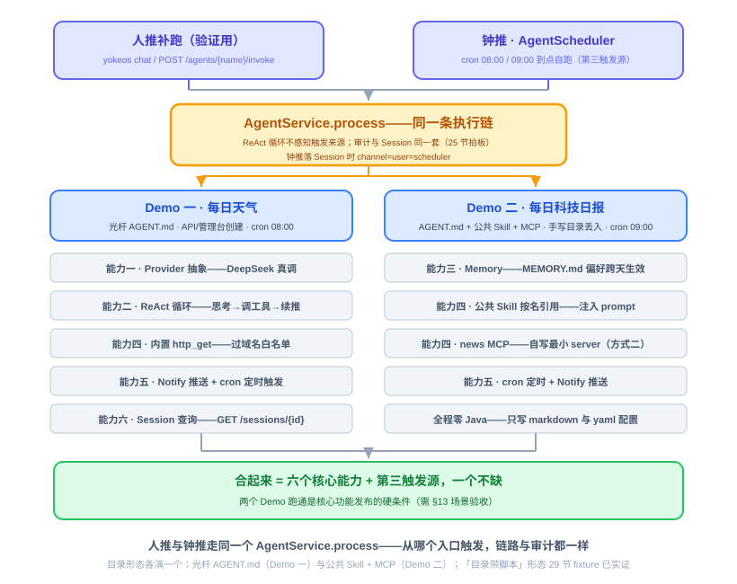
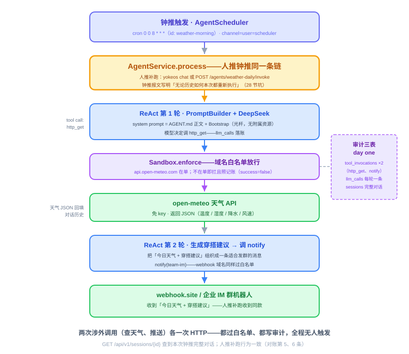
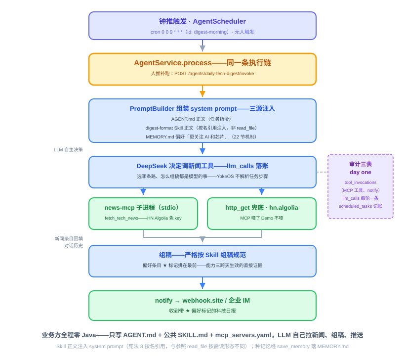
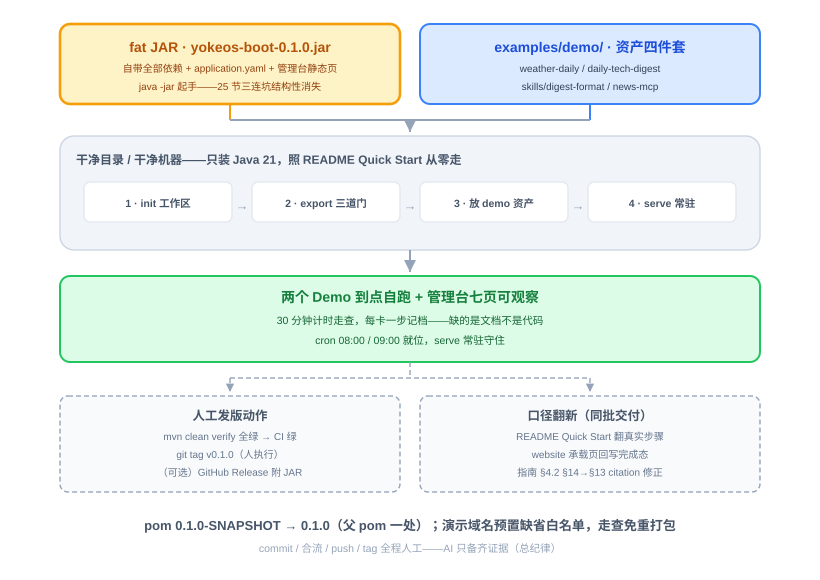

# 第 31 节：Demo——两个日跑 Agent 上线、打包、第一个版本

> **双定位**：本文档是 YokeOS 节级开发文档——既是**教学文档**（给人看：原理解析、动手前想清楚、怎么做），也是 **Spec-Kit 的开发原料**（给 AI 执行）。Demo 课流水线映射收窄：一、二部分定范围与前置门；三部分是实操步骤与资产清单（交付物比对锚点）；四部分是对账清单（DoD 对号锚点）；五部分是人工验项。
>
> **语料出处**：[需] `docs/DemandAnalysis.md` §11 行 31、§13 场景验收/可运维性验收 · [技] §12 关键流程、§13 行 31 · [宪] CLAUDE.md · [指] `docs/AiProgrammingGuide.md` §4.2（Demo 节特殊模式）· [参] 课件第 31 节与钉版树形态（Demo 资产不入仓，只留 bootstrap 样例；Demo 节无测试文件）。
>
> **拍板记录**（2026-09-23，**用户批准**——9 项全按建议定稿）：
>
> ① **Demo 数量 = 两个**（需求 §13 已收窄）：参照的第三个「GitHub 日报」不单列——其要演的「目录带脚本」形态 29 节 fixture `daily-reconcile`（`scripts/reconcile.py` 真跑实证）已覆盖，不重复演。
> ② **Demo 资产入库 `examples/demo/`**：参照 Demo 资产不入仓；本仓差异化立在可追溯——资产入库让 30 分钟部署走查与验收证据可复现（clone 即得），也是「第一阶段目标物」的实物陈列。若不入库，走查素材退化为验收报告内嵌全文。
> ③ **Demo 二 MCP 路径 = 自写最小 `news-mcp`**（Python 官方 SDK、stdio、读 Hacker News Algolia API 免 key，几十行）＋ `http_get` 直连同源兜底；不赌社区 server 还活着（参照同款判断）。
> ④ **发版动作**：pom `0.1.0-SNAPSHOT` → `0.1.0`（父 pom 一处，子模块继承）；fat JAR 随验收构建产出；`git tag v0.1.0` 与 push 由**人**执行（全程不自动 commit/push/tag 纪律）。
> ⑤ **性能验收不在本节展开**（10 Agent×4h / 100 并发 / P99 <200ms / 转发开销 <50ms）：需求 §11 行 31 可演示成果不含压测，26 节已实证 8 并发 invoke 全 200；正式压测列扩展阶段（或单列后续工单）。
> ⑥ **「连续两天自动跑」口径**：本仓节奏不设日历时间盒——验收 = 当场短 cron 钟推对账全绿 ＋ 真实 cron（08:00/09:00 Asia/Shanghai）配置就位 ＋ 人推补跑一致；连续多日稳定观察列为上线后运维项（非阻断）。
> ⑦ **演示域名进 boot `application.yaml` 缺省白名单**（`api.open-meteo.com` / `webhook.site` / `hn.algolia.com`，注释标明演示用途）——30 分钟走查免重打包（白名单 classpath 直读，改配置必须重打包，走查机器装 Maven+Node 才能重编）。代价：出厂缺省不再是纯 deny-all（三个域名均为低风险只读/推送端点，注释写明生产自行裁剪）。若拍板不入缺省，走查增加「改配置 → mvn package」一步。
> ⑧ **文档修正随本节带上**：指南 §4.2「按需求文档 §14 场景验收」citation 漂移 → 改 §13（场景验收实际在 §13）；README「Phase 1 is in progress」口径 → 完成态；website 承载页「第一阶段进行中，随实现回写」→ 回写完成态。
> ⑨ **spec 目录形态 = 串联课同款**：`specs/016-demo-release/` 只落 `acceptance-report.md`，不开 spec 三件套（Demo 课不做常规模块开发，指 §4.2）；分支 `specs/016-demo-release`。

课型：**Demo 课**。不产底座代码、不开 spec 三件套；流程 = 语料定稿 → H0 备料 → 建资产、改配置、真跑对账 → 验收报告 → 人来 commit/合流/tag。第 30 节遗留的一条人工项（管理台浏览器走查）随本节 serve 一并目验。

---

## 一、Demo 课是什么：第一阶段的毕业考

一句话：**两个到点自动跑的真实 Agent + 一个打了 tag 的可部署版本 + 一个说实话的项目主页。**

机制全部就位：底座自己跑得稳（27/28 节），Agent 能声明式定义（29 节：一个目录 = 一个 Agent）、能动态管理（30 节：一句话生成、免重启 CRUD、丢目录即上线）。这节不再写底座代码——把底座当操作系统**用**：业务方视角从零做出两个每天自己干活的 Agent，把整个系统打包成一个 fat JAR 交给一台干净机器，让它 30 分钟内跑起来。两个 Demo 跑通是核心功能发布的**硬条件**（需 §13），合起来覆盖全部六个核心能力加定时任务这个第三触发源。

| | Demo 一：每日天气 | Demo 二：每日科技日报 |
|---|---|---|
| 场景 | 每天 08:00 查北京天气、生成穿搭建议、推群 | 每天 09:00 汇总当日科技新闻、推群，内容体现用户偏好 |
| 压到的能力 | 能力一 Provider + 能力二 ReAct + 能力四（内置 `http_get`）+ 能力五（Notify + 定时）+ 能力六（Session 查询兜底） | 能力四（公共 Skill 按名引用 + MCP 方式二）+ 能力三 Memory + 能力五（定时 + Notify） |
| Agent 目录形态 | 光杆 `AGENT.md`，无附属资源 | `AGENT.md` + 公共 Skill 库 `skills/digest-format/` + 工作区 `mcp_servers.yaml` |
| 怎么建 | 走 30 节 API / 管理台（顺带目验遗留的管理台走查） | 走 29 节手写目录，`cp` 丢进 `.yokeos/agents/` 即上线（演 Watcher） |
| 建法各证一件事 | 一句话/表单建出来的 Agent 与手写的无差别 | 业务方零 Java 代码，只有 markdown 与配置 |

两个 Demo 都是**钟推**（`AgentScheduler` 到点触发，channel 与 user 固定为 `scheduler`），都支持**人推**补跑（`yokeos chat` 或 `POST /agents/{name}/invoke`）验证同一个 Agent 从任一入口走的是同一条执行链路（25 节拍板的架构，验收时当面对账）。

与参照的一个形态差异要先说清（宪法 8）：参照 Demo 二把组稿规范放在 **Agent 目录内** `skills/`、用 `read_file` 按需读；本仓 Skill 是**公共库**（`.yokeos/skills/{name}/SKILL.md`）、frontmatter `skills:` **按名引用、正文整段注入 system prompt**——所以本仓 Demo 二不需要 `read_file`、不需要为它特批 `file.allowed-paths`，组稿规范常驻上下文。这是设计取舍的不同，不是遗漏：演示口径写「Skill 正文注入 system prompt」。



## 二、动手前先想清楚几件事

Demo 课没有架构题，全是**环境题与流程题**——每一坑都在前序节实证过，这里把它们排成开跑前的检查单。

**第一，环境三道门——不过就是空转，别急着等钟推。**

- **门一（启动 key）**：`source ~/.zshrc` 拿 `DEEPSEEK_API_KEY`（非交互 shell 读不到 zshrc，18 节坑）；boot yaml 列了 kimi 时给哑值过存在性校验（连坐坑），或者只留 deepseek。
- **门二（白名单）**：24 节 Sandbox 缺省 deny-all，会拦自家——`yokeos.sandbox.http.allowed-domains` 必须含天气源域名、webhook 域名、新闻源域名，少一个 `tool_invocations` 就是一片 `success=false`。白名单在 `yokeos-boot/src/main/resources/application.yaml`、classpath 直读（27 节坑：不走 Spring 绑定）——**改了必须重新打包**才生效（拍板⑦用缺省预置避免走查重编）。
- **门三（webhook 真值）**：`export TEAM_WEBHOOK_URL=https://webhook.site/<uuid>`（一次性收件端点，演示够用）。29 节坑在先：占位解析失败保留字面量 → 推送失败 → 模型把「未完成」当任务未竟从头重跑烧穿轮数——**演示环境必须 export 真值**。

**第二，先人推再钟推。** 人推与钟推走同一个 `AgentService.process`（25 节），人推通了钟推基本就通；人推阶段暴露的问题（域名没进白名单、正文含糊模型不调工具）当场修，比等八点体面得多。

**第三，MCP 不赌社区 server。** Demo 二验收点名「配置 `mcp_servers.yaml`」，用自写最小 `news-mcp`（拍板③）——几十行 Python、官方 SDK stdio、免 key 数据源，命运握在自己手里；正文同时写 `http_get` 兜底路径，MCP 哑了 Demo 不哑（28 节「外部依赖不拖垮启动」同思路）。20 节 npx 冷缓存坑也顺势绕开（不依赖 npx）。

**第四，AGENT.md 的三个已知坑逐个过。** ① 漏写 `tools:` 清单 → 模型零工具只会口头答复（19 节）——demo Agent 的工具必须点名写全；② `schedules` 每条必须有 `id` 且 profile 内唯一（25 节修正案——`task_id = {profileName}:{id}`，漏 id 整条被剔且有声日志）；③ 正文里指引任何文件都写**工作区根相对路径**并注明 shell 工作目录是工作区根（29 节）。另：钟推报文（schedule `message`）写明「无论此前对话历史如何，本次都要重新完整执行」——28 节实证钟推会话复用下历史累积会让模型判定无需重推。

**第五，fat JAR 三连坑在本节消失——这本身就是验收点。** 25 节手跑真 serve 的三连坑（boot mainClass 硬编码 / m2 旧 jar CNFE / fat jar 嵌套结构不进 `-cp`）全是**没有 fat JAR 时借 classpath 硬跑**的产物；本节 `java -jar` 一个文件自带全部依赖与 `application.yaml`，三坑结构性消失。30 分钟走查就是拿一台「干净目录 + 只有 Java 21」的环境实证它。

**第六，发布动作全是人工。** `mvn clean verify` 全绿 → CI 绿 → 干净走查过 → 才轮到 `git tag v0.1.0`；commit、合流、push、tag 由人执行（总纪律），AI 只备齐证据。

## 三、怎么做：两个 Agent、一个版本、一个说实话的主页

### 3.0 建资产（入库，拍板②）

`examples/demo/` 四件套（AGENT.md 全部按 29 节 fixture 的实证 frontmatter 形态写）：

**① `examples/demo/weather-daily/AGENT.md`**（Demo 一，光杆）：

```markdown
---
name: weather-daily
description: 每天早上查北京天气并推送穿搭建议
identity:
  agent_name: 天气小欧
  prompt: 你是实用的天气助手，建议具体、可执行，不堆形容词。
provider:
  name: deepseek
  model: deepseek-chat
  temperature: 0.3
tools:
  - http_get
  - notify
notify:
  channels:
    - name: team-im
      type: webhook
      config:
        url: ${TEAM_WEBHOOK_URL}
schedules:
  - id: weather-morning
    cron: "0 0 8 * * *"
    zone: Asia/Shanghai
    message: 到点了，按你的说明执行今天的天气播报。无论此前对话历史如何，本次都要重新完整执行。
settings:
  max_iterations: 10
---

你是每日天气助手。被触发时按顺序做：
1. 调用 http_get 请求 https://api.open-meteo.com/v1/forecast?latitude=39.9&longitude=116.4&current=temperature_2m,relative_humidity_2m,precipitation,wind_speed_10m 获取北京当前天气；
2. 根据天气给两三句实用的穿搭建议；
3. 把「今日天气 + 穿搭建议」组织成一条适合发群的消息，调用 notify（channel 用 team-im）发送出去。
```

天气源钉死 **open-meteo**（免费、免 key、返回 JSON、国内可达）——Demo 现场最怕「要注册/要充值/被墙」这类与验收无关的意外。最小权限：只给 `http_get`/`notify`，不给文件与 shell。

**② `examples/demo/daily-tech-digest/AGENT.md`**（Demo 二）：

```markdown
---
name: daily-tech-digest
description: 每天早上编一份科技日报推送到群，体现用户关注方向
identity:
  agent_name: 科技日报小欧
  prompt: 你是科技日报编辑，选稿准、排版克制，忠实于抓到的条目。
provider:
  name: deepseek
  model: deepseek-chat
  temperature: 0.4
tools:
  - http_get
  - notify
  - save_memory
skills:
  - digest-format
mcp_servers:
  - news
notify:
  channels:
    - name: team-im
      type: webhook
      config:
        url: ${TEAM_WEBHOOK_URL}
schedules:
  - id: digest-morning
    cron: "0 0 9 * * *"
    zone: Asia/Shanghai
    message: 到点了，编今天的科技日报。无论此前对话历史如何，本次都要重新完整执行。
settings:
  max_iterations: 10
---

你是每日科技日报编辑。被触发时按顺序做：
1. 取当日科技新闻：优先调用 news MCP 的 fetch_tech_news 工具；它不可用时用 http_get 直连 https://hn.algolia.com/api/v1/search?tags=front_page&hitsPerPage=15 兜底；
2. 系统提示词里已注入 digest-format 技能的组稿规范，严格照它组织日报；
3. 若长期记忆里有用户关注方向的偏好，优先挑选相关条目并把它们排在前面；
4. 调用 notify（channel 用 team-im）把日报发送出去。
```

**③ `examples/demo/skills/digest-format/SKILL.md`**（公共 Skill，拷进工作区 `.yokeos/skills/`）：

```markdown
---
name: digest-format
description: 科技日报的组稿规范——选条数、排序与排版形态，约束日报类 Agent 的产出
---
# 科技日报组稿规范

- 挑最重要的 5~8 条，每条一行：标题 + 一句话点评 + 链接。
- 按重要性排序；命中用户偏好方向的条目排最前并加「★」标记。
- 开头一句今日总览（条数 + 主线一句话），结尾不加口号、不写免责声明。
- 只用抓到的条目，不编造；点评不超过 20 字。
```

**④ `examples/demo/news-mcp/news_mcp.py`**（自写最小 MCP server，拍板③）+ 说明 README：

```python
"""最小新闻 MCP server（stdio）：读 Hacker News Algolia API，免 key。"""
import json
import urllib.request

from mcp.server.fastmcp import FastMCP

mcp = FastMCP("news")


@mcp.tool()
def fetch_tech_news(limit: int = 15) -> str:
    """取 Hacker News 当前首页条目：标题 / 链接 / 热度 / 摘要"""
    url = f"https://hn.algolia.com/api/v1/search?tags=front_page&hitsPerPage={limit}"
    with urllib.request.urlopen(url, timeout=15) as resp:
        hits = json.load(resp).get("hits", [])
    return json.dumps(
        [{"title": h.get("title"), "url": h.get("url"), "points": h.get("points"),
          "summary": (h.get("story_text") or "")[:160]} for h in hits],
        ensure_ascii=False)


if __name__ == "__main__":
    mcp.run()
```

演示机前置：`pip install "mcp<2"`（一次；**2.x 把 FastMCP 改名 MCPServer**，1.x API 钉版——31 节真跑实证）。工作区 `mcp_servers.yaml` 配一条（command 用绝对路径最稳——MCP 子进程不依赖工作区 cwd）：

```yaml
servers:
  - name: news
    transport: stdio
    command: python3 /abs/path/examples/demo/news-mcp/news_mcp.py
```

### 3.1 真跑（演示工作区从零起）

工作区建在本机持久目录（`/tmp` 重启即失，日跑 Demo 要常驻），如 `~/yokeos-demo`：

1. **起底座**：`java -jar yokeos-boot/target/yokeos-boot-0.1.0.jar init`（在 `~/yokeos-demo`）→ export 三道门 → 同 jar `serve`；
2. **Demo 一走 API 建**：`POST /api/v1/agents/generate`（一句话：「每天早上八点查北京天气给穿搭建议推送到 team-im」）→ 人在环预览改定 → `POST /api/v1/agents`（或管理台表单走一遍——顺带完成 30 节遗留的浏览器目验）；
3. **Demo 二走手写目录**：`cp -r examples/demo/daily-tech-digest ~/yokeos-demo/.yokeos/agents/`、`cp -r examples/demo/skills/digest-format ~/yokeos-demo/.yokeos/skills/`、工作区 `mcp_servers.yaml` 配 news——不重启，几秒后 `GET /api/v1/agents` 列表出现（Watcher 拾取）；
4. **种记忆**：`yokeos chat` 跟任一 Agent 说「以后关注科技新闻的话，我更关注 AI 和芯片方向」→ 确认 `MEMORY.md` 真的多了这条再往下走（22 节机制）；
5. **人推补跑两个 Demo**：chat 或 `POST /agents/{name}/invoke`，链路通了再改钟推；
6. **钟推对账**：临时把两个 cron 改成几分钟后（PUT 改 frontmatter 免重启），看它们完整自跑一轮，按第四部分对账；对账完改回 08:00/09:00 真实 cron——「真实环境上线」= serve 常驻跑着这两个真实 cron（nohup/launchd 守住），连续多日观察属运维项（拍板⑥）。





### 3.2 发布：fat JAR + v0.1.0 + 主页

```bash
mvn clean verify        # 全量门禁最后一道（九模块 + 静态检查 + 管理台前端构建），verify 阶段含 package，fat JAR 已产出
java -jar yokeos-boot/target/yokeos-boot-0.1.0.jar --help   # fat JAR 冒烟
```

1. **pom 版本 release 化**（拍板④）：父 pom `0.1.0-SNAPSHOT` → `0.1.0`，重打包产物名即 `yokeos-boot-0.1.0.jar`；
2. **干净走查（30 分钟标准）**：另开一个空目录（或干净机器），只有 Java 21 + fat JAR + `examples/demo/`，照 README Quick Start 从零走：init → export env → 放资产 → serve → 人推看到推送。走查中每一步卡住都记下来——**缺的是文档不是代码**；
3. **README 翻口径**（拍板⑧）：Quick Start 从「Phase 1 is in progress（目标形态）」改为真实可走步骤（`java -jar` 起手、演示资产取用、env 与白名单说明、两个 Demo 的验收口径）；Roadmap/状态行翻完成态；
4. **website 承载页回写**（拍板⑧）：「第一阶段进行中，随实现回写」标注的页面改为完成态口径；push master 触发 Pages 部署（`deploy-pages.yml`）；
5. **CI 绿 + 人工 tag**：push 后 CI 全绿（含依赖扫描），人执行 `git tag v0.1.0 && git push --tags`；GitHub Release（可选，附 fat JAR）由人决定。



**本节交付物**（Spec-Kit 拆解锚点）：

- **代码（无底座代码新增）**：`examples/demo/` 四件套——`weather-daily/AGENT.md`、`daily-tech-digest/AGENT.md`、`skills/digest-format/SKILL.md`、`news-mcp/news_mcp.py`（+ 各自 README 说明）【拍板②③】
- **测试**：无新测试类（参照 Demo 节无测试文件，钉版树同形态）；门禁 = 既有九模块 `mvn clean verify` 全绿 ＋ integration 组显式复跑（27/28 固化的链路测试再跑一遍）
- **配置**：boot `application.yaml` 演示域名进缺省白名单（注释标演示用途，拍板⑦）；父 pom 版本 `0.1.0`（拍板④）；README Quick Start/状态行（拍板⑧）；website 承载页回写（拍板⑧）；指南 §4.2 citation 修正 §13（拍板⑧）
- **表**：无新表、无表结构变更（六表形态不变）

## 四、怎么验收：真跑对账就是 harness

Demo 课的 harness 不是新测试类，是**对账清单**——每条验收点都有机器可查的证据（审计表 / REST / 文件系统 / webhook 收件），全部落 `specs/016-demo-release/acceptance-report.md`。

**全量门禁与既有测试**：`mvn clean verify` 九模块全绿；`mvn test -Dgroups=integration -DexcludedGroups=` 显式复跑（27/28 集成链路 + 16/17 节真 key 冒烟，assumeTrue 语义照旧）。

**Demo 一对账**（逐条来自需 §13 Demo 一验收标准）：

| # | 验收点 | 证据手段 |
|---|--------|---------|
| 1 | 不需要人工触发，到点自动跑 | `scheduled_tasks` run_count 自增、`task_executions` success=true（sqlite3 查询贴报告） |
| 2 | 完整 ReAct 循环 | `llm_calls` 多轮落账（sessionId 为钟推 session） |
| 3 | 查天气与推送各一次 HTTP、都过域名白名单 | `tool_invocations` 恰有 `http_get` 与 `notify` 两条涉外记录、success=true |
| 4 | 都写入 `tool_invocations` | 同上查询输出 |
| 5 | `GET /api/v1/sessions/{id}` 查到完整对话 | curl 返回钟推 session（channel=scheduler）消息序列 |
| 6 | 人推补跑与钟推同链路 | `yokeos chat` 或 `POST /agents/weather-daily/invoke` 再跑一轮，行为一致 |
| 7 | 光杆 AGENT.md | 目录清单实证（只有 AGENT.md）；走 API/管理台创建的过程证据 |

**Demo 二对账**（逐条来自需 §13 Demo 二验收标准）：

| # | 验收点 | 证据手段 |
|---|--------|---------|
| 1 | 全程零 Java，只写 AGENT.md + Skill + mcp_servers.yaml | 资产文件清单；git 历史无 Java 改动（本节 diff） |
| 2 | Skill 正文注入 system prompt | 产出严格符合 digest-format 规范（★ 偏好标记、条数、无口号）——机制本身 29 节单测已钉 |
| 3 | LLM 自己决定调新闻工具 | `tool_invocations` 有 news MCP 工具调用记录（McpToolAdapter 路径） |
| 4 | 自己组织日报、自己调推送 | `tool_invocations` 有 notify 一条；日报文本为模型组织非模板 |
| 5 | 日报体现 `MEMORY.md` 偏好 | webhook 收件里 AI/芯片条目排前且带 ★；`MEMORY.md` 有偏好条目 |
| 6 | `GET /api/v1/agents` 查得到 | curl 列表含 `daily-tech-digest`（丢目录免重启出现） |
| 7 | 人推补跑一致 | `POST /agents/daily-tech-digest/invoke` |

**发布验收**：fat JAR 冒烟（`--help`/`init`）；干净目录 30 分钟走查计时与卡点记录；README/website 新口径截图或 diff；CI 绿；tag 由人打（报告记操作人与时间）。**凭证卫生**：`grep -r "sk-"` 零命中；webhook URL 与 key 全程 `${ENV_VAR}`。**H4 七条不变量**：无代码改动，走既有 grep 自查照做一遍。

**30 节遗留承接**：管理台浏览器走查（场景 F：Agent 管理页一句话新建 → 预览 → 创建 → 编辑 → 删除 + 工作区页浏览）在 Demo 一创建步骤中一并目验，证据进报告。

## 五、做完怎么验

- [ ] 两个 Demo 钟推对账全绿（第四部分两表逐条），人推补跑一致；
- [ ] webhook.site 收到天气播报与科技日报两条推送，日报体现偏好（★ 标记靠前）；
- [ ] 真实 cron（08:00/09:00 Asia/Shanghai）配置就位、serve 常驻（拍板⑥口径）；
- [ ] `mvn clean verify` 九模块全绿 + integration 组复跑；
- [ ] fat JAR 冒烟过；干净目录 30 分钟走查过（卡点已修成文档）；
- [ ] README/website 完成态口径、Pages 可访问；CI 绿；
- [ ] 管理台浏览器走查完成（30 节遗留清零）；
- [ ] 凭证卫生 `grep -r "sk-"` 零命中；
- [ ] `git tag v0.1.0` 由人打好、push 完成。

可演示成果口径（需 §11 行 31）：**两个日跑 Demo 在真实环境上线，打包发布，项目主页可访问**。到这一步，第一阶段的目标物全部交付：一个能跑的 Agent 底座（九模块、19 端点、六表审计）、一套定义 Agent 的机制（一个目录 = 一个 Agent + 动态管理）、两个每天自己干活的真实 Agent、一个打了 tag 的版本、一个说实话的主页——「复刻型起步」的过程证据链（16 份节级规格与验收报告）完整落档。
